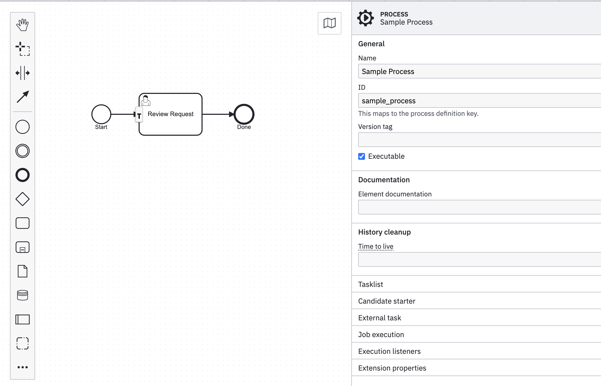
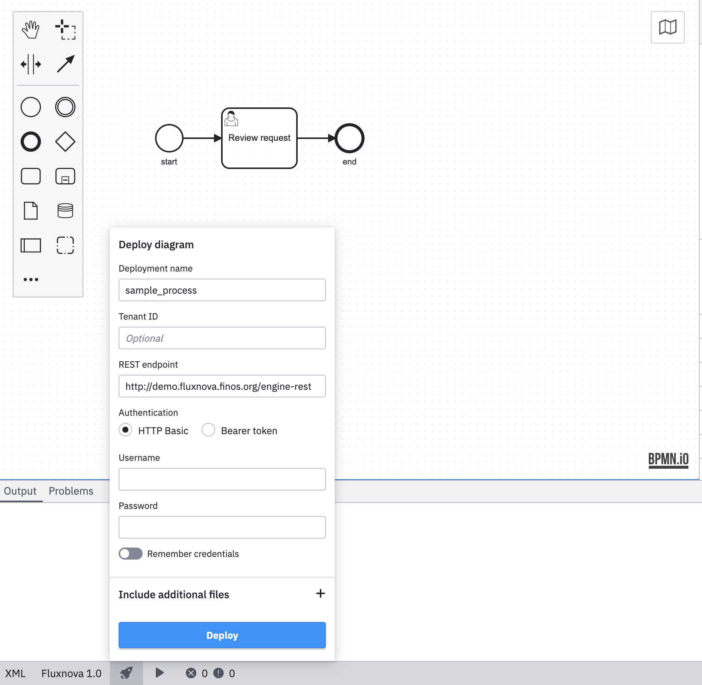
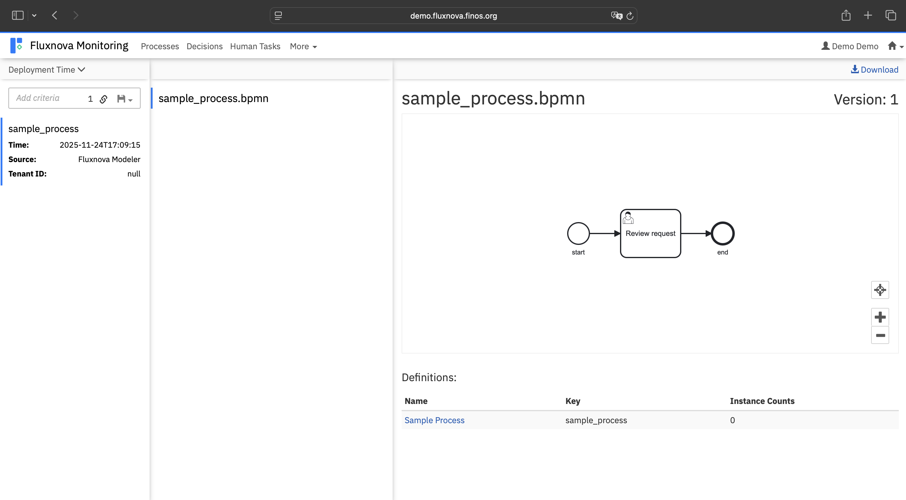
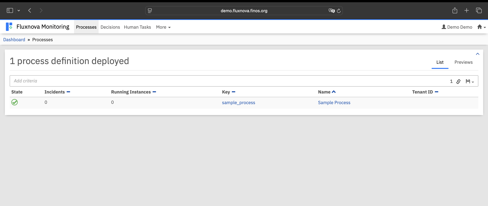
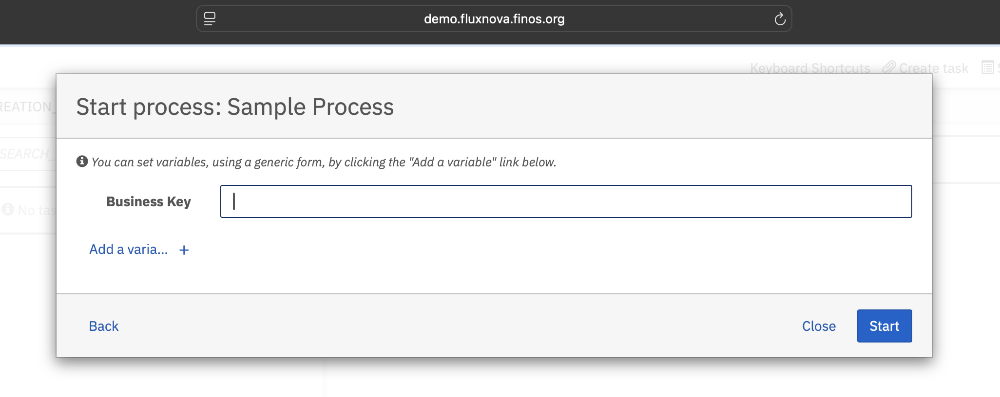

# Fluxnova BPM Platform - Getting Started Guide

Welcome to Fluxnova BPM Platform! This guide will help you quickly get started with building, running, and using Fluxnova, including deploying your first BPMN process and accessing the sandbox environment.

## Table of Contents
- [1. Introduction](#1-introduction)
- [2. Prerequisites](#2-prerequisites)
- [3. Building and Running Fluxnova Locally](#3-building-and-running-fluxnova-locally)
- [4. Accessing the Sandbox Environment](#4-accessing-the-sandbox-environment)
- [5. Creating a BPMN Process](#5-creating-a-bpmn-process)
- [6. Deploying Directly from Fluxnova Modeler](#6-deploying-directly-from-fluxnova-modeler)
- [7. Starting and Monitoring a Process](#7-starting-and-monitoring-a-process)
- [8. Additional Resources](#8-additional-resources)

## 1. Introduction
Fluxnova BPM Platform enables workflow automation using BPMN models. You can run it locally or use the hosted sandbox environment for quick evaluation.

## 2. Prerequisites
- Java 21 or higher
- Maven 3.8 or higher
- Git
- Fluxnova Modeler

## 3. Building and Running Fluxnova Locally
For detailed build and run instructions, see the [Fluxnova Build Guide](https://github.com/finos/fluxnova-bpm-platform/blob/main/Fluxnova-build-readme.md).

### Quick Summary
- Clone and build required dependencies.
- Build the main platform:
  ```sh
  git clone https://github.com/finos/fluxnova-bpm-platform
  cd fluxnova-bpm-platform
  mvn clean install
  ```
- Run Tomcat or Spring Boot version (see build guide for details).
- Alternatively, use the official Docker image:
  ```sh
  docker pull ghcr.io/finos/fluxnova-bpm-platform:1.1.0
  docker run -p 8080:8080 ghcr.io/finos/fluxnova-bpm-platform:1.1.0
  ```

## 4. Accessing the Sandbox Environment
You can try Fluxnova BPM Platform instantly using the hosted sandbox:
- [Fluxnova Sandbox](https://demo.fluxnova.finos.org/)
- Log in with provided credentials or register if available.
- Use the sandbox to deploy BPMN models and test processes without local setup.

## 5. Creating a BPMN Process
1. Download and install Fluxnova Modeler:
   - [Fluxnova Modeler Download](https://github.com/finos/fluxnova-modeler/releases/tag/v1.0.0)
2. Create a new BPMN diagram:
   - Add a Start Event, a Task, and an End Event.
   - Connect the elements sequentially.
   - Your diagram should look like this:
   
   - Save as `sample-process.bpmn`.

### 6. Deploying Directly from Fluxnova Modeler

1. Click the "Deploy" button in Fluxnova Modeler.
   
2. Enter the deployment endpoint:
   - For local: `http://localhost:8080/engine-rest`
   - For sandbox: `https://demo.fluxnova.finos.org/engine-rest`
3. Provide credentials if required.
4. Set the deployment name (e.g., `sample_process`).
5. Click "Deploy" and confirm success.

## 7. Starting and Monitoring a Process
1. In the Fluxnova web UI, navigate to your deployed process definition.
   
   
2. Click "Start Process Instance" and provide any required variables.
   
3. Monitor the process instance, view active tasks, and complete them as needed.

## 8. Additional Resources
- [Fluxnova Build Guide](https://github.com/finos/fluxnova-bpm-platform/blob/main/Fluxnova-build-readme.md)
- [Fluxnova Sandbox](https://demo.fluxnova.finos.org/)
