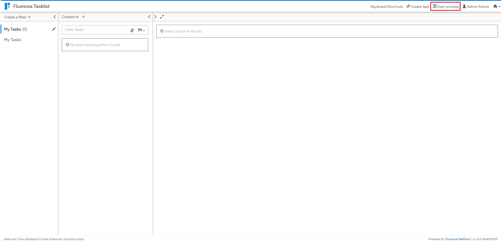
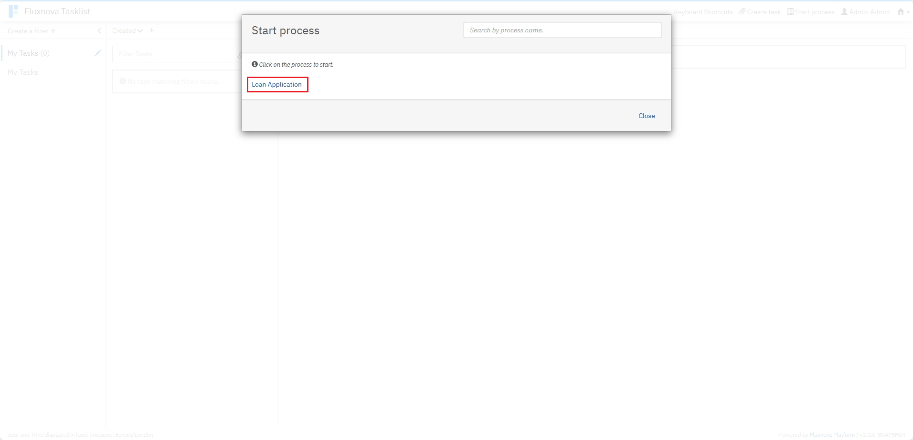
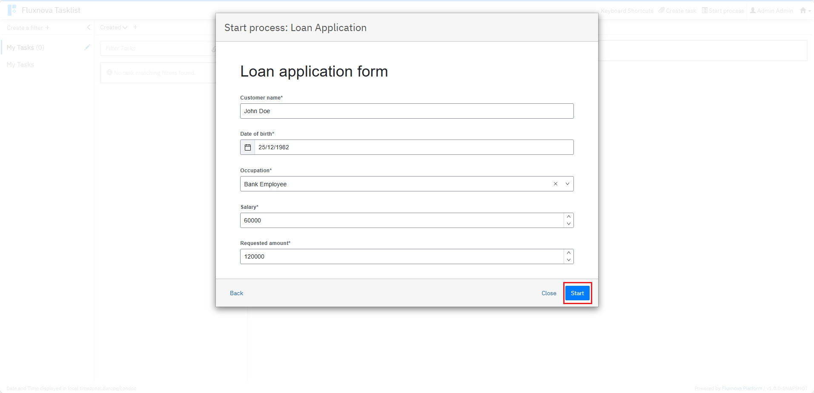
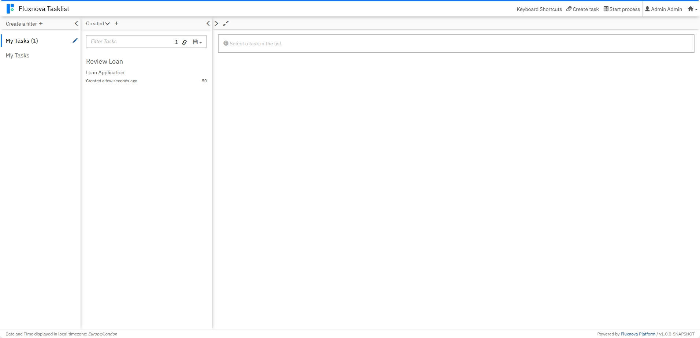
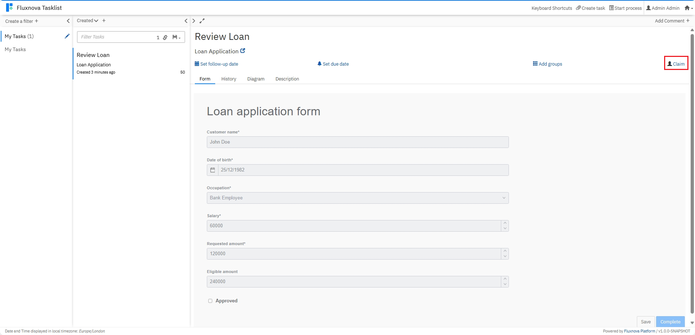
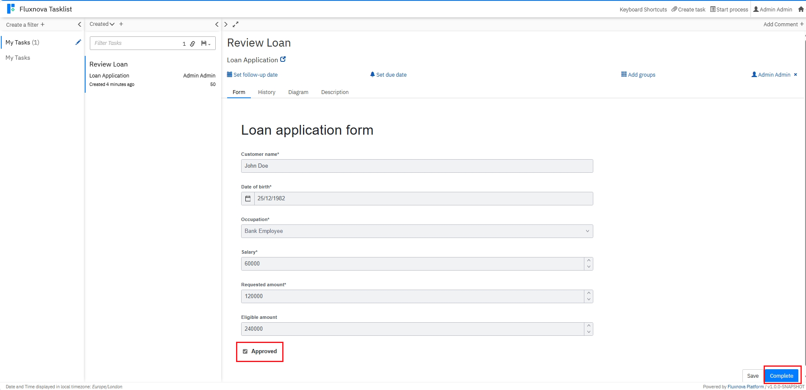

# **Fluxnova demo application**

## **Overview**

This project was generated using fluxnova-archetype. It provides a foundation for building workflow-driven applications using **BPMN**, **DMN**, and **Forms** with Fluxnova.

The application includes:

*   **Spring Boot** integration
*   Fluxnova **Process Engine**
*   Ready-to-use configuration for deploying BPMN models for development purposes.


## **Prerequisites**

*   **Java 21+** (or the version specified during generation)
*   **Maven**
*   **Docker** (optional, for running Fluxnova in containers)


## **Getting Started**

### **1. Build the Project**

Using Maven:

```
mvn clean install
```

### **2. Run the Application**

```
mvn spring-boot:run
```

The application will start on **<http://localhost:8080>**.


## **Fluxnova Webapps**

Once the application is running, you can access:

*   **Fluxnova Tasklist**: <http://localhost:8080/fluxnova/app/tasklist>
*   **Fluxnova Monitoring**: <http://localhost:8080/fluxnova/app/monitoring>
*   **Fluxnova Admin**: <http://localhost:8080/fluxnova/app/admin>

**Default Login Credentials**:

    Username: demo
    Password: demo


## **Working with Processes and Tasks**

### **1. Start a Process**

To start a process instance:

1.  Log in to **Fluxnova Tasklist**:  
    `http://localhost:8080/fluxnova/app/tasklist`  
    *(Default credentials: `demo/demo`)*
2.  Click on **Start Process**.
3.  Select the desired process definition from the list.
4.  Fill in any required form fields and click **Start**.








### **2. View Tasks**

After starting a process, tasks assigned to you or available for claiming will appear in the **Tasklist**:

*   Navigate to **Tasks** in the left menu.
*   Use filters to view **Assigned** or **Unassigned** tasks. You might have to refresh the page to see your new tasks.




### **3. Claim a Task**

To claim an unassigned task:

1.  Open the task from the list.
2.  Click **Claim** in the task details panel.




### **4. Complete a Task**

Once claimed:

1.  Fill in the required form fields. In this case, click the Approved checkbox.
2.  Click **Complete** to move the process forward.




### **Tips**

*   Use **Fluxnova Monitoring** to monitor process instances and check their status.


## **Working with Processes and Tasks via REST API**

The project also includes REST APIs for starting processes, viewing tasks, claiming tasks, and completing tasks programmatically. The APIs in turn uses Fluxnova services  (RuntimeService, TaskService) autowired as Spring beans using SpringBoot integration.

#### Note:
1. Replace `{processInstanceId}` and `{taskId}` with actual values from the response of the preceding APIs.
2. Below `curl` commands work well in Windows cmd prompt. It needs modification in case you use Linux bash terminal or Powershell.


### **1. Start a Process Instance**

Use the **Process Definition Key** (from your BPMN model, here LoanApplicationProcess) to start a process:

```
curl -X POST "http://localhost:8080/api/workflow/v1.0/start/LoanApplicationProcess" -H "Content-Type: application/json" -d "{ \"customerName\": \"John Doe\", \"birthDate\": \"1982-12-25\", \"occupation\": \"Bank Employee\", \"salary\": 60000, \"requestedAmount\": 120000}"
```


### **2. Get All Tasks**

Use the **processInstanceId** from the previous API response to retrieve all tasks:

```
curl -X GET "http://localhost:8080/api/workflow/v1.0/tasks/{processInstanceId}"
```


### **3. Claim a Task**

Use the **taskId** from the previous API response to claim the task for the default user *demo*:

```
curl -X PATCH "http://localhost:8080/api/workflow/v1.0/tasks/{taskId}/assign/demo"
```


### **4. Complete a Task**

Use the same **taskId** to complete a task and optionally pass variables:

```
curl -X PATCH "http://localhost:8080/api/workflow/v1.0/tasks/{taskId}/complete" -H "Content-Type: application/json" -d "{ \"isApproved\": true }"
```


## **Project Structure**

    src/
     ├─ main/
     │   ├─ java/                       # Java source code
     │   ├─ resources/
     │       ├─ processes/              # BPMN, DMN, Form files
     │       ├─ application.properties  # Spring Boot config
     └─ test/                           # Unit and integration tests


## **How to Deploy BPMN Models**

Place your BPMN files in:

    src/main/resources/processes/

They will be automatically deployed when the application starts.


## **⚠️ Security Notice**

**This is a demonstration application with NO security implementation.**

### **Current State:**
- ❌ No authentication required
- ❌ No authorization checks
- ❌ Default admin credentials (demo/demo)
- ❌ All APIs are publicly accessible
- ❌ No input validation
- ❌ No audit logging


## **Next Steps**

*   Add your BPMN workflows in `src/main/resources/processes/`.
*   Implement service tasks and business logic in `src/main/java/`.
*   Configure external systems if needed.


## **Additional Resources**

- **[Fluxnova Spring Boot Example](https://github.com/finos/fluxnova-examples/tree/main/fluxnova-springboot-example)** - Spring Boot application with all dependencies, ways to use production grade DB and Docker.
- **[Fluxnova Process Examples](https://github.com/finos/fluxnova-examples/tree/main/process-examples)** - Extensive bpmn examples with test data and scripts.  
