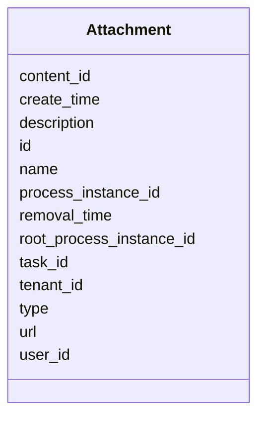

---
search:
  boost: 10.0
---

# Class: Attachment 


_Any type of content that is be associated with a task or with a process instance._


<div data-search-exclude markdown="1">


URI: [fluxnova_bpm_platform:Attachment](https://w3id.org/TD-Universe/fluxnova-bpm-platform/Attachment)





<!-- no inheritance hierarchy -->

## Slots

| Name | Cardinality and Range | Description | Inheritance |
| ---  | --- | --- | --- |
| [id](id.md) | 1 <br/> [String](String.md) | Unique identifier | direct |
| [user_id](user_id.md) | 0..1 <br/> [String](String.md) | Reference to a user | direct |
| [name](name.md) | 0..1 <br/> [String](String.md) | Human-readable name | direct |
| [description](description.md) | 0..1 <br/> [String](String.md) | Human-readable description | direct |
| [type](type.md) | 0..1 <br/> [String](String.md) | Type discriminator | direct |
| [task_id](task_id.md) | 0..1 <br/> [String](String.md) | Reference to the task | direct |
| [root_process_instance_id](root_process_instance_id.md) | 0..1 <br/> [String](String.md) | Root process instance for history cleanup | direct |
| [process_instance_id](process_instance_id.md) | 0..1 <br/> [String](String.md) | Reference to the process instance | direct |
| [url](url.md) | 0..1 <br/> [String](String.md) | The remote URL in case this is remote content | direct |
| [content_id](content_id.md) | 0..1 <br/> [String](String.md) | Reference to the content | direct |
| [tenant_id](tenant_id.md) | 0..1 <br/> [String](String.md) | Multi-tenancy discriminator | direct |
| [create_time](create_time.md) | 0..1 <br/> [Datetime](Datetime.md) | Creation timestamp | direct |
| [removal_time](removal_time.md) | 0..1 <br/> [Datetime](Datetime.md) | Timestamp when this entity is eligible for removal | direct |


## In Subsets


* [Collaboration](Collaboration.md)
* [FluxnovaBpm](FluxnovaBpm.md)


## Identifier and Mapping Information


### Annotations

| property | value |
| --- | --- |
| sql_table | ACT_HI_ATTACHMENT |


### Schema Source


* from schema: https://w3id.org/TD-Universe/fluxnova-bpm-platform


## Mappings

| Mapping Type | Mapped Value |
| ---  | ---  |
| self | fluxnova_bpm_platform:Attachment |
| native | fluxnova_bpm_platform:Attachment |


## LinkML Source

<!-- TODO: investigate https://stackoverflow.com/questions/37606292/how-to-create-tabbed-code-blocks-in-mkdocs-or-sphinx -->

### Direct

<details>
```yaml
name: Attachment
annotations:
  sql_table:
    tag: sql_table
    value: ACT_HI_ATTACHMENT
description: Any type of content that is be associated with a task or with a process
  instance.
in_subset:
- collaboration
- fluxnova_bpm
from_schema: https://w3id.org/TD-Universe/fluxnova-bpm-platform
slots:
- id
- user_id
- name
- description
- type
- task_id
- root_process_instance_id
- process_instance_id
- url
- content_id
- tenant_id
- create_time
- removal_time

```
</details>

### Induced

<details>
```yaml
name: Attachment
annotations:
  sql_table:
    tag: sql_table
    value: ACT_HI_ATTACHMENT
description: Any type of content that is be associated with a task or with a process
  instance.
in_subset:
- collaboration
- fluxnova_bpm
from_schema: https://w3id.org/TD-Universe/fluxnova-bpm-platform
attributes:
  id:
    name: id
    description: Unique identifier.
    from_schema: https://w3id.org/TD-Universe/fluxnova-bpm-platform
    rank: 1000
    slot_uri: schema:identifier
    identifier: true
    owner: Attachment
    domain_of:
    - ByteArray
    - MeterLog
    - SchemaLogEntry
    - TaskMeterLog
    - Authorization
    - Group
    - IdentityInfo
    - IdentityLink
    - Tenant
    - TenantMembership
    - User
    - CaseExecution
    - CaseSentryPart
    - EventSubscription
    - Execution
    - ExternalTask
    - Incident
    - Task
    - VariableInstance
    - Attachment
    - Comment
    - Filter
    - Deployment
    - ResourceDefinition
    - Batch
    - Job
    - JobDefinition
    - HistoricBatch
    - HistoricDecisionInputInstance
    - HistoricDecisionInstance
    - HistoricDecisionOutputInstance
    - HistoricDetail
    - HistoricExternalTaskLog
    - HistoricIdentityLink
    - HistoricIncident
    - HistoricJobLog
    - HistoricScopeInstance
    - HistoricVariableInstance
    - UserOperationLogEntry
    - Diagram
    - DiagramElement
    - Style
    - BaseElement
    - Definitions
    - Documentation
    - InteractionNode
    range: string
    required: true
  user_id:
    name: user_id
    description: Reference to a user.
    from_schema: https://w3id.org/TD-Universe/fluxnova-bpm-platform
    rank: 1000
    owner: Attachment
    domain_of:
    - Authorization
    - IdentityInfo
    - IdentityLink
    - Membership
    - TenantMembership
    - Attachment
    - Comment
    - HistoricDecisionInstance
    - HistoricIdentityLink
    - UserOperationLogEntry
    range: string
  name:
    name: name
    description: Human-readable name.
    from_schema: https://w3id.org/TD-Universe/fluxnova-bpm-platform
    rank: 1000
    slot_uri: schema:name
    owner: Attachment
    domain_of:
    - ByteArray
    - MeterLog
    - Property
    - Group
    - Tenant
    - Task
    - VariableInstance
    - Attachment
    - Filter
    - Deployment
    - ResourceDefinition
    - HistoricDetail
    - HistoricTaskInstance
    - HistoricVariableInstance
    - Font
    - Diagram
    - CallableElement
    - Category
    - Collaboration
    - ConversationLink
    - ConversationNode
    - CorrelationKey
    - CorrelationProperty
    - DataInput
    - DataOutput
    - DataState
    - DataStore
    - Definitions
    - Error
    - Escalation
    - FlowElement
    - InputSet
    - Interface
    - Lane
    - LaneSet
    - LinkEventDefinition
    - Message
    - MessageFlow
    - Operation
    - OutputSet
    - Participant
    - BpmnProperty
    - Resource
    - ResourceParameter
    - ResourceRole
    - Signal
    range: string
  description:
    name: description
    description: Human-readable description.
    from_schema: https://w3id.org/TD-Universe/fluxnova-bpm-platform
    rank: 1000
    slot_uri: schema:description
    owner: Attachment
    domain_of:
    - Task
    - Attachment
    - HistoricTaskInstance
    range: string
  type:
    name: type
    description: Type discriminator.
    from_schema: https://w3id.org/TD-Universe/fluxnova-bpm-platform
    rank: 1000
    owner: Attachment
    domain_of:
    - ByteArray
    - Authorization
    - Group
    - IdentityInfo
    - IdentityLink
    - CaseSentryPart
    - VariableInstance
    - Attachment
    - Comment
    - Batch
    - Job
    - HistoricBatch
    - HistoricDetail
    - HistoricIdentityLink
    - ConditionExpression
    - CorrelationProperty
    - Relationship
    - ResourceParameter
    range: string
  task_id:
    name: task_id
    description: Reference to the task.
    from_schema: https://w3id.org/TD-Universe/fluxnova-bpm-platform
    rank: 1000
    owner: Attachment
    domain_of:
    - IdentityLink
    - VariableInstance
    - Attachment
    - Comment
    - HistoricActivityInstance
    - HistoricCaseActivityInstance
    - HistoricDetail
    - HistoricIdentityLink
    - HistoricVariableInstance
    - UserOperationLogEntry
    range: string
  root_process_instance_id:
    name: root_process_instance_id
    description: Root process instance for history cleanup.
    from_schema: https://w3id.org/TD-Universe/fluxnova-bpm-platform
    rank: 1000
    owner: Attachment
    domain_of:
    - ByteArray
    - Authorization
    - Execution
    - Attachment
    - Comment
    - Job
    - HistoricDecisionInputInstance
    - HistoricDecisionInstance
    - HistoricDecisionOutputInstance
    - HistoricDetail
    - HistoricExternalTaskLog
    - HistoricIdentityLink
    - HistoricIncident
    - HistoricJobLog
    - HistoricScopeInstance
    - HistoricVariableInstance
    - UserOperationLogEntry
    range: string
  process_instance_id:
    name: process_instance_id
    description: Reference to the process instance.
    from_schema: https://w3id.org/TD-Universe/fluxnova-bpm-platform
    rank: 1000
    owner: Attachment
    domain_of:
    - EventSubscription
    - Execution
    - ExternalTask
    - Incident
    - Task
    - VariableInstance
    - Attachment
    - Comment
    - Job
    - HistoricDecisionInstance
    - HistoricDetail
    - HistoricExternalTaskLog
    - HistoricIncident
    - HistoricJobLog
    - HistoricScopeInstance
    - HistoricVariableInstance
    - UserOperationLogEntry
    range: string
  url:
    name: url
    annotations:
      sql_column:
        tag: sql_column
        value: URL_
    description: The remote URL in case this is remote content. If the attachment
      content was uploaded with an input stream, then this method returns null and
      the content can be fetched with .
    from_schema: https://w3id.org/TD-Universe/fluxnova-bpm-platform
    rank: 1000
    owner: Attachment
    domain_of:
    - Attachment
    range: string
  content_id:
    name: content_id
    annotations:
      sql_column:
        tag: sql_column
        value: CONTENT_ID_
    description: Reference to the content.
    from_schema: https://w3id.org/TD-Universe/fluxnova-bpm-platform
    rank: 1000
    owner: Attachment
    domain_of:
    - Attachment
    range: string
  tenant_id:
    name: tenant_id
    description: Multi-tenancy discriminator.
    from_schema: https://w3id.org/TD-Universe/fluxnova-bpm-platform
    rank: 1000
    owner: Attachment
    domain_of:
    - ByteArray
    - IdentityLink
    - TenantMembership
    - CaseExecution
    - CaseSentryPart
    - EventSubscription
    - Execution
    - ExternalTask
    - Incident
    - Task
    - VariableInstance
    - Attachment
    - Comment
    - Deployment
    - ResourceDefinition
    - Batch
    - Job
    - JobDefinition
    - HistoricActivityInstance
    - HistoricBatch
    - HistoricCaseActivityInstance
    - HistoricCaseInstance
    - HistoricDecisionInputInstance
    - HistoricDecisionInstance
    - HistoricDecisionOutputInstance
    - HistoricDetail
    - HistoricExternalTaskLog
    - HistoricIdentityLink
    - HistoricIncident
    - HistoricJobLog
    - HistoricProcessInstance
    - HistoricTaskInstance
    - HistoricVariableInstance
    - UserOperationLogEntry
    range: string
  create_time:
    name: create_time
    description: Creation timestamp.
    from_schema: https://w3id.org/TD-Universe/fluxnova-bpm-platform
    rank: 1000
    owner: Attachment
    domain_of:
    - ByteArray
    - ExternalTask
    - Task
    - Attachment
    - Job
    - HistoricCaseActivityInstance
    - HistoricCaseInstance
    - HistoricDecisionInputInstance
    - HistoricDecisionOutputInstance
    - HistoricIncident
    - HistoricVariableInstance
    range: datetime
  removal_time:
    name: removal_time
    description: Timestamp when this entity is eligible for removal.
    from_schema: https://w3id.org/TD-Universe/fluxnova-bpm-platform
    rank: 1000
    owner: Attachment
    domain_of:
    - ByteArray
    - Authorization
    - Attachment
    - Comment
    - HistoricBatch
    - HistoricDecisionInputInstance
    - HistoricDecisionInstance
    - HistoricDecisionOutputInstance
    - HistoricDetail
    - HistoricExternalTaskLog
    - HistoricIdentityLink
    - HistoricIncident
    - HistoricJobLog
    - HistoricScopeInstance
    - HistoricVariableInstance
    - UserOperationLogEntry
    range: datetime

```
</details></div>