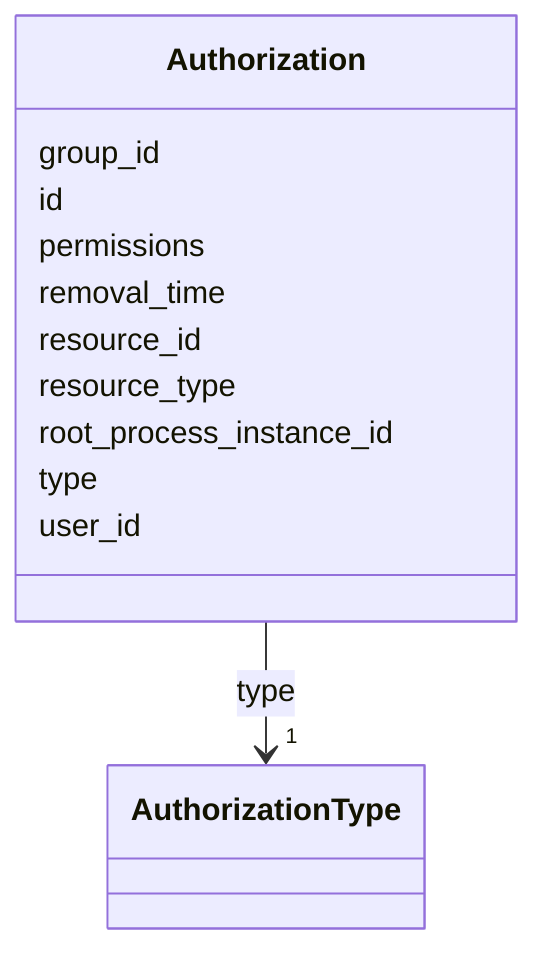

---
search:
  boost: 10.0
---

# Class: Authorization 


_An Authorization assigns a set of Permission Permissions to an identity to interact with a given Resource. EXAMPLES: Nobody is allowed to edit process variables in the cockpit application, except t..._


<div data-search-exclude markdown="1">


URI: [fluxnova_bpm_platform:Authorization](https://w3id.org/TD-Universe/fluxnova-bpm-platform/Authorization)





<!-- no inheritance hierarchy -->

## Slots

| Name | Cardinality and Range | Description | Inheritance |
| ---  | --- | --- | --- |
| [id](id.md) | 1 <br/> [String](String.md) | Unique identifier | direct |
| [type](type.md) | 1 <br/> [AuthorizationType](AuthorizationType.md) | Type discriminator | direct |
| [group_id](group_id.md) | 0..1 <br/> [String](String.md) | Reference to a group | direct |
| [user_id](user_id.md) | 0..1 <br/> [String](String.md) | Reference to a user | direct |
| [resource_type](resource_type.md) | 1 <br/> [Integer](Integer.md) | Numeric type of the authorized resource | direct |
| [resource_id](resource_id.md) | 0..1 <br/> [String](String.md) | Reference to the resource | direct |
| [permissions](permissions.md) | 0..1 <br/> [Integer](Integer.md) | Bitmask of granted permissions | direct |
| [removal_time](removal_time.md) | 0..1 <br/> [Datetime](Datetime.md) | Timestamp when this entity is eligible for removal | direct |
| [root_process_instance_id](root_process_instance_id.md) | 0..1 <br/> [String](String.md) | Root process instance for history cleanup | direct |


## In Subsets


* [Identity](Identity.md)
* [FluxnovaBpm](FluxnovaBpm.md)


## Identifier and Mapping Information


### Annotations

| property | value |
| --- | --- |
| sql_table | ACT_RU_AUTHORIZATION |


### Schema Source


* from schema: https://w3id.org/TD-Universe/fluxnova-bpm-platform


## Mappings

| Mapping Type | Mapped Value |
| ---  | ---  |
| self | fluxnova_bpm_platform:Authorization |
| native | fluxnova_bpm_platform:Authorization |


## LinkML Source

<!-- TODO: investigate https://stackoverflow.com/questions/37606292/how-to-create-tabbed-code-blocks-in-mkdocs-or-sphinx -->

### Direct

<details>
```yaml
name: Authorization
annotations:
  sql_table:
    tag: sql_table
    value: ACT_RU_AUTHORIZATION
description: 'An Authorization assigns a set of Permission Permissions to an identity
  to interact with a given Resource. EXAMPLES: Nobody is allowed to edit process variables
  in the cockpit application, except t...'
in_subset:
- identity
- fluxnova_bpm
from_schema: https://w3id.org/TD-Universe/fluxnova-bpm-platform
slots:
- id
- type
- group_id
- user_id
- resource_type
- resource_id
- permissions
- removal_time
- root_process_instance_id
slot_usage:
  type:
    name: type
    range: AuthorizationType
    required: true

```
</details>

### Induced

<details>
```yaml
name: Authorization
annotations:
  sql_table:
    tag: sql_table
    value: ACT_RU_AUTHORIZATION
description: 'An Authorization assigns a set of Permission Permissions to an identity
  to interact with a given Resource. EXAMPLES: Nobody is allowed to edit process variables
  in the cockpit application, except t...'
in_subset:
- identity
- fluxnova_bpm
from_schema: https://w3id.org/TD-Universe/fluxnova-bpm-platform
slot_usage:
  type:
    name: type
    range: AuthorizationType
    required: true
attributes:
  id:
    name: id
    description: Unique identifier.
    from_schema: https://w3id.org/TD-Universe/fluxnova-bpm-platform
    rank: 1000
    slot_uri: schema:identifier
    identifier: true
    owner: Authorization
    domain_of:
    - ByteArray
    - MeterLog
    - SchemaLogEntry
    - TaskMeterLog
    - Authorization
    - Group
    - IdentityInfo
    - IdentityLink
    - Tenant
    - TenantMembership
    - User
    - CaseExecution
    - CaseSentryPart
    - EventSubscription
    - Execution
    - ExternalTask
    - Incident
    - Task
    - VariableInstance
    - Attachment
    - Comment
    - Filter
    - Deployment
    - ResourceDefinition
    - Batch
    - Job
    - JobDefinition
    - HistoricBatch
    - HistoricDecisionInputInstance
    - HistoricDecisionInstance
    - HistoricDecisionOutputInstance
    - HistoricDetail
    - HistoricExternalTaskLog
    - HistoricIdentityLink
    - HistoricIncident
    - HistoricJobLog
    - HistoricScopeInstance
    - HistoricVariableInstance
    - UserOperationLogEntry
    - Diagram
    - DiagramElement
    - Style
    - BaseElement
    - Definitions
    - Documentation
    - InteractionNode
    range: string
    required: true
  type:
    name: type
    description: Type discriminator.
    from_schema: https://w3id.org/TD-Universe/fluxnova-bpm-platform
    rank: 1000
    owner: Authorization
    domain_of:
    - ByteArray
    - Authorization
    - Group
    - IdentityInfo
    - IdentityLink
    - CaseSentryPart
    - VariableInstance
    - Attachment
    - Comment
    - Batch
    - Job
    - HistoricBatch
    - HistoricDetail
    - HistoricIdentityLink
    - ConditionExpression
    - CorrelationProperty
    - Relationship
    - ResourceParameter
    range: AuthorizationType
    required: true
  group_id:
    name: group_id
    description: Reference to a group.
    from_schema: https://w3id.org/TD-Universe/fluxnova-bpm-platform
    rank: 1000
    owner: Authorization
    domain_of:
    - Authorization
    - IdentityLink
    - Membership
    - TenantMembership
    - HistoricIdentityLink
    range: string
  user_id:
    name: user_id
    description: Reference to a user.
    from_schema: https://w3id.org/TD-Universe/fluxnova-bpm-platform
    rank: 1000
    owner: Authorization
    domain_of:
    - Authorization
    - IdentityInfo
    - IdentityLink
    - Membership
    - TenantMembership
    - Attachment
    - Comment
    - HistoricDecisionInstance
    - HistoricIdentityLink
    - UserOperationLogEntry
    range: string
  resource_type:
    name: resource_type
    annotations:
      sql_column:
        tag: sql_column
        value: RESOURCE_TYPE_
    description: Numeric type of the authorized resource.
    from_schema: https://w3id.org/TD-Universe/fluxnova-bpm-platform
    rank: 1000
    owner: Authorization
    domain_of:
    - Authorization
    - Filter
    range: integer
    required: true
  resource_id:
    name: resource_id
    annotations:
      sql_column:
        tag: sql_column
        value: RESOURCE_ID_
    description: Reference to the resource.
    from_schema: https://w3id.org/TD-Universe/fluxnova-bpm-platform
    rank: 1000
    owner: Authorization
    domain_of:
    - Authorization
    range: string
  permissions:
    name: permissions
    annotations:
      sql_column:
        tag: sql_column
        value: PERMS_
    description: Bitmask of granted permissions.
    from_schema: https://w3id.org/TD-Universe/fluxnova-bpm-platform
    rank: 1000
    owner: Authorization
    domain_of:
    - Authorization
    range: integer
  removal_time:
    name: removal_time
    description: Timestamp when this entity is eligible for removal.
    from_schema: https://w3id.org/TD-Universe/fluxnova-bpm-platform
    rank: 1000
    owner: Authorization
    domain_of:
    - ByteArray
    - Authorization
    - Attachment
    - Comment
    - HistoricBatch
    - HistoricDecisionInputInstance
    - HistoricDecisionInstance
    - HistoricDecisionOutputInstance
    - HistoricDetail
    - HistoricExternalTaskLog
    - HistoricIdentityLink
    - HistoricIncident
    - HistoricJobLog
    - HistoricScopeInstance
    - HistoricVariableInstance
    - UserOperationLogEntry
    range: datetime
  root_process_instance_id:
    name: root_process_instance_id
    description: Root process instance for history cleanup.
    from_schema: https://w3id.org/TD-Universe/fluxnova-bpm-platform
    rank: 1000
    owner: Authorization
    domain_of:
    - ByteArray
    - Authorization
    - Execution
    - Attachment
    - Comment
    - Job
    - HistoricDecisionInputInstance
    - HistoricDecisionInstance
    - HistoricDecisionOutputInstance
    - HistoricDetail
    - HistoricExternalTaskLog
    - HistoricIdentityLink
    - HistoricIncident
    - HistoricJobLog
    - HistoricScopeInstance
    - HistoricVariableInstance
    - UserOperationLogEntry
    range: string

```
</details></div>