---
search:
  boost: 10.0
---

# Class: BaseElement 


_The BPMN baseElement element_


<div data-search-exclude markdown="1">


URI: [fluxnova_bpm_platform:BaseElement](https://w3id.org/TD-Universe/fluxnova-bpm-platform/BaseElement)

```mermaid
 classDiagram
    class BaseElement
    click BaseElement href "../BaseElement/"
      BpmnModelElementInstance <|-- BaseElement
        click BpmnModelElementInstance href "../BpmnModelElementInstance/"
      

      BaseElement <|-- Artifact
        click Artifact href "../Artifact/"
      BaseElement <|-- Assignment
        click Assignment href "../Assignment/"
      BaseElement <|-- Auditing
        click Auditing href "../Auditing/"
      BaseElement <|-- CategoryValue
        click CategoryValue href "../CategoryValue/"
      BaseElement <|-- ComplexBehaviorDefinition
        click ComplexBehaviorDefinition href "../ComplexBehaviorDefinition/"
      BaseElement <|-- ConversationAssociation
        click ConversationAssociation href "../ConversationAssociation/"
      BaseElement <|-- ConversationLink
        click ConversationLink href "../ConversationLink/"
      BaseElement <|-- ConversationNode
        click ConversationNode href "../ConversationNode/"
      BaseElement <|-- CorrelationKey
        click CorrelationKey href "../CorrelationKey/"
      BaseElement <|-- CorrelationPropertyBinding
        click CorrelationPropertyBinding href "../CorrelationPropertyBinding/"
      BaseElement <|-- CorrelationPropertyRetrievalExpression
        click CorrelationPropertyRetrievalExpression href "../CorrelationPropertyRetrievalExpression/"
      BaseElement <|-- CorrelationSubscription
        click CorrelationSubscription href "../CorrelationSubscription/"
      BaseElement <|-- DataAssociation
        click DataAssociation href "../DataAssociation/"
      BaseElement <|-- DataState
        click DataState href "../DataState/"
      BaseElement <|-- Expression
        click Expression href "../Expression/"
      BaseElement <|-- FlowElement
        click FlowElement href "../FlowElement/"
      BaseElement <|-- InputSet
        click InputSet href "../InputSet/"
      BaseElement <|-- IoBinding
        click IoBinding href "../IoBinding/"
      BaseElement <|-- IoSpecification
        click IoSpecification href "../IoSpecification/"
      BaseElement <|-- ItemAwareElement
        click ItemAwareElement href "../ItemAwareElement/"
      BaseElement <|-- Lane
        click Lane href "../Lane/"
      BaseElement <|-- LaneSet
        click LaneSet href "../LaneSet/"
      BaseElement <|-- LoopCharacteristics
        click LoopCharacteristics href "../LoopCharacteristics/"
      BaseElement <|-- MessageFlow
        click MessageFlow href "../MessageFlow/"
      BaseElement <|-- MessageFlowAssociation
        click MessageFlowAssociation href "../MessageFlowAssociation/"
      BaseElement <|-- Monitoring
        click Monitoring href "../Monitoring/"
      BaseElement <|-- Operation
        click Operation href "../Operation/"
      BaseElement <|-- OutputSet
        click OutputSet href "../OutputSet/"
      BaseElement <|-- Participant
        click Participant href "../Participant/"
      BaseElement <|-- ParticipantAssociation
        click ParticipantAssociation href "../ParticipantAssociation/"
      BaseElement <|-- ParticipantMultiplicity
        click ParticipantMultiplicity href "../ParticipantMultiplicity/"
      BaseElement <|-- Relationship
        click Relationship href "../Relationship/"
      BaseElement <|-- Rendering
        click Rendering href "../Rendering/"
      BaseElement <|-- ResourceAssignmentExpression
        click ResourceAssignmentExpression href "../ResourceAssignmentExpression/"
      BaseElement <|-- ResourceParameter
        click ResourceParameter href "../ResourceParameter/"
      BaseElement <|-- ResourceParameterBinding
        click ResourceParameterBinding href "../ResourceParameterBinding/"
      BaseElement <|-- ResourceRole
        click ResourceRole href "../ResourceRole/"
      BaseElement <|-- RootElement
        click RootElement href "../RootElement/"
      

      BaseElement : diagram_element
        
          
    
        
        
        BaseElement --> "0..1" DiagramElement : diagram_element
        click DiagramElement href "../DiagramElement/"
    

        
      BaseElement : documentations
        
          
    
        
        
        BaseElement --> "*" Documentation : documentations
        click Documentation href "../Documentation/"
    

        
      BaseElement : extension_elements
        
          
    
        
        
        BaseElement --> "0..1" ExtensionElements : extension_elements
        click ExtensionElements href "../ExtensionElements/"
    

        
      BaseElement : id
        
      BaseElement : scope
        
          
    
        
        
        BaseElement --> "0..1" BpmnModelElementInstance : scope
        click BpmnModelElementInstance href "../BpmnModelElementInstance/"
    

        
      
```





## Inheritance
* [BpmnModelElementInstance](BpmnModelElementInstance.md)
    * **BaseElement**
        * [Artifact](Artifact.md)
        * [Assignment](Assignment.md)
        * [Auditing](Auditing.md)
        * [CategoryValue](CategoryValue.md)
        * [ComplexBehaviorDefinition](ComplexBehaviorDefinition.md)
        * [ConversationAssociation](ConversationAssociation.md)
        * [ConversationLink](ConversationLink.md)
        * [ConversationNode](ConversationNode.md) [ [InteractionNode](InteractionNode.md)]
        * [CorrelationKey](CorrelationKey.md)
        * [CorrelationPropertyBinding](CorrelationPropertyBinding.md)
        * [CorrelationPropertyRetrievalExpression](CorrelationPropertyRetrievalExpression.md)
        * [CorrelationSubscription](CorrelationSubscription.md)
        * [DataAssociation](DataAssociation.md)
        * [DataState](DataState.md)
        * [Expression](Expression.md)
        * [FlowElement](FlowElement.md)
        * [InputSet](InputSet.md)
        * [IoBinding](IoBinding.md)
        * [IoSpecification](IoSpecification.md)
        * [ItemAwareElement](ItemAwareElement.md)
        * [Lane](Lane.md)
        * [LaneSet](LaneSet.md)
        * [LoopCharacteristics](LoopCharacteristics.md)
        * [MessageFlow](MessageFlow.md)
        * [MessageFlowAssociation](MessageFlowAssociation.md)
        * [Monitoring](Monitoring.md)
        * [Operation](Operation.md)
        * [OutputSet](OutputSet.md)
        * [Participant](Participant.md) [ [InteractionNode](InteractionNode.md)]
        * [ParticipantAssociation](ParticipantAssociation.md)
        * [ParticipantMultiplicity](ParticipantMultiplicity.md)
        * [Relationship](Relationship.md)
        * [Rendering](Rendering.md)
        * [ResourceAssignmentExpression](ResourceAssignmentExpression.md)
        * [ResourceParameter](ResourceParameter.md)
        * [ResourceParameterBinding](ResourceParameterBinding.md)
        * [ResourceRole](ResourceRole.md)
        * [RootElement](RootElement.md)


## Slots

| Name | Cardinality and Range | Description | Inheritance |
| ---  | --- | --- | --- |
| [id](id.md) | 1 <br/> [String](String.md) | Unique identifier | direct |
| [documentations](documentations.md) | * <br/> [Documentation](Documentation.md) | Collection of documentation elements associated with this element | direct |
| [extension_elements](extension_elements.md) | 0..1 <br/> [ExtensionElements](ExtensionElements.md) | Extension elements holding vendor-specific metadata | direct |
| [diagram_element](diagram_element.md) | 0..1 <br/> [DiagramElement](DiagramElement.md) | The diagram element that visually represents this BPMN element | direct |
| [scope](scope.md) | 0..1 <br/> [BpmnModelElementInstance](BpmnModelElementInstance.md) | Tests if the element is a scope like process or sub-process | [BpmnModelElementInstance](BpmnModelElementInstance.md) |


## Usages

| used by | used in | type | used |
| ---  | --- | --- | --- |
| [Association](Association.md) | [source](source.md) | range | [BaseElement](BaseElement.md) |
| [Association](Association.md) | [target](target.md) | range | [BaseElement](BaseElement.md) |


## In Subsets


* [Instance](Instance.md)
* [FluxnovaBpmnModel](FluxnovaBpmnModel.md)


## Identifier and Mapping Information


### Annotations

| property | value |
| --- | --- |
| java_package | org.finos.fluxnova.bpm.model.bpmn.instance |
| source_file | model-api/bpmn-model/src/main/java/org/finos/fluxnova/bpm/model/bpmn/instance/BaseElement.java |


### Schema Source


* from schema: https://w3id.org/TD-Universe/fluxnova-bpm-platform


## Mappings

| Mapping Type | Mapped Value |
| ---  | ---  |
| self | fluxnova_bpm_platform:BaseElement |
| native | fluxnova_bpm_platform:BaseElement |


## LinkML Source

<!-- TODO: investigate https://stackoverflow.com/questions/37606292/how-to-create-tabbed-code-blocks-in-mkdocs-or-sphinx -->

### Direct

<details>
```yaml
name: BaseElement
annotations:
  java_package:
    tag: java_package
    value: org.finos.fluxnova.bpm.model.bpmn.instance
  source_file:
    tag: source_file
    value: model-api/bpmn-model/src/main/java/org/finos/fluxnova/bpm/model/bpmn/instance/BaseElement.java
description: The BPMN baseElement element
in_subset:
- instance
- fluxnova_bpmn_model
from_schema: https://w3id.org/TD-Universe/fluxnova-bpm-platform
is_a: BpmnModelElementInstance
slots:
- id
- documentations
- extension_elements
- diagram_element

```
</details>

### Induced

<details>
```yaml
name: BaseElement
annotations:
  java_package:
    tag: java_package
    value: org.finos.fluxnova.bpm.model.bpmn.instance
  source_file:
    tag: source_file
    value: model-api/bpmn-model/src/main/java/org/finos/fluxnova/bpm/model/bpmn/instance/BaseElement.java
description: The BPMN baseElement element
in_subset:
- instance
- fluxnova_bpmn_model
from_schema: https://w3id.org/TD-Universe/fluxnova-bpm-platform
is_a: BpmnModelElementInstance
attributes:
  id:
    name: id
    description: Unique identifier.
    from_schema: https://w3id.org/TD-Universe/fluxnova-bpm-platform
    rank: 1000
    slot_uri: schema:identifier
    identifier: true
    owner: BaseElement
    domain_of:
    - ByteArray
    - MeterLog
    - SchemaLogEntry
    - TaskMeterLog
    - Authorization
    - Group
    - IdentityInfo
    - IdentityLink
    - Tenant
    - TenantMembership
    - User
    - CaseExecution
    - CaseSentryPart
    - EventSubscription
    - Execution
    - ExternalTask
    - Incident
    - Task
    - VariableInstance
    - Attachment
    - Comment
    - Filter
    - Deployment
    - ResourceDefinition
    - Batch
    - Job
    - JobDefinition
    - HistoricBatch
    - HistoricDecisionInputInstance
    - HistoricDecisionInstance
    - HistoricDecisionOutputInstance
    - HistoricDetail
    - HistoricExternalTaskLog
    - HistoricIdentityLink
    - HistoricIncident
    - HistoricJobLog
    - HistoricScopeInstance
    - HistoricVariableInstance
    - UserOperationLogEntry
    - Diagram
    - DiagramElement
    - Style
    - BaseElement
    - Definitions
    - Documentation
    - InteractionNode
    range: string
    required: true
  documentations:
    name: documentations
    description: Collection of documentation elements associated with this element.
    from_schema: https://w3id.org/TD-Universe/fluxnova-bpm-platform
    rank: 1000
    owner: BaseElement
    domain_of:
    - BaseElement
    range: Documentation
    multivalued: true
    inlined: true
    inlined_as_list: true
  extension_elements:
    name: extension_elements
    description: Extension elements holding vendor-specific metadata.
    from_schema: https://w3id.org/TD-Universe/fluxnova-bpm-platform
    rank: 1000
    owner: BaseElement
    domain_of:
    - BaseElement
    range: ExtensionElements
  diagram_element:
    name: diagram_element
    description: The diagram element that visually represents this BPMN element.
    from_schema: https://w3id.org/TD-Universe/fluxnova-bpm-platform
    rank: 1000
    owner: BaseElement
    domain_of:
    - BaseElement
    range: DiagramElement
  scope:
    name: scope
    description: Tests if the element is a scope like process or sub-process.
    from_schema: https://w3id.org/TD-Universe/fluxnova-bpm-platform
    rank: 1000
    owner: BaseElement
    domain_of:
    - BpmnModelElementInstance
    range: BpmnModelElementInstance

```
</details></div>