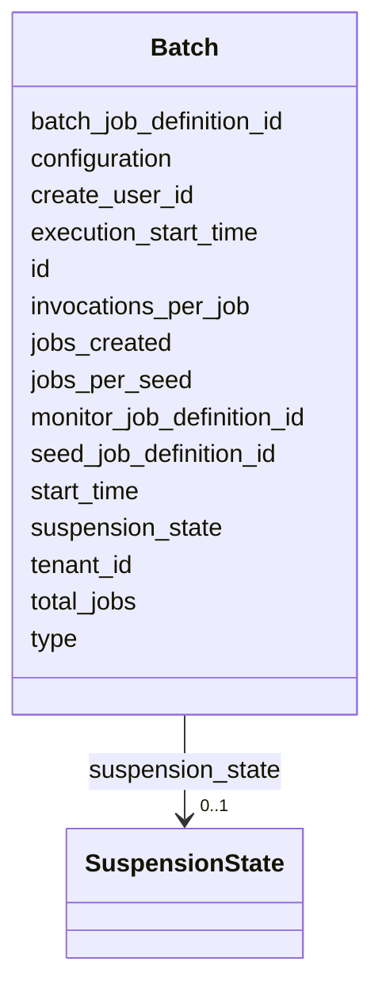

---
search:
  boost: 10.0
---

# Class: Batch 


_A batch represents a number of jobs which execute a number of commands asynchronously. Batches have three types of jobs: Seed jobs: Create execution jobs Execution jobs: Execute the actual action M..._


<div data-search-exclude markdown="1">


URI: [fluxnova_bpm_platform:Batch](https://w3id.org/TD-Universe/fluxnova-bpm-platform/Batch)





<!-- no inheritance hierarchy -->

## Slots

| Name | Cardinality and Range | Description | Inheritance |
| ---  | --- | --- | --- |
| [id](id.md) | 1 <br/> [String](String.md) | Unique identifier | direct |
| [type](type.md) | 0..1 <br/> [String](String.md) | Type discriminator | direct |
| [total_jobs](total_jobs.md) | 0..1 <br/> [Integer](Integer.md) | Total number of jobs | direct |
| [jobs_created](jobs_created.md) | 0..1 <br/> [Integer](Integer.md) | The jobs created | direct |
| [jobs_per_seed](jobs_per_seed.md) | 0..1 <br/> [Integer](Integer.md) | The jobs per seed | direct |
| [invocations_per_job](invocations_per_job.md) | 0..1 <br/> [Integer](Integer.md) | The invocations per job | direct |
| [seed_job_definition_id](seed_job_definition_id.md) | 0..1 <br/> [String](String.md) | Reference to a JobDefinition | direct |
| [batch_job_definition_id](batch_job_definition_id.md) | 0..1 <br/> [String](String.md) | Reference to a JobDefinition | direct |
| [monitor_job_definition_id](monitor_job_definition_id.md) | 0..1 <br/> [String](String.md) | Reference to a JobDefinition | direct |
| [suspension_state](suspension_state.md) | 0..1 <br/> [SuspensionState](SuspensionState.md) | Whether the entity is active or suspended | direct |
| [configuration](configuration.md) | 0..1 <br/> [String](String.md) | Payload of this incident | direct |
| [tenant_id](tenant_id.md) | 0..1 <br/> [String](String.md) | Multi-tenancy discriminator | direct |
| [create_user_id](create_user_id.md) | 0..1 <br/> [String](String.md) | The authenticated user that created this case instance | direct |
| [start_time](start_time.md) | 0..1 <br/> [Datetime](Datetime.md) | Start timestamp | direct |
| [execution_start_time](execution_start_time.md) | 0..1 <br/> [Datetime](Datetime.md) | Timestamp when this started | direct |


## Usages

| used by | used in | type | used |
| ---  | --- | --- | --- |
| [FluxnovaPlatformData](FluxnovaPlatformData.md) | [batches](batches.md) | range | [Batch](Batch.md) |


## In Subsets


* [Job](Job.md)
* [FluxnovaBpm](FluxnovaBpm.md)


## Identifier and Mapping Information


### Annotations

| property | value |
| --- | --- |
| sql_table | ACT_RU_BATCH |


### Schema Source


* from schema: https://w3id.org/TD-Universe/fluxnova-bpm-platform


## Mappings

| Mapping Type | Mapped Value |
| ---  | ---  |
| self | fluxnova_bpm_platform:Batch |
| native | fluxnova_bpm_platform:Batch |


## LinkML Source

<!-- TODO: investigate https://stackoverflow.com/questions/37606292/how-to-create-tabbed-code-blocks-in-mkdocs-or-sphinx -->

### Direct

<details>
```yaml
name: Batch
annotations:
  sql_table:
    tag: sql_table
    value: ACT_RU_BATCH
description: 'A batch represents a number of jobs which execute a number of commands
  asynchronously. Batches have three types of jobs: Seed jobs: Create execution jobs
  Execution jobs: Execute the actual action M...'
in_subset:
- job
- fluxnova_bpm
from_schema: https://w3id.org/TD-Universe/fluxnova-bpm-platform
slots:
- id
- type
- total_jobs
- jobs_created
- jobs_per_seed
- invocations_per_job
- seed_job_definition_id
- batch_job_definition_id
- monitor_job_definition_id
- suspension_state
- configuration
- tenant_id
- create_user_id
- start_time
- execution_start_time

```
</details>

### Induced

<details>
```yaml
name: Batch
annotations:
  sql_table:
    tag: sql_table
    value: ACT_RU_BATCH
description: 'A batch represents a number of jobs which execute a number of commands
  asynchronously. Batches have three types of jobs: Seed jobs: Create execution jobs
  Execution jobs: Execute the actual action M...'
in_subset:
- job
- fluxnova_bpm
from_schema: https://w3id.org/TD-Universe/fluxnova-bpm-platform
attributes:
  id:
    name: id
    description: Unique identifier.
    from_schema: https://w3id.org/TD-Universe/fluxnova-bpm-platform
    rank: 1000
    slot_uri: schema:identifier
    identifier: true
    owner: Batch
    domain_of:
    - ByteArray
    - MeterLog
    - SchemaLogEntry
    - TaskMeterLog
    - Authorization
    - Group
    - IdentityInfo
    - IdentityLink
    - Tenant
    - TenantMembership
    - User
    - CaseExecution
    - CaseSentryPart
    - EventSubscription
    - Execution
    - ExternalTask
    - Incident
    - Task
    - VariableInstance
    - Attachment
    - Comment
    - Filter
    - Deployment
    - ResourceDefinition
    - Batch
    - Job
    - JobDefinition
    - HistoricBatch
    - HistoricDecisionInputInstance
    - HistoricDecisionInstance
    - HistoricDecisionOutputInstance
    - HistoricDetail
    - HistoricExternalTaskLog
    - HistoricIdentityLink
    - HistoricIncident
    - HistoricJobLog
    - HistoricScopeInstance
    - HistoricVariableInstance
    - UserOperationLogEntry
    - Diagram
    - DiagramElement
    - Style
    - BaseElement
    - Definitions
    - Documentation
    - InteractionNode
    range: string
    required: true
  type:
    name: type
    description: Type discriminator.
    from_schema: https://w3id.org/TD-Universe/fluxnova-bpm-platform
    rank: 1000
    owner: Batch
    domain_of:
    - ByteArray
    - Authorization
    - Group
    - IdentityInfo
    - IdentityLink
    - CaseSentryPart
    - VariableInstance
    - Attachment
    - Comment
    - Batch
    - Job
    - HistoricBatch
    - HistoricDetail
    - HistoricIdentityLink
    - ConditionExpression
    - CorrelationProperty
    - Relationship
    - ResourceParameter
    range: string
  total_jobs:
    name: total_jobs
    annotations:
      sql_column:
        tag: sql_column
        value: TOTAL_JOBS_
    description: Total number of jobs.
    from_schema: https://w3id.org/TD-Universe/fluxnova-bpm-platform
    rank: 1000
    owner: Batch
    domain_of:
    - Batch
    - HistoricBatch
    range: integer
  jobs_created:
    name: jobs_created
    annotations:
      sql_column:
        tag: sql_column
        value: JOBS_CREATED_
    description: The jobs created.
    from_schema: https://w3id.org/TD-Universe/fluxnova-bpm-platform
    rank: 1000
    owner: Batch
    domain_of:
    - Batch
    range: integer
  jobs_per_seed:
    name: jobs_per_seed
    annotations:
      sql_column:
        tag: sql_column
        value: JOBS_PER_SEED_
    description: The jobs per seed.
    from_schema: https://w3id.org/TD-Universe/fluxnova-bpm-platform
    rank: 1000
    owner: Batch
    domain_of:
    - Batch
    - HistoricBatch
    range: integer
  invocations_per_job:
    name: invocations_per_job
    annotations:
      sql_column:
        tag: sql_column
        value: INVOCATIONS_PER_JOB_
    description: The invocations per job.
    from_schema: https://w3id.org/TD-Universe/fluxnova-bpm-platform
    rank: 1000
    owner: Batch
    domain_of:
    - Batch
    - HistoricBatch
    range: integer
  seed_job_definition_id:
    name: seed_job_definition_id
    annotations:
      sql_column:
        tag: sql_column
        value: SEED_JOB_DEF_ID_
    description: Reference to a JobDefinition.
    from_schema: https://w3id.org/TD-Universe/fluxnova-bpm-platform
    rank: 1000
    owner: Batch
    domain_of:
    - Batch
    - HistoricBatch
    range: string
  batch_job_definition_id:
    name: batch_job_definition_id
    annotations:
      sql_column:
        tag: sql_column
        value: BATCH_JOB_DEF_ID_
    description: Reference to a JobDefinition.
    from_schema: https://w3id.org/TD-Universe/fluxnova-bpm-platform
    rank: 1000
    owner: Batch
    domain_of:
    - Batch
    - HistoricBatch
    range: string
  monitor_job_definition_id:
    name: monitor_job_definition_id
    annotations:
      sql_column:
        tag: sql_column
        value: MONITOR_JOB_DEF_ID_
    description: Reference to a JobDefinition.
    from_schema: https://w3id.org/TD-Universe/fluxnova-bpm-platform
    rank: 1000
    owner: Batch
    domain_of:
    - Batch
    - HistoricBatch
    range: string
  suspension_state:
    name: suspension_state
    annotations:
      sql_column:
        tag: sql_column
        value: SUSPENSION_STATE_
    description: Whether the entity is active or suspended.
    from_schema: https://w3id.org/TD-Universe/fluxnova-bpm-platform
    rank: 1000
    owner: Batch
    domain_of:
    - Execution
    - ExternalTask
    - Task
    - ProcessDefinition
    - Batch
    - Job
    - JobDefinition
    range: SuspensionState
  configuration:
    name: configuration
    annotations:
      sql_column:
        tag: sql_column
        value: CONFIGURATION_
    description: Payload of this incident.
    from_schema: https://w3id.org/TD-Universe/fluxnova-bpm-platform
    rank: 1000
    owner: Batch
    domain_of:
    - EventSubscription
    - Incident
    - Batch
    - HistoricIncident
    range: string
  tenant_id:
    name: tenant_id
    description: Multi-tenancy discriminator.
    from_schema: https://w3id.org/TD-Universe/fluxnova-bpm-platform
    rank: 1000
    owner: Batch
    domain_of:
    - ByteArray
    - IdentityLink
    - TenantMembership
    - CaseExecution
    - CaseSentryPart
    - EventSubscription
    - Execution
    - ExternalTask
    - Incident
    - Task
    - VariableInstance
    - Attachment
    - Comment
    - Deployment
    - ResourceDefinition
    - Batch
    - Job
    - JobDefinition
    - HistoricActivityInstance
    - HistoricBatch
    - HistoricCaseActivityInstance
    - HistoricCaseInstance
    - HistoricDecisionInputInstance
    - HistoricDecisionInstance
    - HistoricDecisionOutputInstance
    - HistoricDetail
    - HistoricExternalTaskLog
    - HistoricIdentityLink
    - HistoricIncident
    - HistoricJobLog
    - HistoricProcessInstance
    - HistoricTaskInstance
    - HistoricVariableInstance
    - UserOperationLogEntry
    range: string
  create_user_id:
    name: create_user_id
    annotations:
      sql_column:
        tag: sql_column
        value: CREATE_USER_ID_
    description: The authenticated user that created this case instance.
    from_schema: https://w3id.org/TD-Universe/fluxnova-bpm-platform
    rank: 1000
    owner: Batch
    domain_of:
    - Batch
    - HistoricBatch
    - HistoricCaseInstance
    range: string
  start_time:
    name: start_time
    description: Start timestamp.
    from_schema: https://w3id.org/TD-Universe/fluxnova-bpm-platform
    rank: 1000
    owner: Batch
    domain_of:
    - Batch
    - HistoricBatch
    - HistoricScopeInstance
    range: datetime
  execution_start_time:
    name: execution_start_time
    annotations:
      sql_column:
        tag: sql_column
        value: EXEC_START_TIME_
    description: Timestamp when this started.
    from_schema: https://w3id.org/TD-Universe/fluxnova-bpm-platform
    rank: 1000
    owner: Batch
    domain_of:
    - Batch
    - HistoricBatch
    range: datetime

```
</details></div>