---
search:
  boost: 10.0
---

# Class: BoundaryEvent 


_The BPMN boundaryEvent element_


<div data-search-exclude markdown="1">


URI: [fluxnova_bpm_platform:BoundaryEvent](https://w3id.org/TD-Universe/fluxnova-bpm-platform/BoundaryEvent)

```mermaid
 classDiagram
    class BoundaryEvent
    click BoundaryEvent href "../BoundaryEvent/"
      CatchEvent <|-- BoundaryEvent
        click CatchEvent href "../CatchEvent/"
      
      BoundaryEvent : attached_to
        
          
    
        
        
        BoundaryEvent --> "0..1" Activity : attached_to
        click Activity href "../Activity/"
    

        
      BoundaryEvent : auditing
        
          
    
        
        
        BoundaryEvent --> "0..1" Auditing : auditing
        click Auditing href "../Auditing/"
    

        
      BoundaryEvent : category_value_refs
        
          
    
        
        
        BoundaryEvent --> "*" CategoryValue : category_value_refs
        click CategoryValue href "../CategoryValue/"
    

        
      BoundaryEvent : data_output_associations
        
          
    
        
        
        BoundaryEvent --> "*" DataOutputAssociation : data_output_associations
        click DataOutputAssociation href "../DataOutputAssociation/"
    

        
      BoundaryEvent : data_outputs
        
          
    
        
        
        BoundaryEvent --> "*" DataOutput : data_outputs
        click DataOutput href "../DataOutput/"
    

        
      BoundaryEvent : diagram_element
        
          
    
        
        
        BoundaryEvent --> "0..1" DiagramElement : diagram_element
        click DiagramElement href "../DiagramElement/"
    

        
      BoundaryEvent : documentations
        
          
    
        
        
        BoundaryEvent --> "*" Documentation : documentations
        click Documentation href "../Documentation/"
    

        
      BoundaryEvent : event_definition_refs
        
          
    
        
        
        BoundaryEvent --> "*" EventDefinition : event_definition_refs
        click EventDefinition href "../EventDefinition/"
    

        
      BoundaryEvent : event_definitions
        
          
    
        
        
        BoundaryEvent --> "*" EventDefinition : event_definitions
        click EventDefinition href "../EventDefinition/"
    

        
      BoundaryEvent : extension_elements
        
          
    
        
        
        BoundaryEvent --> "0..1" ExtensionElements : extension_elements
        click ExtensionElements href "../ExtensionElements/"
    

        
      BoundaryEvent : fluxnova_async_after
        
      BoundaryEvent : fluxnova_async_before
        
      BoundaryEvent : fluxnova_exclusive
        
      BoundaryEvent : fluxnova_job_priority
        
      BoundaryEvent : id
        
      BoundaryEvent : incoming
        
          
    
        
        
        BoundaryEvent --> "*" SequenceFlow : incoming
        click SequenceFlow href "../SequenceFlow/"
    

        
      BoundaryEvent : monitoring
        
          
    
        
        
        BoundaryEvent --> "0..1" Monitoring : monitoring
        click Monitoring href "../Monitoring/"
    

        
      BoundaryEvent : name
        
      BoundaryEvent : outgoing
        
          
    
        
        
        BoundaryEvent --> "*" SequenceFlow : outgoing
        click SequenceFlow href "../SequenceFlow/"
    

        
      BoundaryEvent : output_set
        
          
    
        
        
        BoundaryEvent --> "0..1" OutputSet : output_set
        click OutputSet href "../OutputSet/"
    

        
      BoundaryEvent : parallel_multiple
        
      BoundaryEvent : previous_nodes
        
          
    
        
        
        BoundaryEvent --> "0..1" FlowNode : previous_nodes
        click FlowNode href "../FlowNode/"
    

        
      BoundaryEvent : properties
        
          
    
        
        
        BoundaryEvent --> "*" BpmnProperty : properties
        click BpmnProperty href "../BpmnProperty/"
    

        
      BoundaryEvent : scope
        
          
    
        
        
        BoundaryEvent --> "0..1" BpmnModelElementInstance : scope
        click BpmnModelElementInstance href "../BpmnModelElementInstance/"
    

        
      BoundaryEvent : succeeding_nodes
        
          
    
        
        
        BoundaryEvent --> "0..1" FlowNode : succeeding_nodes
        click FlowNode href "../FlowNode/"
    

        
      
```





## Inheritance
* [BpmnModelElementInstance](BpmnModelElementInstance.md)
    * [BaseElement](BaseElement.md)
        * [FlowElement](FlowElement.md)
            * [FlowNode](FlowNode.md)
                * [Event](Event.md) [ [InteractionNode](InteractionNode.md)]
                    * [CatchEvent](CatchEvent.md)
                        * **BoundaryEvent**


## Slots

| Name | Cardinality and Range | Description | Inheritance |
| ---  | --- | --- | --- |
| [attached_to](attached_to.md) | 0..1 <br/> [Activity](Activity.md) | The activity to which this boundary event is attached | direct |
| [parallel_multiple](parallel_multiple.md) | 0..1 <br/> [Boolean](Boolean.md) | Whether all event triggers must occur (parallel) rather than any one | [CatchEvent](CatchEvent.md) |
| [data_outputs](data_outputs.md) | * <br/> [DataOutput](DataOutput.md) | Output data elements of this specification | [CatchEvent](CatchEvent.md) |
| [data_output_associations](data_output_associations.md) | * <br/> [DataOutputAssociation](DataOutputAssociation.md) | Data associations that move output data out of this activity | [CatchEvent](CatchEvent.md) |
| [output_set](output_set.md) | 0..1 <br/> [OutputSet](OutputSet.md) | The output set associated with this output data | [CatchEvent](CatchEvent.md) |
| [event_definitions](event_definitions.md) | * <br/> [EventDefinition](EventDefinition.md) | Event definitions that specify the event trigger type | [CatchEvent](CatchEvent.md) |
| [event_definition_refs](event_definition_refs.md) | * <br/> [EventDefinition](EventDefinition.md) | Collection of event definition elements associated with this element | [CatchEvent](CatchEvent.md) |
| [properties](properties.md) | * <br/> [BpmnProperty](BpmnProperty.md) | Serialized properties | [Event](Event.md) |
| [id](id.md) | 1 <br/> [String](String.md) | Unique identifier | [InteractionNode](InteractionNode.md), [BaseElement](BaseElement.md) |
| [incoming](incoming.md) | * <br/> [SequenceFlow](SequenceFlow.md) | Sequence flows entering this flow node | [FlowNode](FlowNode.md) |
| [outgoing](outgoing.md) | * <br/> [SequenceFlow](SequenceFlow.md) | Sequence flows leaving this flow node | [FlowNode](FlowNode.md) |
| [previous_nodes](previous_nodes.md) | 0..1 <br/> [FlowNode](FlowNode.md) | The previous nodes of this element | [FlowNode](FlowNode.md) |
| [succeeding_nodes](succeeding_nodes.md) | 0..1 <br/> [FlowNode](FlowNode.md) | The succeeding nodes of this element | [FlowNode](FlowNode.md) |
| [fluxnova_async_before](fluxnova_async_before.md) | 0..1 <br/> [Boolean](Boolean.md) | Whether this element is executed asynchronously before its start | [FlowNode](FlowNode.md) |
| [fluxnova_async_after](fluxnova_async_after.md) | 0..1 <br/> [Boolean](Boolean.md) | Whether this element is executed asynchronously after its end | [FlowNode](FlowNode.md) |
| [fluxnova_exclusive](fluxnova_exclusive.md) | 0..1 <br/> [Boolean](Boolean.md) | Whether this element participates in an exclusive job execution | [FlowNode](FlowNode.md) |
| [fluxnova_job_priority](fluxnova_job_priority.md) | 0..1 <br/> [String](String.md) | Priority assigned to async continuation jobs for this element | [FlowNode](FlowNode.md) |
| [name](name.md) | 0..1 <br/> [String](String.md) | Human-readable name | [FlowElement](FlowElement.md) |
| [auditing](auditing.md) | 0..1 <br/> [Auditing](Auditing.md) | Auditing information attached to this flow element | [FlowElement](FlowElement.md) |
| [monitoring](monitoring.md) | 0..1 <br/> [Monitoring](Monitoring.md) | Monitoring information attached to this flow element | [FlowElement](FlowElement.md) |
| [category_value_refs](category_value_refs.md) | * <br/> [CategoryValue](CategoryValue.md) | Category values associated with this flow element | [FlowElement](FlowElement.md) |
| [documentations](documentations.md) | * <br/> [Documentation](Documentation.md) | Collection of documentation elements associated with this element | [BaseElement](BaseElement.md) |
| [extension_elements](extension_elements.md) | 0..1 <br/> [ExtensionElements](ExtensionElements.md) | Extension elements holding vendor-specific metadata | [BaseElement](BaseElement.md) |
| [diagram_element](diagram_element.md) | 0..1 <br/> [DiagramElement](DiagramElement.md) | The diagram element that visually represents this BPMN element | [BaseElement](BaseElement.md) |
| [scope](scope.md) | 0..1 <br/> [BpmnModelElementInstance](BpmnModelElementInstance.md) | Tests if the element is a scope like process or sub-process | [BpmnModelElementInstance](BpmnModelElementInstance.md) |


## In Subsets


* [Instance](Instance.md)
* [FluxnovaBpmnModel](FluxnovaBpmnModel.md)


## Identifier and Mapping Information


### Annotations

| property | value |
| --- | --- |
| java_package | org.finos.fluxnova.bpm.model.bpmn.instance |
| source_file | model-api/bpmn-model/src/main/java/org/finos/fluxnova/bpm/model/bpmn/instance/BoundaryEvent.java |


### Schema Source


* from schema: https://w3id.org/TD-Universe/fluxnova-bpm-platform


## Mappings

| Mapping Type | Mapped Value |
| ---  | ---  |
| self | fluxnova_bpm_platform:BoundaryEvent |
| native | fluxnova_bpm_platform:BoundaryEvent |


## LinkML Source

<!-- TODO: investigate https://stackoverflow.com/questions/37606292/how-to-create-tabbed-code-blocks-in-mkdocs-or-sphinx -->

### Direct

<details>
```yaml
name: BoundaryEvent
annotations:
  java_package:
    tag: java_package
    value: org.finos.fluxnova.bpm.model.bpmn.instance
  source_file:
    tag: source_file
    value: model-api/bpmn-model/src/main/java/org/finos/fluxnova/bpm/model/bpmn/instance/BoundaryEvent.java
description: The BPMN boundaryEvent element
in_subset:
- instance
- fluxnova_bpmn_model
from_schema: https://w3id.org/TD-Universe/fluxnova-bpm-platform
is_a: CatchEvent
slots:
- attached_to

```
</details>

### Induced

<details>
```yaml
name: BoundaryEvent
annotations:
  java_package:
    tag: java_package
    value: org.finos.fluxnova.bpm.model.bpmn.instance
  source_file:
    tag: source_file
    value: model-api/bpmn-model/src/main/java/org/finos/fluxnova/bpm/model/bpmn/instance/BoundaryEvent.java
description: The BPMN boundaryEvent element
in_subset:
- instance
- fluxnova_bpmn_model
from_schema: https://w3id.org/TD-Universe/fluxnova-bpm-platform
is_a: CatchEvent
attributes:
  attached_to:
    name: attached_to
    description: The activity to which this boundary event is attached.
    from_schema: https://w3id.org/TD-Universe/fluxnova-bpm-platform
    rank: 1000
    owner: BoundaryEvent
    domain_of:
    - BoundaryEvent
    range: Activity
  parallel_multiple:
    name: parallel_multiple
    description: Whether all event triggers must occur (parallel) rather than any
      one.
    from_schema: https://w3id.org/TD-Universe/fluxnova-bpm-platform
    rank: 1000
    owner: BoundaryEvent
    domain_of:
    - CatchEvent
    range: boolean
  data_outputs:
    name: data_outputs
    description: Output data elements of this specification.
    from_schema: https://w3id.org/TD-Universe/fluxnova-bpm-platform
    rank: 1000
    owner: BoundaryEvent
    domain_of:
    - CatchEvent
    - IoSpecification
    range: DataOutput
    multivalued: true
    inlined: true
    inlined_as_list: true
  data_output_associations:
    name: data_output_associations
    description: Data associations that move output data out of this activity.
    from_schema: https://w3id.org/TD-Universe/fluxnova-bpm-platform
    rank: 1000
    owner: BoundaryEvent
    domain_of:
    - Activity
    - CatchEvent
    range: DataOutputAssociation
    multivalued: true
    inlined: true
    inlined_as_list: true
  output_set:
    name: output_set
    description: The output set associated with this output data.
    from_schema: https://w3id.org/TD-Universe/fluxnova-bpm-platform
    rank: 1000
    owner: BoundaryEvent
    domain_of:
    - CatchEvent
    range: OutputSet
  event_definitions:
    name: event_definitions
    description: Event definitions that specify the event trigger type.
    from_schema: https://w3id.org/TD-Universe/fluxnova-bpm-platform
    rank: 1000
    owner: BoundaryEvent
    domain_of:
    - CatchEvent
    - ThrowEvent
    range: EventDefinition
    multivalued: true
    inlined: true
    inlined_as_list: true
  event_definition_refs:
    name: event_definition_refs
    description: Collection of event definition elements associated with this element.
    from_schema: https://w3id.org/TD-Universe/fluxnova-bpm-platform
    rank: 1000
    owner: BoundaryEvent
    domain_of:
    - CatchEvent
    - ThrowEvent
    range: EventDefinition
    multivalued: true
    inlined: true
    inlined_as_list: true
  properties:
    name: properties
    annotations:
      sql_column:
        tag: sql_column
        value: PROPERTIES_
    description: Serialized properties.
    from_schema: https://w3id.org/TD-Universe/fluxnova-bpm-platform
    rank: 1000
    owner: BoundaryEvent
    domain_of:
    - Filter
    - Activity
    - Event
    - Process
    range: BpmnProperty
    multivalued: true
    inlined: true
    inlined_as_list: true
  id:
    name: id
    description: Unique identifier.
    from_schema: https://w3id.org/TD-Universe/fluxnova-bpm-platform
    rank: 1000
    slot_uri: schema:identifier
    identifier: true
    owner: BoundaryEvent
    domain_of:
    - ByteArray
    - MeterLog
    - SchemaLogEntry
    - TaskMeterLog
    - Authorization
    - Group
    - IdentityInfo
    - IdentityLink
    - Tenant
    - TenantMembership
    - User
    - CaseExecution
    - CaseSentryPart
    - EventSubscription
    - Execution
    - ExternalTask
    - Incident
    - Task
    - VariableInstance
    - Attachment
    - Comment
    - Filter
    - Deployment
    - ResourceDefinition
    - Batch
    - Job
    - JobDefinition
    - HistoricBatch
    - HistoricDecisionInputInstance
    - HistoricDecisionInstance
    - HistoricDecisionOutputInstance
    - HistoricDetail
    - HistoricExternalTaskLog
    - HistoricIdentityLink
    - HistoricIncident
    - HistoricJobLog
    - HistoricScopeInstance
    - HistoricVariableInstance
    - UserOperationLogEntry
    - Diagram
    - DiagramElement
    - Style
    - BaseElement
    - Definitions
    - Documentation
    - InteractionNode
    range: string
    required: true
  incoming:
    name: incoming
    description: Sequence flows entering this flow node.
    from_schema: https://w3id.org/TD-Universe/fluxnova-bpm-platform
    rank: 1000
    owner: BoundaryEvent
    domain_of:
    - FlowNode
    range: SequenceFlow
    multivalued: true
    inlined: true
    inlined_as_list: true
  outgoing:
    name: outgoing
    description: Sequence flows leaving this flow node.
    from_schema: https://w3id.org/TD-Universe/fluxnova-bpm-platform
    rank: 1000
    owner: BoundaryEvent
    domain_of:
    - FlowNode
    range: SequenceFlow
    multivalued: true
    inlined: true
    inlined_as_list: true
  previous_nodes:
    name: previous_nodes
    description: The previous nodes of this element.
    from_schema: https://w3id.org/TD-Universe/fluxnova-bpm-platform
    rank: 1000
    owner: BoundaryEvent
    domain_of:
    - FlowNode
    range: FlowNode
  succeeding_nodes:
    name: succeeding_nodes
    description: The succeeding nodes of this element.
    from_schema: https://w3id.org/TD-Universe/fluxnova-bpm-platform
    rank: 1000
    owner: BoundaryEvent
    domain_of:
    - FlowNode
    range: FlowNode
  fluxnova_async_before:
    name: fluxnova_async_before
    description: Whether this element is executed asynchronously before its start.
    from_schema: https://w3id.org/TD-Universe/fluxnova-bpm-platform
    rank: 1000
    owner: BoundaryEvent
    domain_of:
    - FlowNode
    - MultiInstanceLoopCharacteristics
    range: boolean
  fluxnova_async_after:
    name: fluxnova_async_after
    description: Whether this element is executed asynchronously after its end.
    from_schema: https://w3id.org/TD-Universe/fluxnova-bpm-platform
    rank: 1000
    owner: BoundaryEvent
    domain_of:
    - FlowNode
    - MultiInstanceLoopCharacteristics
    range: boolean
  fluxnova_exclusive:
    name: fluxnova_exclusive
    description: Whether this element participates in an exclusive job execution.
    from_schema: https://w3id.org/TD-Universe/fluxnova-bpm-platform
    rank: 1000
    owner: BoundaryEvent
    domain_of:
    - FlowNode
    - MultiInstanceLoopCharacteristics
    range: boolean
  fluxnova_job_priority:
    name: fluxnova_job_priority
    description: Priority assigned to async continuation jobs for this element.
    from_schema: https://w3id.org/TD-Universe/fluxnova-bpm-platform
    rank: 1000
    owner: BoundaryEvent
    domain_of:
    - FlowNode
    - Process
    range: string
  name:
    name: name
    description: Human-readable name.
    from_schema: https://w3id.org/TD-Universe/fluxnova-bpm-platform
    rank: 1000
    slot_uri: schema:name
    owner: BoundaryEvent
    domain_of:
    - ByteArray
    - MeterLog
    - Property
    - Group
    - Tenant
    - Task
    - VariableInstance
    - Attachment
    - Filter
    - Deployment
    - ResourceDefinition
    - HistoricDetail
    - HistoricTaskInstance
    - HistoricVariableInstance
    - Font
    - Diagram
    - CallableElement
    - Category
    - Collaboration
    - ConversationLink
    - ConversationNode
    - CorrelationKey
    - CorrelationProperty
    - DataInput
    - DataOutput
    - DataState
    - DataStore
    - Definitions
    - Error
    - Escalation
    - FlowElement
    - InputSet
    - Interface
    - Lane
    - LaneSet
    - LinkEventDefinition
    - Message
    - MessageFlow
    - Operation
    - OutputSet
    - Participant
    - BpmnProperty
    - Resource
    - ResourceParameter
    - ResourceRole
    - Signal
    range: string
  auditing:
    name: auditing
    description: Auditing information attached to this flow element.
    from_schema: https://w3id.org/TD-Universe/fluxnova-bpm-platform
    rank: 1000
    owner: BoundaryEvent
    domain_of:
    - FlowElement
    - Process
    range: Auditing
  monitoring:
    name: monitoring
    description: Monitoring information attached to this flow element.
    from_schema: https://w3id.org/TD-Universe/fluxnova-bpm-platform
    rank: 1000
    owner: BoundaryEvent
    domain_of:
    - FlowElement
    - Process
    range: Monitoring
  category_value_refs:
    name: category_value_refs
    description: Category values associated with this flow element.
    from_schema: https://w3id.org/TD-Universe/fluxnova-bpm-platform
    rank: 1000
    owner: BoundaryEvent
    domain_of:
    - FlowElement
    range: CategoryValue
    multivalued: true
    inlined: true
    inlined_as_list: true
  documentations:
    name: documentations
    description: Collection of documentation elements associated with this element.
    from_schema: https://w3id.org/TD-Universe/fluxnova-bpm-platform
    rank: 1000
    owner: BoundaryEvent
    domain_of:
    - BaseElement
    range: Documentation
    multivalued: true
    inlined: true
    inlined_as_list: true
  extension_elements:
    name: extension_elements
    description: Extension elements holding vendor-specific metadata.
    from_schema: https://w3id.org/TD-Universe/fluxnova-bpm-platform
    rank: 1000
    owner: BoundaryEvent
    domain_of:
    - BaseElement
    range: ExtensionElements
  diagram_element:
    name: diagram_element
    description: The diagram element that visually represents this BPMN element.
    from_schema: https://w3id.org/TD-Universe/fluxnova-bpm-platform
    rank: 1000
    owner: BoundaryEvent
    domain_of:
    - BaseElement
    range: DiagramElement
  scope:
    name: scope
    description: Tests if the element is a scope like process or sub-process.
    from_schema: https://w3id.org/TD-Universe/fluxnova-bpm-platform
    rank: 1000
    owner: BoundaryEvent
    domain_of:
    - BpmnModelElementInstance
    range: BpmnModelElementInstance

```
</details></div>