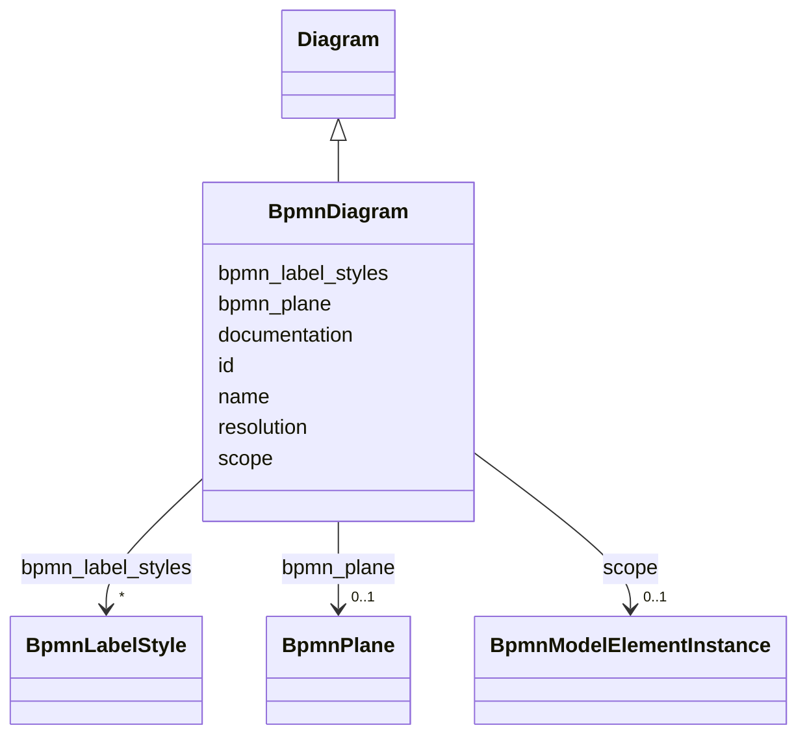

---
search:
  boost: 10.0
---

# Class: BpmnDiagram 


_The BPMNDI BPMNDiagram element_


<div data-search-exclude markdown="1">


URI: [fluxnova_bpm_platform:BpmnDiagram](https://w3id.org/TD-Universe/fluxnova-bpm-platform/BpmnDiagram)





## Inheritance
* [BpmnModelElementInstance](BpmnModelElementInstance.md)
    * [Diagram](Diagram.md)
        * **BpmnDiagram**


## Slots

| Name | Cardinality and Range | Description | Inheritance |
| ---  | --- | --- | --- |
| [bpmn_plane](bpmn_plane.md) | 0..1 <br/> [BpmnPlane](BpmnPlane.md) | The plane element containing the shapes and edges of this diagram | direct |
| [bpmn_label_styles](bpmn_label_styles.md) | * <br/> [BpmnLabelStyle](BpmnLabelStyle.md) | Label style definitions available in this BPMN diagram | direct |
| [name](name.md) | 0..1 <br/> [String](String.md) | Human-readable name | [Diagram](Diagram.md) |
| [documentation](documentation.md) | 0..1 <br/> [String](String.md) | Human-readable documentation attached to this element | [Diagram](Diagram.md) |
| [resolution](resolution.md) | 0..1 <br/> [Float](Float.md) | The resolution of this element | [Diagram](Diagram.md) |
| [id](id.md) | 1 <br/> [String](String.md) | Unique identifier | [Diagram](Diagram.md) |
| [scope](scope.md) | 0..1 <br/> [BpmnModelElementInstance](BpmnModelElementInstance.md) | Tests if the element is a scope like process or sub-process | [BpmnModelElementInstance](BpmnModelElementInstance.md) |


## In Subsets


* [Bpmndi](Bpmndi.md)
* [FluxnovaBpmnModel](FluxnovaBpmnModel.md)


## Identifier and Mapping Information


### Annotations

| property | value |
| --- | --- |
| java_package | org.finos.fluxnova.bpm.model.bpmn.instance.bpmndi |
| source_file | model-api/bpmn-model/src/main/java/org/finos/fluxnova/bpm/model/bpmn/instance/bpmndi/BpmnDiagram.java |


### Schema Source


* from schema: https://w3id.org/TD-Universe/fluxnova-bpm-platform


## Mappings

| Mapping Type | Mapped Value |
| ---  | ---  |
| self | fluxnova_bpm_platform:BpmnDiagram |
| native | fluxnova_bpm_platform:BpmnDiagram |


## LinkML Source

<!-- TODO: investigate https://stackoverflow.com/questions/37606292/how-to-create-tabbed-code-blocks-in-mkdocs-or-sphinx -->

### Direct

<details>
```yaml
name: BpmnDiagram
annotations:
  java_package:
    tag: java_package
    value: org.finos.fluxnova.bpm.model.bpmn.instance.bpmndi
  source_file:
    tag: source_file
    value: model-api/bpmn-model/src/main/java/org/finos/fluxnova/bpm/model/bpmn/instance/bpmndi/BpmnDiagram.java
description: The BPMNDI BPMNDiagram element
in_subset:
- bpmndi
- fluxnova_bpmn_model
from_schema: https://w3id.org/TD-Universe/fluxnova-bpm-platform
is_a: Diagram
slots:
- bpmn_plane
- bpmn_label_styles

```
</details>

### Induced

<details>
```yaml
name: BpmnDiagram
annotations:
  java_package:
    tag: java_package
    value: org.finos.fluxnova.bpm.model.bpmn.instance.bpmndi
  source_file:
    tag: source_file
    value: model-api/bpmn-model/src/main/java/org/finos/fluxnova/bpm/model/bpmn/instance/bpmndi/BpmnDiagram.java
description: The BPMNDI BPMNDiagram element
in_subset:
- bpmndi
- fluxnova_bpmn_model
from_schema: https://w3id.org/TD-Universe/fluxnova-bpm-platform
is_a: Diagram
attributes:
  bpmn_plane:
    name: bpmn_plane
    description: The plane element containing the shapes and edges of this diagram.
    from_schema: https://w3id.org/TD-Universe/fluxnova-bpm-platform
    rank: 1000
    owner: BpmnDiagram
    domain_of:
    - BpmnDiagram
    range: BpmnPlane
  bpmn_label_styles:
    name: bpmn_label_styles
    description: Label style definitions available in this BPMN diagram.
    from_schema: https://w3id.org/TD-Universe/fluxnova-bpm-platform
    rank: 1000
    owner: BpmnDiagram
    domain_of:
    - BpmnDiagram
    range: BpmnLabelStyle
    multivalued: true
    inlined: true
    inlined_as_list: true
  name:
    name: name
    description: Human-readable name.
    from_schema: https://w3id.org/TD-Universe/fluxnova-bpm-platform
    rank: 1000
    slot_uri: schema:name
    owner: BpmnDiagram
    domain_of:
    - ByteArray
    - MeterLog
    - Property
    - Group
    - Tenant
    - Task
    - VariableInstance
    - Attachment
    - Filter
    - Deployment
    - ResourceDefinition
    - HistoricDetail
    - HistoricTaskInstance
    - HistoricVariableInstance
    - Font
    - Diagram
    - CallableElement
    - Category
    - Collaboration
    - ConversationLink
    - ConversationNode
    - CorrelationKey
    - CorrelationProperty
    - DataInput
    - DataOutput
    - DataState
    - DataStore
    - Definitions
    - Error
    - Escalation
    - FlowElement
    - InputSet
    - Interface
    - Lane
    - LaneSet
    - LinkEventDefinition
    - Message
    - MessageFlow
    - Operation
    - OutputSet
    - Participant
    - BpmnProperty
    - Resource
    - ResourceParameter
    - ResourceRole
    - Signal
    range: string
  documentation:
    name: documentation
    description: Human-readable documentation attached to this element.
    from_schema: https://w3id.org/TD-Universe/fluxnova-bpm-platform
    rank: 1000
    owner: BpmnDiagram
    domain_of:
    - Diagram
    range: string
  resolution:
    name: resolution
    description: The resolution of this element.
    from_schema: https://w3id.org/TD-Universe/fluxnova-bpm-platform
    rank: 1000
    owner: BpmnDiagram
    domain_of:
    - Diagram
    range: float
  id:
    name: id
    description: Unique identifier.
    from_schema: https://w3id.org/TD-Universe/fluxnova-bpm-platform
    rank: 1000
    slot_uri: schema:identifier
    identifier: true
    owner: BpmnDiagram
    domain_of:
    - ByteArray
    - MeterLog
    - SchemaLogEntry
    - TaskMeterLog
    - Authorization
    - Group
    - IdentityInfo
    - IdentityLink
    - Tenant
    - TenantMembership
    - User
    - CaseExecution
    - CaseSentryPart
    - EventSubscription
    - Execution
    - ExternalTask
    - Incident
    - Task
    - VariableInstance
    - Attachment
    - Comment
    - Filter
    - Deployment
    - ResourceDefinition
    - Batch
    - Job
    - JobDefinition
    - HistoricBatch
    - HistoricDecisionInputInstance
    - HistoricDecisionInstance
    - HistoricDecisionOutputInstance
    - HistoricDetail
    - HistoricExternalTaskLog
    - HistoricIdentityLink
    - HistoricIncident
    - HistoricJobLog
    - HistoricScopeInstance
    - HistoricVariableInstance
    - UserOperationLogEntry
    - Diagram
    - DiagramElement
    - Style
    - BaseElement
    - Definitions
    - Documentation
    - InteractionNode
    range: string
    required: true
  scope:
    name: scope
    description: Tests if the element is a scope like process or sub-process.
    from_schema: https://w3id.org/TD-Universe/fluxnova-bpm-platform
    rank: 1000
    owner: BpmnDiagram
    domain_of:
    - BpmnModelElementInstance
    range: BpmnModelElementInstance

```
</details></div>