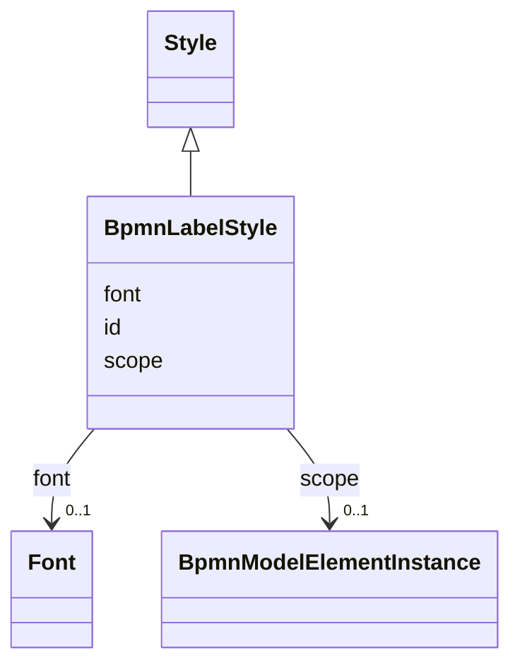

---
search:
  boost: 10.0
---

# Class: BpmnLabelStyle 


_The BPMNDI BPMNLabelStyle element_


<div data-search-exclude markdown="1">


URI: [fluxnova_bpm_platform:BpmnLabelStyle](https://w3id.org/TD-Universe/fluxnova-bpm-platform/BpmnLabelStyle)





## Inheritance
* [BpmnModelElementInstance](BpmnModelElementInstance.md)
    * [Style](Style.md)
        * **BpmnLabelStyle**


## Slots

| Name | Cardinality and Range | Description | Inheritance |
| ---  | --- | --- | --- |
| [font](font.md) | 0..1 <br/> [Font](Font.md) | The font of this element | direct |
| [id](id.md) | 1 <br/> [String](String.md) | Unique identifier | [Style](Style.md) |
| [scope](scope.md) | 0..1 <br/> [BpmnModelElementInstance](BpmnModelElementInstance.md) | Tests if the element is a scope like process or sub-process | [BpmnModelElementInstance](BpmnModelElementInstance.md) |


## Usages

| used by | used in | type | used |
| ---  | --- | --- | --- |
| [BpmnDiagram](BpmnDiagram.md) | [bpmn_label_styles](bpmn_label_styles.md) | range | [BpmnLabelStyle](BpmnLabelStyle.md) |
| [BpmnLabel](BpmnLabel.md) | [label_style](label_style.md) | range | [BpmnLabelStyle](BpmnLabelStyle.md) |


## In Subsets


* [Bpmndi](Bpmndi.md)
* [FluxnovaBpmnModel](FluxnovaBpmnModel.md)


## Identifier and Mapping Information


### Annotations

| property | value |
| --- | --- |
| java_package | org.finos.fluxnova.bpm.model.bpmn.instance.bpmndi |
| source_file | model-api/bpmn-model/src/main/java/org/finos/fluxnova/bpm/model/bpmn/instance/bpmndi/BpmnLabelStyle.java |


### Schema Source


* from schema: https://w3id.org/TD-Universe/fluxnova-bpm-platform


## Mappings

| Mapping Type | Mapped Value |
| ---  | ---  |
| self | fluxnova_bpm_platform:BpmnLabelStyle |
| native | fluxnova_bpm_platform:BpmnLabelStyle |


## LinkML Source

<!-- TODO: investigate https://stackoverflow.com/questions/37606292/how-to-create-tabbed-code-blocks-in-mkdocs-or-sphinx -->

### Direct

<details>
```yaml
name: BpmnLabelStyle
annotations:
  java_package:
    tag: java_package
    value: org.finos.fluxnova.bpm.model.bpmn.instance.bpmndi
  source_file:
    tag: source_file
    value: model-api/bpmn-model/src/main/java/org/finos/fluxnova/bpm/model/bpmn/instance/bpmndi/BpmnLabelStyle.java
description: The BPMNDI BPMNLabelStyle element
in_subset:
- bpmndi
- fluxnova_bpmn_model
from_schema: https://w3id.org/TD-Universe/fluxnova-bpm-platform
is_a: Style
slots:
- font

```
</details>

### Induced

<details>
```yaml
name: BpmnLabelStyle
annotations:
  java_package:
    tag: java_package
    value: org.finos.fluxnova.bpm.model.bpmn.instance.bpmndi
  source_file:
    tag: source_file
    value: model-api/bpmn-model/src/main/java/org/finos/fluxnova/bpm/model/bpmn/instance/bpmndi/BpmnLabelStyle.java
description: The BPMNDI BPMNLabelStyle element
in_subset:
- bpmndi
- fluxnova_bpmn_model
from_schema: https://w3id.org/TD-Universe/fluxnova-bpm-platform
is_a: Style
attributes:
  font:
    name: font
    description: The font of this element.
    from_schema: https://w3id.org/TD-Universe/fluxnova-bpm-platform
    rank: 1000
    owner: BpmnLabelStyle
    domain_of:
    - BpmnLabelStyle
    range: Font
  id:
    name: id
    description: Unique identifier.
    from_schema: https://w3id.org/TD-Universe/fluxnova-bpm-platform
    rank: 1000
    slot_uri: schema:identifier
    identifier: true
    owner: BpmnLabelStyle
    domain_of:
    - ByteArray
    - MeterLog
    - SchemaLogEntry
    - TaskMeterLog
    - Authorization
    - Group
    - IdentityInfo
    - IdentityLink
    - Tenant
    - TenantMembership
    - User
    - CaseExecution
    - CaseSentryPart
    - EventSubscription
    - Execution
    - ExternalTask
    - Incident
    - Task
    - VariableInstance
    - Attachment
    - Comment
    - Filter
    - Deployment
    - ResourceDefinition
    - Batch
    - Job
    - JobDefinition
    - HistoricBatch
    - HistoricDecisionInputInstance
    - HistoricDecisionInstance
    - HistoricDecisionOutputInstance
    - HistoricDetail
    - HistoricExternalTaskLog
    - HistoricIdentityLink
    - HistoricIncident
    - HistoricJobLog
    - HistoricScopeInstance
    - HistoricVariableInstance
    - UserOperationLogEntry
    - Diagram
    - DiagramElement
    - Style
    - BaseElement
    - Definitions
    - Documentation
    - InteractionNode
    range: string
    required: true
  scope:
    name: scope
    description: Tests if the element is a scope like process or sub-process.
    from_schema: https://w3id.org/TD-Universe/fluxnova-bpm-platform
    rank: 1000
    owner: BpmnLabelStyle
    domain_of:
    - BpmnModelElementInstance
    range: BpmnModelElementInstance

```
</details></div>