---
search:
  boost: 10.0
---

# Class: BpmnModelElementInstance 


_Interface implemented by all elements in a BPMN Model_


<div data-search-exclude markdown="1">


URI: [fluxnova_bpm_platform:BpmnModelElementInstance](https://w3id.org/TD-Universe/fluxnova-bpm-platform/BpmnModelElementInstance)

```mermaid
 classDiagram
    class BpmnModelElementInstance
    click BpmnModelElementInstance href "../BpmnModelElementInstance/"
      BpmnModelElementInstance <|-- Bounds
        click Bounds href "../Bounds/"
      BpmnModelElementInstance <|-- Font
        click Font href "../Font/"
      BpmnModelElementInstance <|-- Point
        click Point href "../Point/"
      BpmnModelElementInstance <|-- Diagram
        click Diagram href "../Diagram/"
      BpmnModelElementInstance <|-- DiagramElement
        click DiagramElement href "../DiagramElement/"
      BpmnModelElementInstance <|-- Extension
        click Extension href "../Extension/"
      BpmnModelElementInstance <|-- Style
        click Style href "../Style/"
      BpmnModelElementInstance <|-- BaseElement
        click BaseElement href "../BaseElement/"
      BpmnModelElementInstance <|-- Definitions
        click Definitions href "../Definitions/"
      BpmnModelElementInstance <|-- Documentation
        click Documentation href "../Documentation/"
      BpmnModelElementInstance <|-- ExtensionElements
        click ExtensionElements href "../ExtensionElements/"
      BpmnModelElementInstance <|-- Import
        click Import href "../Import/"
      BpmnModelElementInstance <|-- Script
        click Script href "../Script/"
      BpmnModelElementInstance <|-- Text
        click Text href "../Text/"
      BpmnModelElementInstance <|-- FluxnovaConnector
        click FluxnovaConnector href "../FluxnovaConnector/"
      BpmnModelElementInstance <|-- FluxnovaConnectorId
        click FluxnovaConnectorId href "../FluxnovaConnectorId/"
      BpmnModelElementInstance <|-- FluxnovaConstraint
        click FluxnovaConstraint href "../FluxnovaConstraint/"
      BpmnModelElementInstance <|-- FluxnovaEntry
        click FluxnovaEntry href "../FluxnovaEntry/"
      BpmnModelElementInstance <|-- FluxnovaExecutionListener
        click FluxnovaExecutionListener href "../FluxnovaExecutionListener/"
      BpmnModelElementInstance <|-- FluxnovaExpression
        click FluxnovaExpression href "../FluxnovaExpression/"
      BpmnModelElementInstance <|-- FluxnovaFailedJobRetryTimeCycle
        click FluxnovaFailedJobRetryTimeCycle href "../FluxnovaFailedJobRetryTimeCycle/"
      BpmnModelElementInstance <|-- FluxnovaField
        click FluxnovaField href "../FluxnovaField/"
      BpmnModelElementInstance <|-- FluxnovaFormData
        click FluxnovaFormData href "../FluxnovaFormData/"
      BpmnModelElementInstance <|-- FluxnovaFormField
        click FluxnovaFormField href "../FluxnovaFormField/"
      BpmnModelElementInstance <|-- FluxnovaFormProperty
        click FluxnovaFormProperty href "../FluxnovaFormProperty/"
      BpmnModelElementInstance <|-- FluxnovaIn
        click FluxnovaIn href "../FluxnovaIn/"
      BpmnModelElementInstance <|-- FluxnovaInputOutput
        click FluxnovaInputOutput href "../FluxnovaInputOutput/"
      BpmnModelElementInstance <|-- FluxnovaInputParameter
        click FluxnovaInputParameter href "../FluxnovaInputParameter/"
      BpmnModelElementInstance <|-- FluxnovaList
        click FluxnovaList href "../FluxnovaList/"
      BpmnModelElementInstance <|-- FluxnovaMap
        click FluxnovaMap href "../FluxnovaMap/"
      BpmnModelElementInstance <|-- FluxnovaOut
        click FluxnovaOut href "../FluxnovaOut/"
      BpmnModelElementInstance <|-- FluxnovaOutputParameter
        click FluxnovaOutputParameter href "../FluxnovaOutputParameter/"
      BpmnModelElementInstance <|-- FluxnovaPotentialStarter
        click FluxnovaPotentialStarter href "../FluxnovaPotentialStarter/"
      BpmnModelElementInstance <|-- FluxnovaProperties
        click FluxnovaProperties href "../FluxnovaProperties/"
      BpmnModelElementInstance <|-- FluxnovaProperty
        click FluxnovaProperty href "../FluxnovaProperty/"
      BpmnModelElementInstance <|-- FluxnovaScript
        click FluxnovaScript href "../FluxnovaScript/"
      BpmnModelElementInstance <|-- FluxnovaString
        click FluxnovaString href "../FluxnovaString/"
      BpmnModelElementInstance <|-- FluxnovaTaskListener
        click FluxnovaTaskListener href "../FluxnovaTaskListener/"
      BpmnModelElementInstance <|-- FluxnovaValidation
        click FluxnovaValidation href "../FluxnovaValidation/"
      BpmnModelElementInstance <|-- FluxnovaValue
        click FluxnovaValue href "../FluxnovaValue/"
      
      BpmnModelElementInstance : scope
        
          
    
        
        
        BpmnModelElementInstance --> "0..1" BpmnModelElementInstance : scope
        click BpmnModelElementInstance href "../BpmnModelElementInstance/"
    

        
      
```





## Inheritance
* **BpmnModelElementInstance**
    * [Bounds](Bounds.md)
    * [Font](Font.md)
    * [Point](Point.md)
    * [Diagram](Diagram.md)
    * [DiagramElement](DiagramElement.md)
    * [Extension](Extension.md)
    * [Style](Style.md)
    * [BaseElement](BaseElement.md)
    * [Definitions](Definitions.md)
    * [Documentation](Documentation.md)
    * [ExtensionElements](ExtensionElements.md)
    * [Import](Import.md)
    * [Script](Script.md)
    * [Text](Text.md)
    * [FluxnovaConnector](FluxnovaConnector.md)
    * [FluxnovaConnectorId](FluxnovaConnectorId.md)
    * [FluxnovaConstraint](FluxnovaConstraint.md)
    * [FluxnovaEntry](FluxnovaEntry.md) [ [FluxnovaGenericValueElement](FluxnovaGenericValueElement.md)]
    * [FluxnovaExecutionListener](FluxnovaExecutionListener.md)
    * [FluxnovaExpression](FluxnovaExpression.md)
    * [FluxnovaFailedJobRetryTimeCycle](FluxnovaFailedJobRetryTimeCycle.md)
    * [FluxnovaField](FluxnovaField.md)
    * [FluxnovaFormData](FluxnovaFormData.md)
    * [FluxnovaFormField](FluxnovaFormField.md)
    * [FluxnovaFormProperty](FluxnovaFormProperty.md)
    * [FluxnovaIn](FluxnovaIn.md)
    * [FluxnovaInputOutput](FluxnovaInputOutput.md)
    * [FluxnovaInputParameter](FluxnovaInputParameter.md) [ [FluxnovaGenericValueElement](FluxnovaGenericValueElement.md)]
    * [FluxnovaList](FluxnovaList.md)
    * [FluxnovaMap](FluxnovaMap.md)
    * [FluxnovaOut](FluxnovaOut.md)
    * [FluxnovaOutputParameter](FluxnovaOutputParameter.md) [ [FluxnovaGenericValueElement](FluxnovaGenericValueElement.md)]
    * [FluxnovaPotentialStarter](FluxnovaPotentialStarter.md)
    * [FluxnovaProperties](FluxnovaProperties.md)
    * [FluxnovaProperty](FluxnovaProperty.md)
    * [FluxnovaScript](FluxnovaScript.md)
    * [FluxnovaString](FluxnovaString.md)
    * [FluxnovaTaskListener](FluxnovaTaskListener.md)
    * [FluxnovaValidation](FluxnovaValidation.md)
    * [FluxnovaValue](FluxnovaValue.md)


## Slots

| Name | Cardinality and Range | Description | Inheritance |
| ---  | --- | --- | --- |
| [scope](scope.md) | 0..1 <br/> [BpmnModelElementInstance](BpmnModelElementInstance.md) | Tests if the element is a scope like process or sub-process | direct |
| [scope](scope.md) | 0..1 <br/> [BpmnModelElementInstance](BpmnModelElementInstance.md) | Tests if the element is a scope like process or sub-process | direct |


## Usages

| used by | used in | type | used |
| ---  | --- | --- | --- |
| [Bounds](Bounds.md) | [scope](scope.md) | range | [BpmnModelElementInstance](BpmnModelElementInstance.md) |
| [Font](Font.md) | [scope](scope.md) | range | [BpmnModelElementInstance](BpmnModelElementInstance.md) |
| [Point](Point.md) | [scope](scope.md) | range | [BpmnModelElementInstance](BpmnModelElementInstance.md) |
| [Diagram](Diagram.md) | [scope](scope.md) | range | [BpmnModelElementInstance](BpmnModelElementInstance.md) |
| [DiagramElement](DiagramElement.md) | [scope](scope.md) | range | [BpmnModelElementInstance](BpmnModelElementInstance.md) |
| [Edge](Edge.md) | [scope](scope.md) | range | [BpmnModelElementInstance](BpmnModelElementInstance.md) |
| [Extension](Extension.md) | [scope](scope.md) | range | [BpmnModelElementInstance](BpmnModelElementInstance.md) |
| [Label](Label.md) | [scope](scope.md) | range | [BpmnModelElementInstance](BpmnModelElementInstance.md) |
| [LabeledEdge](LabeledEdge.md) | [scope](scope.md) | range | [BpmnModelElementInstance](BpmnModelElementInstance.md) |
| [LabeledShape](LabeledShape.md) | [scope](scope.md) | range | [BpmnModelElementInstance](BpmnModelElementInstance.md) |
| [Node](Node.md) | [scope](scope.md) | range | [BpmnModelElementInstance](BpmnModelElementInstance.md) |
| [Plane](Plane.md) | [scope](scope.md) | range | [BpmnModelElementInstance](BpmnModelElementInstance.md) |
| [Shape](Shape.md) | [scope](scope.md) | range | [BpmnModelElementInstance](BpmnModelElementInstance.md) |
| [Style](Style.md) | [scope](scope.md) | range | [BpmnModelElementInstance](BpmnModelElementInstance.md) |
| [Waypoint](Waypoint.md) | [scope](scope.md) | range | [BpmnModelElementInstance](BpmnModelElementInstance.md) |
| [ActivationCondition](ActivationCondition.md) | [scope](scope.md) | range | [BpmnModelElementInstance](BpmnModelElementInstance.md) |
| [Activity](Activity.md) | [scope](scope.md) | range | [BpmnModelElementInstance](BpmnModelElementInstance.md) |
| [Artifact](Artifact.md) | [scope](scope.md) | range | [BpmnModelElementInstance](BpmnModelElementInstance.md) |
| [Assignment](Assignment.md) | [scope](scope.md) | range | [BpmnModelElementInstance](BpmnModelElementInstance.md) |
| [Association](Association.md) | [scope](scope.md) | range | [BpmnModelElementInstance](BpmnModelElementInstance.md) |
| [Auditing](Auditing.md) | [scope](scope.md) | range | [BpmnModelElementInstance](BpmnModelElementInstance.md) |
| [BaseElement](BaseElement.md) | [scope](scope.md) | range | [BpmnModelElementInstance](BpmnModelElementInstance.md) |
| [BoundaryEvent](BoundaryEvent.md) | [scope](scope.md) | range | [BpmnModelElementInstance](BpmnModelElementInstance.md) |
| [BpmnModelElementInstance](BpmnModelElementInstance.md) | [scope](scope.md) | range | [BpmnModelElementInstance](BpmnModelElementInstance.md) |
| [BusinessRuleTask](BusinessRuleTask.md) | [scope](scope.md) | range | [BpmnModelElementInstance](BpmnModelElementInstance.md) |
| [CallActivity](CallActivity.md) | [scope](scope.md) | range | [BpmnModelElementInstance](BpmnModelElementInstance.md) |
| [CallConversation](CallConversation.md) | [scope](scope.md) | range | [BpmnModelElementInstance](BpmnModelElementInstance.md) |
| [CallableElement](CallableElement.md) | [scope](scope.md) | range | [BpmnModelElementInstance](BpmnModelElementInstance.md) |
| [CancelEventDefinition](CancelEventDefinition.md) | [scope](scope.md) | range | [BpmnModelElementInstance](BpmnModelElementInstance.md) |
| [CatchEvent](CatchEvent.md) | [scope](scope.md) | range | [BpmnModelElementInstance](BpmnModelElementInstance.md) |
| [Category](Category.md) | [scope](scope.md) | range | [BpmnModelElementInstance](BpmnModelElementInstance.md) |
| [CategoryValue](CategoryValue.md) | [scope](scope.md) | range | [BpmnModelElementInstance](BpmnModelElementInstance.md) |
| [Collaboration](Collaboration.md) | [scope](scope.md) | range | [BpmnModelElementInstance](BpmnModelElementInstance.md) |
| [CompensateEventDefinition](CompensateEventDefinition.md) | [scope](scope.md) | range | [BpmnModelElementInstance](BpmnModelElementInstance.md) |
| [CompletionCondition](CompletionCondition.md) | [scope](scope.md) | range | [BpmnModelElementInstance](BpmnModelElementInstance.md) |
| [ComplexBehaviorDefinition](ComplexBehaviorDefinition.md) | [scope](scope.md) | range | [BpmnModelElementInstance](BpmnModelElementInstance.md) |
| [ComplexGateway](ComplexGateway.md) | [scope](scope.md) | range | [BpmnModelElementInstance](BpmnModelElementInstance.md) |
| [Condition](Condition.md) | [scope](scope.md) | range | [BpmnModelElementInstance](BpmnModelElementInstance.md) |
| [ConditionExpression](ConditionExpression.md) | [scope](scope.md) | range | [BpmnModelElementInstance](BpmnModelElementInstance.md) |
| [ConditionalEventDefinition](ConditionalEventDefinition.md) | [scope](scope.md) | range | [BpmnModelElementInstance](BpmnModelElementInstance.md) |
| [Conversation](Conversation.md) | [scope](scope.md) | range | [BpmnModelElementInstance](BpmnModelElementInstance.md) |
| [ConversationAssociation](ConversationAssociation.md) | [scope](scope.md) | range | [BpmnModelElementInstance](BpmnModelElementInstance.md) |
| [ConversationLink](ConversationLink.md) | [scope](scope.md) | range | [BpmnModelElementInstance](BpmnModelElementInstance.md) |
| [ConversationNode](ConversationNode.md) | [scope](scope.md) | range | [BpmnModelElementInstance](BpmnModelElementInstance.md) |
| [CorrelationKey](CorrelationKey.md) | [scope](scope.md) | range | [BpmnModelElementInstance](BpmnModelElementInstance.md) |
| [CorrelationProperty](CorrelationProperty.md) | [scope](scope.md) | range | [BpmnModelElementInstance](BpmnModelElementInstance.md) |
| [CorrelationPropertyBinding](CorrelationPropertyBinding.md) | [scope](scope.md) | range | [BpmnModelElementInstance](BpmnModelElementInstance.md) |
| [CorrelationPropertyRetrievalExpression](CorrelationPropertyRetrievalExpression.md) | [scope](scope.md) | range | [BpmnModelElementInstance](BpmnModelElementInstance.md) |
| [CorrelationSubscription](CorrelationSubscription.md) | [scope](scope.md) | range | [BpmnModelElementInstance](BpmnModelElementInstance.md) |
| [DataAssociation](DataAssociation.md) | [scope](scope.md) | range | [BpmnModelElementInstance](BpmnModelElementInstance.md) |
| [DataInput](DataInput.md) | [scope](scope.md) | range | [BpmnModelElementInstance](BpmnModelElementInstance.md) |
| [DataInputAssociation](DataInputAssociation.md) | [scope](scope.md) | range | [BpmnModelElementInstance](BpmnModelElementInstance.md) |
| [DataObject](DataObject.md) | [scope](scope.md) | range | [BpmnModelElementInstance](BpmnModelElementInstance.md) |
| [DataObjectReference](DataObjectReference.md) | [scope](scope.md) | range | [BpmnModelElementInstance](BpmnModelElementInstance.md) |
| [DataOutput](DataOutput.md) | [scope](scope.md) | range | [BpmnModelElementInstance](BpmnModelElementInstance.md) |
| [DataOutputAssociation](DataOutputAssociation.md) | [scope](scope.md) | range | [BpmnModelElementInstance](BpmnModelElementInstance.md) |
| [DataState](DataState.md) | [scope](scope.md) | range | [BpmnModelElementInstance](BpmnModelElementInstance.md) |
| [DataStore](DataStore.md) | [scope](scope.md) | range | [BpmnModelElementInstance](BpmnModelElementInstance.md) |
| [DataStoreReference](DataStoreReference.md) | [scope](scope.md) | range | [BpmnModelElementInstance](BpmnModelElementInstance.md) |
| [Definitions](Definitions.md) | [scope](scope.md) | range | [BpmnModelElementInstance](BpmnModelElementInstance.md) |
| [Documentation](Documentation.md) | [scope](scope.md) | range | [BpmnModelElementInstance](BpmnModelElementInstance.md) |
| [EndEvent](EndEvent.md) | [scope](scope.md) | range | [BpmnModelElementInstance](BpmnModelElementInstance.md) |
| [EndPoint](EndPoint.md) | [scope](scope.md) | range | [BpmnModelElementInstance](BpmnModelElementInstance.md) |
| [Error](Error.md) | [scope](scope.md) | range | [BpmnModelElementInstance](BpmnModelElementInstance.md) |
| [ErrorEventDefinition](ErrorEventDefinition.md) | [scope](scope.md) | range | [BpmnModelElementInstance](BpmnModelElementInstance.md) |
| [Escalation](Escalation.md) | [scope](scope.md) | range | [BpmnModelElementInstance](BpmnModelElementInstance.md) |
| [EscalationEventDefinition](EscalationEventDefinition.md) | [scope](scope.md) | range | [BpmnModelElementInstance](BpmnModelElementInstance.md) |
| [Event](Event.md) | [scope](scope.md) | range | [BpmnModelElementInstance](BpmnModelElementInstance.md) |
| [EventBasedGateway](EventBasedGateway.md) | [scope](scope.md) | range | [BpmnModelElementInstance](BpmnModelElementInstance.md) |
| [EventDefinition](EventDefinition.md) | [scope](scope.md) | range | [BpmnModelElementInstance](BpmnModelElementInstance.md) |
| [ExclusiveGateway](ExclusiveGateway.md) | [scope](scope.md) | range | [BpmnModelElementInstance](BpmnModelElementInstance.md) |
| [Expression](Expression.md) | [scope](scope.md) | range | [BpmnModelElementInstance](BpmnModelElementInstance.md) |
| [ExtensionElements](ExtensionElements.md) | [scope](scope.md) | range | [BpmnModelElementInstance](BpmnModelElementInstance.md) |
| [FlowElement](FlowElement.md) | [scope](scope.md) | range | [BpmnModelElementInstance](BpmnModelElementInstance.md) |
| [FlowNode](FlowNode.md) | [scope](scope.md) | range | [BpmnModelElementInstance](BpmnModelElementInstance.md) |
| [FormalExpression](FormalExpression.md) | [scope](scope.md) | range | [BpmnModelElementInstance](BpmnModelElementInstance.md) |
| [Gateway](Gateway.md) | [scope](scope.md) | range | [BpmnModelElementInstance](BpmnModelElementInstance.md) |
| [GlobalConversation](GlobalConversation.md) | [scope](scope.md) | range | [BpmnModelElementInstance](BpmnModelElementInstance.md) |
| [BpmnGroup](BpmnGroup.md) | [scope](scope.md) | range | [BpmnModelElementInstance](BpmnModelElementInstance.md) |
| [HumanPerformer](HumanPerformer.md) | [scope](scope.md) | range | [BpmnModelElementInstance](BpmnModelElementInstance.md) |
| [Import](Import.md) | [scope](scope.md) | range | [BpmnModelElementInstance](BpmnModelElementInstance.md) |
| [InclusiveGateway](InclusiveGateway.md) | [scope](scope.md) | range | [BpmnModelElementInstance](BpmnModelElementInstance.md) |
| [InputDataItem](InputDataItem.md) | [scope](scope.md) | range | [BpmnModelElementInstance](BpmnModelElementInstance.md) |
| [InputSet](InputSet.md) | [scope](scope.md) | range | [BpmnModelElementInstance](BpmnModelElementInstance.md) |
| [Interface](Interface.md) | [scope](scope.md) | range | [BpmnModelElementInstance](BpmnModelElementInstance.md) |
| [IntermediateCatchEvent](IntermediateCatchEvent.md) | [scope](scope.md) | range | [BpmnModelElementInstance](BpmnModelElementInstance.md) |
| [IntermediateThrowEvent](IntermediateThrowEvent.md) | [scope](scope.md) | range | [BpmnModelElementInstance](BpmnModelElementInstance.md) |
| [IoBinding](IoBinding.md) | [scope](scope.md) | range | [BpmnModelElementInstance](BpmnModelElementInstance.md) |
| [IoSpecification](IoSpecification.md) | [scope](scope.md) | range | [BpmnModelElementInstance](BpmnModelElementInstance.md) |
| [ItemAwareElement](ItemAwareElement.md) | [scope](scope.md) | range | [BpmnModelElementInstance](BpmnModelElementInstance.md) |
| [ItemDefinition](ItemDefinition.md) | [scope](scope.md) | range | [BpmnModelElementInstance](BpmnModelElementInstance.md) |
| [Lane](Lane.md) | [scope](scope.md) | range | [BpmnModelElementInstance](BpmnModelElementInstance.md) |
| [LaneSet](LaneSet.md) | [scope](scope.md) | range | [BpmnModelElementInstance](BpmnModelElementInstance.md) |
| [LinkEventDefinition](LinkEventDefinition.md) | [scope](scope.md) | range | [BpmnModelElementInstance](BpmnModelElementInstance.md) |
| [LoopCardinality](LoopCardinality.md) | [scope](scope.md) | range | [BpmnModelElementInstance](BpmnModelElementInstance.md) |
| [LoopCharacteristics](LoopCharacteristics.md) | [scope](scope.md) | range | [BpmnModelElementInstance](BpmnModelElementInstance.md) |
| [ManualTask](ManualTask.md) | [scope](scope.md) | range | [BpmnModelElementInstance](BpmnModelElementInstance.md) |
| [Message](Message.md) | [scope](scope.md) | range | [BpmnModelElementInstance](BpmnModelElementInstance.md) |
| [MessageEventDefinition](MessageEventDefinition.md) | [scope](scope.md) | range | [BpmnModelElementInstance](BpmnModelElementInstance.md) |
| [MessageFlow](MessageFlow.md) | [scope](scope.md) | range | [BpmnModelElementInstance](BpmnModelElementInstance.md) |
| [MessageFlowAssociation](MessageFlowAssociation.md) | [scope](scope.md) | range | [BpmnModelElementInstance](BpmnModelElementInstance.md) |
| [Monitoring](Monitoring.md) | [scope](scope.md) | range | [BpmnModelElementInstance](BpmnModelElementInstance.md) |
| [MultiInstanceLoopCharacteristics](MultiInstanceLoopCharacteristics.md) | [scope](scope.md) | range | [BpmnModelElementInstance](BpmnModelElementInstance.md) |
| [Operation](Operation.md) | [scope](scope.md) | range | [BpmnModelElementInstance](BpmnModelElementInstance.md) |
| [OutputDataItem](OutputDataItem.md) | [scope](scope.md) | range | [BpmnModelElementInstance](BpmnModelElementInstance.md) |
| [OutputSet](OutputSet.md) | [scope](scope.md) | range | [BpmnModelElementInstance](BpmnModelElementInstance.md) |
| [ParallelGateway](ParallelGateway.md) | [scope](scope.md) | range | [BpmnModelElementInstance](BpmnModelElementInstance.md) |
| [Participant](Participant.md) | [scope](scope.md) | range | [BpmnModelElementInstance](BpmnModelElementInstance.md) |
| [ParticipantAssociation](ParticipantAssociation.md) | [scope](scope.md) | range | [BpmnModelElementInstance](BpmnModelElementInstance.md) |
| [ParticipantMultiplicity](ParticipantMultiplicity.md) | [scope](scope.md) | range | [BpmnModelElementInstance](BpmnModelElementInstance.md) |
| [Performer](Performer.md) | [scope](scope.md) | range | [BpmnModelElementInstance](BpmnModelElementInstance.md) |
| [PotentialOwner](PotentialOwner.md) | [scope](scope.md) | range | [BpmnModelElementInstance](BpmnModelElementInstance.md) |
| [Process](Process.md) | [scope](scope.md) | range | [BpmnModelElementInstance](BpmnModelElementInstance.md) |
| [BpmnProperty](BpmnProperty.md) | [scope](scope.md) | range | [BpmnModelElementInstance](BpmnModelElementInstance.md) |
| [ReceiveTask](ReceiveTask.md) | [scope](scope.md) | range | [BpmnModelElementInstance](BpmnModelElementInstance.md) |
| [Relationship](Relationship.md) | [scope](scope.md) | range | [BpmnModelElementInstance](BpmnModelElementInstance.md) |
| [Rendering](Rendering.md) | [scope](scope.md) | range | [BpmnModelElementInstance](BpmnModelElementInstance.md) |
| [Resource](Resource.md) | [scope](scope.md) | range | [BpmnModelElementInstance](BpmnModelElementInstance.md) |
| [ResourceAssignmentExpression](ResourceAssignmentExpression.md) | [scope](scope.md) | range | [BpmnModelElementInstance](BpmnModelElementInstance.md) |
| [ResourceParameter](ResourceParameter.md) | [scope](scope.md) | range | [BpmnModelElementInstance](BpmnModelElementInstance.md) |
| [ResourceParameterBinding](ResourceParameterBinding.md) | [scope](scope.md) | range | [BpmnModelElementInstance](BpmnModelElementInstance.md) |
| [ResourceRole](ResourceRole.md) | [scope](scope.md) | range | [BpmnModelElementInstance](BpmnModelElementInstance.md) |
| [RootElement](RootElement.md) | [scope](scope.md) | range | [BpmnModelElementInstance](BpmnModelElementInstance.md) |
| [Script](Script.md) | [scope](scope.md) | range | [BpmnModelElementInstance](BpmnModelElementInstance.md) |
| [ScriptTask](ScriptTask.md) | [scope](scope.md) | range | [BpmnModelElementInstance](BpmnModelElementInstance.md) |
| [SendTask](SendTask.md) | [scope](scope.md) | range | [BpmnModelElementInstance](BpmnModelElementInstance.md) |
| [SequenceFlow](SequenceFlow.md) | [scope](scope.md) | range | [BpmnModelElementInstance](BpmnModelElementInstance.md) |
| [ServiceTask](ServiceTask.md) | [scope](scope.md) | range | [BpmnModelElementInstance](BpmnModelElementInstance.md) |
| [Signal](Signal.md) | [scope](scope.md) | range | [BpmnModelElementInstance](BpmnModelElementInstance.md) |
| [SignalEventDefinition](SignalEventDefinition.md) | [scope](scope.md) | range | [BpmnModelElementInstance](BpmnModelElementInstance.md) |
| [StartEvent](StartEvent.md) | [scope](scope.md) | range | [BpmnModelElementInstance](BpmnModelElementInstance.md) |
| [SubConversation](SubConversation.md) | [scope](scope.md) | range | [BpmnModelElementInstance](BpmnModelElementInstance.md) |
| [SubProcess](SubProcess.md) | [scope](scope.md) | range | [BpmnModelElementInstance](BpmnModelElementInstance.md) |
| [BpmnTask](BpmnTask.md) | [scope](scope.md) | range | [BpmnModelElementInstance](BpmnModelElementInstance.md) |
| [TerminateEventDefinition](TerminateEventDefinition.md) | [scope](scope.md) | range | [BpmnModelElementInstance](BpmnModelElementInstance.md) |
| [Text](Text.md) | [scope](scope.md) | range | [BpmnModelElementInstance](BpmnModelElementInstance.md) |
| [TextAnnotation](TextAnnotation.md) | [scope](scope.md) | range | [BpmnModelElementInstance](BpmnModelElementInstance.md) |
| [ThrowEvent](ThrowEvent.md) | [scope](scope.md) | range | [BpmnModelElementInstance](BpmnModelElementInstance.md) |
| [TimeCycle](TimeCycle.md) | [scope](scope.md) | range | [BpmnModelElementInstance](BpmnModelElementInstance.md) |
| [TimeDate](TimeDate.md) | [scope](scope.md) | range | [BpmnModelElementInstance](BpmnModelElementInstance.md) |
| [TimeDuration](TimeDuration.md) | [scope](scope.md) | range | [BpmnModelElementInstance](BpmnModelElementInstance.md) |
| [TimerEventDefinition](TimerEventDefinition.md) | [scope](scope.md) | range | [BpmnModelElementInstance](BpmnModelElementInstance.md) |
| [Transaction](Transaction.md) | [scope](scope.md) | range | [BpmnModelElementInstance](BpmnModelElementInstance.md) |
| [UserTask](UserTask.md) | [scope](scope.md) | range | [BpmnModelElementInstance](BpmnModelElementInstance.md) |
| [BpmnDiagram](BpmnDiagram.md) | [scope](scope.md) | range | [BpmnModelElementInstance](BpmnModelElementInstance.md) |
| [BpmnEdge](BpmnEdge.md) | [scope](scope.md) | range | [BpmnModelElementInstance](BpmnModelElementInstance.md) |
| [BpmnLabel](BpmnLabel.md) | [scope](scope.md) | range | [BpmnModelElementInstance](BpmnModelElementInstance.md) |
| [BpmnLabelStyle](BpmnLabelStyle.md) | [scope](scope.md) | range | [BpmnModelElementInstance](BpmnModelElementInstance.md) |
| [BpmnPlane](BpmnPlane.md) | [scope](scope.md) | range | [BpmnModelElementInstance](BpmnModelElementInstance.md) |
| [BpmnShape](BpmnShape.md) | [scope](scope.md) | range | [BpmnModelElementInstance](BpmnModelElementInstance.md) |
| [FluxnovaConnector](FluxnovaConnector.md) | [scope](scope.md) | range | [BpmnModelElementInstance](BpmnModelElementInstance.md) |
| [FluxnovaConnectorId](FluxnovaConnectorId.md) | [scope](scope.md) | range | [BpmnModelElementInstance](BpmnModelElementInstance.md) |
| [FluxnovaConstraint](FluxnovaConstraint.md) | [scope](scope.md) | range | [BpmnModelElementInstance](BpmnModelElementInstance.md) |
| [FluxnovaEntry](FluxnovaEntry.md) | [scope](scope.md) | range | [BpmnModelElementInstance](BpmnModelElementInstance.md) |
| [FluxnovaErrorEventDefinition](FluxnovaErrorEventDefinition.md) | [scope](scope.md) | range | [BpmnModelElementInstance](BpmnModelElementInstance.md) |
| [FluxnovaExecutionListener](FluxnovaExecutionListener.md) | [scope](scope.md) | range | [BpmnModelElementInstance](BpmnModelElementInstance.md) |
| [FluxnovaExpression](FluxnovaExpression.md) | [scope](scope.md) | range | [BpmnModelElementInstance](BpmnModelElementInstance.md) |
| [FluxnovaFailedJobRetryTimeCycle](FluxnovaFailedJobRetryTimeCycle.md) | [scope](scope.md) | range | [BpmnModelElementInstance](BpmnModelElementInstance.md) |
| [FluxnovaField](FluxnovaField.md) | [scope](scope.md) | range | [BpmnModelElementInstance](BpmnModelElementInstance.md) |
| [FluxnovaFormData](FluxnovaFormData.md) | [scope](scope.md) | range | [BpmnModelElementInstance](BpmnModelElementInstance.md) |
| [FluxnovaFormField](FluxnovaFormField.md) | [scope](scope.md) | range | [BpmnModelElementInstance](BpmnModelElementInstance.md) |
| [FluxnovaFormProperty](FluxnovaFormProperty.md) | [scope](scope.md) | range | [BpmnModelElementInstance](BpmnModelElementInstance.md) |
| [FluxnovaIn](FluxnovaIn.md) | [scope](scope.md) | range | [BpmnModelElementInstance](BpmnModelElementInstance.md) |
| [FluxnovaInputOutput](FluxnovaInputOutput.md) | [scope](scope.md) | range | [BpmnModelElementInstance](BpmnModelElementInstance.md) |
| [FluxnovaInputParameter](FluxnovaInputParameter.md) | [scope](scope.md) | range | [BpmnModelElementInstance](BpmnModelElementInstance.md) |
| [FluxnovaList](FluxnovaList.md) | [scope](scope.md) | range | [BpmnModelElementInstance](BpmnModelElementInstance.md) |
| [FluxnovaMap](FluxnovaMap.md) | [scope](scope.md) | range | [BpmnModelElementInstance](BpmnModelElementInstance.md) |
| [FluxnovaOut](FluxnovaOut.md) | [scope](scope.md) | range | [BpmnModelElementInstance](BpmnModelElementInstance.md) |
| [FluxnovaOutputParameter](FluxnovaOutputParameter.md) | [scope](scope.md) | range | [BpmnModelElementInstance](BpmnModelElementInstance.md) |
| [FluxnovaPotentialStarter](FluxnovaPotentialStarter.md) | [scope](scope.md) | range | [BpmnModelElementInstance](BpmnModelElementInstance.md) |
| [FluxnovaProperties](FluxnovaProperties.md) | [scope](scope.md) | range | [BpmnModelElementInstance](BpmnModelElementInstance.md) |
| [FluxnovaProperty](FluxnovaProperty.md) | [scope](scope.md) | range | [BpmnModelElementInstance](BpmnModelElementInstance.md) |
| [FluxnovaScript](FluxnovaScript.md) | [scope](scope.md) | range | [BpmnModelElementInstance](BpmnModelElementInstance.md) |
| [FluxnovaString](FluxnovaString.md) | [scope](scope.md) | range | [BpmnModelElementInstance](BpmnModelElementInstance.md) |
| [FluxnovaTaskListener](FluxnovaTaskListener.md) | [scope](scope.md) | range | [BpmnModelElementInstance](BpmnModelElementInstance.md) |
| [FluxnovaValidation](FluxnovaValidation.md) | [scope](scope.md) | range | [BpmnModelElementInstance](BpmnModelElementInstance.md) |
| [FluxnovaValue](FluxnovaValue.md) | [scope](scope.md) | range | [BpmnModelElementInstance](BpmnModelElementInstance.md) |


## In Subsets


* [Instance](Instance.md)
* [FluxnovaBpmnModel](FluxnovaBpmnModel.md)


## Identifier and Mapping Information


### Annotations

| property | value |
| --- | --- |
| java_package | org.finos.fluxnova.bpm.model.bpmn.instance |
| source_file | model-api/bpmn-model/src/main/java/org/finos/fluxnova/bpm/model/bpmn/instance/BpmnModelElementInstance.java |


### Schema Source


* from schema: https://w3id.org/TD-Universe/fluxnova-bpm-platform


## Mappings

| Mapping Type | Mapped Value |
| ---  | ---  |
| self | fluxnova_bpm_platform:BpmnModelElementInstance |
| native | fluxnova_bpm_platform:BpmnModelElementInstance |


## LinkML Source

<!-- TODO: investigate https://stackoverflow.com/questions/37606292/how-to-create-tabbed-code-blocks-in-mkdocs-or-sphinx -->

### Direct

<details>
```yaml
name: BpmnModelElementInstance
annotations:
  java_package:
    tag: java_package
    value: org.finos.fluxnova.bpm.model.bpmn.instance
  source_file:
    tag: source_file
    value: model-api/bpmn-model/src/main/java/org/finos/fluxnova/bpm/model/bpmn/instance/BpmnModelElementInstance.java
description: Interface implemented by all elements in a BPMN Model
in_subset:
- instance
- fluxnova_bpmn_model
from_schema: https://w3id.org/TD-Universe/fluxnova-bpm-platform
slots:
- scope
- scope
slot_usage:
  scope:
    name: scope
    range: BpmnModelElementInstance

```
</details>

### Induced

<details>
```yaml
name: BpmnModelElementInstance
annotations:
  java_package:
    tag: java_package
    value: org.finos.fluxnova.bpm.model.bpmn.instance
  source_file:
    tag: source_file
    value: model-api/bpmn-model/src/main/java/org/finos/fluxnova/bpm/model/bpmn/instance/BpmnModelElementInstance.java
description: Interface implemented by all elements in a BPMN Model
in_subset:
- instance
- fluxnova_bpmn_model
from_schema: https://w3id.org/TD-Universe/fluxnova-bpm-platform
slot_usage:
  scope:
    name: scope
    range: BpmnModelElementInstance
attributes:
  scope:
    name: scope
    description: Tests if the element is a scope like process or sub-process.
    from_schema: https://w3id.org/TD-Universe/fluxnova-bpm-platform
    rank: 1000
    owner: BpmnModelElementInstance
    domain_of:
    - BpmnModelElementInstance
    range: BpmnModelElementInstance

```
</details></div>