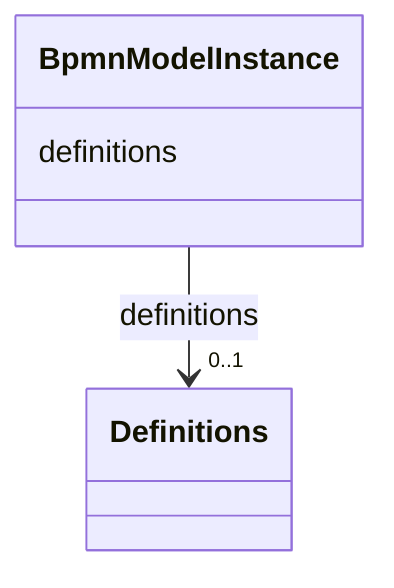

---
search:
  boost: 10.0
---

# Class: BpmnModelInstance 


_Root container for a parsed BPMN model, providing access to the Definitions element._


<div data-search-exclude markdown="1">


URI: [fluxnova_bpm_platform:BpmnModelInstance](https://w3id.org/TD-Universe/fluxnova-bpm-platform/BpmnModelInstance)





<!-- no inheritance hierarchy -->

## Class Properties

| Property | Value |
| --- | --- |
| Tree Root | Yes |


## Slots

| Name | Cardinality and Range | Description | Inheritance |
| ---  | --- | --- | --- |
| [definitions](definitions.md) | 0..1 <br/> [Definitions](Definitions.md) | The root BPMN Definitions element of this model | direct |


## In Subsets


* [CoreApi](CoreApi.md)
* [FluxnovaBpmnModel](FluxnovaBpmnModel.md)


## Identifier and Mapping Information


### Annotations

| property | value |
| --- | --- |
| java_package | org.finos.fluxnova.bpm.model.bpmn |
| source_file | model-api/bpmn-model/src/main/java/org/finos/fluxnova/bpm/model/bpmn/BpmnModelInstance.java |


### Schema Source


* from schema: https://w3id.org/TD-Universe/fluxnova-bpm-platform


## Mappings

| Mapping Type | Mapped Value |
| ---  | ---  |
| self | fluxnova_bpm_platform:BpmnModelInstance |
| native | fluxnova_bpm_platform:BpmnModelInstance |


## LinkML Source

<!-- TODO: investigate https://stackoverflow.com/questions/37606292/how-to-create-tabbed-code-blocks-in-mkdocs-or-sphinx -->

### Direct

<details>
```yaml
name: BpmnModelInstance
annotations:
  java_package:
    tag: java_package
    value: org.finos.fluxnova.bpm.model.bpmn
  source_file:
    tag: source_file
    value: model-api/bpmn-model/src/main/java/org/finos/fluxnova/bpm/model/bpmn/BpmnModelInstance.java
description: Root container for a parsed BPMN model, providing access to the Definitions
  element.
in_subset:
- core_api
- fluxnova_bpmn_model
from_schema: https://w3id.org/TD-Universe/fluxnova-bpm-platform
slots:
- definitions
tree_root: true

```
</details>

### Induced

<details>
```yaml
name: BpmnModelInstance
annotations:
  java_package:
    tag: java_package
    value: org.finos.fluxnova.bpm.model.bpmn
  source_file:
    tag: source_file
    value: model-api/bpmn-model/src/main/java/org/finos/fluxnova/bpm/model/bpmn/BpmnModelInstance.java
description: Root container for a parsed BPMN model, providing access to the Definitions
  element.
in_subset:
- core_api
- fluxnova_bpmn_model
from_schema: https://w3id.org/TD-Universe/fluxnova-bpm-platform
attributes:
  definitions:
    name: definitions
    description: The root BPMN Definitions element of this model.
    from_schema: https://w3id.org/TD-Universe/fluxnova-bpm-platform
    rank: 1000
    owner: BpmnModelInstance
    domain_of:
    - BpmnModelInstance
    range: Definitions
tree_root: true

```
</details></div>