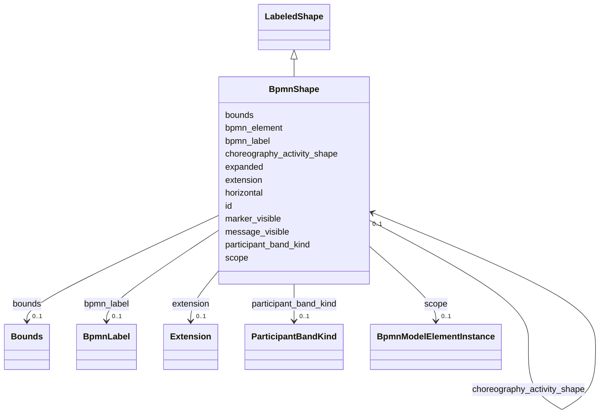

---
search:
  boost: 10.0
---

# Class: BpmnShape 


_The BPMNDI BPMNShape element_


<div data-search-exclude markdown="1">


URI: [fluxnova_bpm_platform:BpmnShape](https://w3id.org/TD-Universe/fluxnova-bpm-platform/BpmnShape)





## Inheritance
* [BpmnModelElementInstance](BpmnModelElementInstance.md)
    * [DiagramElement](DiagramElement.md)
        * [Node](Node.md)
            * [Shape](Shape.md)
                * [LabeledShape](LabeledShape.md)
                    * **BpmnShape**


## Slots

| Name | Cardinality and Range | Description | Inheritance |
| ---  | --- | --- | --- |
| [bpmn_element](bpmn_element.md) | 0..1 <br/> [String](String.md) | The BPMN model element this diagram element represents | direct |
| [horizontal](horizontal.md) | 0..1 <br/> [Boolean](Boolean.md) | Whether this pool or lane is oriented horizontally | direct |
| [expanded](expanded.md) | 0..1 <br/> [Boolean](Boolean.md) | Whether this sub-process shape is shown in expanded form | direct |
| [marker_visible](marker_visible.md) | 0..1 <br/> [Boolean](Boolean.md) | Whether the loop or multi-instance marker is displayed | direct |
| [message_visible](message_visible.md) | 0..1 <br/> [Boolean](Boolean.md) | Whether the message flow envelope icon is visible | direct |
| [participant_band_kind](participant_band_kind.md) | 0..1 <br/> [ParticipantBandKind](ParticipantBandKind.md) | Indicates the initiating/non-initiating role of this participant band | direct |
| [choreography_activity_shape](choreography_activity_shape.md) | 0..1 <br/> [BpmnShape](BpmnShape.md) | Shape of the associated choreography activity | direct |
| [bpmn_label](bpmn_label.md) | 0..1 <br/> [BpmnLabel](BpmnLabel.md) | The label element attached to this shape or edge | direct |
| [bounds](bounds.md) | 0..1 <br/> [Bounds](Bounds.md) | Bounding rectangle giving position and size of this diagram element | [Shape](Shape.md) |
| [id](id.md) | 1 <br/> [String](String.md) | Unique identifier | [DiagramElement](DiagramElement.md) |
| [extension](extension.md) | 0..1 <br/> [Extension](Extension.md) | Extension element containing additional diagram information | [DiagramElement](DiagramElement.md) |
| [scope](scope.md) | 0..1 <br/> [BpmnModelElementInstance](BpmnModelElementInstance.md) | Tests if the element is a scope like process or sub-process | [BpmnModelElementInstance](BpmnModelElementInstance.md) |


## Usages

| used by | used in | type | used |
| ---  | --- | --- | --- |
| [BpmnShape](BpmnShape.md) | [choreography_activity_shape](choreography_activity_shape.md) | range | [BpmnShape](BpmnShape.md) |


## In Subsets


* [Bpmndi](Bpmndi.md)
* [FluxnovaBpmnModel](FluxnovaBpmnModel.md)


## Identifier and Mapping Information


### Annotations

| property | value |
| --- | --- |
| java_package | org.finos.fluxnova.bpm.model.bpmn.instance.bpmndi |
| source_file | model-api/bpmn-model/src/main/java/org/finos/fluxnova/bpm/model/bpmn/instance/bpmndi/BpmnShape.java |


### Schema Source


* from schema: https://w3id.org/TD-Universe/fluxnova-bpm-platform


## Mappings

| Mapping Type | Mapped Value |
| ---  | ---  |
| self | fluxnova_bpm_platform:BpmnShape |
| native | fluxnova_bpm_platform:BpmnShape |


## LinkML Source

<!-- TODO: investigate https://stackoverflow.com/questions/37606292/how-to-create-tabbed-code-blocks-in-mkdocs-or-sphinx -->

### Direct

<details>
```yaml
name: BpmnShape
annotations:
  java_package:
    tag: java_package
    value: org.finos.fluxnova.bpm.model.bpmn.instance.bpmndi
  source_file:
    tag: source_file
    value: model-api/bpmn-model/src/main/java/org/finos/fluxnova/bpm/model/bpmn/instance/bpmndi/BpmnShape.java
description: The BPMNDI BPMNShape element
in_subset:
- bpmndi
- fluxnova_bpmn_model
from_schema: https://w3id.org/TD-Universe/fluxnova-bpm-platform
is_a: LabeledShape
slots:
- bpmn_element
- horizontal
- expanded
- marker_visible
- message_visible
- participant_band_kind
- choreography_activity_shape
- bpmn_label

```
</details>

### Induced

<details>
```yaml
name: BpmnShape
annotations:
  java_package:
    tag: java_package
    value: org.finos.fluxnova.bpm.model.bpmn.instance.bpmndi
  source_file:
    tag: source_file
    value: model-api/bpmn-model/src/main/java/org/finos/fluxnova/bpm/model/bpmn/instance/bpmndi/BpmnShape.java
description: The BPMNDI BPMNShape element
in_subset:
- bpmndi
- fluxnova_bpmn_model
from_schema: https://w3id.org/TD-Universe/fluxnova-bpm-platform
is_a: LabeledShape
attributes:
  bpmn_element:
    name: bpmn_element
    description: The BPMN model element this diagram element represents.
    from_schema: https://w3id.org/TD-Universe/fluxnova-bpm-platform
    rank: 1000
    owner: BpmnShape
    domain_of:
    - BpmnEdge
    - BpmnPlane
    - BpmnShape
    range: string
  horizontal:
    name: horizontal
    description: Whether this pool or lane is oriented horizontally.
    from_schema: https://w3id.org/TD-Universe/fluxnova-bpm-platform
    rank: 1000
    owner: BpmnShape
    domain_of:
    - BpmnShape
    range: boolean
  expanded:
    name: expanded
    description: Whether this sub-process shape is shown in expanded form.
    from_schema: https://w3id.org/TD-Universe/fluxnova-bpm-platform
    rank: 1000
    owner: BpmnShape
    domain_of:
    - BpmnShape
    range: boolean
  marker_visible:
    name: marker_visible
    description: Whether the loop or multi-instance marker is displayed.
    from_schema: https://w3id.org/TD-Universe/fluxnova-bpm-platform
    rank: 1000
    owner: BpmnShape
    domain_of:
    - BpmnShape
    range: boolean
  message_visible:
    name: message_visible
    description: Whether the message flow envelope icon is visible.
    from_schema: https://w3id.org/TD-Universe/fluxnova-bpm-platform
    rank: 1000
    owner: BpmnShape
    domain_of:
    - BpmnShape
    range: boolean
  participant_band_kind:
    name: participant_band_kind
    description: Indicates the initiating/non-initiating role of this participant
      band.
    from_schema: https://w3id.org/TD-Universe/fluxnova-bpm-platform
    rank: 1000
    owner: BpmnShape
    domain_of:
    - BpmnShape
    range: ParticipantBandKind
  choreography_activity_shape:
    name: choreography_activity_shape
    description: Shape of the associated choreography activity.
    from_schema: https://w3id.org/TD-Universe/fluxnova-bpm-platform
    rank: 1000
    owner: BpmnShape
    domain_of:
    - BpmnShape
    range: BpmnShape
  bpmn_label:
    name: bpmn_label
    description: The label element attached to this shape or edge.
    from_schema: https://w3id.org/TD-Universe/fluxnova-bpm-platform
    rank: 1000
    owner: BpmnShape
    domain_of:
    - BpmnEdge
    - BpmnShape
    range: BpmnLabel
  bounds:
    name: bounds
    description: Bounding rectangle giving position and size of this diagram element.
    from_schema: https://w3id.org/TD-Universe/fluxnova-bpm-platform
    rank: 1000
    owner: BpmnShape
    domain_of:
    - Label
    - Shape
    range: Bounds
  id:
    name: id
    description: Unique identifier.
    from_schema: https://w3id.org/TD-Universe/fluxnova-bpm-platform
    rank: 1000
    slot_uri: schema:identifier
    identifier: true
    owner: BpmnShape
    domain_of:
    - ByteArray
    - MeterLog
    - SchemaLogEntry
    - TaskMeterLog
    - Authorization
    - Group
    - IdentityInfo
    - IdentityLink
    - Tenant
    - TenantMembership
    - User
    - CaseExecution
    - CaseSentryPart
    - EventSubscription
    - Execution
    - ExternalTask
    - Incident
    - Task
    - VariableInstance
    - Attachment
    - Comment
    - Filter
    - Deployment
    - ResourceDefinition
    - Batch
    - Job
    - JobDefinition
    - HistoricBatch
    - HistoricDecisionInputInstance
    - HistoricDecisionInstance
    - HistoricDecisionOutputInstance
    - HistoricDetail
    - HistoricExternalTaskLog
    - HistoricIdentityLink
    - HistoricIncident
    - HistoricJobLog
    - HistoricScopeInstance
    - HistoricVariableInstance
    - UserOperationLogEntry
    - Diagram
    - DiagramElement
    - Style
    - BaseElement
    - Definitions
    - Documentation
    - InteractionNode
    range: string
    required: true
  extension:
    name: extension
    description: Extension element containing additional diagram information.
    from_schema: https://w3id.org/TD-Universe/fluxnova-bpm-platform
    rank: 1000
    owner: BpmnShape
    domain_of:
    - DiagramElement
    range: Extension
  scope:
    name: scope
    description: Tests if the element is a scope like process or sub-process.
    from_schema: https://w3id.org/TD-Universe/fluxnova-bpm-platform
    rank: 1000
    owner: BpmnShape
    domain_of:
    - BpmnModelElementInstance
    range: BpmnModelElementInstance

```
</details></div>