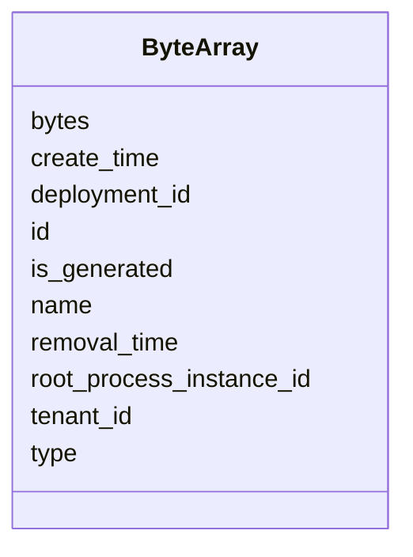

---
search:
  boost: 10.0
---

# Class: ByteArray 


_Byte Array entity in the engine infrastructure._


<div data-search-exclude markdown="1">


URI: [fluxnova_bpm_platform:ByteArray](https://w3id.org/TD-Universe/fluxnova-bpm-platform/ByteArray)





<!-- no inheritance hierarchy -->

## Slots

| Name | Cardinality and Range | Description | Inheritance |
| ---  | --- | --- | --- |
| [id](id.md) | 1 <br/> [String](String.md) | Unique identifier | direct |
| [name](name.md) | 0..1 <br/> [String](String.md) | Human-readable name | direct |
| [deployment_id](deployment_id.md) | 0..1 <br/> [String](String.md) | Reference to the deployment | direct |
| [bytes](bytes.md) | 0..1 <br/> [String](String.md) | Serialized binary content | direct |
| [is_generated](is_generated.md) | 0..1 <br/> [Boolean](Boolean.md) | Whether this entity is generated | direct |
| [tenant_id](tenant_id.md) | 0..1 <br/> [String](String.md) | Multi-tenancy discriminator | direct |
| [type](type.md) | 0..1 <br/> [Integer](Integer.md) | Type discriminator | direct |
| [create_time](create_time.md) | 0..1 <br/> [Datetime](Datetime.md) | Creation timestamp | direct |
| [root_process_instance_id](root_process_instance_id.md) | 0..1 <br/> [String](String.md) | Root process instance for history cleanup | direct |
| [removal_time](removal_time.md) | 0..1 <br/> [Datetime](Datetime.md) | Timestamp when this entity is eligible for removal | direct |


## In Subsets


* [Base](Base.md)
* [FluxnovaBpm](FluxnovaBpm.md)


## Identifier and Mapping Information


### Annotations

| property | value |
| --- | --- |
| sql_table | ACT_GE_BYTEARRAY |


### Schema Source


* from schema: https://w3id.org/TD-Universe/fluxnova-bpm-platform


## Mappings

| Mapping Type | Mapped Value |
| ---  | ---  |
| self | fluxnova_bpm_platform:ByteArray |
| native | fluxnova_bpm_platform:ByteArray |


## LinkML Source

<!-- TODO: investigate https://stackoverflow.com/questions/37606292/how-to-create-tabbed-code-blocks-in-mkdocs-or-sphinx -->

### Direct

<details>
```yaml
name: ByteArray
annotations:
  sql_table:
    tag: sql_table
    value: ACT_GE_BYTEARRAY
description: Byte Array entity in the engine infrastructure.
in_subset:
- base
- fluxnova_bpm
from_schema: https://w3id.org/TD-Universe/fluxnova-bpm-platform
slots:
- id
- name
- deployment_id
- bytes
- is_generated
- tenant_id
- type
- create_time
- root_process_instance_id
- removal_time
slot_usage:
  type:
    name: type
    range: integer

```
</details>

### Induced

<details>
```yaml
name: ByteArray
annotations:
  sql_table:
    tag: sql_table
    value: ACT_GE_BYTEARRAY
description: Byte Array entity in the engine infrastructure.
in_subset:
- base
- fluxnova_bpm
from_schema: https://w3id.org/TD-Universe/fluxnova-bpm-platform
slot_usage:
  type:
    name: type
    range: integer
attributes:
  id:
    name: id
    description: Unique identifier.
    from_schema: https://w3id.org/TD-Universe/fluxnova-bpm-platform
    rank: 1000
    slot_uri: schema:identifier
    identifier: true
    owner: ByteArray
    domain_of:
    - ByteArray
    - MeterLog
    - SchemaLogEntry
    - TaskMeterLog
    - Authorization
    - Group
    - IdentityInfo
    - IdentityLink
    - Tenant
    - TenantMembership
    - User
    - CaseExecution
    - CaseSentryPart
    - EventSubscription
    - Execution
    - ExternalTask
    - Incident
    - Task
    - VariableInstance
    - Attachment
    - Comment
    - Filter
    - Deployment
    - ResourceDefinition
    - Batch
    - Job
    - JobDefinition
    - HistoricBatch
    - HistoricDecisionInputInstance
    - HistoricDecisionInstance
    - HistoricDecisionOutputInstance
    - HistoricDetail
    - HistoricExternalTaskLog
    - HistoricIdentityLink
    - HistoricIncident
    - HistoricJobLog
    - HistoricScopeInstance
    - HistoricVariableInstance
    - UserOperationLogEntry
    - Diagram
    - DiagramElement
    - Style
    - BaseElement
    - Definitions
    - Documentation
    - InteractionNode
    range: string
    required: true
  name:
    name: name
    description: Human-readable name.
    from_schema: https://w3id.org/TD-Universe/fluxnova-bpm-platform
    rank: 1000
    slot_uri: schema:name
    owner: ByteArray
    domain_of:
    - ByteArray
    - MeterLog
    - Property
    - Group
    - Tenant
    - Task
    - VariableInstance
    - Attachment
    - Filter
    - Deployment
    - ResourceDefinition
    - HistoricDetail
    - HistoricTaskInstance
    - HistoricVariableInstance
    - Font
    - Diagram
    - CallableElement
    - Category
    - Collaboration
    - ConversationLink
    - ConversationNode
    - CorrelationKey
    - CorrelationProperty
    - DataInput
    - DataOutput
    - DataState
    - DataStore
    - Definitions
    - Error
    - Escalation
    - FlowElement
    - InputSet
    - Interface
    - Lane
    - LaneSet
    - LinkEventDefinition
    - Message
    - MessageFlow
    - Operation
    - OutputSet
    - Participant
    - BpmnProperty
    - Resource
    - ResourceParameter
    - ResourceRole
    - Signal
    range: string
  deployment_id:
    name: deployment_id
    description: Reference to the deployment.
    from_schema: https://w3id.org/TD-Universe/fluxnova-bpm-platform
    rank: 1000
    owner: ByteArray
    domain_of:
    - ByteArray
    - ResourceDefinition
    - Job
    - JobDefinition
    - HistoricJobLog
    - UserOperationLogEntry
    range: string
  bytes:
    name: bytes
    annotations:
      sql_column:
        tag: sql_column
        value: BYTES_
    description: Serialized binary content.
    from_schema: https://w3id.org/TD-Universe/fluxnova-bpm-platform
    rank: 1000
    owner: ByteArray
    domain_of:
    - ByteArray
    range: string
  is_generated:
    name: is_generated
    annotations:
      sql_column:
        tag: sql_column
        value: GENERATED_
    description: Whether this entity is generated.
    from_schema: https://w3id.org/TD-Universe/fluxnova-bpm-platform
    rank: 1000
    owner: ByteArray
    domain_of:
    - ByteArray
    range: boolean
  tenant_id:
    name: tenant_id
    description: Multi-tenancy discriminator.
    from_schema: https://w3id.org/TD-Universe/fluxnova-bpm-platform
    rank: 1000
    owner: ByteArray
    domain_of:
    - ByteArray
    - IdentityLink
    - TenantMembership
    - CaseExecution
    - CaseSentryPart
    - EventSubscription
    - Execution
    - ExternalTask
    - Incident
    - Task
    - VariableInstance
    - Attachment
    - Comment
    - Deployment
    - ResourceDefinition
    - Batch
    - Job
    - JobDefinition
    - HistoricActivityInstance
    - HistoricBatch
    - HistoricCaseActivityInstance
    - HistoricCaseInstance
    - HistoricDecisionInputInstance
    - HistoricDecisionInstance
    - HistoricDecisionOutputInstance
    - HistoricDetail
    - HistoricExternalTaskLog
    - HistoricIdentityLink
    - HistoricIncident
    - HistoricJobLog
    - HistoricProcessInstance
    - HistoricTaskInstance
    - HistoricVariableInstance
    - UserOperationLogEntry
    range: string
  type:
    name: type
    description: Type discriminator.
    from_schema: https://w3id.org/TD-Universe/fluxnova-bpm-platform
    rank: 1000
    owner: ByteArray
    domain_of:
    - ByteArray
    - Authorization
    - Group
    - IdentityInfo
    - IdentityLink
    - CaseSentryPart
    - VariableInstance
    - Attachment
    - Comment
    - Batch
    - Job
    - HistoricBatch
    - HistoricDetail
    - HistoricIdentityLink
    - ConditionExpression
    - CorrelationProperty
    - Relationship
    - ResourceParameter
    range: integer
  create_time:
    name: create_time
    description: Creation timestamp.
    from_schema: https://w3id.org/TD-Universe/fluxnova-bpm-platform
    rank: 1000
    owner: ByteArray
    domain_of:
    - ByteArray
    - ExternalTask
    - Task
    - Attachment
    - Job
    - HistoricCaseActivityInstance
    - HistoricCaseInstance
    - HistoricDecisionInputInstance
    - HistoricDecisionOutputInstance
    - HistoricIncident
    - HistoricVariableInstance
    range: datetime
  root_process_instance_id:
    name: root_process_instance_id
    description: Root process instance for history cleanup.
    from_schema: https://w3id.org/TD-Universe/fluxnova-bpm-platform
    rank: 1000
    owner: ByteArray
    domain_of:
    - ByteArray
    - Authorization
    - Execution
    - Attachment
    - Comment
    - Job
    - HistoricDecisionInputInstance
    - HistoricDecisionInstance
    - HistoricDecisionOutputInstance
    - HistoricDetail
    - HistoricExternalTaskLog
    - HistoricIdentityLink
    - HistoricIncident
    - HistoricJobLog
    - HistoricScopeInstance
    - HistoricVariableInstance
    - UserOperationLogEntry
    range: string
  removal_time:
    name: removal_time
    description: Timestamp when this entity is eligible for removal.
    from_schema: https://w3id.org/TD-Universe/fluxnova-bpm-platform
    rank: 1000
    owner: ByteArray
    domain_of:
    - ByteArray
    - Authorization
    - Attachment
    - Comment
    - HistoricBatch
    - HistoricDecisionInputInstance
    - HistoricDecisionInstance
    - HistoricDecisionOutputInstance
    - HistoricDetail
    - HistoricExternalTaskLog
    - HistoricIdentityLink
    - HistoricIncident
    - HistoricJobLog
    - HistoricScopeInstance
    - HistoricVariableInstance
    - UserOperationLogEntry
    range: datetime

```
</details></div>