---
search:
  boost: 10.0
---

# Class: CallActivity 


_The BPMN callActivity element_


<div data-search-exclude markdown="1">


URI: [fluxnova_bpm_platform:CallActivity](https://w3id.org/TD-Universe/fluxnova-bpm-platform/CallActivity)

```mermaid
 classDiagram
    class CallActivity
    click CallActivity href "../CallActivity/"
      Activity <|-- CallActivity
        click Activity href "../Activity/"
      
      CallActivity : auditing
        
          
    
        
        
        CallActivity --> "0..1" Auditing : auditing
        click Auditing href "../Auditing/"
    

        
      CallActivity : called_element
        
      CallActivity : category_value_refs
        
          
    
        
        
        CallActivity --> "*" CategoryValue : category_value_refs
        click CategoryValue href "../CategoryValue/"
    

        
      CallActivity : completion_quantity
        
      CallActivity : data_input_associations
        
          
    
        
        
        CallActivity --> "*" DataInputAssociation : data_input_associations
        click DataInputAssociation href "../DataInputAssociation/"
    

        
      CallActivity : data_output_associations
        
          
    
        
        
        CallActivity --> "*" DataOutputAssociation : data_output_associations
        click DataOutputAssociation href "../DataOutputAssociation/"
    

        
      CallActivity : default
        
          
    
        
        
        CallActivity --> "0..1" SequenceFlow : default
        click SequenceFlow href "../SequenceFlow/"
    

        
      CallActivity : diagram_element
        
          
    
        
        
        CallActivity --> "0..1" DiagramElement : diagram_element
        click DiagramElement href "../DiagramElement/"
    

        
      CallActivity : documentations
        
          
    
        
        
        CallActivity --> "*" Documentation : documentations
        click Documentation href "../Documentation/"
    

        
      CallActivity : extension_elements
        
          
    
        
        
        CallActivity --> "0..1" ExtensionElements : extension_elements
        click ExtensionElements href "../ExtensionElements/"
    

        
      CallActivity : fluxnova_async
        
      CallActivity : fluxnova_async_after
        
      CallActivity : fluxnova_async_before
        
      CallActivity : fluxnova_called_element_binding
        
      CallActivity : fluxnova_called_element_tenant_id
        
      CallActivity : fluxnova_called_element_version
        
      CallActivity : fluxnova_called_element_version_tag
        
      CallActivity : fluxnova_case_binding
        
      CallActivity : fluxnova_case_ref
        
      CallActivity : fluxnova_case_tenant_id
        
      CallActivity : fluxnova_case_version
        
      CallActivity : fluxnova_exclusive
        
      CallActivity : fluxnova_job_priority
        
      CallActivity : fluxnova_variable_mapping_class
        
      CallActivity : fluxnova_variable_mapping_delegate_expression
        
      CallActivity : for_compensation
        
      CallActivity : id
        
      CallActivity : incoming
        
          
    
        
        
        CallActivity --> "*" SequenceFlow : incoming
        click SequenceFlow href "../SequenceFlow/"
    

        
      CallActivity : io_specification
        
          
    
        
        
        CallActivity --> "0..1" IoSpecification : io_specification
        click IoSpecification href "../IoSpecification/"
    

        
      CallActivity : loop_characteristics
        
          
    
        
        
        CallActivity --> "0..1" LoopCharacteristics : loop_characteristics
        click LoopCharacteristics href "../LoopCharacteristics/"
    

        
      CallActivity : monitoring
        
          
    
        
        
        CallActivity --> "0..1" Monitoring : monitoring
        click Monitoring href "../Monitoring/"
    

        
      CallActivity : name
        
      CallActivity : outgoing
        
          
    
        
        
        CallActivity --> "*" SequenceFlow : outgoing
        click SequenceFlow href "../SequenceFlow/"
    

        
      CallActivity : previous_nodes
        
          
    
        
        
        CallActivity --> "0..1" FlowNode : previous_nodes
        click FlowNode href "../FlowNode/"
    

        
      CallActivity : properties
        
          
    
        
        
        CallActivity --> "*" BpmnProperty : properties
        click BpmnProperty href "../BpmnProperty/"
    

        
      CallActivity : resource_roles
        
          
    
        
        
        CallActivity --> "*" ResourceRole : resource_roles
        click ResourceRole href "../ResourceRole/"
    

        
      CallActivity : scope
        
          
    
        
        
        CallActivity --> "0..1" BpmnModelElementInstance : scope
        click BpmnModelElementInstance href "../BpmnModelElementInstance/"
    

        
      CallActivity : start_quantity
        
      CallActivity : succeeding_nodes
        
          
    
        
        
        CallActivity --> "0..1" FlowNode : succeeding_nodes
        click FlowNode href "../FlowNode/"
    

        
      
```





## Inheritance
* [BpmnModelElementInstance](BpmnModelElementInstance.md)
    * [BaseElement](BaseElement.md)
        * [FlowElement](FlowElement.md)
            * [FlowNode](FlowNode.md)
                * [Activity](Activity.md) [ [InteractionNode](InteractionNode.md)]
                    * **CallActivity**


## Slots

| Name | Cardinality and Range | Description | Inheritance |
| ---  | --- | --- | --- |
| [called_element](called_element.md) | 0..1 <br/> [String](String.md) | The global task or process called by this call activity | direct |
| [fluxnova_async](fluxnova_async.md) | 0..1 <br/> [Boolean](Boolean.md) | Camunda extensions */ /** | direct |
| [fluxnova_called_element_binding](fluxnova_called_element_binding.md) | 0..1 <br/> [String](String.md) | Fluxnova extension property: called element binding | direct |
| [fluxnova_called_element_version](fluxnova_called_element_version.md) | 0..1 <br/> [String](String.md) | Fluxnova extension property: called element version | direct |
| [fluxnova_called_element_version_tag](fluxnova_called_element_version_tag.md) | 0..1 <br/> [String](String.md) | Fluxnova extension property: called element version tag | direct |
| [fluxnova_case_ref](fluxnova_case_ref.md) | 0..1 <br/> [String](String.md) | Fluxnova extension property: case ref | direct |
| [fluxnova_case_binding](fluxnova_case_binding.md) | 0..1 <br/> [String](String.md) | Fluxnova extension property: case binding | direct |
| [fluxnova_case_version](fluxnova_case_version.md) | 0..1 <br/> [String](String.md) | Fluxnova extension property: case version | direct |
| [fluxnova_called_element_tenant_id](fluxnova_called_element_tenant_id.md) | 0..1 <br/> [String](String.md) | Fluxnova extension property: called element tenant id | direct |
| [fluxnova_case_tenant_id](fluxnova_case_tenant_id.md) | 0..1 <br/> [String](String.md) | Fluxnova extension property: case tenant id | direct |
| [fluxnova_variable_mapping_class](fluxnova_variable_mapping_class.md) | 0..1 <br/> [String](String.md) | Fluxnova extension property: variable mapping class | direct |
| [fluxnova_variable_mapping_delegate_expression](fluxnova_variable_mapping_delegate_expression.md) | 0..1 <br/> [String](String.md) | Fluxnova extension property: variable mapping delegate expression | direct |
| [for_compensation](for_compensation.md) | 0..1 <br/> [Boolean](Boolean.md) | Whether this activity is used for compensation handling | [Activity](Activity.md) |
| [start_quantity](start_quantity.md) | 0..1 <br/> [Integer](Integer.md) | Minimum number of tokens required to start this activity | [Activity](Activity.md) |
| [completion_quantity](completion_quantity.md) | 0..1 <br/> [Integer](Integer.md) | Number of tokens produced when this activity completes | [Activity](Activity.md) |
| [default](default.md) | 0..1 <br/> [SequenceFlow](SequenceFlow.md) | Default sequence flow taken when no other outgoing condition is satisfied | [Activity](Activity.md) |
| [io_specification](io_specification.md) | 0..1 <br/> [IoSpecification](IoSpecification.md) | Input and output specification of this activity | [Activity](Activity.md) |
| [properties](properties.md) | * <br/> [BpmnProperty](BpmnProperty.md) | Serialized properties | [Activity](Activity.md) |
| [data_input_associations](data_input_associations.md) | * <br/> [DataInputAssociation](DataInputAssociation.md) | Data associations that feed input data into this activity | [Activity](Activity.md) |
| [data_output_associations](data_output_associations.md) | * <br/> [DataOutputAssociation](DataOutputAssociation.md) | Data associations that move output data out of this activity | [Activity](Activity.md) |
| [resource_roles](resource_roles.md) | * <br/> [ResourceRole](ResourceRole.md) | Resources (performers, potential owners) assigned to this activity | [Activity](Activity.md) |
| [loop_characteristics](loop_characteristics.md) | 0..1 <br/> [LoopCharacteristics](LoopCharacteristics.md) | Loop or multi-instance characteristics of this activity | [Activity](Activity.md) |
| [id](id.md) | 1 <br/> [String](String.md) | Unique identifier | [InteractionNode](InteractionNode.md), [BaseElement](BaseElement.md) |
| [incoming](incoming.md) | * <br/> [SequenceFlow](SequenceFlow.md) | Sequence flows entering this flow node | [FlowNode](FlowNode.md) |
| [outgoing](outgoing.md) | * <br/> [SequenceFlow](SequenceFlow.md) | Sequence flows leaving this flow node | [FlowNode](FlowNode.md) |
| [previous_nodes](previous_nodes.md) | 0..1 <br/> [FlowNode](FlowNode.md) | The previous nodes of this element | [FlowNode](FlowNode.md) |
| [succeeding_nodes](succeeding_nodes.md) | 0..1 <br/> [FlowNode](FlowNode.md) | The succeeding nodes of this element | [FlowNode](FlowNode.md) |
| [fluxnova_async_before](fluxnova_async_before.md) | 0..1 <br/> [Boolean](Boolean.md) | Whether this element is executed asynchronously before its start | [FlowNode](FlowNode.md) |
| [fluxnova_async_after](fluxnova_async_after.md) | 0..1 <br/> [Boolean](Boolean.md) | Whether this element is executed asynchronously after its end | [FlowNode](FlowNode.md) |
| [fluxnova_exclusive](fluxnova_exclusive.md) | 0..1 <br/> [Boolean](Boolean.md) | Whether this element participates in an exclusive job execution | [FlowNode](FlowNode.md) |
| [fluxnova_job_priority](fluxnova_job_priority.md) | 0..1 <br/> [String](String.md) | Priority assigned to async continuation jobs for this element | [FlowNode](FlowNode.md) |
| [name](name.md) | 0..1 <br/> [String](String.md) | Human-readable name | [FlowElement](FlowElement.md) |
| [auditing](auditing.md) | 0..1 <br/> [Auditing](Auditing.md) | Auditing information attached to this flow element | [FlowElement](FlowElement.md) |
| [monitoring](monitoring.md) | 0..1 <br/> [Monitoring](Monitoring.md) | Monitoring information attached to this flow element | [FlowElement](FlowElement.md) |
| [category_value_refs](category_value_refs.md) | * <br/> [CategoryValue](CategoryValue.md) | Category values associated with this flow element | [FlowElement](FlowElement.md) |
| [documentations](documentations.md) | * <br/> [Documentation](Documentation.md) | Collection of documentation elements associated with this element | [BaseElement](BaseElement.md) |
| [extension_elements](extension_elements.md) | 0..1 <br/> [ExtensionElements](ExtensionElements.md) | Extension elements holding vendor-specific metadata | [BaseElement](BaseElement.md) |
| [diagram_element](diagram_element.md) | 0..1 <br/> [DiagramElement](DiagramElement.md) | The diagram element that visually represents this BPMN element | [BaseElement](BaseElement.md) |
| [scope](scope.md) | 0..1 <br/> [BpmnModelElementInstance](BpmnModelElementInstance.md) | Tests if the element is a scope like process or sub-process | [BpmnModelElementInstance](BpmnModelElementInstance.md) |


## In Subsets


* [Instance](Instance.md)
* [FluxnovaBpmnModel](FluxnovaBpmnModel.md)


## Identifier and Mapping Information


### Annotations

| property | value |
| --- | --- |
| java_package | org.finos.fluxnova.bpm.model.bpmn.instance |
| source_file | model-api/bpmn-model/src/main/java/org/finos/fluxnova/bpm/model/bpmn/instance/CallActivity.java |


### Schema Source


* from schema: https://w3id.org/TD-Universe/fluxnova-bpm-platform


## Mappings

| Mapping Type | Mapped Value |
| ---  | ---  |
| self | fluxnova_bpm_platform:CallActivity |
| native | fluxnova_bpm_platform:CallActivity |


## LinkML Source

<!-- TODO: investigate https://stackoverflow.com/questions/37606292/how-to-create-tabbed-code-blocks-in-mkdocs-or-sphinx -->

### Direct

<details>
```yaml
name: CallActivity
annotations:
  java_package:
    tag: java_package
    value: org.finos.fluxnova.bpm.model.bpmn.instance
  source_file:
    tag: source_file
    value: model-api/bpmn-model/src/main/java/org/finos/fluxnova/bpm/model/bpmn/instance/CallActivity.java
description: The BPMN callActivity element
in_subset:
- instance
- fluxnova_bpmn_model
from_schema: https://w3id.org/TD-Universe/fluxnova-bpm-platform
is_a: Activity
slots:
- called_element
- fluxnova_async
- fluxnova_called_element_binding
- fluxnova_called_element_version
- fluxnova_called_element_version_tag
- fluxnova_case_ref
- fluxnova_case_binding
- fluxnova_case_version
- fluxnova_called_element_tenant_id
- fluxnova_case_tenant_id
- fluxnova_variable_mapping_class
- fluxnova_variable_mapping_delegate_expression

```
</details>

### Induced

<details>
```yaml
name: CallActivity
annotations:
  java_package:
    tag: java_package
    value: org.finos.fluxnova.bpm.model.bpmn.instance
  source_file:
    tag: source_file
    value: model-api/bpmn-model/src/main/java/org/finos/fluxnova/bpm/model/bpmn/instance/CallActivity.java
description: The BPMN callActivity element
in_subset:
- instance
- fluxnova_bpmn_model
from_schema: https://w3id.org/TD-Universe/fluxnova-bpm-platform
is_a: Activity
attributes:
  called_element:
    name: called_element
    description: The global task or process called by this call activity.
    from_schema: https://w3id.org/TD-Universe/fluxnova-bpm-platform
    rank: 1000
    owner: CallActivity
    domain_of:
    - CallActivity
    range: string
  fluxnova_async:
    name: fluxnova_async
    description: Camunda extensions */ /**
    from_schema: https://w3id.org/TD-Universe/fluxnova-bpm-platform
    rank: 1000
    owner: CallActivity
    domain_of:
    - CallActivity
    - ParallelGateway
    - SignalEventDefinition
    - StartEvent
    - SubProcess
    - BpmnTask
    range: boolean
  fluxnova_called_element_binding:
    name: fluxnova_called_element_binding
    description: 'Fluxnova extension property: called element binding.'
    from_schema: https://w3id.org/TD-Universe/fluxnova-bpm-platform
    rank: 1000
    owner: CallActivity
    domain_of:
    - CallActivity
    range: string
  fluxnova_called_element_version:
    name: fluxnova_called_element_version
    description: 'Fluxnova extension property: called element version.'
    from_schema: https://w3id.org/TD-Universe/fluxnova-bpm-platform
    rank: 1000
    owner: CallActivity
    domain_of:
    - CallActivity
    range: string
  fluxnova_called_element_version_tag:
    name: fluxnova_called_element_version_tag
    description: 'Fluxnova extension property: called element version tag.'
    from_schema: https://w3id.org/TD-Universe/fluxnova-bpm-platform
    rank: 1000
    owner: CallActivity
    domain_of:
    - CallActivity
    range: string
  fluxnova_case_ref:
    name: fluxnova_case_ref
    description: 'Fluxnova extension property: case ref.'
    from_schema: https://w3id.org/TD-Universe/fluxnova-bpm-platform
    rank: 1000
    owner: CallActivity
    domain_of:
    - CallActivity
    range: string
  fluxnova_case_binding:
    name: fluxnova_case_binding
    description: 'Fluxnova extension property: case binding.'
    from_schema: https://w3id.org/TD-Universe/fluxnova-bpm-platform
    rank: 1000
    owner: CallActivity
    domain_of:
    - CallActivity
    range: string
  fluxnova_case_version:
    name: fluxnova_case_version
    description: 'Fluxnova extension property: case version.'
    from_schema: https://w3id.org/TD-Universe/fluxnova-bpm-platform
    rank: 1000
    owner: CallActivity
    domain_of:
    - CallActivity
    range: string
  fluxnova_called_element_tenant_id:
    name: fluxnova_called_element_tenant_id
    description: 'Fluxnova extension property: called element tenant id.'
    from_schema: https://w3id.org/TD-Universe/fluxnova-bpm-platform
    rank: 1000
    owner: CallActivity
    domain_of:
    - CallActivity
    range: string
  fluxnova_case_tenant_id:
    name: fluxnova_case_tenant_id
    description: 'Fluxnova extension property: case tenant id.'
    from_schema: https://w3id.org/TD-Universe/fluxnova-bpm-platform
    rank: 1000
    owner: CallActivity
    domain_of:
    - CallActivity
    range: string
  fluxnova_variable_mapping_class:
    name: fluxnova_variable_mapping_class
    description: 'Fluxnova extension property: variable mapping class.'
    from_schema: https://w3id.org/TD-Universe/fluxnova-bpm-platform
    rank: 1000
    owner: CallActivity
    domain_of:
    - CallActivity
    range: string
  fluxnova_variable_mapping_delegate_expression:
    name: fluxnova_variable_mapping_delegate_expression
    description: 'Fluxnova extension property: variable mapping delegate expression.'
    from_schema: https://w3id.org/TD-Universe/fluxnova-bpm-platform
    rank: 1000
    owner: CallActivity
    domain_of:
    - CallActivity
    range: string
  for_compensation:
    name: for_compensation
    description: Whether this activity is used for compensation handling.
    from_schema: https://w3id.org/TD-Universe/fluxnova-bpm-platform
    rank: 1000
    owner: CallActivity
    domain_of:
    - Activity
    range: boolean
  start_quantity:
    name: start_quantity
    description: Minimum number of tokens required to start this activity.
    from_schema: https://w3id.org/TD-Universe/fluxnova-bpm-platform
    rank: 1000
    owner: CallActivity
    domain_of:
    - Activity
    range: integer
  completion_quantity:
    name: completion_quantity
    description: Number of tokens produced when this activity completes.
    from_schema: https://w3id.org/TD-Universe/fluxnova-bpm-platform
    rank: 1000
    owner: CallActivity
    domain_of:
    - Activity
    range: integer
  default:
    name: default
    description: Default sequence flow taken when no other outgoing condition is satisfied.
    from_schema: https://w3id.org/TD-Universe/fluxnova-bpm-platform
    rank: 1000
    owner: CallActivity
    domain_of:
    - Activity
    - ComplexGateway
    - ExclusiveGateway
    - InclusiveGateway
    range: SequenceFlow
  io_specification:
    name: io_specification
    description: Input and output specification of this activity.
    from_schema: https://w3id.org/TD-Universe/fluxnova-bpm-platform
    rank: 1000
    owner: CallActivity
    domain_of:
    - Activity
    - CallableElement
    range: IoSpecification
  properties:
    name: properties
    annotations:
      sql_column:
        tag: sql_column
        value: PROPERTIES_
    description: Serialized properties.
    from_schema: https://w3id.org/TD-Universe/fluxnova-bpm-platform
    rank: 1000
    owner: CallActivity
    domain_of:
    - Filter
    - Activity
    - Event
    - Process
    range: BpmnProperty
    multivalued: true
    inlined: true
    inlined_as_list: true
  data_input_associations:
    name: data_input_associations
    description: Data associations that feed input data into this activity.
    from_schema: https://w3id.org/TD-Universe/fluxnova-bpm-platform
    rank: 1000
    owner: CallActivity
    domain_of:
    - Activity
    - ThrowEvent
    range: DataInputAssociation
    multivalued: true
    inlined: true
    inlined_as_list: true
  data_output_associations:
    name: data_output_associations
    description: Data associations that move output data out of this activity.
    from_schema: https://w3id.org/TD-Universe/fluxnova-bpm-platform
    rank: 1000
    owner: CallActivity
    domain_of:
    - Activity
    - CatchEvent
    range: DataOutputAssociation
    multivalued: true
    inlined: true
    inlined_as_list: true
  resource_roles:
    name: resource_roles
    description: Resources (performers, potential owners) assigned to this activity.
    from_schema: https://w3id.org/TD-Universe/fluxnova-bpm-platform
    rank: 1000
    owner: CallActivity
    domain_of:
    - Activity
    - Process
    range: ResourceRole
    multivalued: true
    inlined: true
    inlined_as_list: true
  loop_characteristics:
    name: loop_characteristics
    description: Loop or multi-instance characteristics of this activity.
    from_schema: https://w3id.org/TD-Universe/fluxnova-bpm-platform
    rank: 1000
    owner: CallActivity
    domain_of:
    - Activity
    range: LoopCharacteristics
  id:
    name: id
    description: Unique identifier.
    from_schema: https://w3id.org/TD-Universe/fluxnova-bpm-platform
    rank: 1000
    slot_uri: schema:identifier
    identifier: true
    owner: CallActivity
    domain_of:
    - ByteArray
    - MeterLog
    - SchemaLogEntry
    - TaskMeterLog
    - Authorization
    - Group
    - IdentityInfo
    - IdentityLink
    - Tenant
    - TenantMembership
    - User
    - CaseExecution
    - CaseSentryPart
    - EventSubscription
    - Execution
    - ExternalTask
    - Incident
    - Task
    - VariableInstance
    - Attachment
    - Comment
    - Filter
    - Deployment
    - ResourceDefinition
    - Batch
    - Job
    - JobDefinition
    - HistoricBatch
    - HistoricDecisionInputInstance
    - HistoricDecisionInstance
    - HistoricDecisionOutputInstance
    - HistoricDetail
    - HistoricExternalTaskLog
    - HistoricIdentityLink
    - HistoricIncident
    - HistoricJobLog
    - HistoricScopeInstance
    - HistoricVariableInstance
    - UserOperationLogEntry
    - Diagram
    - DiagramElement
    - Style
    - BaseElement
    - Definitions
    - Documentation
    - InteractionNode
    range: string
    required: true
  incoming:
    name: incoming
    description: Sequence flows entering this flow node.
    from_schema: https://w3id.org/TD-Universe/fluxnova-bpm-platform
    rank: 1000
    owner: CallActivity
    domain_of:
    - FlowNode
    range: SequenceFlow
    multivalued: true
    inlined: true
    inlined_as_list: true
  outgoing:
    name: outgoing
    description: Sequence flows leaving this flow node.
    from_schema: https://w3id.org/TD-Universe/fluxnova-bpm-platform
    rank: 1000
    owner: CallActivity
    domain_of:
    - FlowNode
    range: SequenceFlow
    multivalued: true
    inlined: true
    inlined_as_list: true
  previous_nodes:
    name: previous_nodes
    description: The previous nodes of this element.
    from_schema: https://w3id.org/TD-Universe/fluxnova-bpm-platform
    rank: 1000
    owner: CallActivity
    domain_of:
    - FlowNode
    range: FlowNode
  succeeding_nodes:
    name: succeeding_nodes
    description: The succeeding nodes of this element.
    from_schema: https://w3id.org/TD-Universe/fluxnova-bpm-platform
    rank: 1000
    owner: CallActivity
    domain_of:
    - FlowNode
    range: FlowNode
  fluxnova_async_before:
    name: fluxnova_async_before
    description: Whether this element is executed asynchronously before its start.
    from_schema: https://w3id.org/TD-Universe/fluxnova-bpm-platform
    rank: 1000
    owner: CallActivity
    domain_of:
    - FlowNode
    - MultiInstanceLoopCharacteristics
    range: boolean
  fluxnova_async_after:
    name: fluxnova_async_after
    description: Whether this element is executed asynchronously after its end.
    from_schema: https://w3id.org/TD-Universe/fluxnova-bpm-platform
    rank: 1000
    owner: CallActivity
    domain_of:
    - FlowNode
    - MultiInstanceLoopCharacteristics
    range: boolean
  fluxnova_exclusive:
    name: fluxnova_exclusive
    description: Whether this element participates in an exclusive job execution.
    from_schema: https://w3id.org/TD-Universe/fluxnova-bpm-platform
    rank: 1000
    owner: CallActivity
    domain_of:
    - FlowNode
    - MultiInstanceLoopCharacteristics
    range: boolean
  fluxnova_job_priority:
    name: fluxnova_job_priority
    description: Priority assigned to async continuation jobs for this element.
    from_schema: https://w3id.org/TD-Universe/fluxnova-bpm-platform
    rank: 1000
    owner: CallActivity
    domain_of:
    - FlowNode
    - Process
    range: string
  name:
    name: name
    description: Human-readable name.
    from_schema: https://w3id.org/TD-Universe/fluxnova-bpm-platform
    rank: 1000
    slot_uri: schema:name
    owner: CallActivity
    domain_of:
    - ByteArray
    - MeterLog
    - Property
    - Group
    - Tenant
    - Task
    - VariableInstance
    - Attachment
    - Filter
    - Deployment
    - ResourceDefinition
    - HistoricDetail
    - HistoricTaskInstance
    - HistoricVariableInstance
    - Font
    - Diagram
    - CallableElement
    - Category
    - Collaboration
    - ConversationLink
    - ConversationNode
    - CorrelationKey
    - CorrelationProperty
    - DataInput
    - DataOutput
    - DataState
    - DataStore
    - Definitions
    - Error
    - Escalation
    - FlowElement
    - InputSet
    - Interface
    - Lane
    - LaneSet
    - LinkEventDefinition
    - Message
    - MessageFlow
    - Operation
    - OutputSet
    - Participant
    - BpmnProperty
    - Resource
    - ResourceParameter
    - ResourceRole
    - Signal
    range: string
  auditing:
    name: auditing
    description: Auditing information attached to this flow element.
    from_schema: https://w3id.org/TD-Universe/fluxnova-bpm-platform
    rank: 1000
    owner: CallActivity
    domain_of:
    - FlowElement
    - Process
    range: Auditing
  monitoring:
    name: monitoring
    description: Monitoring information attached to this flow element.
    from_schema: https://w3id.org/TD-Universe/fluxnova-bpm-platform
    rank: 1000
    owner: CallActivity
    domain_of:
    - FlowElement
    - Process
    range: Monitoring
  category_value_refs:
    name: category_value_refs
    description: Category values associated with this flow element.
    from_schema: https://w3id.org/TD-Universe/fluxnova-bpm-platform
    rank: 1000
    owner: CallActivity
    domain_of:
    - FlowElement
    range: CategoryValue
    multivalued: true
    inlined: true
    inlined_as_list: true
  documentations:
    name: documentations
    description: Collection of documentation elements associated with this element.
    from_schema: https://w3id.org/TD-Universe/fluxnova-bpm-platform
    rank: 1000
    owner: CallActivity
    domain_of:
    - BaseElement
    range: Documentation
    multivalued: true
    inlined: true
    inlined_as_list: true
  extension_elements:
    name: extension_elements
    description: Extension elements holding vendor-specific metadata.
    from_schema: https://w3id.org/TD-Universe/fluxnova-bpm-platform
    rank: 1000
    owner: CallActivity
    domain_of:
    - BaseElement
    range: ExtensionElements
  diagram_element:
    name: diagram_element
    description: The diagram element that visually represents this BPMN element.
    from_schema: https://w3id.org/TD-Universe/fluxnova-bpm-platform
    rank: 1000
    owner: CallActivity
    domain_of:
    - BaseElement
    range: DiagramElement
  scope:
    name: scope
    description: Tests if the element is a scope like process or sub-process.
    from_schema: https://w3id.org/TD-Universe/fluxnova-bpm-platform
    rank: 1000
    owner: CallActivity
    domain_of:
    - BpmnModelElementInstance
    range: BpmnModelElementInstance

```
</details></div>