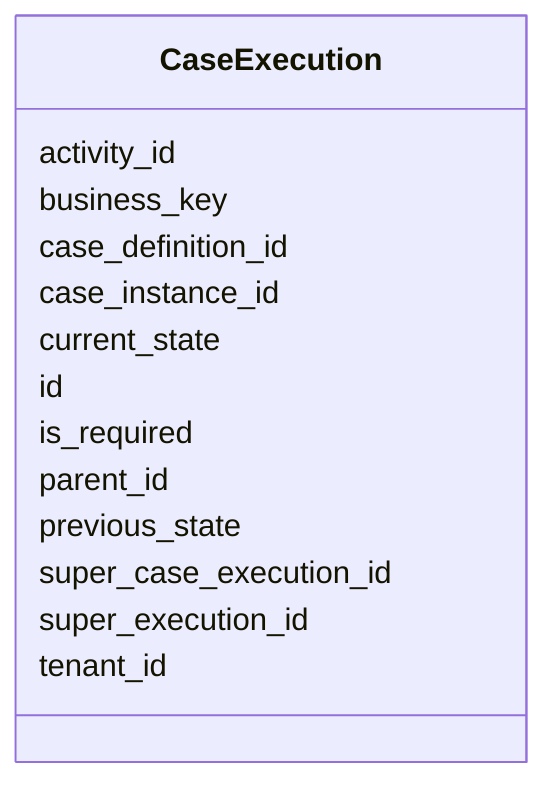

---
search:
  boost: 10.0
---

# Class: CaseExecution 


_Case Execution entity in the process execution runtime._


<div data-search-exclude markdown="1">


URI: [fluxnova_bpm_platform:CaseExecution](https://w3id.org/TD-Universe/fluxnova-bpm-platform/CaseExecution)





<!-- no inheritance hierarchy -->

## Slots

| Name | Cardinality and Range | Description | Inheritance |
| ---  | --- | --- | --- |
| [id](id.md) | 1 <br/> [String](String.md) | Unique identifier | direct |
| [case_instance_id](case_instance_id.md) | 0..1 <br/> [String](String.md) | Reference to the case instance | direct |
| [super_case_execution_id](super_case_execution_id.md) | 0..1 <br/> [String](String.md) | Reference to the super case execution | direct |
| [super_execution_id](super_execution_id.md) | 0..1 <br/> [String](String.md) | Reference to the super execution | direct |
| [business_key](business_key.md) | 0..1 <br/> [String](String.md) | Domain-specific business key | direct |
| [parent_id](parent_id.md) | 0..1 <br/> [String](String.md) | Reference to a CaseExecution | direct |
| [case_definition_id](case_definition_id.md) | 0..1 <br/> [String](String.md) | Reference to the case definition | direct |
| [activity_id](activity_id.md) | 0..1 <br/> [String](String.md) | BPMN activity element identifier | direct |
| [previous_state](previous_state.md) | 0..1 <br/> [Integer](Integer.md) | The previous state | direct |
| [current_state](current_state.md) | 0..1 <br/> [Integer](Integer.md) | The current state | direct |
| [is_required](is_required.md) | 0..1 <br/> [Boolean](Boolean.md) | Whether this entity is required | direct |
| [tenant_id](tenant_id.md) | 0..1 <br/> [String](String.md) | Multi-tenancy discriminator | direct |


## In Subsets


* [Runtime](Runtime.md)
* [FluxnovaBpm](FluxnovaBpm.md)


## Identifier and Mapping Information


### Annotations

| property | value |
| --- | --- |
| sql_table | ACT_RU_CASE_EXECUTION |


### Schema Source


* from schema: https://w3id.org/TD-Universe/fluxnova-bpm-platform


## Mappings

| Mapping Type | Mapped Value |
| ---  | ---  |
| self | fluxnova_bpm_platform:CaseExecution |
| native | fluxnova_bpm_platform:CaseExecution |


## LinkML Source

<!-- TODO: investigate https://stackoverflow.com/questions/37606292/how-to-create-tabbed-code-blocks-in-mkdocs-or-sphinx -->

### Direct

<details>
```yaml
name: CaseExecution
annotations:
  sql_table:
    tag: sql_table
    value: ACT_RU_CASE_EXECUTION
description: Case Execution entity in the process execution runtime.
in_subset:
- runtime
- fluxnova_bpm
from_schema: https://w3id.org/TD-Universe/fluxnova-bpm-platform
slots:
- id
- case_instance_id
- super_case_execution_id
- super_execution_id
- business_key
- parent_id
- case_definition_id
- activity_id
- previous_state
- current_state
- is_required
- tenant_id

```
</details>

### Induced

<details>
```yaml
name: CaseExecution
annotations:
  sql_table:
    tag: sql_table
    value: ACT_RU_CASE_EXECUTION
description: Case Execution entity in the process execution runtime.
in_subset:
- runtime
- fluxnova_bpm
from_schema: https://w3id.org/TD-Universe/fluxnova-bpm-platform
attributes:
  id:
    name: id
    description: Unique identifier.
    from_schema: https://w3id.org/TD-Universe/fluxnova-bpm-platform
    rank: 1000
    slot_uri: schema:identifier
    identifier: true
    owner: CaseExecution
    domain_of:
    - ByteArray
    - MeterLog
    - SchemaLogEntry
    - TaskMeterLog
    - Authorization
    - Group
    - IdentityInfo
    - IdentityLink
    - Tenant
    - TenantMembership
    - User
    - CaseExecution
    - CaseSentryPart
    - EventSubscription
    - Execution
    - ExternalTask
    - Incident
    - Task
    - VariableInstance
    - Attachment
    - Comment
    - Filter
    - Deployment
    - ResourceDefinition
    - Batch
    - Job
    - JobDefinition
    - HistoricBatch
    - HistoricDecisionInputInstance
    - HistoricDecisionInstance
    - HistoricDecisionOutputInstance
    - HistoricDetail
    - HistoricExternalTaskLog
    - HistoricIdentityLink
    - HistoricIncident
    - HistoricJobLog
    - HistoricScopeInstance
    - HistoricVariableInstance
    - UserOperationLogEntry
    - Diagram
    - DiagramElement
    - Style
    - BaseElement
    - Definitions
    - Documentation
    - InteractionNode
    range: string
    required: true
  case_instance_id:
    name: case_instance_id
    description: Reference to the case instance.
    from_schema: https://w3id.org/TD-Universe/fluxnova-bpm-platform
    rank: 1000
    owner: CaseExecution
    domain_of:
    - CaseExecution
    - CaseSentryPart
    - Execution
    - Task
    - VariableInstance
    - HistoricCaseActivityInstance
    - HistoricCaseInstance
    - HistoricDecisionInstance
    - HistoricDetail
    - HistoricProcessInstance
    - HistoricTaskInstance
    - HistoricVariableInstance
    - UserOperationLogEntry
    range: string
  super_case_execution_id:
    name: super_case_execution_id
    annotations:
      sql_column:
        tag: sql_column
        value: SUPER_CASE_EXEC_
    description: Reference to the super case execution.
    from_schema: https://w3id.org/TD-Universe/fluxnova-bpm-platform
    rank: 1000
    owner: CaseExecution
    domain_of:
    - CaseExecution
    - Execution
    range: string
  super_execution_id:
    name: super_execution_id
    annotations:
      sql_column:
        tag: sql_column
        value: SUPER_EXEC_
    description: Reference to the super execution.
    from_schema: https://w3id.org/TD-Universe/fluxnova-bpm-platform
    rank: 1000
    owner: CaseExecution
    domain_of:
    - CaseExecution
    - Execution
    range: string
  business_key:
    name: business_key
    description: Domain-specific business key.
    from_schema: https://w3id.org/TD-Universe/fluxnova-bpm-platform
    rank: 1000
    owner: CaseExecution
    domain_of:
    - CaseExecution
    - Execution
    - HistoricCaseInstance
    - HistoricProcessInstance
    range: string
  parent_id:
    name: parent_id
    annotations:
      sql_column:
        tag: sql_column
        value: PARENT_ID_
    description: Reference to a CaseExecution.
    from_schema: https://w3id.org/TD-Universe/fluxnova-bpm-platform
    rank: 1000
    owner: CaseExecution
    domain_of:
    - IdentityInfo
    - CaseExecution
    - Execution
    range: string
  case_definition_id:
    name: case_definition_id
    description: Reference to the case definition.
    from_schema: https://w3id.org/TD-Universe/fluxnova-bpm-platform
    rank: 1000
    owner: CaseExecution
    domain_of:
    - CaseExecution
    - Task
    - HistoricCaseActivityInstance
    - HistoricCaseInstance
    - HistoricDecisionInstance
    - HistoricDetail
    - HistoricTaskInstance
    - HistoricVariableInstance
    - UserOperationLogEntry
    range: string
  activity_id:
    name: activity_id
    description: BPMN activity element identifier.
    from_schema: https://w3id.org/TD-Universe/fluxnova-bpm-platform
    rank: 1000
    owner: CaseExecution
    domain_of:
    - CaseExecution
    - EventSubscription
    - Execution
    - ExternalTask
    - Incident
    - JobDefinition
    - HistoricActivityInstance
    - HistoricDecisionInstance
    - HistoricExternalTaskLog
    - HistoricIncident
    - HistoricJobLog
    range: string
  previous_state:
    name: previous_state
    annotations:
      sql_column:
        tag: sql_column
        value: PREV_STATE_
    description: The previous state.
    from_schema: https://w3id.org/TD-Universe/fluxnova-bpm-platform
    rank: 1000
    owner: CaseExecution
    domain_of:
    - CaseExecution
    range: integer
  current_state:
    name: current_state
    annotations:
      sql_column:
        tag: sql_column
        value: CURRENT_STATE_
    description: The current state.
    from_schema: https://w3id.org/TD-Universe/fluxnova-bpm-platform
    rank: 1000
    owner: CaseExecution
    domain_of:
    - CaseExecution
    range: integer
  is_required:
    name: is_required
    annotations:
      sql_column:
        tag: sql_column
        value: REQUIRED_
    description: Whether this entity is required.
    from_schema: https://w3id.org/TD-Universe/fluxnova-bpm-platform
    rank: 1000
    owner: CaseExecution
    domain_of:
    - CaseExecution
    - HistoricCaseActivityInstance
    range: boolean
  tenant_id:
    name: tenant_id
    description: Multi-tenancy discriminator.
    from_schema: https://w3id.org/TD-Universe/fluxnova-bpm-platform
    rank: 1000
    owner: CaseExecution
    domain_of:
    - ByteArray
    - IdentityLink
    - TenantMembership
    - CaseExecution
    - CaseSentryPart
    - EventSubscription
    - Execution
    - ExternalTask
    - Incident
    - Task
    - VariableInstance
    - Attachment
    - Comment
    - Deployment
    - ResourceDefinition
    - Batch
    - Job
    - JobDefinition
    - HistoricActivityInstance
    - HistoricBatch
    - HistoricCaseActivityInstance
    - HistoricCaseInstance
    - HistoricDecisionInputInstance
    - HistoricDecisionInstance
    - HistoricDecisionOutputInstance
    - HistoricDetail
    - HistoricExternalTaskLog
    - HistoricIdentityLink
    - HistoricIncident
    - HistoricJobLog
    - HistoricProcessInstance
    - HistoricTaskInstance
    - HistoricVariableInstance
    - UserOperationLogEntry
    range: string

```
</details></div>