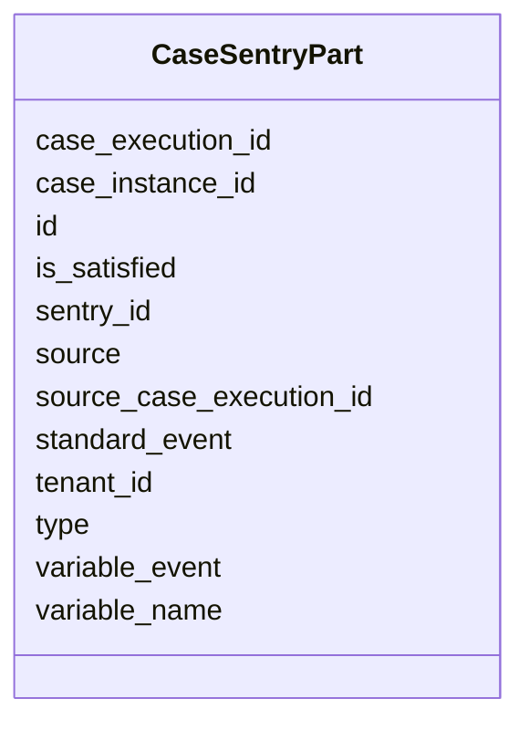

---
search:
  boost: 10.0
---

# Class: CaseSentryPart 


_Case Sentry Part entity in the process execution runtime._


<div data-search-exclude markdown="1">


URI: [fluxnova_bpm_platform:CaseSentryPart](https://w3id.org/TD-Universe/fluxnova-bpm-platform/CaseSentryPart)





<!-- no inheritance hierarchy -->

## Slots

| Name | Cardinality and Range | Description | Inheritance |
| ---  | --- | --- | --- |
| [id](id.md) | 1 <br/> [String](String.md) | Unique identifier | direct |
| [case_instance_id](case_instance_id.md) | 0..1 <br/> [String](String.md) | Reference to the case instance | direct |
| [case_execution_id](case_execution_id.md) | 0..1 <br/> [String](String.md) | Reference to the case execution | direct |
| [sentry_id](sentry_id.md) | 0..1 <br/> [String](String.md) | Reference to the sentry | direct |
| [type](type.md) | 0..1 <br/> [String](String.md) | Type discriminator | direct |
| [source_case_execution_id](source_case_execution_id.md) | 0..1 <br/> [String](String.md) | Reference to the source case execution | direct |
| [standard_event](standard_event.md) | 0..1 <br/> [String](String.md) | The standard event | direct |
| [source](source.md) | 0..1 <br/> [String](String.md) | The source | direct |
| [variable_event](variable_event.md) | 0..1 <br/> [String](String.md) | The variable event | direct |
| [variable_name](variable_name.md) | 0..1 <br/> [String](String.md) | The name of the output variable | direct |
| [is_satisfied](is_satisfied.md) | 0..1 <br/> [Boolean](Boolean.md) | Whether this entity is satisfied | direct |
| [tenant_id](tenant_id.md) | 0..1 <br/> [String](String.md) | Multi-tenancy discriminator | direct |


## In Subsets


* [Runtime](Runtime.md)
* [FluxnovaBpm](FluxnovaBpm.md)


## Identifier and Mapping Information


### Annotations

| property | value |
| --- | --- |
| sql_table | ACT_RU_CASE_SENTRY_PART |


### Schema Source


* from schema: https://w3id.org/TD-Universe/fluxnova-bpm-platform


## Mappings

| Mapping Type | Mapped Value |
| ---  | ---  |
| self | fluxnova_bpm_platform:CaseSentryPart |
| native | fluxnova_bpm_platform:CaseSentryPart |


## LinkML Source

<!-- TODO: investigate https://stackoverflow.com/questions/37606292/how-to-create-tabbed-code-blocks-in-mkdocs-or-sphinx -->

### Direct

<details>
```yaml
name: CaseSentryPart
annotations:
  sql_table:
    tag: sql_table
    value: ACT_RU_CASE_SENTRY_PART
description: Case Sentry Part entity in the process execution runtime.
in_subset:
- runtime
- fluxnova_bpm
from_schema: https://w3id.org/TD-Universe/fluxnova-bpm-platform
slots:
- id
- case_instance_id
- case_execution_id
- sentry_id
- type
- source_case_execution_id
- standard_event
- source
- variable_event
- variable_name
- is_satisfied
- tenant_id

```
</details>

### Induced

<details>
```yaml
name: CaseSentryPart
annotations:
  sql_table:
    tag: sql_table
    value: ACT_RU_CASE_SENTRY_PART
description: Case Sentry Part entity in the process execution runtime.
in_subset:
- runtime
- fluxnova_bpm
from_schema: https://w3id.org/TD-Universe/fluxnova-bpm-platform
attributes:
  id:
    name: id
    description: Unique identifier.
    from_schema: https://w3id.org/TD-Universe/fluxnova-bpm-platform
    rank: 1000
    slot_uri: schema:identifier
    identifier: true
    owner: CaseSentryPart
    domain_of:
    - ByteArray
    - MeterLog
    - SchemaLogEntry
    - TaskMeterLog
    - Authorization
    - Group
    - IdentityInfo
    - IdentityLink
    - Tenant
    - TenantMembership
    - User
    - CaseExecution
    - CaseSentryPart
    - EventSubscription
    - Execution
    - ExternalTask
    - Incident
    - Task
    - VariableInstance
    - Attachment
    - Comment
    - Filter
    - Deployment
    - ResourceDefinition
    - Batch
    - Job
    - JobDefinition
    - HistoricBatch
    - HistoricDecisionInputInstance
    - HistoricDecisionInstance
    - HistoricDecisionOutputInstance
    - HistoricDetail
    - HistoricExternalTaskLog
    - HistoricIdentityLink
    - HistoricIncident
    - HistoricJobLog
    - HistoricScopeInstance
    - HistoricVariableInstance
    - UserOperationLogEntry
    - Diagram
    - DiagramElement
    - Style
    - BaseElement
    - Definitions
    - Documentation
    - InteractionNode
    range: string
    required: true
  case_instance_id:
    name: case_instance_id
    description: Reference to the case instance.
    from_schema: https://w3id.org/TD-Universe/fluxnova-bpm-platform
    rank: 1000
    owner: CaseSentryPart
    domain_of:
    - CaseExecution
    - CaseSentryPart
    - Execution
    - Task
    - VariableInstance
    - HistoricCaseActivityInstance
    - HistoricCaseInstance
    - HistoricDecisionInstance
    - HistoricDetail
    - HistoricProcessInstance
    - HistoricTaskInstance
    - HistoricVariableInstance
    - UserOperationLogEntry
    range: string
  case_execution_id:
    name: case_execution_id
    description: Reference to the case execution.
    from_schema: https://w3id.org/TD-Universe/fluxnova-bpm-platform
    rank: 1000
    owner: CaseSentryPart
    domain_of:
    - CaseSentryPart
    - Task
    - VariableInstance
    - HistoricDetail
    - HistoricTaskInstance
    - HistoricVariableInstance
    - UserOperationLogEntry
    range: string
  sentry_id:
    name: sentry_id
    annotations:
      sql_column:
        tag: sql_column
        value: SENTRY_ID_
    description: Reference to the sentry.
    from_schema: https://w3id.org/TD-Universe/fluxnova-bpm-platform
    rank: 1000
    owner: CaseSentryPart
    domain_of:
    - CaseSentryPart
    range: string
  type:
    name: type
    description: Type discriminator.
    from_schema: https://w3id.org/TD-Universe/fluxnova-bpm-platform
    rank: 1000
    owner: CaseSentryPart
    domain_of:
    - ByteArray
    - Authorization
    - Group
    - IdentityInfo
    - IdentityLink
    - CaseSentryPart
    - VariableInstance
    - Attachment
    - Comment
    - Batch
    - Job
    - HistoricBatch
    - HistoricDetail
    - HistoricIdentityLink
    - ConditionExpression
    - CorrelationProperty
    - Relationship
    - ResourceParameter
    range: string
  source_case_execution_id:
    name: source_case_execution_id
    annotations:
      sql_column:
        tag: sql_column
        value: SOURCE_CASE_EXEC_ID_
    description: Reference to the source case execution.
    from_schema: https://w3id.org/TD-Universe/fluxnova-bpm-platform
    rank: 1000
    owner: CaseSentryPart
    domain_of:
    - CaseSentryPart
    range: string
  standard_event:
    name: standard_event
    annotations:
      sql_column:
        tag: sql_column
        value: STANDARD_EVENT_
    description: The standard event.
    from_schema: https://w3id.org/TD-Universe/fluxnova-bpm-platform
    rank: 1000
    owner: CaseSentryPart
    domain_of:
    - CaseSentryPart
    range: string
  source:
    name: source
    annotations:
      sql_column:
        tag: sql_column
        value: SOURCE_
    description: The source.
    from_schema: https://w3id.org/TD-Universe/fluxnova-bpm-platform
    rank: 1000
    owner: CaseSentryPart
    domain_of:
    - CaseSentryPart
    - Deployment
    - Association
    - ConversationLink
    - MessageFlow
    - SequenceFlow
    range: string
  variable_event:
    name: variable_event
    annotations:
      sql_column:
        tag: sql_column
        value: VARIABLE_EVENT_
    description: The variable event.
    from_schema: https://w3id.org/TD-Universe/fluxnova-bpm-platform
    rank: 1000
    owner: CaseSentryPart
    domain_of:
    - CaseSentryPart
    range: string
  variable_name:
    name: variable_name
    annotations:
      sql_column:
        tag: sql_column
        value: VAR_NAME_
    description: The name of the output variable.
    from_schema: https://w3id.org/TD-Universe/fluxnova-bpm-platform
    rank: 1000
    owner: CaseSentryPart
    domain_of:
    - CaseSentryPart
    - HistoricDecisionOutputInstance
    range: string
  is_satisfied:
    name: is_satisfied
    annotations:
      sql_column:
        tag: sql_column
        value: SATISFIED_
    description: Whether this entity is satisfied.
    from_schema: https://w3id.org/TD-Universe/fluxnova-bpm-platform
    rank: 1000
    owner: CaseSentryPart
    domain_of:
    - CaseSentryPart
    range: boolean
  tenant_id:
    name: tenant_id
    description: Multi-tenancy discriminator.
    from_schema: https://w3id.org/TD-Universe/fluxnova-bpm-platform
    rank: 1000
    owner: CaseSentryPart
    domain_of:
    - ByteArray
    - IdentityLink
    - TenantMembership
    - CaseExecution
    - CaseSentryPart
    - EventSubscription
    - Execution
    - ExternalTask
    - Incident
    - Task
    - VariableInstance
    - Attachment
    - Comment
    - Deployment
    - ResourceDefinition
    - Batch
    - Job
    - JobDefinition
    - HistoricActivityInstance
    - HistoricBatch
    - HistoricCaseActivityInstance
    - HistoricCaseInstance
    - HistoricDecisionInputInstance
    - HistoricDecisionInstance
    - HistoricDecisionOutputInstance
    - HistoricDetail
    - HistoricExternalTaskLog
    - HistoricIdentityLink
    - HistoricIncident
    - HistoricJobLog
    - HistoricProcessInstance
    - HistoricTaskInstance
    - HistoricVariableInstance
    - UserOperationLogEntry
    range: string

```
</details></div>