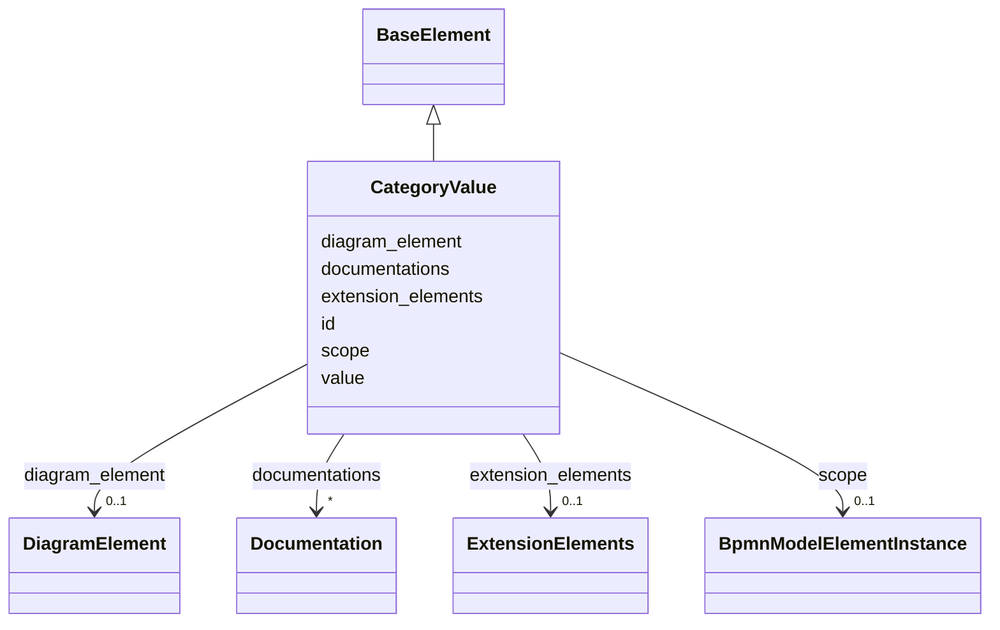

---
search:
  boost: 10.0
---

# Class: CategoryValue 


_The BPMN categoryValue element_


<div data-search-exclude markdown="1">


URI: [fluxnova_bpm_platform:CategoryValue](https://w3id.org/TD-Universe/fluxnova-bpm-platform/CategoryValue)





## Inheritance
* [BpmnModelElementInstance](BpmnModelElementInstance.md)
    * [BaseElement](BaseElement.md)
        * **CategoryValue**


## Slots

| Name | Cardinality and Range | Description | Inheritance |
| ---  | --- | --- | --- |
| [value](value.md) | 0..1 <br/> [String](String.md) | Value of this variable instance | direct |
| [id](id.md) | 1 <br/> [String](String.md) | Unique identifier | [BaseElement](BaseElement.md) |
| [documentations](documentations.md) | * <br/> [Documentation](Documentation.md) | Collection of documentation elements associated with this element | [BaseElement](BaseElement.md) |
| [extension_elements](extension_elements.md) | 0..1 <br/> [ExtensionElements](ExtensionElements.md) | Extension elements holding vendor-specific metadata | [BaseElement](BaseElement.md) |
| [diagram_element](diagram_element.md) | 0..1 <br/> [DiagramElement](DiagramElement.md) | The diagram element that visually represents this BPMN element | [BaseElement](BaseElement.md) |
| [scope](scope.md) | 0..1 <br/> [BpmnModelElementInstance](BpmnModelElementInstance.md) | Tests if the element is a scope like process or sub-process | [BpmnModelElementInstance](BpmnModelElementInstance.md) |


## Usages

| used by | used in | type | used |
| ---  | --- | --- | --- |
| [Activity](Activity.md) | [category_value_refs](category_value_refs.md) | range | [CategoryValue](CategoryValue.md) |
| [BoundaryEvent](BoundaryEvent.md) | [category_value_refs](category_value_refs.md) | range | [CategoryValue](CategoryValue.md) |
| [BusinessRuleTask](BusinessRuleTask.md) | [category_value_refs](category_value_refs.md) | range | [CategoryValue](CategoryValue.md) |
| [CallActivity](CallActivity.md) | [category_value_refs](category_value_refs.md) | range | [CategoryValue](CategoryValue.md) |
| [CatchEvent](CatchEvent.md) | [category_value_refs](category_value_refs.md) | range | [CategoryValue](CategoryValue.md) |
| [Category](Category.md) | [category_values](category_values.md) | range | [CategoryValue](CategoryValue.md) |
| [ComplexGateway](ComplexGateway.md) | [category_value_refs](category_value_refs.md) | range | [CategoryValue](CategoryValue.md) |
| [DataObject](DataObject.md) | [category_value_refs](category_value_refs.md) | range | [CategoryValue](CategoryValue.md) |
| [DataObjectReference](DataObjectReference.md) | [category_value_refs](category_value_refs.md) | range | [CategoryValue](CategoryValue.md) |
| [DataStoreReference](DataStoreReference.md) | [category_value_refs](category_value_refs.md) | range | [CategoryValue](CategoryValue.md) |
| [EndEvent](EndEvent.md) | [category_value_refs](category_value_refs.md) | range | [CategoryValue](CategoryValue.md) |
| [Event](Event.md) | [category_value_refs](category_value_refs.md) | range | [CategoryValue](CategoryValue.md) |
| [EventBasedGateway](EventBasedGateway.md) | [category_value_refs](category_value_refs.md) | range | [CategoryValue](CategoryValue.md) |
| [ExclusiveGateway](ExclusiveGateway.md) | [category_value_refs](category_value_refs.md) | range | [CategoryValue](CategoryValue.md) |
| [FlowElement](FlowElement.md) | [category_value_refs](category_value_refs.md) | range | [CategoryValue](CategoryValue.md) |
| [FlowNode](FlowNode.md) | [category_value_refs](category_value_refs.md) | range | [CategoryValue](CategoryValue.md) |
| [Gateway](Gateway.md) | [category_value_refs](category_value_refs.md) | range | [CategoryValue](CategoryValue.md) |
| [BpmnGroup](BpmnGroup.md) | [category](category.md) | range | [CategoryValue](CategoryValue.md) |
| [InclusiveGateway](InclusiveGateway.md) | [category_value_refs](category_value_refs.md) | range | [CategoryValue](CategoryValue.md) |
| [IntermediateCatchEvent](IntermediateCatchEvent.md) | [category_value_refs](category_value_refs.md) | range | [CategoryValue](CategoryValue.md) |
| [IntermediateThrowEvent](IntermediateThrowEvent.md) | [category_value_refs](category_value_refs.md) | range | [CategoryValue](CategoryValue.md) |
| [ManualTask](ManualTask.md) | [category_value_refs](category_value_refs.md) | range | [CategoryValue](CategoryValue.md) |
| [ParallelGateway](ParallelGateway.md) | [category_value_refs](category_value_refs.md) | range | [CategoryValue](CategoryValue.md) |
| [ReceiveTask](ReceiveTask.md) | [category_value_refs](category_value_refs.md) | range | [CategoryValue](CategoryValue.md) |
| [ScriptTask](ScriptTask.md) | [category_value_refs](category_value_refs.md) | range | [CategoryValue](CategoryValue.md) |
| [SendTask](SendTask.md) | [category_value_refs](category_value_refs.md) | range | [CategoryValue](CategoryValue.md) |
| [SequenceFlow](SequenceFlow.md) | [category_value_refs](category_value_refs.md) | range | [CategoryValue](CategoryValue.md) |
| [ServiceTask](ServiceTask.md) | [category_value_refs](category_value_refs.md) | range | [CategoryValue](CategoryValue.md) |
| [StartEvent](StartEvent.md) | [category_value_refs](category_value_refs.md) | range | [CategoryValue](CategoryValue.md) |
| [SubProcess](SubProcess.md) | [category_value_refs](category_value_refs.md) | range | [CategoryValue](CategoryValue.md) |
| [BpmnTask](BpmnTask.md) | [category_value_refs](category_value_refs.md) | range | [CategoryValue](CategoryValue.md) |
| [ThrowEvent](ThrowEvent.md) | [category_value_refs](category_value_refs.md) | range | [CategoryValue](CategoryValue.md) |
| [Transaction](Transaction.md) | [category_value_refs](category_value_refs.md) | range | [CategoryValue](CategoryValue.md) |
| [UserTask](UserTask.md) | [category_value_refs](category_value_refs.md) | range | [CategoryValue](CategoryValue.md) |


## In Subsets


* [Instance](Instance.md)
* [FluxnovaBpmnModel](FluxnovaBpmnModel.md)


## Identifier and Mapping Information


### Annotations

| property | value |
| --- | --- |
| java_package | org.finos.fluxnova.bpm.model.bpmn.instance |
| source_file | model-api/bpmn-model/src/main/java/org/finos/fluxnova/bpm/model/bpmn/instance/CategoryValue.java |


### Schema Source


* from schema: https://w3id.org/TD-Universe/fluxnova-bpm-platform


## Mappings

| Mapping Type | Mapped Value |
| ---  | ---  |
| self | fluxnova_bpm_platform:CategoryValue |
| native | fluxnova_bpm_platform:CategoryValue |


## LinkML Source

<!-- TODO: investigate https://stackoverflow.com/questions/37606292/how-to-create-tabbed-code-blocks-in-mkdocs-or-sphinx -->

### Direct

<details>
```yaml
name: CategoryValue
annotations:
  java_package:
    tag: java_package
    value: org.finos.fluxnova.bpm.model.bpmn.instance
  source_file:
    tag: source_file
    value: model-api/bpmn-model/src/main/java/org/finos/fluxnova/bpm/model/bpmn/instance/CategoryValue.java
description: The BPMN categoryValue element
in_subset:
- instance
- fluxnova_bpmn_model
from_schema: https://w3id.org/TD-Universe/fluxnova-bpm-platform
is_a: BaseElement
slots:
- value

```
</details>

### Induced

<details>
```yaml
name: CategoryValue
annotations:
  java_package:
    tag: java_package
    value: org.finos.fluxnova.bpm.model.bpmn.instance
  source_file:
    tag: source_file
    value: model-api/bpmn-model/src/main/java/org/finos/fluxnova/bpm/model/bpmn/instance/CategoryValue.java
description: The BPMN categoryValue element
in_subset:
- instance
- fluxnova_bpmn_model
from_schema: https://w3id.org/TD-Universe/fluxnova-bpm-platform
is_a: BaseElement
attributes:
  value:
    name: value
    annotations:
      sql_column:
        tag: sql_column
        value: VALUE_
    description: Value of this variable instance.
    from_schema: https://w3id.org/TD-Universe/fluxnova-bpm-platform
    rank: 1000
    owner: CategoryValue
    domain_of:
    - MeterLog
    - Property
    - IdentityInfo
    - CategoryValue
    - FluxnovaGenericValueElement
    range: string
  id:
    name: id
    description: Unique identifier.
    from_schema: https://w3id.org/TD-Universe/fluxnova-bpm-platform
    rank: 1000
    slot_uri: schema:identifier
    identifier: true
    owner: CategoryValue
    domain_of:
    - ByteArray
    - MeterLog
    - SchemaLogEntry
    - TaskMeterLog
    - Authorization
    - Group
    - IdentityInfo
    - IdentityLink
    - Tenant
    - TenantMembership
    - User
    - CaseExecution
    - CaseSentryPart
    - EventSubscription
    - Execution
    - ExternalTask
    - Incident
    - Task
    - VariableInstance
    - Attachment
    - Comment
    - Filter
    - Deployment
    - ResourceDefinition
    - Batch
    - Job
    - JobDefinition
    - HistoricBatch
    - HistoricDecisionInputInstance
    - HistoricDecisionInstance
    - HistoricDecisionOutputInstance
    - HistoricDetail
    - HistoricExternalTaskLog
    - HistoricIdentityLink
    - HistoricIncident
    - HistoricJobLog
    - HistoricScopeInstance
    - HistoricVariableInstance
    - UserOperationLogEntry
    - Diagram
    - DiagramElement
    - Style
    - BaseElement
    - Definitions
    - Documentation
    - InteractionNode
    range: string
    required: true
  documentations:
    name: documentations
    description: Collection of documentation elements associated with this element.
    from_schema: https://w3id.org/TD-Universe/fluxnova-bpm-platform
    rank: 1000
    owner: CategoryValue
    domain_of:
    - BaseElement
    range: Documentation
    multivalued: true
    inlined: true
    inlined_as_list: true
  extension_elements:
    name: extension_elements
    description: Extension elements holding vendor-specific metadata.
    from_schema: https://w3id.org/TD-Universe/fluxnova-bpm-platform
    rank: 1000
    owner: CategoryValue
    domain_of:
    - BaseElement
    range: ExtensionElements
  diagram_element:
    name: diagram_element
    description: The diagram element that visually represents this BPMN element.
    from_schema: https://w3id.org/TD-Universe/fluxnova-bpm-platform
    rank: 1000
    owner: CategoryValue
    domain_of:
    - BaseElement
    range: DiagramElement
  scope:
    name: scope
    description: Tests if the element is a scope like process or sub-process.
    from_schema: https://w3id.org/TD-Universe/fluxnova-bpm-platform
    rank: 1000
    owner: CategoryValue
    domain_of:
    - BpmnModelElementInstance
    range: BpmnModelElementInstance

```
</details></div>