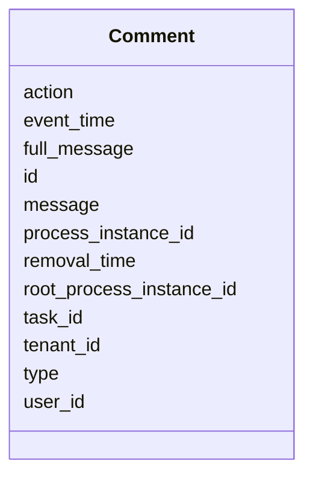

---
search:
  boost: 10.0
---

# Class: Comment 


_User comments that form discussions around tasks._


<div data-search-exclude markdown="1">


URI: [fluxnova_bpm_platform:Comment](https://w3id.org/TD-Universe/fluxnova-bpm-platform/Comment)





<!-- no inheritance hierarchy -->

## Slots

| Name | Cardinality and Range | Description | Inheritance |
| ---  | --- | --- | --- |
| [id](id.md) | 1 <br/> [String](String.md) | Unique identifier | direct |
| [type](type.md) | 0..1 <br/> [String](String.md) | Type discriminator | direct |
| [event_time](event_time.md) | 1 <br/> [Datetime](Datetime.md) | Timestamp for event time | direct |
| [user_id](user_id.md) | 0..1 <br/> [String](String.md) | Reference to a user | direct |
| [task_id](task_id.md) | 0..1 <br/> [String](String.md) | Reference to the task | direct |
| [root_process_instance_id](root_process_instance_id.md) | 0..1 <br/> [String](String.md) | Root process instance for history cleanup | direct |
| [process_instance_id](process_instance_id.md) | 0..1 <br/> [String](String.md) | Reference to the process instance | direct |
| [action](action.md) | 0..1 <br/> [String](String.md) | The action | direct |
| [message](message.md) | 0..1 <br/> [String](String.md) | Short message or summary | direct |
| [full_message](full_message.md) | 0..1 <br/> [String](String.md) | The full comment message the user had related to the task and/or process inst... | direct |
| [tenant_id](tenant_id.md) | 0..1 <br/> [String](String.md) | Multi-tenancy discriminator | direct |
| [removal_time](removal_time.md) | 0..1 <br/> [Datetime](Datetime.md) | Timestamp when this entity is eligible for removal | direct |


## In Subsets


* [Collaboration](Collaboration.md)
* [FluxnovaBpm](FluxnovaBpm.md)


## Identifier and Mapping Information


### Annotations

| property | value |
| --- | --- |
| sql_table | ACT_HI_COMMENT |


### Schema Source


* from schema: https://w3id.org/TD-Universe/fluxnova-bpm-platform


## Mappings

| Mapping Type | Mapped Value |
| ---  | ---  |
| self | fluxnova_bpm_platform:Comment |
| native | fluxnova_bpm_platform:Comment |


## LinkML Source

<!-- TODO: investigate https://stackoverflow.com/questions/37606292/how-to-create-tabbed-code-blocks-in-mkdocs-or-sphinx -->

### Direct

<details>
```yaml
name: Comment
annotations:
  sql_table:
    tag: sql_table
    value: ACT_HI_COMMENT
description: User comments that form discussions around tasks.
in_subset:
- collaboration
- fluxnova_bpm
from_schema: https://w3id.org/TD-Universe/fluxnova-bpm-platform
slots:
- id
- type
- event_time
- user_id
- task_id
- root_process_instance_id
- process_instance_id
- action
- message
- full_message
- tenant_id
- removal_time

```
</details>

### Induced

<details>
```yaml
name: Comment
annotations:
  sql_table:
    tag: sql_table
    value: ACT_HI_COMMENT
description: User comments that form discussions around tasks.
in_subset:
- collaboration
- fluxnova_bpm
from_schema: https://w3id.org/TD-Universe/fluxnova-bpm-platform
attributes:
  id:
    name: id
    description: Unique identifier.
    from_schema: https://w3id.org/TD-Universe/fluxnova-bpm-platform
    rank: 1000
    slot_uri: schema:identifier
    identifier: true
    owner: Comment
    domain_of:
    - ByteArray
    - MeterLog
    - SchemaLogEntry
    - TaskMeterLog
    - Authorization
    - Group
    - IdentityInfo
    - IdentityLink
    - Tenant
    - TenantMembership
    - User
    - CaseExecution
    - CaseSentryPart
    - EventSubscription
    - Execution
    - ExternalTask
    - Incident
    - Task
    - VariableInstance
    - Attachment
    - Comment
    - Filter
    - Deployment
    - ResourceDefinition
    - Batch
    - Job
    - JobDefinition
    - HistoricBatch
    - HistoricDecisionInputInstance
    - HistoricDecisionInstance
    - HistoricDecisionOutputInstance
    - HistoricDetail
    - HistoricExternalTaskLog
    - HistoricIdentityLink
    - HistoricIncident
    - HistoricJobLog
    - HistoricScopeInstance
    - HistoricVariableInstance
    - UserOperationLogEntry
    - Diagram
    - DiagramElement
    - Style
    - BaseElement
    - Definitions
    - Documentation
    - InteractionNode
    range: string
    required: true
  type:
    name: type
    description: Type discriminator.
    from_schema: https://w3id.org/TD-Universe/fluxnova-bpm-platform
    rank: 1000
    owner: Comment
    domain_of:
    - ByteArray
    - Authorization
    - Group
    - IdentityInfo
    - IdentityLink
    - CaseSentryPart
    - VariableInstance
    - Attachment
    - Comment
    - Batch
    - Job
    - HistoricBatch
    - HistoricDetail
    - HistoricIdentityLink
    - ConditionExpression
    - CorrelationProperty
    - Relationship
    - ResourceParameter
    range: string
  event_time:
    name: event_time
    annotations:
      sql_column:
        tag: sql_column
        value: TIME_
    description: Timestamp for event time.
    from_schema: https://w3id.org/TD-Universe/fluxnova-bpm-platform
    rank: 1000
    owner: Comment
    domain_of:
    - Comment
    - HistoricDetail
    range: datetime
    required: true
  user_id:
    name: user_id
    description: Reference to a user.
    from_schema: https://w3id.org/TD-Universe/fluxnova-bpm-platform
    rank: 1000
    owner: Comment
    domain_of:
    - Authorization
    - IdentityInfo
    - IdentityLink
    - Membership
    - TenantMembership
    - Attachment
    - Comment
    - HistoricDecisionInstance
    - HistoricIdentityLink
    - UserOperationLogEntry
    range: string
  task_id:
    name: task_id
    description: Reference to the task.
    from_schema: https://w3id.org/TD-Universe/fluxnova-bpm-platform
    rank: 1000
    owner: Comment
    domain_of:
    - IdentityLink
    - VariableInstance
    - Attachment
    - Comment
    - HistoricActivityInstance
    - HistoricCaseActivityInstance
    - HistoricDetail
    - HistoricIdentityLink
    - HistoricVariableInstance
    - UserOperationLogEntry
    range: string
  root_process_instance_id:
    name: root_process_instance_id
    description: Root process instance for history cleanup.
    from_schema: https://w3id.org/TD-Universe/fluxnova-bpm-platform
    rank: 1000
    owner: Comment
    domain_of:
    - ByteArray
    - Authorization
    - Execution
    - Attachment
    - Comment
    - Job
    - HistoricDecisionInputInstance
    - HistoricDecisionInstance
    - HistoricDecisionOutputInstance
    - HistoricDetail
    - HistoricExternalTaskLog
    - HistoricIdentityLink
    - HistoricIncident
    - HistoricJobLog
    - HistoricScopeInstance
    - HistoricVariableInstance
    - UserOperationLogEntry
    range: string
  process_instance_id:
    name: process_instance_id
    description: Reference to the process instance.
    from_schema: https://w3id.org/TD-Universe/fluxnova-bpm-platform
    rank: 1000
    owner: Comment
    domain_of:
    - EventSubscription
    - Execution
    - ExternalTask
    - Incident
    - Task
    - VariableInstance
    - Attachment
    - Comment
    - Job
    - HistoricDecisionInstance
    - HistoricDetail
    - HistoricExternalTaskLog
    - HistoricIncident
    - HistoricJobLog
    - HistoricScopeInstance
    - HistoricVariableInstance
    - UserOperationLogEntry
    range: string
  action:
    name: action
    annotations:
      sql_column:
        tag: sql_column
        value: ACTION_
    description: The action.
    from_schema: https://w3id.org/TD-Universe/fluxnova-bpm-platform
    rank: 1000
    owner: Comment
    domain_of:
    - Comment
    range: string
  message:
    name: message
    annotations:
      sql_column:
        tag: sql_column
        value: MESSAGE_
    description: Short message or summary.
    from_schema: https://w3id.org/TD-Universe/fluxnova-bpm-platform
    rank: 1000
    owner: Comment
    domain_of:
    - Comment
    - CorrelationPropertyRetrievalExpression
    - MessageEventDefinition
    - MessageFlow
    - ReceiveTask
    - SendTask
    range: string
  full_message:
    name: full_message
    annotations:
      sql_column:
        tag: sql_column
        value: FULL_MSG_
    description: The full comment message the user had related to the task and/or
      process instance
    from_schema: https://w3id.org/TD-Universe/fluxnova-bpm-platform
    rank: 1000
    owner: Comment
    domain_of:
    - Comment
    range: string
  tenant_id:
    name: tenant_id
    description: Multi-tenancy discriminator.
    from_schema: https://w3id.org/TD-Universe/fluxnova-bpm-platform
    rank: 1000
    owner: Comment
    domain_of:
    - ByteArray
    - IdentityLink
    - TenantMembership
    - CaseExecution
    - CaseSentryPart
    - EventSubscription
    - Execution
    - ExternalTask
    - Incident
    - Task
    - VariableInstance
    - Attachment
    - Comment
    - Deployment
    - ResourceDefinition
    - Batch
    - Job
    - JobDefinition
    - HistoricActivityInstance
    - HistoricBatch
    - HistoricCaseActivityInstance
    - HistoricCaseInstance
    - HistoricDecisionInputInstance
    - HistoricDecisionInstance
    - HistoricDecisionOutputInstance
    - HistoricDetail
    - HistoricExternalTaskLog
    - HistoricIdentityLink
    - HistoricIncident
    - HistoricJobLog
    - HistoricProcessInstance
    - HistoricTaskInstance
    - HistoricVariableInstance
    - UserOperationLogEntry
    range: string
  removal_time:
    name: removal_time
    description: Timestamp when this entity is eligible for removal.
    from_schema: https://w3id.org/TD-Universe/fluxnova-bpm-platform
    rank: 1000
    owner: Comment
    domain_of:
    - ByteArray
    - Authorization
    - Attachment
    - Comment
    - HistoricBatch
    - HistoricDecisionInputInstance
    - HistoricDecisionInstance
    - HistoricDecisionOutputInstance
    - HistoricDetail
    - HistoricExternalTaskLog
    - HistoricIdentityLink
    - HistoricIncident
    - HistoricJobLog
    - HistoricScopeInstance
    - HistoricVariableInstance
    - UserOperationLogEntry
    range: datetime

```
</details></div>