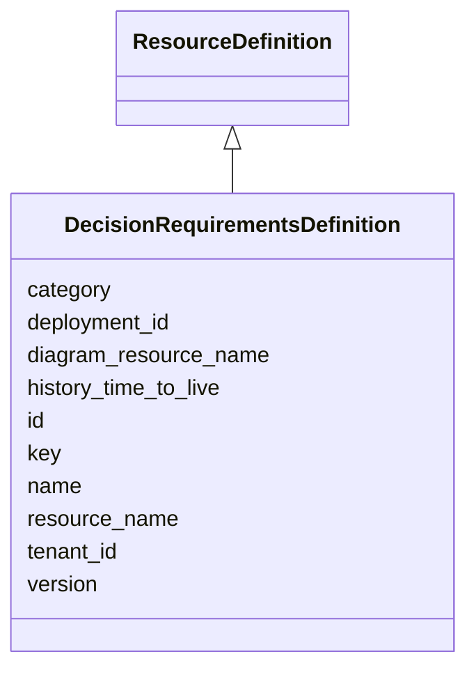

---
search:
  boost: 10.0
---

# Class: DecisionRequirementsDefinition 


_Container of DecisionDefinitions which belongs to the same decision requirements graph (i.e. DMN resource)._


<div data-search-exclude markdown="1">


URI: [fluxnova_bpm_platform:DecisionRequirementsDefinition](https://w3id.org/TD-Universe/fluxnova-bpm-platform/DecisionRequirementsDefinition)





## Inheritance
* [ResourceDefinition](ResourceDefinition.md)
    * **DecisionRequirementsDefinition**


## Slots

| Name | Cardinality and Range | Description | Inheritance |
| ---  | --- | --- | --- |
| [id](id.md) | 1 <br/> [String](String.md) | Unique identifier | [ResourceDefinition](ResourceDefinition.md) |
| [key](key.md) | 1 <br/> [String](String.md) | Business key for the definition | [ResourceDefinition](ResourceDefinition.md) |
| [name](name.md) | 0..1 <br/> [String](String.md) | Human-readable name | [ResourceDefinition](ResourceDefinition.md) |
| [version](version.md) | 1 <br/> [Integer](Integer.md) | Version number | [ResourceDefinition](ResourceDefinition.md) |
| [category](category.md) | 0..1 <br/> [String](String.md) | Category classification | [ResourceDefinition](ResourceDefinition.md) |
| [deployment_id](deployment_id.md) | 0..1 <br/> [String](String.md) | Reference to the deployment | [ResourceDefinition](ResourceDefinition.md) |
| [resource_name](resource_name.md) | 0..1 <br/> [String](String.md) | Name of the deployed resource file | [ResourceDefinition](ResourceDefinition.md) |
| [diagram_resource_name](diagram_resource_name.md) | 0..1 <br/> [String](String.md) | Name of the diagram resource file | [ResourceDefinition](ResourceDefinition.md) |
| [tenant_id](tenant_id.md) | 0..1 <br/> [String](String.md) | Multi-tenancy discriminator | [ResourceDefinition](ResourceDefinition.md) |
| [history_time_to_live](history_time_to_live.md) | 0..1 <br/> [Integer](Integer.md) | Days to retain history before cleanup | [ResourceDefinition](ResourceDefinition.md) |


## In Subsets


* [Repository](Repository.md)
* [FluxnovaBpm](FluxnovaBpm.md)


## Identifier and Mapping Information


### Annotations

| property | value |
| --- | --- |
| sql_table | ACT_RE_DECISION_REQ_DEF |


### Schema Source


* from schema: https://w3id.org/TD-Universe/fluxnova-bpm-platform


## Mappings

| Mapping Type | Mapped Value |
| ---  | ---  |
| self | fluxnova_bpm_platform:DecisionRequirementsDefinition |
| native | fluxnova_bpm_platform:DecisionRequirementsDefinition |


## LinkML Source

<!-- TODO: investigate https://stackoverflow.com/questions/37606292/how-to-create-tabbed-code-blocks-in-mkdocs-or-sphinx -->

### Direct

<details>
```yaml
name: DecisionRequirementsDefinition
annotations:
  sql_table:
    tag: sql_table
    value: ACT_RE_DECISION_REQ_DEF
description: Container of DecisionDefinitions which belongs to the same decision requirements
  graph (i.e. DMN resource).
in_subset:
- repository
- fluxnova_bpm
from_schema: https://w3id.org/TD-Universe/fluxnova-bpm-platform
is_a: ResourceDefinition
slot_usage:
  key:
    name: key
    required: true
  version:
    name: version
    required: true

```
</details>

### Induced

<details>
```yaml
name: DecisionRequirementsDefinition
annotations:
  sql_table:
    tag: sql_table
    value: ACT_RE_DECISION_REQ_DEF
description: Container of DecisionDefinitions which belongs to the same decision requirements
  graph (i.e. DMN resource).
in_subset:
- repository
- fluxnova_bpm
from_schema: https://w3id.org/TD-Universe/fluxnova-bpm-platform
is_a: ResourceDefinition
slot_usage:
  key:
    name: key
    required: true
  version:
    name: version
    required: true
attributes:
  id:
    name: id
    description: Unique identifier.
    from_schema: https://w3id.org/TD-Universe/fluxnova-bpm-platform
    rank: 1000
    slot_uri: schema:identifier
    identifier: true
    owner: DecisionRequirementsDefinition
    domain_of:
    - ByteArray
    - MeterLog
    - SchemaLogEntry
    - TaskMeterLog
    - Authorization
    - Group
    - IdentityInfo
    - IdentityLink
    - Tenant
    - TenantMembership
    - User
    - CaseExecution
    - CaseSentryPart
    - EventSubscription
    - Execution
    - ExternalTask
    - Incident
    - Task
    - VariableInstance
    - Attachment
    - Comment
    - Filter
    - Deployment
    - ResourceDefinition
    - Batch
    - Job
    - JobDefinition
    - HistoricBatch
    - HistoricDecisionInputInstance
    - HistoricDecisionInstance
    - HistoricDecisionOutputInstance
    - HistoricDetail
    - HistoricExternalTaskLog
    - HistoricIdentityLink
    - HistoricIncident
    - HistoricJobLog
    - HistoricScopeInstance
    - HistoricVariableInstance
    - UserOperationLogEntry
    - Diagram
    - DiagramElement
    - Style
    - BaseElement
    - Definitions
    - Documentation
    - InteractionNode
    range: string
    required: true
  key:
    name: key
    description: Business key for the definition.
    from_schema: https://w3id.org/TD-Universe/fluxnova-bpm-platform
    rank: 1000
    owner: DecisionRequirementsDefinition
    domain_of:
    - IdentityInfo
    - ResourceDefinition
    range: string
    required: true
  name:
    name: name
    description: Human-readable name.
    from_schema: https://w3id.org/TD-Universe/fluxnova-bpm-platform
    rank: 1000
    slot_uri: schema:name
    owner: DecisionRequirementsDefinition
    domain_of:
    - ByteArray
    - MeterLog
    - Property
    - Group
    - Tenant
    - Task
    - VariableInstance
    - Attachment
    - Filter
    - Deployment
    - ResourceDefinition
    - HistoricDetail
    - HistoricTaskInstance
    - HistoricVariableInstance
    - Font
    - Diagram
    - CallableElement
    - Category
    - Collaboration
    - ConversationLink
    - ConversationNode
    - CorrelationKey
    - CorrelationProperty
    - DataInput
    - DataOutput
    - DataState
    - DataStore
    - Definitions
    - Error
    - Escalation
    - FlowElement
    - InputSet
    - Interface
    - Lane
    - LaneSet
    - LinkEventDefinition
    - Message
    - MessageFlow
    - Operation
    - OutputSet
    - Participant
    - BpmnProperty
    - Resource
    - ResourceParameter
    - ResourceRole
    - Signal
    range: string
  version:
    name: version
    description: Version number.
    from_schema: https://w3id.org/TD-Universe/fluxnova-bpm-platform
    rank: 1000
    owner: DecisionRequirementsDefinition
    domain_of:
    - SchemaLogEntry
    - ResourceDefinition
    range: integer
    required: true
  category:
    name: category
    description: Category classification.
    from_schema: https://w3id.org/TD-Universe/fluxnova-bpm-platform
    rank: 1000
    owner: DecisionRequirementsDefinition
    domain_of:
    - ResourceDefinition
    - UserOperationLogEntry
    - BpmnGroup
    range: string
  deployment_id:
    name: deployment_id
    description: Reference to the deployment.
    from_schema: https://w3id.org/TD-Universe/fluxnova-bpm-platform
    rank: 1000
    owner: DecisionRequirementsDefinition
    domain_of:
    - ByteArray
    - ResourceDefinition
    - Job
    - JobDefinition
    - HistoricJobLog
    - UserOperationLogEntry
    range: string
  resource_name:
    name: resource_name
    description: Name of the deployed resource file.
    from_schema: https://w3id.org/TD-Universe/fluxnova-bpm-platform
    rank: 1000
    owner: DecisionRequirementsDefinition
    domain_of:
    - ResourceDefinition
    range: string
  diagram_resource_name:
    name: diagram_resource_name
    description: Name of the diagram resource file.
    from_schema: https://w3id.org/TD-Universe/fluxnova-bpm-platform
    rank: 1000
    owner: DecisionRequirementsDefinition
    domain_of:
    - ResourceDefinition
    range: string
  tenant_id:
    name: tenant_id
    description: Multi-tenancy discriminator.
    from_schema: https://w3id.org/TD-Universe/fluxnova-bpm-platform
    rank: 1000
    owner: DecisionRequirementsDefinition
    domain_of:
    - ByteArray
    - IdentityLink
    - TenantMembership
    - CaseExecution
    - CaseSentryPart
    - EventSubscription
    - Execution
    - ExternalTask
    - Incident
    - Task
    - VariableInstance
    - Attachment
    - Comment
    - Deployment
    - ResourceDefinition
    - Batch
    - Job
    - JobDefinition
    - HistoricActivityInstance
    - HistoricBatch
    - HistoricCaseActivityInstance
    - HistoricCaseInstance
    - HistoricDecisionInputInstance
    - HistoricDecisionInstance
    - HistoricDecisionOutputInstance
    - HistoricDetail
    - HistoricExternalTaskLog
    - HistoricIdentityLink
    - HistoricIncident
    - HistoricJobLog
    - HistoricProcessInstance
    - HistoricTaskInstance
    - HistoricVariableInstance
    - UserOperationLogEntry
    range: string
  history_time_to_live:
    name: history_time_to_live
    description: Days to retain history before cleanup.
    from_schema: https://w3id.org/TD-Universe/fluxnova-bpm-platform
    rank: 1000
    owner: DecisionRequirementsDefinition
    domain_of:
    - ResourceDefinition
    range: integer

```
</details></div>