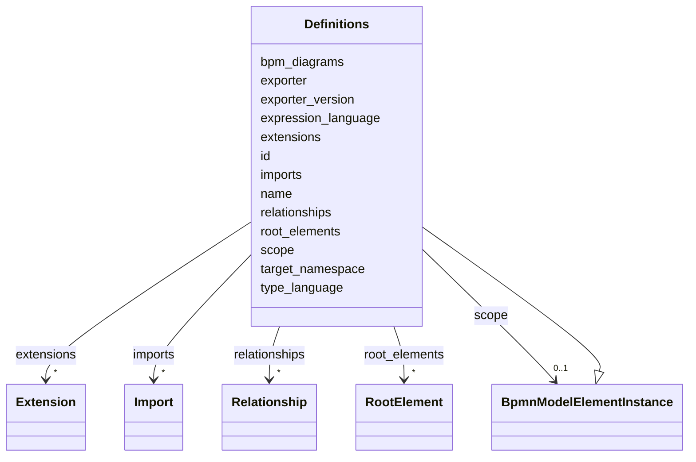

---
search:
  boost: 10.0
---

# Class: Definitions 


_The BPMN definitions element_


<div data-search-exclude markdown="1">


URI: [fluxnova_bpm_platform:Definitions](https://w3id.org/TD-Universe/fluxnova-bpm-platform/Definitions)





## Inheritance
* [BpmnModelElementInstance](BpmnModelElementInstance.md)
    * **Definitions**


## Slots

| Name | Cardinality and Range | Description | Inheritance |
| ---  | --- | --- | --- |
| [id](id.md) | 1 <br/> [String](String.md) | Unique identifier | direct |
| [name](name.md) | 0..1 <br/> [String](String.md) | Human-readable name | direct |
| [target_namespace](target_namespace.md) | 0..1 <br/> [String](String.md) | Namespace URI for elements defined in this document | direct |
| [expression_language](expression_language.md) | 0..1 <br/> [String](String.md) | Default expression language used in this definitions element | direct |
| [type_language](type_language.md) | 0..1 <br/> [String](String.md) | Default type language used for item definitions | direct |
| [exporter](exporter.md) | 0..1 <br/> [String](String.md) | Name of the tool that exported this BPMN document | direct |
| [exporter_version](exporter_version.md) | 0..1 <br/> [String](String.md) | Version of the exporting tool | direct |
| [imports](imports.md) | * <br/> [Import](Import.md) | Import declarations referencing external definitions | direct |
| [extensions](extensions.md) | * <br/> [Extension](Extension.md) | Extension elements attached to this definitions element | direct |
| [root_elements](root_elements.md) | * <br/> [RootElement](RootElement.md) | Top-level elements (processes, messages, signals, etc | direct |
| [bpm_diagrams](bpm_diagrams.md) | * <br/> [String](String.md) | BPMN diagram elements (BPMNDiagram) in the root definitions | direct |
| [relationships](relationships.md) | * <br/> [Relationship](Relationship.md) | Informal relationships between elements in this model | direct |
| [scope](scope.md) | 0..1 <br/> [BpmnModelElementInstance](BpmnModelElementInstance.md) | Tests if the element is a scope like process or sub-process | [BpmnModelElementInstance](BpmnModelElementInstance.md) |


## Usages

| used by | used in | type | used |
| ---  | --- | --- | --- |
| [BpmnModelInstance](BpmnModelInstance.md) | [definitions](definitions.md) | range | [Definitions](Definitions.md) |


## In Subsets


* [Instance](Instance.md)
* [FluxnovaBpmnModel](FluxnovaBpmnModel.md)


## Identifier and Mapping Information


### Annotations

| property | value |
| --- | --- |
| java_package | org.finos.fluxnova.bpm.model.bpmn.instance |
| source_file | model-api/bpmn-model/src/main/java/org/finos/fluxnova/bpm/model/bpmn/instance/Definitions.java |


### Schema Source


* from schema: https://w3id.org/TD-Universe/fluxnova-bpm-platform


## Mappings

| Mapping Type | Mapped Value |
| ---  | ---  |
| self | fluxnova_bpm_platform:Definitions |
| native | fluxnova_bpm_platform:Definitions |


## LinkML Source

<!-- TODO: investigate https://stackoverflow.com/questions/37606292/how-to-create-tabbed-code-blocks-in-mkdocs-or-sphinx -->

### Direct

<details>
```yaml
name: Definitions
annotations:
  java_package:
    tag: java_package
    value: org.finos.fluxnova.bpm.model.bpmn.instance
  source_file:
    tag: source_file
    value: model-api/bpmn-model/src/main/java/org/finos/fluxnova/bpm/model/bpmn/instance/Definitions.java
description: The BPMN definitions element
in_subset:
- instance
- fluxnova_bpmn_model
from_schema: https://w3id.org/TD-Universe/fluxnova-bpm-platform
is_a: BpmnModelElementInstance
slots:
- id
- name
- target_namespace
- expression_language
- type_language
- exporter
- exporter_version
- imports
- extensions
- root_elements
- bpm_diagrams
- relationships

```
</details>

### Induced

<details>
```yaml
name: Definitions
annotations:
  java_package:
    tag: java_package
    value: org.finos.fluxnova.bpm.model.bpmn.instance
  source_file:
    tag: source_file
    value: model-api/bpmn-model/src/main/java/org/finos/fluxnova/bpm/model/bpmn/instance/Definitions.java
description: The BPMN definitions element
in_subset:
- instance
- fluxnova_bpmn_model
from_schema: https://w3id.org/TD-Universe/fluxnova-bpm-platform
is_a: BpmnModelElementInstance
attributes:
  id:
    name: id
    description: Unique identifier.
    from_schema: https://w3id.org/TD-Universe/fluxnova-bpm-platform
    rank: 1000
    slot_uri: schema:identifier
    identifier: true
    owner: Definitions
    domain_of:
    - ByteArray
    - MeterLog
    - SchemaLogEntry
    - TaskMeterLog
    - Authorization
    - Group
    - IdentityInfo
    - IdentityLink
    - Tenant
    - TenantMembership
    - User
    - CaseExecution
    - CaseSentryPart
    - EventSubscription
    - Execution
    - ExternalTask
    - Incident
    - Task
    - VariableInstance
    - Attachment
    - Comment
    - Filter
    - Deployment
    - ResourceDefinition
    - Batch
    - Job
    - JobDefinition
    - HistoricBatch
    - HistoricDecisionInputInstance
    - HistoricDecisionInstance
    - HistoricDecisionOutputInstance
    - HistoricDetail
    - HistoricExternalTaskLog
    - HistoricIdentityLink
    - HistoricIncident
    - HistoricJobLog
    - HistoricScopeInstance
    - HistoricVariableInstance
    - UserOperationLogEntry
    - Diagram
    - DiagramElement
    - Style
    - BaseElement
    - Definitions
    - Documentation
    - InteractionNode
    range: string
    required: true
  name:
    name: name
    description: Human-readable name.
    from_schema: https://w3id.org/TD-Universe/fluxnova-bpm-platform
    rank: 1000
    slot_uri: schema:name
    owner: Definitions
    domain_of:
    - ByteArray
    - MeterLog
    - Property
    - Group
    - Tenant
    - Task
    - VariableInstance
    - Attachment
    - Filter
    - Deployment
    - ResourceDefinition
    - HistoricDetail
    - HistoricTaskInstance
    - HistoricVariableInstance
    - Font
    - Diagram
    - CallableElement
    - Category
    - Collaboration
    - ConversationLink
    - ConversationNode
    - CorrelationKey
    - CorrelationProperty
    - DataInput
    - DataOutput
    - DataState
    - DataStore
    - Definitions
    - Error
    - Escalation
    - FlowElement
    - InputSet
    - Interface
    - Lane
    - LaneSet
    - LinkEventDefinition
    - Message
    - MessageFlow
    - Operation
    - OutputSet
    - Participant
    - BpmnProperty
    - Resource
    - ResourceParameter
    - ResourceRole
    - Signal
    range: string
  target_namespace:
    name: target_namespace
    description: Namespace URI for elements defined in this document.
    from_schema: https://w3id.org/TD-Universe/fluxnova-bpm-platform
    rank: 1000
    owner: Definitions
    domain_of:
    - Definitions
    range: string
  expression_language:
    name: expression_language
    description: Default expression language used in this definitions element.
    from_schema: https://w3id.org/TD-Universe/fluxnova-bpm-platform
    rank: 1000
    owner: Definitions
    domain_of:
    - Definitions
    range: string
  type_language:
    name: type_language
    description: Default type language used for item definitions.
    from_schema: https://w3id.org/TD-Universe/fluxnova-bpm-platform
    rank: 1000
    owner: Definitions
    domain_of:
    - Definitions
    range: string
  exporter:
    name: exporter
    description: Name of the tool that exported this BPMN document.
    from_schema: https://w3id.org/TD-Universe/fluxnova-bpm-platform
    rank: 1000
    owner: Definitions
    domain_of:
    - Definitions
    range: string
  exporter_version:
    name: exporter_version
    description: Version of the exporting tool.
    from_schema: https://w3id.org/TD-Universe/fluxnova-bpm-platform
    rank: 1000
    owner: Definitions
    domain_of:
    - Definitions
    range: string
  imports:
    name: imports
    description: Import declarations referencing external definitions.
    from_schema: https://w3id.org/TD-Universe/fluxnova-bpm-platform
    rank: 1000
    owner: Definitions
    domain_of:
    - Definitions
    range: Import
    multivalued: true
    inlined: true
    inlined_as_list: true
  extensions:
    name: extensions
    description: Extension elements attached to this definitions element.
    from_schema: https://w3id.org/TD-Universe/fluxnova-bpm-platform
    rank: 1000
    owner: Definitions
    domain_of:
    - Definitions
    range: Extension
    multivalued: true
    inlined: true
    inlined_as_list: true
  root_elements:
    name: root_elements
    description: Top-level elements (processes, messages, signals, etc.) in this definitions.
    from_schema: https://w3id.org/TD-Universe/fluxnova-bpm-platform
    rank: 1000
    owner: Definitions
    domain_of:
    - Definitions
    range: RootElement
    multivalued: true
    inlined: true
    inlined_as_list: true
  bpm_diagrams:
    name: bpm_diagrams
    description: BPMN diagram elements (BPMNDiagram) in the root definitions.
    from_schema: https://w3id.org/TD-Universe/fluxnova-bpm-platform
    rank: 1000
    owner: Definitions
    domain_of:
    - Definitions
    range: string
    multivalued: true
  relationships:
    name: relationships
    description: Informal relationships between elements in this model.
    from_schema: https://w3id.org/TD-Universe/fluxnova-bpm-platform
    rank: 1000
    owner: Definitions
    domain_of:
    - Definitions
    range: Relationship
    multivalued: true
    inlined: true
    inlined_as_list: true
  scope:
    name: scope
    description: Tests if the element is a scope like process or sub-process.
    from_schema: https://w3id.org/TD-Universe/fluxnova-bpm-platform
    rank: 1000
    owner: Definitions
    domain_of:
    - BpmnModelElementInstance
    range: BpmnModelElementInstance

```
</details></div>