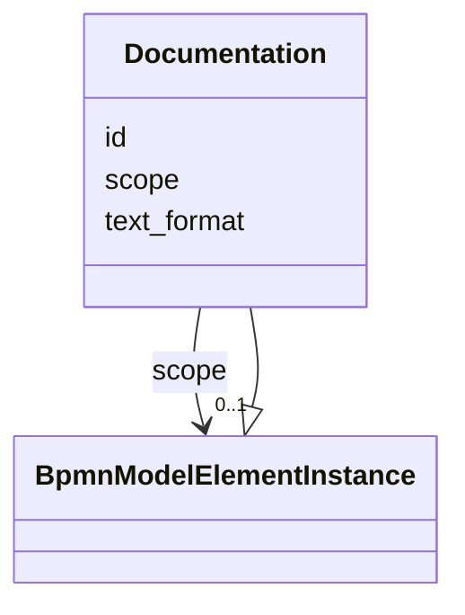

---
search:
  boost: 10.0
---

# Class: Documentation 


_The BPMN documentation element_


<div data-search-exclude markdown="1">


URI: [fluxnova_bpm_platform:Documentation](https://w3id.org/TD-Universe/fluxnova-bpm-platform/Documentation)





## Inheritance
* [BpmnModelElementInstance](BpmnModelElementInstance.md)
    * **Documentation**


## Slots

| Name | Cardinality and Range | Description | Inheritance |
| ---  | --- | --- | --- |
| [id](id.md) | 1 <br/> [String](String.md) | Unique identifier | direct |
| [text_format](text_format.md) | 0..1 <br/> [String](String.md) | MIME type or format of the documentation text | direct |
| [scope](scope.md) | 0..1 <br/> [BpmnModelElementInstance](BpmnModelElementInstance.md) | Tests if the element is a scope like process or sub-process | [BpmnModelElementInstance](BpmnModelElementInstance.md) |


## Usages

| used by | used in | type | used |
| ---  | --- | --- | --- |
| [ActivationCondition](ActivationCondition.md) | [documentations](documentations.md) | range | [Documentation](Documentation.md) |
| [Activity](Activity.md) | [documentations](documentations.md) | range | [Documentation](Documentation.md) |
| [Artifact](Artifact.md) | [documentations](documentations.md) | range | [Documentation](Documentation.md) |
| [Assignment](Assignment.md) | [documentations](documentations.md) | range | [Documentation](Documentation.md) |
| [Association](Association.md) | [documentations](documentations.md) | range | [Documentation](Documentation.md) |
| [Auditing](Auditing.md) | [documentations](documentations.md) | range | [Documentation](Documentation.md) |
| [BaseElement](BaseElement.md) | [documentations](documentations.md) | range | [Documentation](Documentation.md) |
| [BoundaryEvent](BoundaryEvent.md) | [documentations](documentations.md) | range | [Documentation](Documentation.md) |
| [BusinessRuleTask](BusinessRuleTask.md) | [documentations](documentations.md) | range | [Documentation](Documentation.md) |
| [CallActivity](CallActivity.md) | [documentations](documentations.md) | range | [Documentation](Documentation.md) |
| [CallConversation](CallConversation.md) | [documentations](documentations.md) | range | [Documentation](Documentation.md) |
| [CallableElement](CallableElement.md) | [documentations](documentations.md) | range | [Documentation](Documentation.md) |
| [CancelEventDefinition](CancelEventDefinition.md) | [documentations](documentations.md) | range | [Documentation](Documentation.md) |
| [CatchEvent](CatchEvent.md) | [documentations](documentations.md) | range | [Documentation](Documentation.md) |
| [Category](Category.md) | [documentations](documentations.md) | range | [Documentation](Documentation.md) |
| [CategoryValue](CategoryValue.md) | [documentations](documentations.md) | range | [Documentation](Documentation.md) |
| [Collaboration](Collaboration.md) | [documentations](documentations.md) | range | [Documentation](Documentation.md) |
| [CompensateEventDefinition](CompensateEventDefinition.md) | [documentations](documentations.md) | range | [Documentation](Documentation.md) |
| [CompletionCondition](CompletionCondition.md) | [documentations](documentations.md) | range | [Documentation](Documentation.md) |
| [ComplexBehaviorDefinition](ComplexBehaviorDefinition.md) | [documentations](documentations.md) | range | [Documentation](Documentation.md) |
| [ComplexGateway](ComplexGateway.md) | [documentations](documentations.md) | range | [Documentation](Documentation.md) |
| [Condition](Condition.md) | [documentations](documentations.md) | range | [Documentation](Documentation.md) |
| [ConditionExpression](ConditionExpression.md) | [documentations](documentations.md) | range | [Documentation](Documentation.md) |
| [ConditionalEventDefinition](ConditionalEventDefinition.md) | [documentations](documentations.md) | range | [Documentation](Documentation.md) |
| [Conversation](Conversation.md) | [documentations](documentations.md) | range | [Documentation](Documentation.md) |
| [ConversationAssociation](ConversationAssociation.md) | [documentations](documentations.md) | range | [Documentation](Documentation.md) |
| [ConversationLink](ConversationLink.md) | [documentations](documentations.md) | range | [Documentation](Documentation.md) |
| [ConversationNode](ConversationNode.md) | [documentations](documentations.md) | range | [Documentation](Documentation.md) |
| [CorrelationKey](CorrelationKey.md) | [documentations](documentations.md) | range | [Documentation](Documentation.md) |
| [CorrelationProperty](CorrelationProperty.md) | [documentations](documentations.md) | range | [Documentation](Documentation.md) |
| [CorrelationPropertyBinding](CorrelationPropertyBinding.md) | [documentations](documentations.md) | range | [Documentation](Documentation.md) |
| [CorrelationPropertyRetrievalExpression](CorrelationPropertyRetrievalExpression.md) | [documentations](documentations.md) | range | [Documentation](Documentation.md) |
| [CorrelationSubscription](CorrelationSubscription.md) | [documentations](documentations.md) | range | [Documentation](Documentation.md) |
| [DataAssociation](DataAssociation.md) | [documentations](documentations.md) | range | [Documentation](Documentation.md) |
| [DataInput](DataInput.md) | [documentations](documentations.md) | range | [Documentation](Documentation.md) |
| [DataInputAssociation](DataInputAssociation.md) | [documentations](documentations.md) | range | [Documentation](Documentation.md) |
| [DataObject](DataObject.md) | [documentations](documentations.md) | range | [Documentation](Documentation.md) |
| [DataObjectReference](DataObjectReference.md) | [documentations](documentations.md) | range | [Documentation](Documentation.md) |
| [DataOutput](DataOutput.md) | [documentations](documentations.md) | range | [Documentation](Documentation.md) |
| [DataOutputAssociation](DataOutputAssociation.md) | [documentations](documentations.md) | range | [Documentation](Documentation.md) |
| [DataState](DataState.md) | [documentations](documentations.md) | range | [Documentation](Documentation.md) |
| [DataStore](DataStore.md) | [documentations](documentations.md) | range | [Documentation](Documentation.md) |
| [DataStoreReference](DataStoreReference.md) | [documentations](documentations.md) | range | [Documentation](Documentation.md) |
| [EndEvent](EndEvent.md) | [documentations](documentations.md) | range | [Documentation](Documentation.md) |
| [EndPoint](EndPoint.md) | [documentations](documentations.md) | range | [Documentation](Documentation.md) |
| [Error](Error.md) | [documentations](documentations.md) | range | [Documentation](Documentation.md) |
| [ErrorEventDefinition](ErrorEventDefinition.md) | [documentations](documentations.md) | range | [Documentation](Documentation.md) |
| [Escalation](Escalation.md) | [documentations](documentations.md) | range | [Documentation](Documentation.md) |
| [EscalationEventDefinition](EscalationEventDefinition.md) | [documentations](documentations.md) | range | [Documentation](Documentation.md) |
| [Event](Event.md) | [documentations](documentations.md) | range | [Documentation](Documentation.md) |
| [EventBasedGateway](EventBasedGateway.md) | [documentations](documentations.md) | range | [Documentation](Documentation.md) |
| [EventDefinition](EventDefinition.md) | [documentations](documentations.md) | range | [Documentation](Documentation.md) |
| [ExclusiveGateway](ExclusiveGateway.md) | [documentations](documentations.md) | range | [Documentation](Documentation.md) |
| [Expression](Expression.md) | [documentations](documentations.md) | range | [Documentation](Documentation.md) |
| [FlowElement](FlowElement.md) | [documentations](documentations.md) | range | [Documentation](Documentation.md) |
| [FlowNode](FlowNode.md) | [documentations](documentations.md) | range | [Documentation](Documentation.md) |
| [FormalExpression](FormalExpression.md) | [documentations](documentations.md) | range | [Documentation](Documentation.md) |
| [Gateway](Gateway.md) | [documentations](documentations.md) | range | [Documentation](Documentation.md) |
| [GlobalConversation](GlobalConversation.md) | [documentations](documentations.md) | range | [Documentation](Documentation.md) |
| [BpmnGroup](BpmnGroup.md) | [documentations](documentations.md) | range | [Documentation](Documentation.md) |
| [HumanPerformer](HumanPerformer.md) | [documentations](documentations.md) | range | [Documentation](Documentation.md) |
| [InclusiveGateway](InclusiveGateway.md) | [documentations](documentations.md) | range | [Documentation](Documentation.md) |
| [InputDataItem](InputDataItem.md) | [documentations](documentations.md) | range | [Documentation](Documentation.md) |
| [InputSet](InputSet.md) | [documentations](documentations.md) | range | [Documentation](Documentation.md) |
| [Interface](Interface.md) | [documentations](documentations.md) | range | [Documentation](Documentation.md) |
| [IntermediateCatchEvent](IntermediateCatchEvent.md) | [documentations](documentations.md) | range | [Documentation](Documentation.md) |
| [IntermediateThrowEvent](IntermediateThrowEvent.md) | [documentations](documentations.md) | range | [Documentation](Documentation.md) |
| [IoBinding](IoBinding.md) | [documentations](documentations.md) | range | [Documentation](Documentation.md) |
| [IoSpecification](IoSpecification.md) | [documentations](documentations.md) | range | [Documentation](Documentation.md) |
| [ItemAwareElement](ItemAwareElement.md) | [documentations](documentations.md) | range | [Documentation](Documentation.md) |
| [ItemDefinition](ItemDefinition.md) | [documentations](documentations.md) | range | [Documentation](Documentation.md) |
| [Lane](Lane.md) | [documentations](documentations.md) | range | [Documentation](Documentation.md) |
| [LaneSet](LaneSet.md) | [documentations](documentations.md) | range | [Documentation](Documentation.md) |
| [LinkEventDefinition](LinkEventDefinition.md) | [documentations](documentations.md) | range | [Documentation](Documentation.md) |
| [LoopCardinality](LoopCardinality.md) | [documentations](documentations.md) | range | [Documentation](Documentation.md) |
| [LoopCharacteristics](LoopCharacteristics.md) | [documentations](documentations.md) | range | [Documentation](Documentation.md) |
| [ManualTask](ManualTask.md) | [documentations](documentations.md) | range | [Documentation](Documentation.md) |
| [Message](Message.md) | [documentations](documentations.md) | range | [Documentation](Documentation.md) |
| [MessageEventDefinition](MessageEventDefinition.md) | [documentations](documentations.md) | range | [Documentation](Documentation.md) |
| [MessageFlow](MessageFlow.md) | [documentations](documentations.md) | range | [Documentation](Documentation.md) |
| [MessageFlowAssociation](MessageFlowAssociation.md) | [documentations](documentations.md) | range | [Documentation](Documentation.md) |
| [Monitoring](Monitoring.md) | [documentations](documentations.md) | range | [Documentation](Documentation.md) |
| [MultiInstanceLoopCharacteristics](MultiInstanceLoopCharacteristics.md) | [documentations](documentations.md) | range | [Documentation](Documentation.md) |
| [Operation](Operation.md) | [documentations](documentations.md) | range | [Documentation](Documentation.md) |
| [OutputDataItem](OutputDataItem.md) | [documentations](documentations.md) | range | [Documentation](Documentation.md) |
| [OutputSet](OutputSet.md) | [documentations](documentations.md) | range | [Documentation](Documentation.md) |
| [ParallelGateway](ParallelGateway.md) | [documentations](documentations.md) | range | [Documentation](Documentation.md) |
| [Participant](Participant.md) | [documentations](documentations.md) | range | [Documentation](Documentation.md) |
| [ParticipantAssociation](ParticipantAssociation.md) | [documentations](documentations.md) | range | [Documentation](Documentation.md) |
| [ParticipantMultiplicity](ParticipantMultiplicity.md) | [documentations](documentations.md) | range | [Documentation](Documentation.md) |
| [Performer](Performer.md) | [documentations](documentations.md) | range | [Documentation](Documentation.md) |
| [PotentialOwner](PotentialOwner.md) | [documentations](documentations.md) | range | [Documentation](Documentation.md) |
| [Process](Process.md) | [documentations](documentations.md) | range | [Documentation](Documentation.md) |
| [BpmnProperty](BpmnProperty.md) | [documentations](documentations.md) | range | [Documentation](Documentation.md) |
| [ReceiveTask](ReceiveTask.md) | [documentations](documentations.md) | range | [Documentation](Documentation.md) |
| [Relationship](Relationship.md) | [documentations](documentations.md) | range | [Documentation](Documentation.md) |
| [Rendering](Rendering.md) | [documentations](documentations.md) | range | [Documentation](Documentation.md) |
| [Resource](Resource.md) | [documentations](documentations.md) | range | [Documentation](Documentation.md) |
| [ResourceAssignmentExpression](ResourceAssignmentExpression.md) | [documentations](documentations.md) | range | [Documentation](Documentation.md) |
| [ResourceParameter](ResourceParameter.md) | [documentations](documentations.md) | range | [Documentation](Documentation.md) |
| [ResourceParameterBinding](ResourceParameterBinding.md) | [documentations](documentations.md) | range | [Documentation](Documentation.md) |
| [ResourceRole](ResourceRole.md) | [documentations](documentations.md) | range | [Documentation](Documentation.md) |
| [RootElement](RootElement.md) | [documentations](documentations.md) | range | [Documentation](Documentation.md) |
| [ScriptTask](ScriptTask.md) | [documentations](documentations.md) | range | [Documentation](Documentation.md) |
| [SendTask](SendTask.md) | [documentations](documentations.md) | range | [Documentation](Documentation.md) |
| [SequenceFlow](SequenceFlow.md) | [documentations](documentations.md) | range | [Documentation](Documentation.md) |
| [ServiceTask](ServiceTask.md) | [documentations](documentations.md) | range | [Documentation](Documentation.md) |
| [Signal](Signal.md) | [documentations](documentations.md) | range | [Documentation](Documentation.md) |
| [SignalEventDefinition](SignalEventDefinition.md) | [documentations](documentations.md) | range | [Documentation](Documentation.md) |
| [StartEvent](StartEvent.md) | [documentations](documentations.md) | range | [Documentation](Documentation.md) |
| [SubConversation](SubConversation.md) | [documentations](documentations.md) | range | [Documentation](Documentation.md) |
| [SubProcess](SubProcess.md) | [documentations](documentations.md) | range | [Documentation](Documentation.md) |
| [BpmnTask](BpmnTask.md) | [documentations](documentations.md) | range | [Documentation](Documentation.md) |
| [TerminateEventDefinition](TerminateEventDefinition.md) | [documentations](documentations.md) | range | [Documentation](Documentation.md) |
| [TextAnnotation](TextAnnotation.md) | [documentations](documentations.md) | range | [Documentation](Documentation.md) |
| [ThrowEvent](ThrowEvent.md) | [documentations](documentations.md) | range | [Documentation](Documentation.md) |
| [TimeCycle](TimeCycle.md) | [documentations](documentations.md) | range | [Documentation](Documentation.md) |
| [TimeDate](TimeDate.md) | [documentations](documentations.md) | range | [Documentation](Documentation.md) |
| [TimeDuration](TimeDuration.md) | [documentations](documentations.md) | range | [Documentation](Documentation.md) |
| [TimerEventDefinition](TimerEventDefinition.md) | [documentations](documentations.md) | range | [Documentation](Documentation.md) |
| [Transaction](Transaction.md) | [documentations](documentations.md) | range | [Documentation](Documentation.md) |
| [UserTask](UserTask.md) | [documentations](documentations.md) | range | [Documentation](Documentation.md) |
| [FluxnovaErrorEventDefinition](FluxnovaErrorEventDefinition.md) | [documentations](documentations.md) | range | [Documentation](Documentation.md) |


## In Subsets


* [Instance](Instance.md)
* [FluxnovaBpmnModel](FluxnovaBpmnModel.md)


## Identifier and Mapping Information


### Annotations

| property | value |
| --- | --- |
| java_package | org.finos.fluxnova.bpm.model.bpmn.instance |
| source_file | model-api/bpmn-model/src/main/java/org/finos/fluxnova/bpm/model/bpmn/instance/Documentation.java |


### Schema Source


* from schema: https://w3id.org/TD-Universe/fluxnova-bpm-platform


## Mappings

| Mapping Type | Mapped Value |
| ---  | ---  |
| self | fluxnova_bpm_platform:Documentation |
| native | fluxnova_bpm_platform:Documentation |


## LinkML Source

<!-- TODO: investigate https://stackoverflow.com/questions/37606292/how-to-create-tabbed-code-blocks-in-mkdocs-or-sphinx -->

### Direct

<details>
```yaml
name: Documentation
annotations:
  java_package:
    tag: java_package
    value: org.finos.fluxnova.bpm.model.bpmn.instance
  source_file:
    tag: source_file
    value: model-api/bpmn-model/src/main/java/org/finos/fluxnova/bpm/model/bpmn/instance/Documentation.java
description: The BPMN documentation element
in_subset:
- instance
- fluxnova_bpmn_model
from_schema: https://w3id.org/TD-Universe/fluxnova-bpm-platform
is_a: BpmnModelElementInstance
slots:
- id
- text_format

```
</details>

### Induced

<details>
```yaml
name: Documentation
annotations:
  java_package:
    tag: java_package
    value: org.finos.fluxnova.bpm.model.bpmn.instance
  source_file:
    tag: source_file
    value: model-api/bpmn-model/src/main/java/org/finos/fluxnova/bpm/model/bpmn/instance/Documentation.java
description: The BPMN documentation element
in_subset:
- instance
- fluxnova_bpmn_model
from_schema: https://w3id.org/TD-Universe/fluxnova-bpm-platform
is_a: BpmnModelElementInstance
attributes:
  id:
    name: id
    description: Unique identifier.
    from_schema: https://w3id.org/TD-Universe/fluxnova-bpm-platform
    rank: 1000
    slot_uri: schema:identifier
    identifier: true
    owner: Documentation
    domain_of:
    - ByteArray
    - MeterLog
    - SchemaLogEntry
    - TaskMeterLog
    - Authorization
    - Group
    - IdentityInfo
    - IdentityLink
    - Tenant
    - TenantMembership
    - User
    - CaseExecution
    - CaseSentryPart
    - EventSubscription
    - Execution
    - ExternalTask
    - Incident
    - Task
    - VariableInstance
    - Attachment
    - Comment
    - Filter
    - Deployment
    - ResourceDefinition
    - Batch
    - Job
    - JobDefinition
    - HistoricBatch
    - HistoricDecisionInputInstance
    - HistoricDecisionInstance
    - HistoricDecisionOutputInstance
    - HistoricDetail
    - HistoricExternalTaskLog
    - HistoricIdentityLink
    - HistoricIncident
    - HistoricJobLog
    - HistoricScopeInstance
    - HistoricVariableInstance
    - UserOperationLogEntry
    - Diagram
    - DiagramElement
    - Style
    - BaseElement
    - Definitions
    - Documentation
    - InteractionNode
    range: string
    required: true
  text_format:
    name: text_format
    description: MIME type or format of the documentation text.
    from_schema: https://w3id.org/TD-Universe/fluxnova-bpm-platform
    rank: 1000
    owner: Documentation
    domain_of:
    - Documentation
    - TextAnnotation
    range: string
  scope:
    name: scope
    description: Tests if the element is a scope like process or sub-process.
    from_schema: https://w3id.org/TD-Universe/fluxnova-bpm-platform
    rank: 1000
    owner: Documentation
    domain_of:
    - BpmnModelElementInstance
    range: BpmnModelElementInstance

```
</details></div>