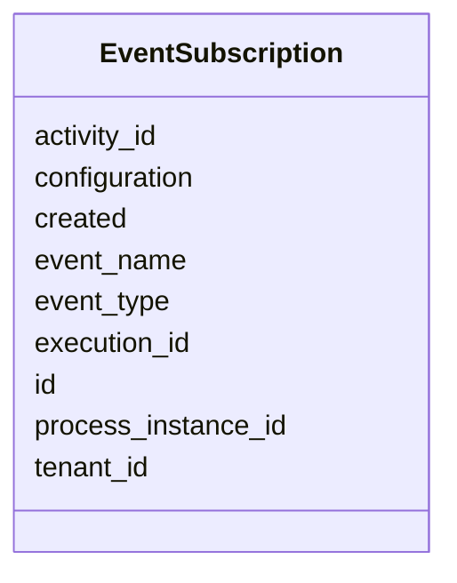

---
search:
  boost: 10.0
---

# Class: EventSubscription 


_A message event subscription exists, if an Execution waits for an event like a message._


<div data-search-exclude markdown="1">


URI: [fluxnova_bpm_platform:EventSubscription](https://w3id.org/TD-Universe/fluxnova-bpm-platform/EventSubscription)





<!-- no inheritance hierarchy -->

## Slots

| Name | Cardinality and Range | Description | Inheritance |
| ---  | --- | --- | --- |
| [id](id.md) | 1 <br/> [String](String.md) | Unique identifier | direct |
| [event_type](event_type.md) | 1 <br/> [String](String.md) | The event subscriptions type | direct |
| [event_name](event_name.md) | 0..1 <br/> [String](String.md) | The name of the event this subscription belongs to as defined in the process ... | direct |
| [execution_id](execution_id.md) | 0..1 <br/> [String](String.md) | Reference to the execution | direct |
| [process_instance_id](process_instance_id.md) | 0..1 <br/> [String](String.md) | Reference to the process instance | direct |
| [activity_id](activity_id.md) | 0..1 <br/> [String](String.md) | BPMN activity element identifier | direct |
| [configuration](configuration.md) | 0..1 <br/> [String](String.md) | Payload of this incident | direct |
| [created](created.md) | 1 <br/> [Datetime](Datetime.md) | The time this event subscription was created | direct |
| [tenant_id](tenant_id.md) | 0..1 <br/> [String](String.md) | Multi-tenancy discriminator | direct |


## In Subsets


* [Runtime](Runtime.md)
* [FluxnovaBpm](FluxnovaBpm.md)


## Identifier and Mapping Information


### Annotations

| property | value |
| --- | --- |
| sql_table | ACT_RU_EVENT_SUBSCR |


### Schema Source


* from schema: https://w3id.org/TD-Universe/fluxnova-bpm-platform


## Mappings

| Mapping Type | Mapped Value |
| ---  | ---  |
| self | fluxnova_bpm_platform:EventSubscription |
| native | fluxnova_bpm_platform:EventSubscription |


## LinkML Source

<!-- TODO: investigate https://stackoverflow.com/questions/37606292/how-to-create-tabbed-code-blocks-in-mkdocs-or-sphinx -->

### Direct

<details>
```yaml
name: EventSubscription
annotations:
  sql_table:
    tag: sql_table
    value: ACT_RU_EVENT_SUBSCR
description: A message event subscription exists, if an Execution waits for an event
  like a message.
in_subset:
- runtime
- fluxnova_bpm
from_schema: https://w3id.org/TD-Universe/fluxnova-bpm-platform
slots:
- id
- event_type
- event_name
- execution_id
- process_instance_id
- activity_id
- configuration
- created
- tenant_id

```
</details>

### Induced

<details>
```yaml
name: EventSubscription
annotations:
  sql_table:
    tag: sql_table
    value: ACT_RU_EVENT_SUBSCR
description: A message event subscription exists, if an Execution waits for an event
  like a message.
in_subset:
- runtime
- fluxnova_bpm
from_schema: https://w3id.org/TD-Universe/fluxnova-bpm-platform
attributes:
  id:
    name: id
    description: Unique identifier.
    from_schema: https://w3id.org/TD-Universe/fluxnova-bpm-platform
    rank: 1000
    slot_uri: schema:identifier
    identifier: true
    owner: EventSubscription
    domain_of:
    - ByteArray
    - MeterLog
    - SchemaLogEntry
    - TaskMeterLog
    - Authorization
    - Group
    - IdentityInfo
    - IdentityLink
    - Tenant
    - TenantMembership
    - User
    - CaseExecution
    - CaseSentryPart
    - EventSubscription
    - Execution
    - ExternalTask
    - Incident
    - Task
    - VariableInstance
    - Attachment
    - Comment
    - Filter
    - Deployment
    - ResourceDefinition
    - Batch
    - Job
    - JobDefinition
    - HistoricBatch
    - HistoricDecisionInputInstance
    - HistoricDecisionInstance
    - HistoricDecisionOutputInstance
    - HistoricDetail
    - HistoricExternalTaskLog
    - HistoricIdentityLink
    - HistoricIncident
    - HistoricJobLog
    - HistoricScopeInstance
    - HistoricVariableInstance
    - UserOperationLogEntry
    - Diagram
    - DiagramElement
    - Style
    - BaseElement
    - Definitions
    - Documentation
    - InteractionNode
    range: string
    required: true
  event_type:
    name: event_type
    annotations:
      sql_column:
        tag: sql_column
        value: EVENT_TYPE_
    description: The event subscriptions type. "message" identifies message event
      subscriptions, "signal" identifies signal event subscription, "compensation"
      identifies event subscriptions used for compensation ev...
    from_schema: https://w3id.org/TD-Universe/fluxnova-bpm-platform
    rank: 1000
    owner: EventSubscription
    domain_of:
    - EventSubscription
    range: string
    required: true
  event_name:
    name: event_name
    annotations:
      sql_column:
        tag: sql_column
        value: EVENT_NAME_
    description: The name of the event this subscription belongs to as defined in
      the process model.
    from_schema: https://w3id.org/TD-Universe/fluxnova-bpm-platform
    rank: 1000
    owner: EventSubscription
    domain_of:
    - EventSubscription
    range: string
  execution_id:
    name: execution_id
    description: Reference to the execution.
    from_schema: https://w3id.org/TD-Universe/fluxnova-bpm-platform
    rank: 1000
    owner: EventSubscription
    domain_of:
    - EventSubscription
    - ExternalTask
    - Incident
    - Task
    - VariableInstance
    - Job
    - HistoricActivityInstance
    - HistoricDetail
    - HistoricExternalTaskLog
    - HistoricIncident
    - HistoricJobLog
    - HistoricTaskInstance
    - HistoricVariableInstance
    - UserOperationLogEntry
    range: string
  process_instance_id:
    name: process_instance_id
    description: Reference to the process instance.
    from_schema: https://w3id.org/TD-Universe/fluxnova-bpm-platform
    rank: 1000
    owner: EventSubscription
    domain_of:
    - EventSubscription
    - Execution
    - ExternalTask
    - Incident
    - Task
    - VariableInstance
    - Attachment
    - Comment
    - Job
    - HistoricDecisionInstance
    - HistoricDetail
    - HistoricExternalTaskLog
    - HistoricIncident
    - HistoricJobLog
    - HistoricScopeInstance
    - HistoricVariableInstance
    - UserOperationLogEntry
    range: string
  activity_id:
    name: activity_id
    description: BPMN activity element identifier.
    from_schema: https://w3id.org/TD-Universe/fluxnova-bpm-platform
    rank: 1000
    owner: EventSubscription
    domain_of:
    - CaseExecution
    - EventSubscription
    - Execution
    - ExternalTask
    - Incident
    - JobDefinition
    - HistoricActivityInstance
    - HistoricDecisionInstance
    - HistoricExternalTaskLog
    - HistoricIncident
    - HistoricJobLog
    range: string
  configuration:
    name: configuration
    annotations:
      sql_column:
        tag: sql_column
        value: CONFIGURATION_
    description: Payload of this incident.
    from_schema: https://w3id.org/TD-Universe/fluxnova-bpm-platform
    rank: 1000
    owner: EventSubscription
    domain_of:
    - EventSubscription
    - Incident
    - Batch
    - HistoricIncident
    range: string
  created:
    name: created
    annotations:
      sql_column:
        tag: sql_column
        value: CREATED_
    description: The time this event subscription was created.
    from_schema: https://w3id.org/TD-Universe/fluxnova-bpm-platform
    rank: 1000
    owner: EventSubscription
    domain_of:
    - EventSubscription
    range: datetime
    required: true
  tenant_id:
    name: tenant_id
    description: Multi-tenancy discriminator.
    from_schema: https://w3id.org/TD-Universe/fluxnova-bpm-platform
    rank: 1000
    owner: EventSubscription
    domain_of:
    - ByteArray
    - IdentityLink
    - TenantMembership
    - CaseExecution
    - CaseSentryPart
    - EventSubscription
    - Execution
    - ExternalTask
    - Incident
    - Task
    - VariableInstance
    - Attachment
    - Comment
    - Deployment
    - ResourceDefinition
    - Batch
    - Job
    - JobDefinition
    - HistoricActivityInstance
    - HistoricBatch
    - HistoricCaseActivityInstance
    - HistoricCaseInstance
    - HistoricDecisionInputInstance
    - HistoricDecisionInstance
    - HistoricDecisionOutputInstance
    - HistoricDetail
    - HistoricExternalTaskLog
    - HistoricIdentityLink
    - HistoricIncident
    - HistoricJobLog
    - HistoricProcessInstance
    - HistoricTaskInstance
    - HistoricVariableInstance
    - UserOperationLogEntry
    range: string

```
</details></div>