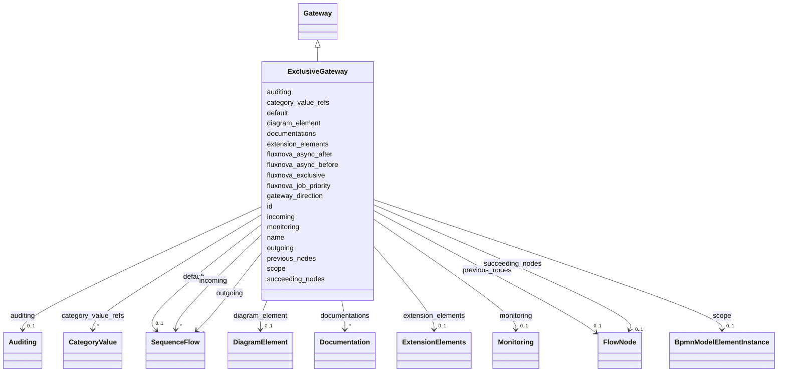

---
search:
  boost: 10.0
---

# Class: ExclusiveGateway 


_The BPMN exclusiveGateway element_


<div data-search-exclude markdown="1">


URI: [fluxnova_bpm_platform:ExclusiveGateway](https://w3id.org/TD-Universe/fluxnova-bpm-platform/ExclusiveGateway)





## Inheritance
* [BpmnModelElementInstance](BpmnModelElementInstance.md)
    * [BaseElement](BaseElement.md)
        * [FlowElement](FlowElement.md)
            * [FlowNode](FlowNode.md)
                * [Gateway](Gateway.md)
                    * **ExclusiveGateway**


## Slots

| Name | Cardinality and Range | Description | Inheritance |
| ---  | --- | --- | --- |
| [default](default.md) | 0..1 <br/> [SequenceFlow](SequenceFlow.md) | Default sequence flow taken when no other outgoing condition is satisfied | direct |
| [gateway_direction](gateway_direction.md) | 0..1 <br/> [String](String.md) | Convergence/divergence direction of token routing through this gateway | [Gateway](Gateway.md) |
| [incoming](incoming.md) | * <br/> [SequenceFlow](SequenceFlow.md) | Sequence flows entering this flow node | [FlowNode](FlowNode.md) |
| [outgoing](outgoing.md) | * <br/> [SequenceFlow](SequenceFlow.md) | Sequence flows leaving this flow node | [FlowNode](FlowNode.md) |
| [previous_nodes](previous_nodes.md) | 0..1 <br/> [FlowNode](FlowNode.md) | The previous nodes of this element | [FlowNode](FlowNode.md) |
| [succeeding_nodes](succeeding_nodes.md) | 0..1 <br/> [FlowNode](FlowNode.md) | The succeeding nodes of this element | [FlowNode](FlowNode.md) |
| [fluxnova_async_before](fluxnova_async_before.md) | 0..1 <br/> [Boolean](Boolean.md) | Whether this element is executed asynchronously before its start | [FlowNode](FlowNode.md) |
| [fluxnova_async_after](fluxnova_async_after.md) | 0..1 <br/> [Boolean](Boolean.md) | Whether this element is executed asynchronously after its end | [FlowNode](FlowNode.md) |
| [fluxnova_exclusive](fluxnova_exclusive.md) | 0..1 <br/> [Boolean](Boolean.md) | Whether this element participates in an exclusive job execution | [FlowNode](FlowNode.md) |
| [fluxnova_job_priority](fluxnova_job_priority.md) | 0..1 <br/> [String](String.md) | Priority assigned to async continuation jobs for this element | [FlowNode](FlowNode.md) |
| [name](name.md) | 0..1 <br/> [String](String.md) | Human-readable name | [FlowElement](FlowElement.md) |
| [auditing](auditing.md) | 0..1 <br/> [Auditing](Auditing.md) | Auditing information attached to this flow element | [FlowElement](FlowElement.md) |
| [monitoring](monitoring.md) | 0..1 <br/> [Monitoring](Monitoring.md) | Monitoring information attached to this flow element | [FlowElement](FlowElement.md) |
| [category_value_refs](category_value_refs.md) | * <br/> [CategoryValue](CategoryValue.md) | Category values associated with this flow element | [FlowElement](FlowElement.md) |
| [id](id.md) | 1 <br/> [String](String.md) | Unique identifier | [BaseElement](BaseElement.md) |
| [documentations](documentations.md) | * <br/> [Documentation](Documentation.md) | Collection of documentation elements associated with this element | [BaseElement](BaseElement.md) |
| [extension_elements](extension_elements.md) | 0..1 <br/> [ExtensionElements](ExtensionElements.md) | Extension elements holding vendor-specific metadata | [BaseElement](BaseElement.md) |
| [diagram_element](diagram_element.md) | 0..1 <br/> [DiagramElement](DiagramElement.md) | The diagram element that visually represents this BPMN element | [BaseElement](BaseElement.md) |
| [scope](scope.md) | 0..1 <br/> [BpmnModelElementInstance](BpmnModelElementInstance.md) | Tests if the element is a scope like process or sub-process | [BpmnModelElementInstance](BpmnModelElementInstance.md) |


## In Subsets


* [Instance](Instance.md)
* [FluxnovaBpmnModel](FluxnovaBpmnModel.md)


## Identifier and Mapping Information


### Annotations

| property | value |
| --- | --- |
| java_package | org.finos.fluxnova.bpm.model.bpmn.instance |
| source_file | model-api/bpmn-model/src/main/java/org/finos/fluxnova/bpm/model/bpmn/instance/ExclusiveGateway.java |


### Schema Source


* from schema: https://w3id.org/TD-Universe/fluxnova-bpm-platform


## Mappings

| Mapping Type | Mapped Value |
| ---  | ---  |
| self | fluxnova_bpm_platform:ExclusiveGateway |
| native | fluxnova_bpm_platform:ExclusiveGateway |


## LinkML Source

<!-- TODO: investigate https://stackoverflow.com/questions/37606292/how-to-create-tabbed-code-blocks-in-mkdocs-or-sphinx -->

### Direct

<details>
```yaml
name: ExclusiveGateway
annotations:
  java_package:
    tag: java_package
    value: org.finos.fluxnova.bpm.model.bpmn.instance
  source_file:
    tag: source_file
    value: model-api/bpmn-model/src/main/java/org/finos/fluxnova/bpm/model/bpmn/instance/ExclusiveGateway.java
description: The BPMN exclusiveGateway element
in_subset:
- instance
- fluxnova_bpmn_model
from_schema: https://w3id.org/TD-Universe/fluxnova-bpm-platform
is_a: Gateway
slots:
- default

```
</details>

### Induced

<details>
```yaml
name: ExclusiveGateway
annotations:
  java_package:
    tag: java_package
    value: org.finos.fluxnova.bpm.model.bpmn.instance
  source_file:
    tag: source_file
    value: model-api/bpmn-model/src/main/java/org/finos/fluxnova/bpm/model/bpmn/instance/ExclusiveGateway.java
description: The BPMN exclusiveGateway element
in_subset:
- instance
- fluxnova_bpmn_model
from_schema: https://w3id.org/TD-Universe/fluxnova-bpm-platform
is_a: Gateway
attributes:
  default:
    name: default
    description: Default sequence flow taken when no other outgoing condition is satisfied.
    from_schema: https://w3id.org/TD-Universe/fluxnova-bpm-platform
    rank: 1000
    owner: ExclusiveGateway
    domain_of:
    - Activity
    - ComplexGateway
    - ExclusiveGateway
    - InclusiveGateway
    range: SequenceFlow
  gateway_direction:
    name: gateway_direction
    description: Convergence/divergence direction of token routing through this gateway.
    from_schema: https://w3id.org/TD-Universe/fluxnova-bpm-platform
    rank: 1000
    owner: ExclusiveGateway
    domain_of:
    - Gateway
    range: string
  incoming:
    name: incoming
    description: Sequence flows entering this flow node.
    from_schema: https://w3id.org/TD-Universe/fluxnova-bpm-platform
    rank: 1000
    owner: ExclusiveGateway
    domain_of:
    - FlowNode
    range: SequenceFlow
    multivalued: true
    inlined: true
    inlined_as_list: true
  outgoing:
    name: outgoing
    description: Sequence flows leaving this flow node.
    from_schema: https://w3id.org/TD-Universe/fluxnova-bpm-platform
    rank: 1000
    owner: ExclusiveGateway
    domain_of:
    - FlowNode
    range: SequenceFlow
    multivalued: true
    inlined: true
    inlined_as_list: true
  previous_nodes:
    name: previous_nodes
    description: The previous nodes of this element.
    from_schema: https://w3id.org/TD-Universe/fluxnova-bpm-platform
    rank: 1000
    owner: ExclusiveGateway
    domain_of:
    - FlowNode
    range: FlowNode
  succeeding_nodes:
    name: succeeding_nodes
    description: The succeeding nodes of this element.
    from_schema: https://w3id.org/TD-Universe/fluxnova-bpm-platform
    rank: 1000
    owner: ExclusiveGateway
    domain_of:
    - FlowNode
    range: FlowNode
  fluxnova_async_before:
    name: fluxnova_async_before
    description: Whether this element is executed asynchronously before its start.
    from_schema: https://w3id.org/TD-Universe/fluxnova-bpm-platform
    rank: 1000
    owner: ExclusiveGateway
    domain_of:
    - FlowNode
    - MultiInstanceLoopCharacteristics
    range: boolean
  fluxnova_async_after:
    name: fluxnova_async_after
    description: Whether this element is executed asynchronously after its end.
    from_schema: https://w3id.org/TD-Universe/fluxnova-bpm-platform
    rank: 1000
    owner: ExclusiveGateway
    domain_of:
    - FlowNode
    - MultiInstanceLoopCharacteristics
    range: boolean
  fluxnova_exclusive:
    name: fluxnova_exclusive
    description: Whether this element participates in an exclusive job execution.
    from_schema: https://w3id.org/TD-Universe/fluxnova-bpm-platform
    rank: 1000
    owner: ExclusiveGateway
    domain_of:
    - FlowNode
    - MultiInstanceLoopCharacteristics
    range: boolean
  fluxnova_job_priority:
    name: fluxnova_job_priority
    description: Priority assigned to async continuation jobs for this element.
    from_schema: https://w3id.org/TD-Universe/fluxnova-bpm-platform
    rank: 1000
    owner: ExclusiveGateway
    domain_of:
    - FlowNode
    - Process
    range: string
  name:
    name: name
    description: Human-readable name.
    from_schema: https://w3id.org/TD-Universe/fluxnova-bpm-platform
    rank: 1000
    slot_uri: schema:name
    owner: ExclusiveGateway
    domain_of:
    - ByteArray
    - MeterLog
    - Property
    - Group
    - Tenant
    - Task
    - VariableInstance
    - Attachment
    - Filter
    - Deployment
    - ResourceDefinition
    - HistoricDetail
    - HistoricTaskInstance
    - HistoricVariableInstance
    - Font
    - Diagram
    - CallableElement
    - Category
    - Collaboration
    - ConversationLink
    - ConversationNode
    - CorrelationKey
    - CorrelationProperty
    - DataInput
    - DataOutput
    - DataState
    - DataStore
    - Definitions
    - Error
    - Escalation
    - FlowElement
    - InputSet
    - Interface
    - Lane
    - LaneSet
    - LinkEventDefinition
    - Message
    - MessageFlow
    - Operation
    - OutputSet
    - Participant
    - BpmnProperty
    - Resource
    - ResourceParameter
    - ResourceRole
    - Signal
    range: string
  auditing:
    name: auditing
    description: Auditing information attached to this flow element.
    from_schema: https://w3id.org/TD-Universe/fluxnova-bpm-platform
    rank: 1000
    owner: ExclusiveGateway
    domain_of:
    - FlowElement
    - Process
    range: Auditing
  monitoring:
    name: monitoring
    description: Monitoring information attached to this flow element.
    from_schema: https://w3id.org/TD-Universe/fluxnova-bpm-platform
    rank: 1000
    owner: ExclusiveGateway
    domain_of:
    - FlowElement
    - Process
    range: Monitoring
  category_value_refs:
    name: category_value_refs
    description: Category values associated with this flow element.
    from_schema: https://w3id.org/TD-Universe/fluxnova-bpm-platform
    rank: 1000
    owner: ExclusiveGateway
    domain_of:
    - FlowElement
    range: CategoryValue
    multivalued: true
    inlined: true
    inlined_as_list: true
  id:
    name: id
    description: Unique identifier.
    from_schema: https://w3id.org/TD-Universe/fluxnova-bpm-platform
    rank: 1000
    slot_uri: schema:identifier
    identifier: true
    owner: ExclusiveGateway
    domain_of:
    - ByteArray
    - MeterLog
    - SchemaLogEntry
    - TaskMeterLog
    - Authorization
    - Group
    - IdentityInfo
    - IdentityLink
    - Tenant
    - TenantMembership
    - User
    - CaseExecution
    - CaseSentryPart
    - EventSubscription
    - Execution
    - ExternalTask
    - Incident
    - Task
    - VariableInstance
    - Attachment
    - Comment
    - Filter
    - Deployment
    - ResourceDefinition
    - Batch
    - Job
    - JobDefinition
    - HistoricBatch
    - HistoricDecisionInputInstance
    - HistoricDecisionInstance
    - HistoricDecisionOutputInstance
    - HistoricDetail
    - HistoricExternalTaskLog
    - HistoricIdentityLink
    - HistoricIncident
    - HistoricJobLog
    - HistoricScopeInstance
    - HistoricVariableInstance
    - UserOperationLogEntry
    - Diagram
    - DiagramElement
    - Style
    - BaseElement
    - Definitions
    - Documentation
    - InteractionNode
    range: string
    required: true
  documentations:
    name: documentations
    description: Collection of documentation elements associated with this element.
    from_schema: https://w3id.org/TD-Universe/fluxnova-bpm-platform
    rank: 1000
    owner: ExclusiveGateway
    domain_of:
    - BaseElement
    range: Documentation
    multivalued: true
    inlined: true
    inlined_as_list: true
  extension_elements:
    name: extension_elements
    description: Extension elements holding vendor-specific metadata.
    from_schema: https://w3id.org/TD-Universe/fluxnova-bpm-platform
    rank: 1000
    owner: ExclusiveGateway
    domain_of:
    - BaseElement
    range: ExtensionElements
  diagram_element:
    name: diagram_element
    description: The diagram element that visually represents this BPMN element.
    from_schema: https://w3id.org/TD-Universe/fluxnova-bpm-platform
    rank: 1000
    owner: ExclusiveGateway
    domain_of:
    - BaseElement
    range: DiagramElement
  scope:
    name: scope
    description: Tests if the element is a scope like process or sub-process.
    from_schema: https://w3id.org/TD-Universe/fluxnova-bpm-platform
    rank: 1000
    owner: ExclusiveGateway
    domain_of:
    - BpmnModelElementInstance
    range: BpmnModelElementInstance

```
</details></div>