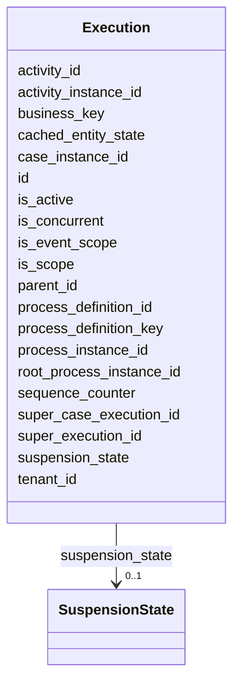

---
search:
  boost: 10.0
---

# Class: Execution 


_Represent a 'path of execution' in a process instance. Note that a ProcessInstance also is an execution._


<div data-search-exclude markdown="1">


URI: [fluxnova_bpm_platform:Execution](https://w3id.org/TD-Universe/fluxnova-bpm-platform/Execution)





<!-- no inheritance hierarchy -->

## Slots

| Name | Cardinality and Range | Description | Inheritance |
| ---  | --- | --- | --- |
| [id](id.md) | 1 <br/> [String](String.md) | Unique identifier | direct |
| [root_process_instance_id](root_process_instance_id.md) | 0..1 <br/> [String](String.md) | Root process instance for history cleanup | direct |
| [process_instance_id](process_instance_id.md) | 0..1 <br/> [String](String.md) | Reference to the process instance | direct |
| [business_key](business_key.md) | 0..1 <br/> [String](String.md) | Domain-specific business key | direct |
| [parent_id](parent_id.md) | 0..1 <br/> [String](String.md) | Reference to a CaseExecution | direct |
| [process_definition_id](process_definition_id.md) | 0..1 <br/> [String](String.md) | Reference to the process definition | direct |
| [super_execution_id](super_execution_id.md) | 0..1 <br/> [String](String.md) | Reference to the super execution | direct |
| [super_case_execution_id](super_case_execution_id.md) | 0..1 <br/> [String](String.md) | Reference to the super case execution | direct |
| [case_instance_id](case_instance_id.md) | 0..1 <br/> [String](String.md) | Reference to the case instance | direct |
| [activity_instance_id](activity_instance_id.md) | 0..1 <br/> [String](String.md) | Runtime activity instance identifier | direct |
| [activity_id](activity_id.md) | 0..1 <br/> [String](String.md) | BPMN activity element identifier | direct |
| [is_active](is_active.md) | 0..1 <br/> [Boolean](Boolean.md) | Whether this entity is active | direct |
| [is_concurrent](is_concurrent.md) | 0..1 <br/> [Boolean](Boolean.md) | Whether this entity is concurrent | direct |
| [is_scope](is_scope.md) | 0..1 <br/> [Boolean](Boolean.md) | Whether this entity is scope | direct |
| [is_event_scope](is_event_scope.md) | 0..1 <br/> [Boolean](Boolean.md) | Whether this entity is event scope | direct |
| [suspension_state](suspension_state.md) | 0..1 <br/> [SuspensionState](SuspensionState.md) | Whether the entity is active or suspended | direct |
| [cached_entity_state](cached_entity_state.md) | 0..1 <br/> [Integer](Integer.md) | Bitmask caching associated entity existence | direct |
| [sequence_counter](sequence_counter.md) | 0..1 <br/> [Integer](Integer.md) | Monotonically increasing counter for ordering | direct |
| [tenant_id](tenant_id.md) | 0..1 <br/> [String](String.md) | Multi-tenancy discriminator | direct |
| [process_definition_key](process_definition_key.md) | 0..1 <br/> [String](String.md) | Key of the process definition | direct |


## Usages

| used by | used in | type | used |
| ---  | --- | --- | --- |
| [FluxnovaPlatformData](FluxnovaPlatformData.md) | [executions](executions.md) | range | [Execution](Execution.md) |


## In Subsets


* [Runtime](Runtime.md)
* [FluxnovaBpm](FluxnovaBpm.md)


## Identifier and Mapping Information


### Annotations

| property | value |
| --- | --- |
| sql_table | ACT_RU_EXECUTION |


### Schema Source


* from schema: https://w3id.org/TD-Universe/fluxnova-bpm-platform


## Mappings

| Mapping Type | Mapped Value |
| ---  | ---  |
| self | fluxnova_bpm_platform:Execution |
| native | fluxnova_bpm_platform:Execution |


## LinkML Source

<!-- TODO: investigate https://stackoverflow.com/questions/37606292/how-to-create-tabbed-code-blocks-in-mkdocs-or-sphinx -->

### Direct

<details>
```yaml
name: Execution
annotations:
  sql_table:
    tag: sql_table
    value: ACT_RU_EXECUTION
description: Represent a 'path of execution' in a process instance. Note that a ProcessInstance
  also is an execution.
in_subset:
- runtime
- fluxnova_bpm
from_schema: https://w3id.org/TD-Universe/fluxnova-bpm-platform
slots:
- id
- root_process_instance_id
- process_instance_id
- business_key
- parent_id
- process_definition_id
- super_execution_id
- super_case_execution_id
- case_instance_id
- activity_instance_id
- activity_id
- is_active
- is_concurrent
- is_scope
- is_event_scope
- suspension_state
- cached_entity_state
- sequence_counter
- tenant_id
- process_definition_key

```
</details>

### Induced

<details>
```yaml
name: Execution
annotations:
  sql_table:
    tag: sql_table
    value: ACT_RU_EXECUTION
description: Represent a 'path of execution' in a process instance. Note that a ProcessInstance
  also is an execution.
in_subset:
- runtime
- fluxnova_bpm
from_schema: https://w3id.org/TD-Universe/fluxnova-bpm-platform
attributes:
  id:
    name: id
    description: Unique identifier.
    from_schema: https://w3id.org/TD-Universe/fluxnova-bpm-platform
    rank: 1000
    slot_uri: schema:identifier
    identifier: true
    owner: Execution
    domain_of:
    - ByteArray
    - MeterLog
    - SchemaLogEntry
    - TaskMeterLog
    - Authorization
    - Group
    - IdentityInfo
    - IdentityLink
    - Tenant
    - TenantMembership
    - User
    - CaseExecution
    - CaseSentryPart
    - EventSubscription
    - Execution
    - ExternalTask
    - Incident
    - Task
    - VariableInstance
    - Attachment
    - Comment
    - Filter
    - Deployment
    - ResourceDefinition
    - Batch
    - Job
    - JobDefinition
    - HistoricBatch
    - HistoricDecisionInputInstance
    - HistoricDecisionInstance
    - HistoricDecisionOutputInstance
    - HistoricDetail
    - HistoricExternalTaskLog
    - HistoricIdentityLink
    - HistoricIncident
    - HistoricJobLog
    - HistoricScopeInstance
    - HistoricVariableInstance
    - UserOperationLogEntry
    - Diagram
    - DiagramElement
    - Style
    - BaseElement
    - Definitions
    - Documentation
    - InteractionNode
    range: string
    required: true
  root_process_instance_id:
    name: root_process_instance_id
    description: Root process instance for history cleanup.
    from_schema: https://w3id.org/TD-Universe/fluxnova-bpm-platform
    rank: 1000
    owner: Execution
    domain_of:
    - ByteArray
    - Authorization
    - Execution
    - Attachment
    - Comment
    - Job
    - HistoricDecisionInputInstance
    - HistoricDecisionInstance
    - HistoricDecisionOutputInstance
    - HistoricDetail
    - HistoricExternalTaskLog
    - HistoricIdentityLink
    - HistoricIncident
    - HistoricJobLog
    - HistoricScopeInstance
    - HistoricVariableInstance
    - UserOperationLogEntry
    range: string
  process_instance_id:
    name: process_instance_id
    description: Reference to the process instance.
    from_schema: https://w3id.org/TD-Universe/fluxnova-bpm-platform
    rank: 1000
    owner: Execution
    domain_of:
    - EventSubscription
    - Execution
    - ExternalTask
    - Incident
    - Task
    - VariableInstance
    - Attachment
    - Comment
    - Job
    - HistoricDecisionInstance
    - HistoricDetail
    - HistoricExternalTaskLog
    - HistoricIncident
    - HistoricJobLog
    - HistoricScopeInstance
    - HistoricVariableInstance
    - UserOperationLogEntry
    range: string
  business_key:
    name: business_key
    description: Domain-specific business key.
    from_schema: https://w3id.org/TD-Universe/fluxnova-bpm-platform
    rank: 1000
    owner: Execution
    domain_of:
    - CaseExecution
    - Execution
    - HistoricCaseInstance
    - HistoricProcessInstance
    range: string
  parent_id:
    name: parent_id
    annotations:
      sql_column:
        tag: sql_column
        value: PARENT_ID_
    description: Reference to a CaseExecution.
    from_schema: https://w3id.org/TD-Universe/fluxnova-bpm-platform
    rank: 1000
    owner: Execution
    domain_of:
    - IdentityInfo
    - CaseExecution
    - Execution
    range: string
  process_definition_id:
    name: process_definition_id
    description: Reference to the process definition.
    from_schema: https://w3id.org/TD-Universe/fluxnova-bpm-platform
    rank: 1000
    owner: Execution
    domain_of:
    - IdentityLink
    - Execution
    - ExternalTask
    - Incident
    - Task
    - VariableInstance
    - Job
    - JobDefinition
    - HistoricDecisionInstance
    - HistoricDetail
    - HistoricExternalTaskLog
    - HistoricIdentityLink
    - HistoricIncident
    - HistoricJobLog
    - HistoricScopeInstance
    - HistoricVariableInstance
    - UserOperationLogEntry
    range: string
  super_execution_id:
    name: super_execution_id
    annotations:
      sql_column:
        tag: sql_column
        value: SUPER_EXEC_
    description: Reference to the super execution.
    from_schema: https://w3id.org/TD-Universe/fluxnova-bpm-platform
    rank: 1000
    owner: Execution
    domain_of:
    - CaseExecution
    - Execution
    range: string
  super_case_execution_id:
    name: super_case_execution_id
    annotations:
      sql_column:
        tag: sql_column
        value: SUPER_CASE_EXEC_
    description: Reference to the super case execution.
    from_schema: https://w3id.org/TD-Universe/fluxnova-bpm-platform
    rank: 1000
    owner: Execution
    domain_of:
    - CaseExecution
    - Execution
    range: string
  case_instance_id:
    name: case_instance_id
    description: Reference to the case instance.
    from_schema: https://w3id.org/TD-Universe/fluxnova-bpm-platform
    rank: 1000
    owner: Execution
    domain_of:
    - CaseExecution
    - CaseSentryPart
    - Execution
    - Task
    - VariableInstance
    - HistoricCaseActivityInstance
    - HistoricCaseInstance
    - HistoricDecisionInstance
    - HistoricDetail
    - HistoricProcessInstance
    - HistoricTaskInstance
    - HistoricVariableInstance
    - UserOperationLogEntry
    range: string
  activity_instance_id:
    name: activity_instance_id
    description: Runtime activity instance identifier.
    from_schema: https://w3id.org/TD-Universe/fluxnova-bpm-platform
    rank: 1000
    owner: Execution
    domain_of:
    - Execution
    - ExternalTask
    - HistoricDecisionInstance
    - HistoricDetail
    - HistoricExternalTaskLog
    - HistoricTaskInstance
    - HistoricVariableInstance
    range: string
  activity_id:
    name: activity_id
    description: BPMN activity element identifier.
    from_schema: https://w3id.org/TD-Universe/fluxnova-bpm-platform
    rank: 1000
    owner: Execution
    domain_of:
    - CaseExecution
    - EventSubscription
    - Execution
    - ExternalTask
    - Incident
    - JobDefinition
    - HistoricActivityInstance
    - HistoricDecisionInstance
    - HistoricExternalTaskLog
    - HistoricIncident
    - HistoricJobLog
    range: string
  is_active:
    name: is_active
    annotations:
      sql_column:
        tag: sql_column
        value: IS_ACTIVE_
    description: Whether this entity is active.
    from_schema: https://w3id.org/TD-Universe/fluxnova-bpm-platform
    rank: 1000
    owner: Execution
    domain_of:
    - Execution
    range: boolean
  is_concurrent:
    name: is_concurrent
    annotations:
      sql_column:
        tag: sql_column
        value: IS_CONCURRENT_
    description: Whether this entity is concurrent.
    from_schema: https://w3id.org/TD-Universe/fluxnova-bpm-platform
    rank: 1000
    owner: Execution
    domain_of:
    - Execution
    range: boolean
  is_scope:
    name: is_scope
    annotations:
      sql_column:
        tag: sql_column
        value: IS_SCOPE_
    description: Whether this entity is scope.
    from_schema: https://w3id.org/TD-Universe/fluxnova-bpm-platform
    rank: 1000
    owner: Execution
    domain_of:
    - Execution
    range: boolean
  is_event_scope:
    name: is_event_scope
    annotations:
      sql_column:
        tag: sql_column
        value: IS_EVENT_SCOPE_
    description: Whether this entity is event scope.
    from_schema: https://w3id.org/TD-Universe/fluxnova-bpm-platform
    rank: 1000
    owner: Execution
    domain_of:
    - Execution
    range: boolean
  suspension_state:
    name: suspension_state
    annotations:
      sql_column:
        tag: sql_column
        value: SUSPENSION_STATE_
    description: Whether the entity is active or suspended.
    from_schema: https://w3id.org/TD-Universe/fluxnova-bpm-platform
    rank: 1000
    owner: Execution
    domain_of:
    - Execution
    - ExternalTask
    - Task
    - ProcessDefinition
    - Batch
    - Job
    - JobDefinition
    range: SuspensionState
  cached_entity_state:
    name: cached_entity_state
    annotations:
      sql_column:
        tag: sql_column
        value: CACHED_ENT_STATE_
    description: Bitmask caching associated entity existence.
    from_schema: https://w3id.org/TD-Universe/fluxnova-bpm-platform
    rank: 1000
    owner: Execution
    domain_of:
    - Execution
    range: integer
  sequence_counter:
    name: sequence_counter
    annotations:
      sql_column:
        tag: sql_column
        value: SEQUENCE_COUNTER_
    description: Monotonically increasing counter for ordering.
    from_schema: https://w3id.org/TD-Universe/fluxnova-bpm-platform
    rank: 1000
    owner: Execution
    domain_of:
    - Execution
    - VariableInstance
    - Job
    - HistoricActivityInstance
    - HistoricDetail
    - HistoricJobLog
    range: integer
  tenant_id:
    name: tenant_id
    description: Multi-tenancy discriminator.
    from_schema: https://w3id.org/TD-Universe/fluxnova-bpm-platform
    rank: 1000
    owner: Execution
    domain_of:
    - ByteArray
    - IdentityLink
    - TenantMembership
    - CaseExecution
    - CaseSentryPart
    - EventSubscription
    - Execution
    - ExternalTask
    - Incident
    - Task
    - VariableInstance
    - Attachment
    - Comment
    - Deployment
    - ResourceDefinition
    - Batch
    - Job
    - JobDefinition
    - HistoricActivityInstance
    - HistoricBatch
    - HistoricCaseActivityInstance
    - HistoricCaseInstance
    - HistoricDecisionInputInstance
    - HistoricDecisionInstance
    - HistoricDecisionOutputInstance
    - HistoricDetail
    - HistoricExternalTaskLog
    - HistoricIdentityLink
    - HistoricIncident
    - HistoricJobLog
    - HistoricProcessInstance
    - HistoricTaskInstance
    - HistoricVariableInstance
    - UserOperationLogEntry
    range: string
  process_definition_key:
    name: process_definition_key
    description: Key of the process definition.
    from_schema: https://w3id.org/TD-Universe/fluxnova-bpm-platform
    rank: 1000
    owner: Execution
    domain_of:
    - Execution
    - ExternalTask
    - Job
    - JobDefinition
    - HistoricDecisionInstance
    - HistoricDetail
    - HistoricExternalTaskLog
    - HistoricIdentityLink
    - HistoricIncident
    - HistoricJobLog
    - HistoricScopeInstance
    - HistoricVariableInstance
    - UserOperationLogEntry
    range: string

```
</details></div>