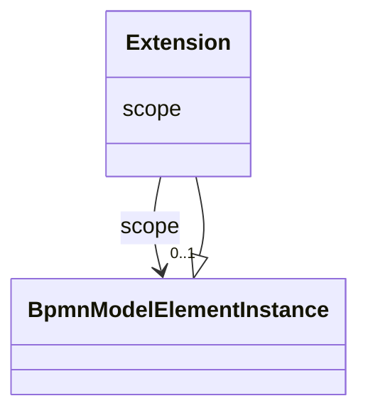

---
search:
  boost: 10.0
---

# Class: Extension 


_The DI extension element of the DI DiagramElement type_


<div data-search-exclude markdown="1">


URI: [fluxnova_bpm_platform:Extension](https://w3id.org/TD-Universe/fluxnova-bpm-platform/Extension)





## Inheritance
* [BpmnModelElementInstance](BpmnModelElementInstance.md)
    * **Extension**


## Slots

| Name | Cardinality and Range | Description | Inheritance |
| ---  | --- | --- | --- |
| [scope](scope.md) | 0..1 <br/> [BpmnModelElementInstance](BpmnModelElementInstance.md) | Tests if the element is a scope like process or sub-process | [BpmnModelElementInstance](BpmnModelElementInstance.md) |


## Usages

| used by | used in | type | used |
| ---  | --- | --- | --- |
| [DiagramElement](DiagramElement.md) | [extension](extension.md) | range | [Extension](Extension.md) |
| [Edge](Edge.md) | [extension](extension.md) | range | [Extension](Extension.md) |
| [Label](Label.md) | [extension](extension.md) | range | [Extension](Extension.md) |
| [LabeledEdge](LabeledEdge.md) | [extension](extension.md) | range | [Extension](Extension.md) |
| [LabeledShape](LabeledShape.md) | [extension](extension.md) | range | [Extension](Extension.md) |
| [Node](Node.md) | [extension](extension.md) | range | [Extension](Extension.md) |
| [Plane](Plane.md) | [extension](extension.md) | range | [Extension](Extension.md) |
| [Shape](Shape.md) | [extension](extension.md) | range | [Extension](Extension.md) |
| [Definitions](Definitions.md) | [extensions](extensions.md) | range | [Extension](Extension.md) |
| [BpmnEdge](BpmnEdge.md) | [extension](extension.md) | range | [Extension](Extension.md) |
| [BpmnLabel](BpmnLabel.md) | [extension](extension.md) | range | [Extension](Extension.md) |
| [BpmnPlane](BpmnPlane.md) | [extension](extension.md) | range | [Extension](Extension.md) |
| [BpmnShape](BpmnShape.md) | [extension](extension.md) | range | [Extension](Extension.md) |


## In Subsets


* [Di](Di.md)
* [FluxnovaBpmnModel](FluxnovaBpmnModel.md)


## Identifier and Mapping Information


### Annotations

| property | value |
| --- | --- |
| java_package | org.finos.fluxnova.bpm.model.bpmn.instance.di |
| source_file | model-api/bpmn-model/src/main/java/org/finos/fluxnova/bpm/model/bpmn/instance/di/Extension.java |


### Schema Source


* from schema: https://w3id.org/TD-Universe/fluxnova-bpm-platform


## Mappings

| Mapping Type | Mapped Value |
| ---  | ---  |
| self | fluxnova_bpm_platform:Extension |
| native | fluxnova_bpm_platform:Extension |


## LinkML Source

<!-- TODO: investigate https://stackoverflow.com/questions/37606292/how-to-create-tabbed-code-blocks-in-mkdocs-or-sphinx -->

### Direct

<details>
```yaml
name: Extension
annotations:
  java_package:
    tag: java_package
    value: org.finos.fluxnova.bpm.model.bpmn.instance.di
  source_file:
    tag: source_file
    value: model-api/bpmn-model/src/main/java/org/finos/fluxnova/bpm/model/bpmn/instance/di/Extension.java
description: The DI extension element of the DI DiagramElement type
in_subset:
- di
- fluxnova_bpmn_model
from_schema: https://w3id.org/TD-Universe/fluxnova-bpm-platform
is_a: BpmnModelElementInstance

```
</details>

### Induced

<details>
```yaml
name: Extension
annotations:
  java_package:
    tag: java_package
    value: org.finos.fluxnova.bpm.model.bpmn.instance.di
  source_file:
    tag: source_file
    value: model-api/bpmn-model/src/main/java/org/finos/fluxnova/bpm/model/bpmn/instance/di/Extension.java
description: The DI extension element of the DI DiagramElement type
in_subset:
- di
- fluxnova_bpmn_model
from_schema: https://w3id.org/TD-Universe/fluxnova-bpm-platform
is_a: BpmnModelElementInstance
attributes:
  scope:
    name: scope
    description: Tests if the element is a scope like process or sub-process.
    from_schema: https://w3id.org/TD-Universe/fluxnova-bpm-platform
    rank: 1000
    owner: Extension
    domain_of:
    - BpmnModelElementInstance
    range: BpmnModelElementInstance

```
</details></div>