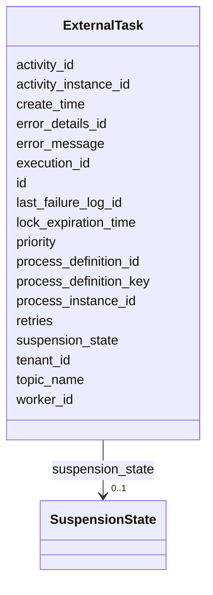

---
search:
  boost: 10.0
---

# Class: ExternalTask 


_Represents an instance of an external task that is created when a service-task like activity (i.e. service task, send task, ...) with attribute camunda:type="external" is executed._


<div data-search-exclude markdown="1">


URI: [fluxnova_bpm_platform:ExternalTask](https://w3id.org/TD-Universe/fluxnova-bpm-platform/ExternalTask)





<!-- no inheritance hierarchy -->

## Slots

| Name | Cardinality and Range | Description | Inheritance |
| ---  | --- | --- | --- |
| [id](id.md) | 1 <br/> [String](String.md) | Unique identifier | direct |
| [worker_id](worker_id.md) | 0..1 <br/> [String](String.md) | Id of the worker that fetched the external task most recently | direct |
| [topic_name](topic_name.md) | 0..1 <br/> [String](String.md) | Topic name of the associated external task | direct |
| [retries](retries.md) | 0..1 <br/> [Integer](Integer.md) | Number of retries this job has left | direct |
| [error_message](error_message.md) | 0..1 <br/> [String](String.md) | If the variable value could not be loaded, this returns the error message | direct |
| [error_details_id](error_details_id.md) | 0..1 <br/> [String](String.md) | Reference to a ByteArray | direct |
| [lock_expiration_time](lock_expiration_time.md) | 0..1 <br/> [Datetime](Datetime.md) | Time at which the lock expires | direct |
| [create_time](create_time.md) | 0..1 <br/> [Datetime](Datetime.md) | Creation timestamp | direct |
| [suspension_state](suspension_state.md) | 0..1 <br/> [SuspensionState](SuspensionState.md) | Whether the entity is active or suspended | direct |
| [execution_id](execution_id.md) | 0..1 <br/> [String](String.md) | Reference to the execution | direct |
| [process_instance_id](process_instance_id.md) | 0..1 <br/> [String](String.md) | Reference to the process instance | direct |
| [process_definition_id](process_definition_id.md) | 0..1 <br/> [String](String.md) | Reference to the process definition | direct |
| [process_definition_key](process_definition_key.md) | 0..1 <br/> [String](String.md) | Key of the process definition | direct |
| [activity_id](activity_id.md) | 0..1 <br/> [String](String.md) | BPMN activity element identifier | direct |
| [activity_instance_id](activity_instance_id.md) | 0..1 <br/> [String](String.md) | Runtime activity instance identifier | direct |
| [tenant_id](tenant_id.md) | 0..1 <br/> [String](String.md) | Multi-tenancy discriminator | direct |
| [priority](priority.md) | 1 <br/> [Integer](Integer.md) | Indication of how important/urgent this task is with a number between 0 and 1... | direct |
| [last_failure_log_id](last_failure_log_id.md) | 0..1 <br/> [String](String.md) | Reference to the last failure log | direct |


## In Subsets


* [Runtime](Runtime.md)
* [FluxnovaBpm](FluxnovaBpm.md)


## Identifier and Mapping Information


### Annotations

| property | value |
| --- | --- |
| sql_table | ACT_RU_EXT_TASK |


### Schema Source


* from schema: https://w3id.org/TD-Universe/fluxnova-bpm-platform


## Mappings

| Mapping Type | Mapped Value |
| ---  | ---  |
| self | fluxnova_bpm_platform:ExternalTask |
| native | fluxnova_bpm_platform:ExternalTask |


## LinkML Source

<!-- TODO: investigate https://stackoverflow.com/questions/37606292/how-to-create-tabbed-code-blocks-in-mkdocs-or-sphinx -->

### Direct

<details>
```yaml
name: ExternalTask
annotations:
  sql_table:
    tag: sql_table
    value: ACT_RU_EXT_TASK
description: Represents an instance of an external task that is created when a service-task
  like activity (i.e. service task, send task, ...) with attribute camunda:type="external"
  is executed.
in_subset:
- runtime
- fluxnova_bpm
from_schema: https://w3id.org/TD-Universe/fluxnova-bpm-platform
slots:
- id
- worker_id
- topic_name
- retries
- error_message
- error_details_id
- lock_expiration_time
- create_time
- suspension_state
- execution_id
- process_instance_id
- process_definition_id
- process_definition_key
- activity_id
- activity_instance_id
- tenant_id
- priority
- last_failure_log_id

```
</details>

### Induced

<details>
```yaml
name: ExternalTask
annotations:
  sql_table:
    tag: sql_table
    value: ACT_RU_EXT_TASK
description: Represents an instance of an external task that is created when a service-task
  like activity (i.e. service task, send task, ...) with attribute camunda:type="external"
  is executed.
in_subset:
- runtime
- fluxnova_bpm
from_schema: https://w3id.org/TD-Universe/fluxnova-bpm-platform
attributes:
  id:
    name: id
    description: Unique identifier.
    from_schema: https://w3id.org/TD-Universe/fluxnova-bpm-platform
    rank: 1000
    slot_uri: schema:identifier
    identifier: true
    owner: ExternalTask
    domain_of:
    - ByteArray
    - MeterLog
    - SchemaLogEntry
    - TaskMeterLog
    - Authorization
    - Group
    - IdentityInfo
    - IdentityLink
    - Tenant
    - TenantMembership
    - User
    - CaseExecution
    - CaseSentryPart
    - EventSubscription
    - Execution
    - ExternalTask
    - Incident
    - Task
    - VariableInstance
    - Attachment
    - Comment
    - Filter
    - Deployment
    - ResourceDefinition
    - Batch
    - Job
    - JobDefinition
    - HistoricBatch
    - HistoricDecisionInputInstance
    - HistoricDecisionInstance
    - HistoricDecisionOutputInstance
    - HistoricDetail
    - HistoricExternalTaskLog
    - HistoricIdentityLink
    - HistoricIncident
    - HistoricJobLog
    - HistoricScopeInstance
    - HistoricVariableInstance
    - UserOperationLogEntry
    - Diagram
    - DiagramElement
    - Style
    - BaseElement
    - Definitions
    - Documentation
    - InteractionNode
    range: string
    required: true
  worker_id:
    name: worker_id
    annotations:
      sql_column:
        tag: sql_column
        value: WORKER_ID_
    description: Id of the worker that fetched the external task most recently.
    from_schema: https://w3id.org/TD-Universe/fluxnova-bpm-platform
    rank: 1000
    owner: ExternalTask
    domain_of:
    - ExternalTask
    - HistoricExternalTaskLog
    range: string
  topic_name:
    name: topic_name
    annotations:
      sql_column:
        tag: sql_column
        value: TOPIC_NAME_
    description: Topic name of the associated external task.
    from_schema: https://w3id.org/TD-Universe/fluxnova-bpm-platform
    rank: 1000
    owner: ExternalTask
    domain_of:
    - ExternalTask
    - HistoricExternalTaskLog
    range: string
  retries:
    name: retries
    annotations:
      sql_column:
        tag: sql_column
        value: RETRIES_
    description: Number of retries this job has left. Whenever the jobexecutor fails
      to execute the job, this value is decremented. When it hits zero, the job is
      supposed to be dead and not retried again (ie a manu...
    from_schema: https://w3id.org/TD-Universe/fluxnova-bpm-platform
    rank: 1000
    owner: ExternalTask
    domain_of:
    - ExternalTask
    - Job
    - HistoricExternalTaskLog
    range: integer
  error_message:
    name: error_message
    annotations:
      sql_column:
        tag: sql_column
        value: ERROR_MSG_
    description: If the variable value could not be loaded, this returns the error
      message.
    from_schema: https://w3id.org/TD-Universe/fluxnova-bpm-platform
    rank: 1000
    owner: ExternalTask
    domain_of:
    - ExternalTask
    - HistoricExternalTaskLog
    range: string
  error_details_id:
    name: error_details_id
    annotations:
      sql_column:
        tag: sql_column
        value: ERROR_DETAILS_ID_
    description: Reference to a ByteArray.
    from_schema: https://w3id.org/TD-Universe/fluxnova-bpm-platform
    rank: 1000
    owner: ExternalTask
    domain_of:
    - ExternalTask
    - HistoricExternalTaskLog
    range: string
  lock_expiration_time:
    name: lock_expiration_time
    annotations:
      sql_column:
        tag: sql_column
        value: LOCK_EXP_TIME_
    description: Time at which the lock expires.
    from_schema: https://w3id.org/TD-Universe/fluxnova-bpm-platform
    rank: 1000
    owner: ExternalTask
    domain_of:
    - User
    - ExternalTask
    - Job
    range: datetime
  create_time:
    name: create_time
    description: Creation timestamp.
    from_schema: https://w3id.org/TD-Universe/fluxnova-bpm-platform
    rank: 1000
    owner: ExternalTask
    domain_of:
    - ByteArray
    - ExternalTask
    - Task
    - Attachment
    - Job
    - HistoricCaseActivityInstance
    - HistoricCaseInstance
    - HistoricDecisionInputInstance
    - HistoricDecisionOutputInstance
    - HistoricIncident
    - HistoricVariableInstance
    range: datetime
  suspension_state:
    name: suspension_state
    annotations:
      sql_column:
        tag: sql_column
        value: SUSPENSION_STATE_
    description: Whether the entity is active or suspended.
    from_schema: https://w3id.org/TD-Universe/fluxnova-bpm-platform
    rank: 1000
    owner: ExternalTask
    domain_of:
    - Execution
    - ExternalTask
    - Task
    - ProcessDefinition
    - Batch
    - Job
    - JobDefinition
    range: SuspensionState
  execution_id:
    name: execution_id
    description: Reference to the execution.
    from_schema: https://w3id.org/TD-Universe/fluxnova-bpm-platform
    rank: 1000
    owner: ExternalTask
    domain_of:
    - EventSubscription
    - ExternalTask
    - Incident
    - Task
    - VariableInstance
    - Job
    - HistoricActivityInstance
    - HistoricDetail
    - HistoricExternalTaskLog
    - HistoricIncident
    - HistoricJobLog
    - HistoricTaskInstance
    - HistoricVariableInstance
    - UserOperationLogEntry
    range: string
  process_instance_id:
    name: process_instance_id
    description: Reference to the process instance.
    from_schema: https://w3id.org/TD-Universe/fluxnova-bpm-platform
    rank: 1000
    owner: ExternalTask
    domain_of:
    - EventSubscription
    - Execution
    - ExternalTask
    - Incident
    - Task
    - VariableInstance
    - Attachment
    - Comment
    - Job
    - HistoricDecisionInstance
    - HistoricDetail
    - HistoricExternalTaskLog
    - HistoricIncident
    - HistoricJobLog
    - HistoricScopeInstance
    - HistoricVariableInstance
    - UserOperationLogEntry
    range: string
  process_definition_id:
    name: process_definition_id
    description: Reference to the process definition.
    from_schema: https://w3id.org/TD-Universe/fluxnova-bpm-platform
    rank: 1000
    owner: ExternalTask
    domain_of:
    - IdentityLink
    - Execution
    - ExternalTask
    - Incident
    - Task
    - VariableInstance
    - Job
    - JobDefinition
    - HistoricDecisionInstance
    - HistoricDetail
    - HistoricExternalTaskLog
    - HistoricIdentityLink
    - HistoricIncident
    - HistoricJobLog
    - HistoricScopeInstance
    - HistoricVariableInstance
    - UserOperationLogEntry
    range: string
  process_definition_key:
    name: process_definition_key
    description: Key of the process definition.
    from_schema: https://w3id.org/TD-Universe/fluxnova-bpm-platform
    rank: 1000
    owner: ExternalTask
    domain_of:
    - Execution
    - ExternalTask
    - Job
    - JobDefinition
    - HistoricDecisionInstance
    - HistoricDetail
    - HistoricExternalTaskLog
    - HistoricIdentityLink
    - HistoricIncident
    - HistoricJobLog
    - HistoricScopeInstance
    - HistoricVariableInstance
    - UserOperationLogEntry
    range: string
  activity_id:
    name: activity_id
    description: BPMN activity element identifier.
    from_schema: https://w3id.org/TD-Universe/fluxnova-bpm-platform
    rank: 1000
    owner: ExternalTask
    domain_of:
    - CaseExecution
    - EventSubscription
    - Execution
    - ExternalTask
    - Incident
    - JobDefinition
    - HistoricActivityInstance
    - HistoricDecisionInstance
    - HistoricExternalTaskLog
    - HistoricIncident
    - HistoricJobLog
    range: string
  activity_instance_id:
    name: activity_instance_id
    description: Runtime activity instance identifier.
    from_schema: https://w3id.org/TD-Universe/fluxnova-bpm-platform
    rank: 1000
    owner: ExternalTask
    domain_of:
    - Execution
    - ExternalTask
    - HistoricDecisionInstance
    - HistoricDetail
    - HistoricExternalTaskLog
    - HistoricTaskInstance
    - HistoricVariableInstance
    range: string
  tenant_id:
    name: tenant_id
    description: Multi-tenancy discriminator.
    from_schema: https://w3id.org/TD-Universe/fluxnova-bpm-platform
    rank: 1000
    owner: ExternalTask
    domain_of:
    - ByteArray
    - IdentityLink
    - TenantMembership
    - CaseExecution
    - CaseSentryPart
    - EventSubscription
    - Execution
    - ExternalTask
    - Incident
    - Task
    - VariableInstance
    - Attachment
    - Comment
    - Deployment
    - ResourceDefinition
    - Batch
    - Job
    - JobDefinition
    - HistoricActivityInstance
    - HistoricBatch
    - HistoricCaseActivityInstance
    - HistoricCaseInstance
    - HistoricDecisionInputInstance
    - HistoricDecisionInstance
    - HistoricDecisionOutputInstance
    - HistoricDetail
    - HistoricExternalTaskLog
    - HistoricIdentityLink
    - HistoricIncident
    - HistoricJobLog
    - HistoricProcessInstance
    - HistoricTaskInstance
    - HistoricVariableInstance
    - UserOperationLogEntry
    range: string
  priority:
    name: priority
    annotations:
      sql_column:
        tag: sql_column
        value: PRIORITY_
    description: 'Indication of how important/urgent this task is with a number between
      0 and 100 where higher values mean a higher priority and lower values mean lower
      priority: [0..19] lowest, [20..39] low, [40..5...'
    from_schema: https://w3id.org/TD-Universe/fluxnova-bpm-platform
    rank: 1000
    owner: ExternalTask
    domain_of:
    - ExternalTask
    - Task
    - Job
    - HistoricExternalTaskLog
    - HistoricTaskInstance
    range: integer
    required: true
  last_failure_log_id:
    name: last_failure_log_id
    annotations:
      sql_column:
        tag: sql_column
        value: LAST_FAILURE_LOG_ID_
    description: Reference to the last failure log.
    from_schema: https://w3id.org/TD-Universe/fluxnova-bpm-platform
    rank: 1000
    owner: ExternalTask
    domain_of:
    - ExternalTask
    - Job
    range: string

```
</details></div>