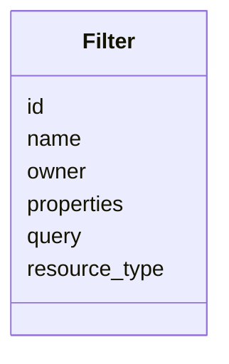

---
search:
  boost: 10.0
---

# Class: Filter 


_Filter entity in the user collaboration._


<div data-search-exclude markdown="1">


URI: [fluxnova_bpm_platform:Filter](https://w3id.org/TD-Universe/fluxnova-bpm-platform/Filter)





<!-- no inheritance hierarchy -->

## Slots

| Name | Cardinality and Range | Description | Inheritance |
| ---  | --- | --- | --- |
| [id](id.md) | 1 <br/> [String](String.md) | Unique identifier | direct |
| [resource_type](resource_type.md) | 1 <br/> [String](String.md) | Numeric type of the authorized resource | direct |
| [name](name.md) | 1 <br/> [String](String.md) | Human-readable name | direct |
| [owner](owner.md) | 0..1 <br/> [String](String.md) | The userId of the person that is responsible for this task | direct |
| [query](query.md) | 1 <br/> [String](String.md) | Serialized query expression | direct |
| [properties](properties.md) | 0..1 <br/> [String](String.md) | Serialized properties | direct |


## In Subsets


* [Collaboration](Collaboration.md)
* [FluxnovaBpm](FluxnovaBpm.md)


## Identifier and Mapping Information


### Annotations

| property | value |
| --- | --- |
| sql_table | ACT_RU_FILTER |


### Schema Source


* from schema: https://w3id.org/TD-Universe/fluxnova-bpm-platform


## Mappings

| Mapping Type | Mapped Value |
| ---  | ---  |
| self | fluxnova_bpm_platform:Filter |
| native | fluxnova_bpm_platform:Filter |


## LinkML Source

<!-- TODO: investigate https://stackoverflow.com/questions/37606292/how-to-create-tabbed-code-blocks-in-mkdocs-or-sphinx -->

### Direct

<details>
```yaml
name: Filter
annotations:
  sql_table:
    tag: sql_table
    value: ACT_RU_FILTER
description: Filter entity in the user collaboration.
in_subset:
- collaboration
- fluxnova_bpm
from_schema: https://w3id.org/TD-Universe/fluxnova-bpm-platform
slots:
- id
- resource_type
- name
- owner
- query
- properties
slot_usage:
  resource_type:
    name: resource_type
    range: string
  name:
    name: name
    required: true

```
</details>

### Induced

<details>
```yaml
name: Filter
annotations:
  sql_table:
    tag: sql_table
    value: ACT_RU_FILTER
description: Filter entity in the user collaboration.
in_subset:
- collaboration
- fluxnova_bpm
from_schema: https://w3id.org/TD-Universe/fluxnova-bpm-platform
slot_usage:
  resource_type:
    name: resource_type
    range: string
  name:
    name: name
    required: true
attributes:
  id:
    name: id
    description: Unique identifier.
    from_schema: https://w3id.org/TD-Universe/fluxnova-bpm-platform
    rank: 1000
    slot_uri: schema:identifier
    identifier: true
    owner: Filter
    domain_of:
    - ByteArray
    - MeterLog
    - SchemaLogEntry
    - TaskMeterLog
    - Authorization
    - Group
    - IdentityInfo
    - IdentityLink
    - Tenant
    - TenantMembership
    - User
    - CaseExecution
    - CaseSentryPart
    - EventSubscription
    - Execution
    - ExternalTask
    - Incident
    - Task
    - VariableInstance
    - Attachment
    - Comment
    - Filter
    - Deployment
    - ResourceDefinition
    - Batch
    - Job
    - JobDefinition
    - HistoricBatch
    - HistoricDecisionInputInstance
    - HistoricDecisionInstance
    - HistoricDecisionOutputInstance
    - HistoricDetail
    - HistoricExternalTaskLog
    - HistoricIdentityLink
    - HistoricIncident
    - HistoricJobLog
    - HistoricScopeInstance
    - HistoricVariableInstance
    - UserOperationLogEntry
    - Diagram
    - DiagramElement
    - Style
    - BaseElement
    - Definitions
    - Documentation
    - InteractionNode
    range: string
    required: true
  resource_type:
    name: resource_type
    annotations:
      sql_column:
        tag: sql_column
        value: RESOURCE_TYPE_
    description: Numeric type of the authorized resource.
    from_schema: https://w3id.org/TD-Universe/fluxnova-bpm-platform
    rank: 1000
    owner: Filter
    domain_of:
    - Authorization
    - Filter
    range: string
    required: true
  name:
    name: name
    description: Human-readable name.
    from_schema: https://w3id.org/TD-Universe/fluxnova-bpm-platform
    rank: 1000
    slot_uri: schema:name
    owner: Filter
    domain_of:
    - ByteArray
    - MeterLog
    - Property
    - Group
    - Tenant
    - Task
    - VariableInstance
    - Attachment
    - Filter
    - Deployment
    - ResourceDefinition
    - HistoricDetail
    - HistoricTaskInstance
    - HistoricVariableInstance
    - Font
    - Diagram
    - CallableElement
    - Category
    - Collaboration
    - ConversationLink
    - ConversationNode
    - CorrelationKey
    - CorrelationProperty
    - DataInput
    - DataOutput
    - DataState
    - DataStore
    - Definitions
    - Error
    - Escalation
    - FlowElement
    - InputSet
    - Interface
    - Lane
    - LaneSet
    - LinkEventDefinition
    - Message
    - MessageFlow
    - Operation
    - OutputSet
    - Participant
    - BpmnProperty
    - Resource
    - ResourceParameter
    - ResourceRole
    - Signal
    range: string
    required: true
  owner:
    name: owner
    annotations:
      sql_column:
        tag: sql_column
        value: OWNER_
    description: The userId of the person that is responsible for this task. This
      is used when a task is delegated.
    from_schema: https://w3id.org/TD-Universe/fluxnova-bpm-platform
    rank: 1000
    owner: Filter
    domain_of:
    - Task
    - Filter
    - HistoricTaskInstance
    range: string
  query:
    name: query
    annotations:
      sql_column:
        tag: sql_column
        value: QUERY_
    description: Serialized query expression.
    from_schema: https://w3id.org/TD-Universe/fluxnova-bpm-platform
    rank: 1000
    owner: Filter
    domain_of:
    - Filter
    range: string
    required: true
  properties:
    name: properties
    annotations:
      sql_column:
        tag: sql_column
        value: PROPERTIES_
    description: Serialized properties.
    from_schema: https://w3id.org/TD-Universe/fluxnova-bpm-platform
    rank: 1000
    owner: Filter
    domain_of:
    - Filter
    - Activity
    - Event
    - Process
    range: string

```
</details></div>