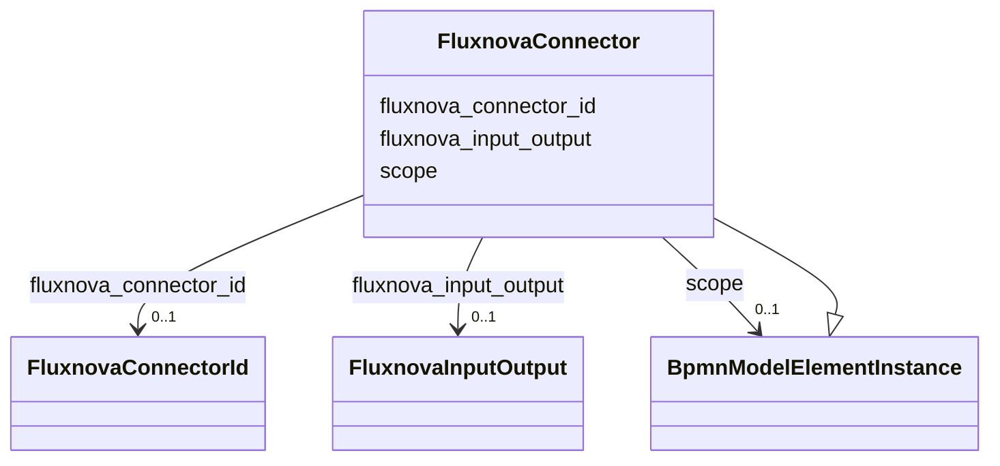

---
search:
  boost: 10.0
---

# Class: FluxnovaConnector 


_The BPMN connector camunda extension element_


<div data-search-exclude markdown="1">


URI: [fluxnova_bpm_platform:FluxnovaConnector](https://w3id.org/TD-Universe/fluxnova-bpm-platform/FluxnovaConnector)





## Inheritance
* [BpmnModelElementInstance](BpmnModelElementInstance.md)
    * **FluxnovaConnector**


## Slots

| Name | Cardinality and Range | Description | Inheritance |
| ---  | --- | --- | --- |
| [fluxnova_connector_id](fluxnova_connector_id.md) | 0..1 <br/> [FluxnovaConnectorId](FluxnovaConnectorId.md) | The unique identifier of this connector configuration | direct |
| [fluxnova_input_output](fluxnova_input_output.md) | 0..1 <br/> [FluxnovaInputOutput](FluxnovaInputOutput.md) | Input/output parameter container for this connector | direct |
| [scope](scope.md) | 0..1 <br/> [BpmnModelElementInstance](BpmnModelElementInstance.md) | Tests if the element is a scope like process or sub-process | [BpmnModelElementInstance](BpmnModelElementInstance.md) |


## In Subsets


* [FluxnovaExtensions](FluxnovaExtensions.md)
* [FluxnovaBpmnModel](FluxnovaBpmnModel.md)


## Identifier and Mapping Information


### Annotations

| property | value |
| --- | --- |
| java_package | org.finos.fluxnova.bpm.model.bpmn.instance.fluxnova |
| source_file | model-api/bpmn-model/src/main/java/org/finos/fluxnova/bpm/model/bpmn/instance/fluxnova/FluxnovaConnector.java |


### Schema Source


* from schema: https://w3id.org/TD-Universe/fluxnova-bpm-platform


## Mappings

| Mapping Type | Mapped Value |
| ---  | ---  |
| self | fluxnova_bpm_platform:FluxnovaConnector |
| native | fluxnova_bpm_platform:FluxnovaConnector |


## LinkML Source

<!-- TODO: investigate https://stackoverflow.com/questions/37606292/how-to-create-tabbed-code-blocks-in-mkdocs-or-sphinx -->

### Direct

<details>
```yaml
name: FluxnovaConnector
annotations:
  java_package:
    tag: java_package
    value: org.finos.fluxnova.bpm.model.bpmn.instance.fluxnova
  source_file:
    tag: source_file
    value: model-api/bpmn-model/src/main/java/org/finos/fluxnova/bpm/model/bpmn/instance/fluxnova/FluxnovaConnector.java
description: The BPMN connector camunda extension element
in_subset:
- fluxnova_extensions
- fluxnova_bpmn_model
from_schema: https://w3id.org/TD-Universe/fluxnova-bpm-platform
is_a: BpmnModelElementInstance
slots:
- fluxnova_connector_id
- fluxnova_input_output

```
</details>

### Induced

<details>
```yaml
name: FluxnovaConnector
annotations:
  java_package:
    tag: java_package
    value: org.finos.fluxnova.bpm.model.bpmn.instance.fluxnova
  source_file:
    tag: source_file
    value: model-api/bpmn-model/src/main/java/org/finos/fluxnova/bpm/model/bpmn/instance/fluxnova/FluxnovaConnector.java
description: The BPMN connector camunda extension element
in_subset:
- fluxnova_extensions
- fluxnova_bpmn_model
from_schema: https://w3id.org/TD-Universe/fluxnova-bpm-platform
is_a: BpmnModelElementInstance
attributes:
  fluxnova_connector_id:
    name: fluxnova_connector_id
    description: The unique identifier of this connector configuration.
    from_schema: https://w3id.org/TD-Universe/fluxnova-bpm-platform
    rank: 1000
    owner: FluxnovaConnector
    domain_of:
    - FluxnovaConnector
    range: FluxnovaConnectorId
  fluxnova_input_output:
    name: fluxnova_input_output
    description: Input/output parameter container for this connector.
    from_schema: https://w3id.org/TD-Universe/fluxnova-bpm-platform
    rank: 1000
    owner: FluxnovaConnector
    domain_of:
    - FluxnovaConnector
    range: FluxnovaInputOutput
  scope:
    name: scope
    description: Tests if the element is a scope like process or sub-process.
    from_schema: https://w3id.org/TD-Universe/fluxnova-bpm-platform
    rank: 1000
    owner: FluxnovaConnector
    domain_of:
    - BpmnModelElementInstance
    range: BpmnModelElementInstance

```
</details></div>