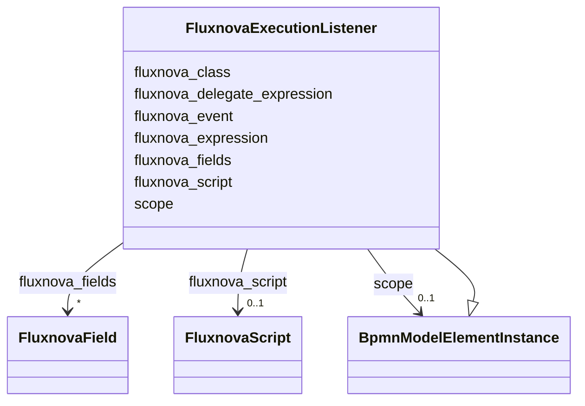

---
search:
  boost: 10.0
---

# Class: FluxnovaExecutionListener 


_The BPMN executionListener camunda extension element_


<div data-search-exclude markdown="1">


URI: [fluxnova_bpm_platform:FluxnovaExecutionListener](https://w3id.org/TD-Universe/fluxnova-bpm-platform/FluxnovaExecutionListener)





## Inheritance
* [BpmnModelElementInstance](BpmnModelElementInstance.md)
    * **FluxnovaExecutionListener**


## Slots

| Name | Cardinality and Range | Description | Inheritance |
| ---  | --- | --- | --- |
| [fluxnova_event](fluxnova_event.md) | 0..1 <br/> [String](String.md) | Event that triggers this execution listener | direct |
| [fluxnova_class](fluxnova_class.md) | 0..1 <br/> [String](String.md) | Camunda extensions | direct |
| [fluxnova_expression](fluxnova_expression.md) | 0..1 <br/> [String](String.md) | EL expression for this element | direct |
| [fluxnova_delegate_expression](fluxnova_delegate_expression.md) | 0..1 <br/> [String](String.md) | Expression resolving to a JavaDelegate | direct |
| [fluxnova_fields](fluxnova_fields.md) | * <br/> [FluxnovaField](FluxnovaField.md) | Field elements of this connector or form | direct |
| [fluxnova_script](fluxnova_script.md) | 0..1 <br/> [FluxnovaScript](FluxnovaScript.md) | Inline script for this element | direct |
| [scope](scope.md) | 0..1 <br/> [BpmnModelElementInstance](BpmnModelElementInstance.md) | Tests if the element is a scope like process or sub-process | [BpmnModelElementInstance](BpmnModelElementInstance.md) |


## In Subsets


* [FluxnovaExtensions](FluxnovaExtensions.md)
* [FluxnovaBpmnModel](FluxnovaBpmnModel.md)


## Identifier and Mapping Information


### Annotations

| property | value |
| --- | --- |
| java_package | org.finos.fluxnova.bpm.model.bpmn.instance.fluxnova |
| source_file | model-api/bpmn-model/src/main/java/org/finos/fluxnova/bpm/model/bpmn/instance/fluxnova/FluxnovaExecutionListener.java |


### Schema Source


* from schema: https://w3id.org/TD-Universe/fluxnova-bpm-platform


## Mappings

| Mapping Type | Mapped Value |
| ---  | ---  |
| self | fluxnova_bpm_platform:FluxnovaExecutionListener |
| native | fluxnova_bpm_platform:FluxnovaExecutionListener |


## LinkML Source

<!-- TODO: investigate https://stackoverflow.com/questions/37606292/how-to-create-tabbed-code-blocks-in-mkdocs-or-sphinx -->

### Direct

<details>
```yaml
name: FluxnovaExecutionListener
annotations:
  java_package:
    tag: java_package
    value: org.finos.fluxnova.bpm.model.bpmn.instance.fluxnova
  source_file:
    tag: source_file
    value: model-api/bpmn-model/src/main/java/org/finos/fluxnova/bpm/model/bpmn/instance/fluxnova/FluxnovaExecutionListener.java
description: The BPMN executionListener camunda extension element
in_subset:
- fluxnova_extensions
- fluxnova_bpmn_model
from_schema: https://w3id.org/TD-Universe/fluxnova-bpm-platform
is_a: BpmnModelElementInstance
slots:
- fluxnova_event
- fluxnova_class
- fluxnova_expression
- fluxnova_delegate_expression
- fluxnova_fields
- fluxnova_script

```
</details>

### Induced

<details>
```yaml
name: FluxnovaExecutionListener
annotations:
  java_package:
    tag: java_package
    value: org.finos.fluxnova.bpm.model.bpmn.instance.fluxnova
  source_file:
    tag: source_file
    value: model-api/bpmn-model/src/main/java/org/finos/fluxnova/bpm/model/bpmn/instance/fluxnova/FluxnovaExecutionListener.java
description: The BPMN executionListener camunda extension element
in_subset:
- fluxnova_extensions
- fluxnova_bpmn_model
from_schema: https://w3id.org/TD-Universe/fluxnova-bpm-platform
is_a: BpmnModelElementInstance
attributes:
  fluxnova_event:
    name: fluxnova_event
    description: Event that triggers this execution listener.
    from_schema: https://w3id.org/TD-Universe/fluxnova-bpm-platform
    rank: 1000
    owner: FluxnovaExecutionListener
    domain_of:
    - FluxnovaExecutionListener
    - FluxnovaTaskListener
    range: string
  fluxnova_class:
    name: fluxnova_class
    description: Camunda extensions
    from_schema: https://w3id.org/TD-Universe/fluxnova-bpm-platform
    rank: 1000
    owner: FluxnovaExecutionListener
    domain_of:
    - BusinessRuleTask
    - MessageEventDefinition
    - SendTask
    - ServiceTask
    - FluxnovaExecutionListener
    - FluxnovaTaskListener
    range: string
  fluxnova_expression:
    name: fluxnova_expression
    description: EL expression for this element.
    from_schema: https://w3id.org/TD-Universe/fluxnova-bpm-platform
    rank: 1000
    owner: FluxnovaExecutionListener
    domain_of:
    - BusinessRuleTask
    - MessageEventDefinition
    - SendTask
    - ServiceTask
    - FluxnovaErrorEventDefinition
    - FluxnovaExecutionListener
    - FluxnovaField
    - FluxnovaFormProperty
    - FluxnovaTaskListener
    range: string
  fluxnova_delegate_expression:
    name: fluxnova_delegate_expression
    description: Expression resolving to a JavaDelegate.
    from_schema: https://w3id.org/TD-Universe/fluxnova-bpm-platform
    rank: 1000
    owner: FluxnovaExecutionListener
    domain_of:
    - BusinessRuleTask
    - MessageEventDefinition
    - SendTask
    - ServiceTask
    - FluxnovaExecutionListener
    - FluxnovaTaskListener
    range: string
  fluxnova_fields:
    name: fluxnova_fields
    description: Field elements of this connector or form.
    from_schema: https://w3id.org/TD-Universe/fluxnova-bpm-platform
    rank: 1000
    owner: FluxnovaExecutionListener
    domain_of:
    - FluxnovaExecutionListener
    - FluxnovaTaskListener
    range: FluxnovaField
    multivalued: true
    inlined: true
    inlined_as_list: true
  fluxnova_script:
    name: fluxnova_script
    description: Inline script for this element.
    from_schema: https://w3id.org/TD-Universe/fluxnova-bpm-platform
    rank: 1000
    owner: FluxnovaExecutionListener
    domain_of:
    - FluxnovaExecutionListener
    - FluxnovaTaskListener
    range: FluxnovaScript
  scope:
    name: scope
    description: Tests if the element is a scope like process or sub-process.
    from_schema: https://w3id.org/TD-Universe/fluxnova-bpm-platform
    rank: 1000
    owner: FluxnovaExecutionListener
    domain_of:
    - BpmnModelElementInstance
    range: BpmnModelElementInstance

```
</details></div>