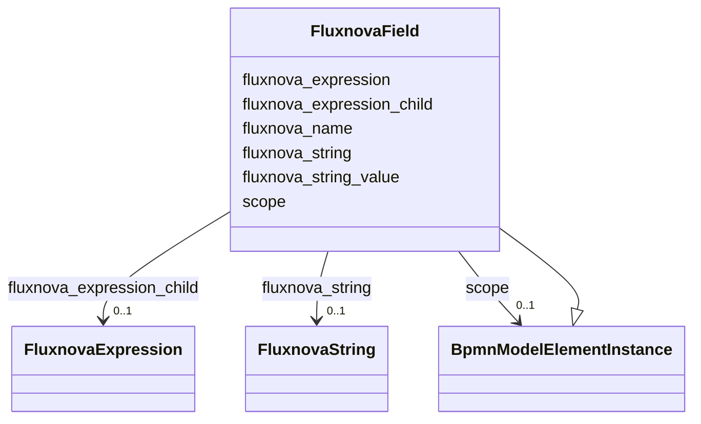

---
search:
  boost: 10.0
---

# Class: FluxnovaField 


_The BPMN field camunda extension element_


<div data-search-exclude markdown="1">


URI: [fluxnova_bpm_platform:FluxnovaField](https://w3id.org/TD-Universe/fluxnova-bpm-platform/FluxnovaField)





## Inheritance
* [BpmnModelElementInstance](BpmnModelElementInstance.md)
    * **FluxnovaField**


## Slots

| Name | Cardinality and Range | Description | Inheritance |
| ---  | --- | --- | --- |
| [fluxnova_name](fluxnova_name.md) | 0..1 <br/> [String](String.md) | Name attribute of this Fluxnova extension element | direct |
| [fluxnova_expression](fluxnova_expression.md) | 0..1 <br/> [String](String.md) | EL expression for this element | direct |
| [fluxnova_string_value](fluxnova_string_value.md) | 0..1 <br/> [String](String.md) | Fluxnova extension property: string value | direct |
| [fluxnova_string](fluxnova_string.md) | 0..1 <br/> [FluxnovaString](FluxnovaString.md) | Inline string value | direct |
| [fluxnova_expression_child](fluxnova_expression_child.md) | 0..1 <br/> [FluxnovaExpression](FluxnovaExpression.md) | Fluxnova extension property: expression child | direct |
| [scope](scope.md) | 0..1 <br/> [BpmnModelElementInstance](BpmnModelElementInstance.md) | Tests if the element is a scope like process or sub-process | [BpmnModelElementInstance](BpmnModelElementInstance.md) |


## Usages

| used by | used in | type | used |
| ---  | --- | --- | --- |
| [FluxnovaExecutionListener](FluxnovaExecutionListener.md) | [fluxnova_fields](fluxnova_fields.md) | range | [FluxnovaField](FluxnovaField.md) |
| [FluxnovaTaskListener](FluxnovaTaskListener.md) | [fluxnova_fields](fluxnova_fields.md) | range | [FluxnovaField](FluxnovaField.md) |


## In Subsets


* [FluxnovaExtensions](FluxnovaExtensions.md)
* [FluxnovaBpmnModel](FluxnovaBpmnModel.md)


## Identifier and Mapping Information


### Annotations

| property | value |
| --- | --- |
| java_package | org.finos.fluxnova.bpm.model.bpmn.instance.fluxnova |
| source_file | model-api/bpmn-model/src/main/java/org/finos/fluxnova/bpm/model/bpmn/instance/fluxnova/FluxnovaField.java |


### Schema Source


* from schema: https://w3id.org/TD-Universe/fluxnova-bpm-platform


## Mappings

| Mapping Type | Mapped Value |
| ---  | ---  |
| self | fluxnova_bpm_platform:FluxnovaField |
| native | fluxnova_bpm_platform:FluxnovaField |


## LinkML Source

<!-- TODO: investigate https://stackoverflow.com/questions/37606292/how-to-create-tabbed-code-blocks-in-mkdocs-or-sphinx -->

### Direct

<details>
```yaml
name: FluxnovaField
annotations:
  java_package:
    tag: java_package
    value: org.finos.fluxnova.bpm.model.bpmn.instance.fluxnova
  source_file:
    tag: source_file
    value: model-api/bpmn-model/src/main/java/org/finos/fluxnova/bpm/model/bpmn/instance/fluxnova/FluxnovaField.java
description: The BPMN field camunda extension element
in_subset:
- fluxnova_extensions
- fluxnova_bpmn_model
from_schema: https://w3id.org/TD-Universe/fluxnova-bpm-platform
is_a: BpmnModelElementInstance
slots:
- fluxnova_name
- fluxnova_expression
- fluxnova_string_value
- fluxnova_string
- fluxnova_expression_child

```
</details>

### Induced

<details>
```yaml
name: FluxnovaField
annotations:
  java_package:
    tag: java_package
    value: org.finos.fluxnova.bpm.model.bpmn.instance.fluxnova
  source_file:
    tag: source_file
    value: model-api/bpmn-model/src/main/java/org/finos/fluxnova/bpm/model/bpmn/instance/fluxnova/FluxnovaField.java
description: The BPMN field camunda extension element
in_subset:
- fluxnova_extensions
- fluxnova_bpmn_model
from_schema: https://w3id.org/TD-Universe/fluxnova-bpm-platform
is_a: BpmnModelElementInstance
attributes:
  fluxnova_name:
    name: fluxnova_name
    description: Name attribute of this Fluxnova extension element.
    from_schema: https://w3id.org/TD-Universe/fluxnova-bpm-platform
    rank: 1000
    owner: FluxnovaField
    domain_of:
    - FluxnovaConstraint
    - FluxnovaField
    - FluxnovaFormProperty
    - FluxnovaInputParameter
    - FluxnovaOutputParameter
    - FluxnovaProperty
    - FluxnovaValue
    range: string
  fluxnova_expression:
    name: fluxnova_expression
    description: EL expression for this element.
    from_schema: https://w3id.org/TD-Universe/fluxnova-bpm-platform
    rank: 1000
    owner: FluxnovaField
    domain_of:
    - BusinessRuleTask
    - MessageEventDefinition
    - SendTask
    - ServiceTask
    - FluxnovaErrorEventDefinition
    - FluxnovaExecutionListener
    - FluxnovaField
    - FluxnovaFormProperty
    - FluxnovaTaskListener
    range: string
  fluxnova_string_value:
    name: fluxnova_string_value
    description: 'Fluxnova extension property: string value.'
    from_schema: https://w3id.org/TD-Universe/fluxnova-bpm-platform
    rank: 1000
    owner: FluxnovaField
    domain_of:
    - FluxnovaField
    range: string
  fluxnova_string:
    name: fluxnova_string
    description: Inline string value.
    from_schema: https://w3id.org/TD-Universe/fluxnova-bpm-platform
    rank: 1000
    owner: FluxnovaField
    domain_of:
    - FluxnovaField
    range: FluxnovaString
  fluxnova_expression_child:
    name: fluxnova_expression_child
    description: 'Fluxnova extension property: expression child.'
    from_schema: https://w3id.org/TD-Universe/fluxnova-bpm-platform
    rank: 1000
    owner: FluxnovaField
    domain_of:
    - FluxnovaField
    range: FluxnovaExpression
  scope:
    name: scope
    description: Tests if the element is a scope like process or sub-process.
    from_schema: https://w3id.org/TD-Universe/fluxnova-bpm-platform
    rank: 1000
    owner: FluxnovaField
    domain_of:
    - BpmnModelElementInstance
    range: BpmnModelElementInstance

```
</details></div>