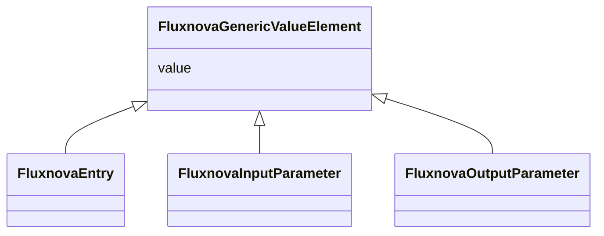

---
search:
  boost: 10.0
---

# Class: FluxnovaGenericValueElement 


_A helper interface for camunda extension elements which hold a generic child element like camunda:inputParameter, camunda:outputParameter and camunda:entry._


<div data-search-exclude markdown="1">


URI: [fluxnova_bpm_platform:FluxnovaGenericValueElement](https://w3id.org/TD-Universe/fluxnova-bpm-platform/FluxnovaGenericValueElement)





<!-- no inheritance hierarchy -->

## Slots

| Name | Cardinality and Range | Description | Inheritance |
| ---  | --- | --- | --- |
| [value](value.md) | 0..1 <br/> [String](String.md) | Value of this variable instance | direct |


## In Subsets


* [FluxnovaExtensions](FluxnovaExtensions.md)
* [FluxnovaBpmnModel](FluxnovaBpmnModel.md)


## Identifier and Mapping Information


### Annotations

| property | value |
| --- | --- |
| java_package | org.finos.fluxnova.bpm.model.bpmn.instance.fluxnova |
| source_file | model-api/bpmn-model/src/main/java/org/finos/fluxnova/bpm/model/bpmn/instance/fluxnova/FluxnovaGenericValueElement.java |


### Schema Source


* from schema: https://w3id.org/TD-Universe/fluxnova-bpm-platform


## Mappings

| Mapping Type | Mapped Value |
| ---  | ---  |
| self | fluxnova_bpm_platform:FluxnovaGenericValueElement |
| native | fluxnova_bpm_platform:FluxnovaGenericValueElement |


## LinkML Source

<!-- TODO: investigate https://stackoverflow.com/questions/37606292/how-to-create-tabbed-code-blocks-in-mkdocs-or-sphinx -->

### Direct

<details>
```yaml
name: FluxnovaGenericValueElement
annotations:
  java_package:
    tag: java_package
    value: org.finos.fluxnova.bpm.model.bpmn.instance.fluxnova
  source_file:
    tag: source_file
    value: model-api/bpmn-model/src/main/java/org/finos/fluxnova/bpm/model/bpmn/instance/fluxnova/FluxnovaGenericValueElement.java
description: A helper interface for camunda extension elements which hold a generic
  child element like camunda:inputParameter, camunda:outputParameter and camunda:entry.
in_subset:
- fluxnova_extensions
- fluxnova_bpmn_model
from_schema: https://w3id.org/TD-Universe/fluxnova-bpm-platform
slots:
- value

```
</details>

### Induced

<details>
```yaml
name: FluxnovaGenericValueElement
annotations:
  java_package:
    tag: java_package
    value: org.finos.fluxnova.bpm.model.bpmn.instance.fluxnova
  source_file:
    tag: source_file
    value: model-api/bpmn-model/src/main/java/org/finos/fluxnova/bpm/model/bpmn/instance/fluxnova/FluxnovaGenericValueElement.java
description: A helper interface for camunda extension elements which hold a generic
  child element like camunda:inputParameter, camunda:outputParameter and camunda:entry.
in_subset:
- fluxnova_extensions
- fluxnova_bpmn_model
from_schema: https://w3id.org/TD-Universe/fluxnova-bpm-platform
attributes:
  value:
    name: value
    annotations:
      sql_column:
        tag: sql_column
        value: VALUE_
    description: Value of this variable instance.
    from_schema: https://w3id.org/TD-Universe/fluxnova-bpm-platform
    rank: 1000
    owner: FluxnovaGenericValueElement
    domain_of:
    - MeterLog
    - Property
    - IdentityInfo
    - CategoryValue
    - FluxnovaGenericValueElement
    range: string

```
</details></div>