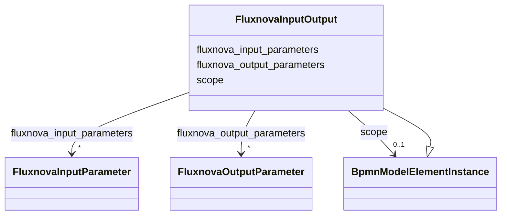

---
search:
  boost: 10.0
---

# Class: FluxnovaInputOutput 


_The BPMN inputOutput camunda extension element_


<div data-search-exclude markdown="1">


URI: [fluxnova_bpm_platform:FluxnovaInputOutput](https://w3id.org/TD-Universe/fluxnova-bpm-platform/FluxnovaInputOutput)





## Inheritance
* [BpmnModelElementInstance](BpmnModelElementInstance.md)
    * **FluxnovaInputOutput**


## Slots

| Name | Cardinality and Range | Description | Inheritance |
| ---  | --- | --- | --- |
| [fluxnova_input_parameters](fluxnova_input_parameters.md) | * <br/> [FluxnovaInputParameter](FluxnovaInputParameter.md) | Input parameters passed to this connector or script | direct |
| [fluxnova_output_parameters](fluxnova_output_parameters.md) | * <br/> [FluxnovaOutputParameter](FluxnovaOutputParameter.md) | Output parameters produced by this connector or script | direct |
| [scope](scope.md) | 0..1 <br/> [BpmnModelElementInstance](BpmnModelElementInstance.md) | Tests if the element is a scope like process or sub-process | [BpmnModelElementInstance](BpmnModelElementInstance.md) |


## Usages

| used by | used in | type | used |
| ---  | --- | --- | --- |
| [FluxnovaConnector](FluxnovaConnector.md) | [fluxnova_input_output](fluxnova_input_output.md) | range | [FluxnovaInputOutput](FluxnovaInputOutput.md) |


## In Subsets


* [FluxnovaExtensions](FluxnovaExtensions.md)
* [FluxnovaBpmnModel](FluxnovaBpmnModel.md)


## Identifier and Mapping Information


### Annotations

| property | value |
| --- | --- |
| java_package | org.finos.fluxnova.bpm.model.bpmn.instance.fluxnova |
| source_file | model-api/bpmn-model/src/main/java/org/finos/fluxnova/bpm/model/bpmn/instance/fluxnova/FluxnovaInputOutput.java |


### Schema Source


* from schema: https://w3id.org/TD-Universe/fluxnova-bpm-platform


## Mappings

| Mapping Type | Mapped Value |
| ---  | ---  |
| self | fluxnova_bpm_platform:FluxnovaInputOutput |
| native | fluxnova_bpm_platform:FluxnovaInputOutput |


## LinkML Source

<!-- TODO: investigate https://stackoverflow.com/questions/37606292/how-to-create-tabbed-code-blocks-in-mkdocs-or-sphinx -->

### Direct

<details>
```yaml
name: FluxnovaInputOutput
annotations:
  java_package:
    tag: java_package
    value: org.finos.fluxnova.bpm.model.bpmn.instance.fluxnova
  source_file:
    tag: source_file
    value: model-api/bpmn-model/src/main/java/org/finos/fluxnova/bpm/model/bpmn/instance/fluxnova/FluxnovaInputOutput.java
description: The BPMN inputOutput camunda extension element
in_subset:
- fluxnova_extensions
- fluxnova_bpmn_model
from_schema: https://w3id.org/TD-Universe/fluxnova-bpm-platform
is_a: BpmnModelElementInstance
slots:
- fluxnova_input_parameters
- fluxnova_output_parameters

```
</details>

### Induced

<details>
```yaml
name: FluxnovaInputOutput
annotations:
  java_package:
    tag: java_package
    value: org.finos.fluxnova.bpm.model.bpmn.instance.fluxnova
  source_file:
    tag: source_file
    value: model-api/bpmn-model/src/main/java/org/finos/fluxnova/bpm/model/bpmn/instance/fluxnova/FluxnovaInputOutput.java
description: The BPMN inputOutput camunda extension element
in_subset:
- fluxnova_extensions
- fluxnova_bpmn_model
from_schema: https://w3id.org/TD-Universe/fluxnova-bpm-platform
is_a: BpmnModelElementInstance
attributes:
  fluxnova_input_parameters:
    name: fluxnova_input_parameters
    description: Input parameters passed to this connector or script.
    from_schema: https://w3id.org/TD-Universe/fluxnova-bpm-platform
    rank: 1000
    owner: FluxnovaInputOutput
    domain_of:
    - FluxnovaInputOutput
    range: FluxnovaInputParameter
    multivalued: true
    inlined: true
    inlined_as_list: true
  fluxnova_output_parameters:
    name: fluxnova_output_parameters
    description: Output parameters produced by this connector or script.
    from_schema: https://w3id.org/TD-Universe/fluxnova-bpm-platform
    rank: 1000
    owner: FluxnovaInputOutput
    domain_of:
    - FluxnovaInputOutput
    range: FluxnovaOutputParameter
    multivalued: true
    inlined: true
    inlined_as_list: true
  scope:
    name: scope
    description: Tests if the element is a scope like process or sub-process.
    from_schema: https://w3id.org/TD-Universe/fluxnova-bpm-platform
    rank: 1000
    owner: FluxnovaInputOutput
    domain_of:
    - BpmnModelElementInstance
    range: BpmnModelElementInstance

```
</details></div>