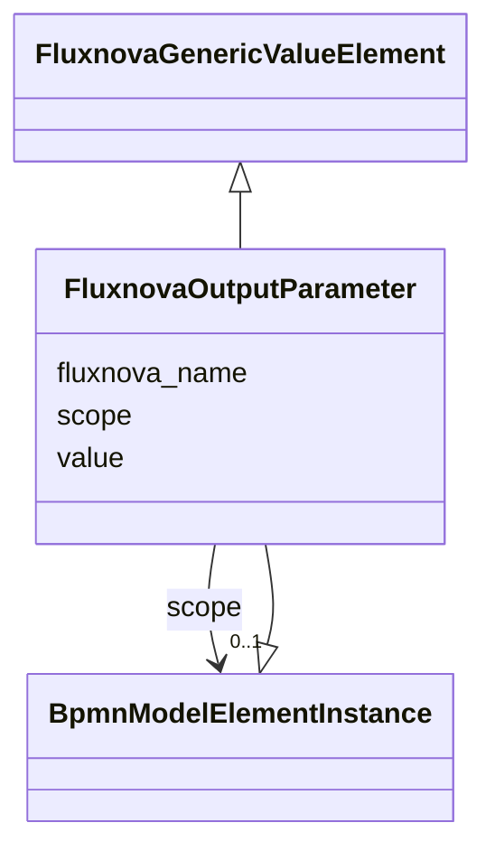

---
search:
  boost: 10.0
---

# Class: FluxnovaOutputParameter 


_The BPMN outputParameter camunda extension element_


<div data-search-exclude markdown="1">


URI: [fluxnova_bpm_platform:FluxnovaOutputParameter](https://w3id.org/TD-Universe/fluxnova-bpm-platform/FluxnovaOutputParameter)





## Inheritance
* [BpmnModelElementInstance](BpmnModelElementInstance.md)
    * **FluxnovaOutputParameter** [ [FluxnovaGenericValueElement](FluxnovaGenericValueElement.md)]


## Slots

| Name | Cardinality and Range | Description | Inheritance |
| ---  | --- | --- | --- |
| [fluxnova_name](fluxnova_name.md) | 0..1 <br/> [String](String.md) | Name attribute of this Fluxnova extension element | direct |
| [value](value.md) | 0..1 <br/> [String](String.md) | Value of this variable instance | [FluxnovaGenericValueElement](FluxnovaGenericValueElement.md) |
| [scope](scope.md) | 0..1 <br/> [BpmnModelElementInstance](BpmnModelElementInstance.md) | Tests if the element is a scope like process or sub-process | [BpmnModelElementInstance](BpmnModelElementInstance.md) |


## Usages

| used by | used in | type | used |
| ---  | --- | --- | --- |
| [FluxnovaInputOutput](FluxnovaInputOutput.md) | [fluxnova_output_parameters](fluxnova_output_parameters.md) | range | [FluxnovaOutputParameter](FluxnovaOutputParameter.md) |


## In Subsets


* [FluxnovaExtensions](FluxnovaExtensions.md)
* [FluxnovaBpmnModel](FluxnovaBpmnModel.md)


## Identifier and Mapping Information


### Annotations

| property | value |
| --- | --- |
| java_package | org.finos.fluxnova.bpm.model.bpmn.instance.fluxnova |
| source_file | model-api/bpmn-model/src/main/java/org/finos/fluxnova/bpm/model/bpmn/instance/fluxnova/FluxnovaOutputParameter.java |


### Schema Source


* from schema: https://w3id.org/TD-Universe/fluxnova-bpm-platform


## Mappings

| Mapping Type | Mapped Value |
| ---  | ---  |
| self | fluxnova_bpm_platform:FluxnovaOutputParameter |
| native | fluxnova_bpm_platform:FluxnovaOutputParameter |


## LinkML Source

<!-- TODO: investigate https://stackoverflow.com/questions/37606292/how-to-create-tabbed-code-blocks-in-mkdocs-or-sphinx -->

### Direct

<details>
```yaml
name: FluxnovaOutputParameter
annotations:
  java_package:
    tag: java_package
    value: org.finos.fluxnova.bpm.model.bpmn.instance.fluxnova
  source_file:
    tag: source_file
    value: model-api/bpmn-model/src/main/java/org/finos/fluxnova/bpm/model/bpmn/instance/fluxnova/FluxnovaOutputParameter.java
description: The BPMN outputParameter camunda extension element
in_subset:
- fluxnova_extensions
- fluxnova_bpmn_model
from_schema: https://w3id.org/TD-Universe/fluxnova-bpm-platform
is_a: BpmnModelElementInstance
mixins:
- FluxnovaGenericValueElement
slots:
- fluxnova_name

```
</details>

### Induced

<details>
```yaml
name: FluxnovaOutputParameter
annotations:
  java_package:
    tag: java_package
    value: org.finos.fluxnova.bpm.model.bpmn.instance.fluxnova
  source_file:
    tag: source_file
    value: model-api/bpmn-model/src/main/java/org/finos/fluxnova/bpm/model/bpmn/instance/fluxnova/FluxnovaOutputParameter.java
description: The BPMN outputParameter camunda extension element
in_subset:
- fluxnova_extensions
- fluxnova_bpmn_model
from_schema: https://w3id.org/TD-Universe/fluxnova-bpm-platform
is_a: BpmnModelElementInstance
mixins:
- FluxnovaGenericValueElement
attributes:
  fluxnova_name:
    name: fluxnova_name
    description: Name attribute of this Fluxnova extension element.
    from_schema: https://w3id.org/TD-Universe/fluxnova-bpm-platform
    rank: 1000
    owner: FluxnovaOutputParameter
    domain_of:
    - FluxnovaConstraint
    - FluxnovaField
    - FluxnovaFormProperty
    - FluxnovaInputParameter
    - FluxnovaOutputParameter
    - FluxnovaProperty
    - FluxnovaValue
    range: string
  value:
    name: value
    annotations:
      sql_column:
        tag: sql_column
        value: VALUE_
    description: Value of this variable instance.
    from_schema: https://w3id.org/TD-Universe/fluxnova-bpm-platform
    rank: 1000
    owner: FluxnovaOutputParameter
    domain_of:
    - MeterLog
    - Property
    - IdentityInfo
    - CategoryValue
    - FluxnovaGenericValueElement
    range: string
  scope:
    name: scope
    description: Tests if the element is a scope like process or sub-process.
    from_schema: https://w3id.org/TD-Universe/fluxnova-bpm-platform
    rank: 1000
    owner: FluxnovaOutputParameter
    domain_of:
    - BpmnModelElementInstance
    range: BpmnModelElementInstance

```
</details></div>