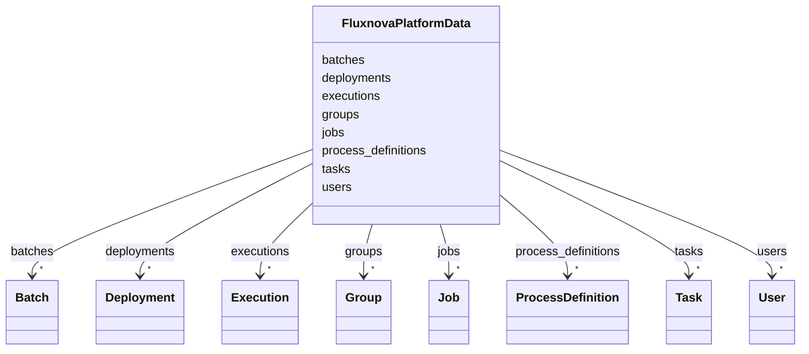

---
search:
  boost: 10.0
---

# Class: FluxnovaPlatformData 


_Root container for Fluxnova BPM Platform data._


<div data-search-exclude markdown="1">


URI: [fluxnova_bpm_platform:FluxnovaPlatformData](https://w3id.org/TD-Universe/fluxnova-bpm-platform/FluxnovaPlatformData)





<!-- no inheritance hierarchy -->

## Class Properties

| Property | Value |
| --- | --- |
| Tree Root | Yes |


## Slots

| Name | Cardinality and Range | Description | Inheritance |
| ---  | --- | --- | --- |
| [deployments](deployments.md) | * <br/> [Deployment](Deployment.md) | Deployed resources | direct |
| [process_definitions](process_definitions.md) | * <br/> [ProcessDefinition](ProcessDefinition.md) | Process definitions | direct |
| [executions](executions.md) | * <br/> [Execution](Execution.md) | Process execution instances | direct |
| [tasks](tasks.md) | * <br/> [Task](Task.md) | User tasks | direct |
| [jobs](jobs.md) | * <br/> [Job](Job.md) | Asynchronous jobs | direct |
| [users](users.md) | * <br/> [User](User.md) | Identity users | direct |
| [groups](groups.md) | * <br/> [Group](Group.md) | Identity groups | direct |
| [batches](batches.md) | * <br/> [Batch](Batch.md) | Batch operations | direct |


## In Subsets


* [Platform](Platform.md)
* [FluxnovaBpm](FluxnovaBpm.md)


## Identifier and Mapping Information


### Schema Source


* from schema: https://w3id.org/TD-Universe/fluxnova-bpm-platform


## Mappings

| Mapping Type | Mapped Value |
| ---  | ---  |
| self | fluxnova_bpm_platform:FluxnovaPlatformData |
| native | fluxnova_bpm_platform:FluxnovaPlatformData |


## LinkML Source

<!-- TODO: investigate https://stackoverflow.com/questions/37606292/how-to-create-tabbed-code-blocks-in-mkdocs-or-sphinx -->

### Direct

<details>
```yaml
name: FluxnovaPlatformData
description: Root container for Fluxnova BPM Platform data.
in_subset:
- platform
- fluxnova_bpm
from_schema: https://w3id.org/TD-Universe/fluxnova-bpm-platform
slots:
- deployments
- process_definitions
- executions
- tasks
- jobs
- users
- groups
- batches
slot_usage:
  deployments:
    name: deployments
    range: Deployment
    multivalued: true
    inlined_as_list: true
  process_definitions:
    name: process_definitions
    range: ProcessDefinition
    multivalued: true
    inlined_as_list: true
  executions:
    name: executions
    range: Execution
    multivalued: true
    inlined_as_list: true
  tasks:
    name: tasks
    range: Task
    multivalued: true
    inlined_as_list: true
  jobs:
    name: jobs
    range: Job
    multivalued: true
    inlined_as_list: true
  users:
    name: users
    range: User
    multivalued: true
    inlined_as_list: true
  groups:
    name: groups
    range: Group
    multivalued: true
    inlined_as_list: true
  batches:
    name: batches
    range: Batch
    multivalued: true
    inlined_as_list: true
tree_root: true

```
</details>

### Induced

<details>
```yaml
name: FluxnovaPlatformData
description: Root container for Fluxnova BPM Platform data.
in_subset:
- platform
- fluxnova_bpm
from_schema: https://w3id.org/TD-Universe/fluxnova-bpm-platform
slot_usage:
  deployments:
    name: deployments
    range: Deployment
    multivalued: true
    inlined_as_list: true
  process_definitions:
    name: process_definitions
    range: ProcessDefinition
    multivalued: true
    inlined_as_list: true
  executions:
    name: executions
    range: Execution
    multivalued: true
    inlined_as_list: true
  tasks:
    name: tasks
    range: Task
    multivalued: true
    inlined_as_list: true
  jobs:
    name: jobs
    range: Job
    multivalued: true
    inlined_as_list: true
  users:
    name: users
    range: User
    multivalued: true
    inlined_as_list: true
  groups:
    name: groups
    range: Group
    multivalued: true
    inlined_as_list: true
  batches:
    name: batches
    range: Batch
    multivalued: true
    inlined_as_list: true
attributes:
  deployments:
    name: deployments
    description: Deployed resources.
    from_schema: https://w3id.org/TD-Universe/fluxnova-bpm-platform
    rank: 1000
    owner: FluxnovaPlatformData
    domain_of:
    - FluxnovaPlatformData
    range: Deployment
    multivalued: true
    inlined: true
    inlined_as_list: true
  process_definitions:
    name: process_definitions
    description: Process definitions.
    from_schema: https://w3id.org/TD-Universe/fluxnova-bpm-platform
    rank: 1000
    owner: FluxnovaPlatformData
    domain_of:
    - FluxnovaPlatformData
    range: ProcessDefinition
    multivalued: true
    inlined: true
    inlined_as_list: true
  executions:
    name: executions
    description: Process execution instances.
    from_schema: https://w3id.org/TD-Universe/fluxnova-bpm-platform
    rank: 1000
    owner: FluxnovaPlatformData
    domain_of:
    - FluxnovaPlatformData
    range: Execution
    multivalued: true
    inlined: true
    inlined_as_list: true
  tasks:
    name: tasks
    description: User tasks.
    from_schema: https://w3id.org/TD-Universe/fluxnova-bpm-platform
    rank: 1000
    owner: FluxnovaPlatformData
    domain_of:
    - FluxnovaPlatformData
    range: Task
    multivalued: true
    inlined: true
    inlined_as_list: true
  jobs:
    name: jobs
    description: Asynchronous jobs.
    from_schema: https://w3id.org/TD-Universe/fluxnova-bpm-platform
    rank: 1000
    owner: FluxnovaPlatformData
    domain_of:
    - FluxnovaPlatformData
    range: Job
    multivalued: true
    inlined: true
    inlined_as_list: true
  users:
    name: users
    description: Identity users.
    from_schema: https://w3id.org/TD-Universe/fluxnova-bpm-platform
    rank: 1000
    owner: FluxnovaPlatformData
    domain_of:
    - FluxnovaPlatformData
    range: User
    multivalued: true
    inlined: true
    inlined_as_list: true
  groups:
    name: groups
    description: Identity groups.
    from_schema: https://w3id.org/TD-Universe/fluxnova-bpm-platform
    rank: 1000
    owner: FluxnovaPlatformData
    domain_of:
    - FluxnovaPlatformData
    range: Group
    multivalued: true
    inlined: true
    inlined_as_list: true
  batches:
    name: batches
    description: Batch operations.
    from_schema: https://w3id.org/TD-Universe/fluxnova-bpm-platform
    rank: 1000
    owner: FluxnovaPlatformData
    domain_of:
    - FluxnovaPlatformData
    range: Batch
    multivalued: true
    inlined: true
    inlined_as_list: true
tree_root: true

```
</details></div>