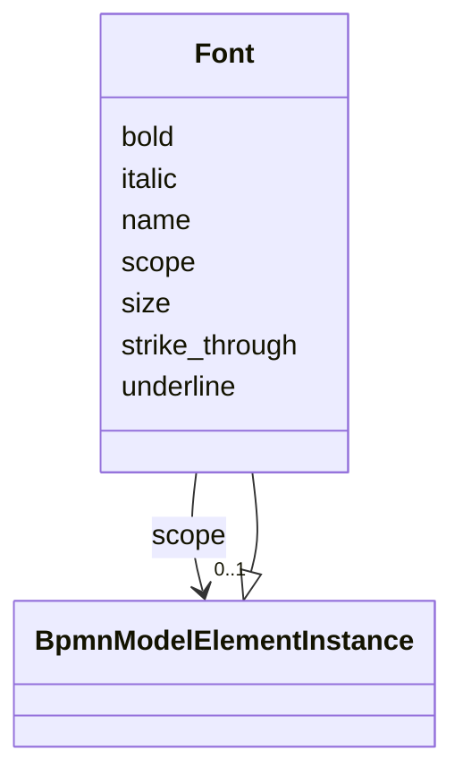

---
search:
  boost: 10.0
---

# Class: Font 


_The DC font element_


<div data-search-exclude markdown="1">


URI: [fluxnova_bpm_platform:Font](https://w3id.org/TD-Universe/fluxnova-bpm-platform/Font)





## Inheritance
* [BpmnModelElementInstance](BpmnModelElementInstance.md)
    * **Font**


## Slots

| Name | Cardinality and Range | Description | Inheritance |
| ---  | --- | --- | --- |
| [name](name.md) | 0..1 <br/> [String](String.md) | Human-readable name | direct |
| [size](size.md) | 0..1 <br/> [Float](Float.md) | Font size in points | direct |
| [bold](bold.md) | 0..1 <br/> [Boolean](Boolean.md) | Whether the font is rendered in bold | direct |
| [italic](italic.md) | 0..1 <br/> [Boolean](Boolean.md) | Whether the font is rendered in italic | direct |
| [underline](underline.md) | 0..1 <br/> [Boolean](Boolean.md) | Whether the font is underlined | direct |
| [strike_through](strike_through.md) | 0..1 <br/> [Boolean](Boolean.md) | Whether the font has a strike-through decoration | direct |
| [scope](scope.md) | 0..1 <br/> [BpmnModelElementInstance](BpmnModelElementInstance.md) | Tests if the element is a scope like process or sub-process | [BpmnModelElementInstance](BpmnModelElementInstance.md) |


## Usages

| used by | used in | type | used |
| ---  | --- | --- | --- |
| [BpmnLabelStyle](BpmnLabelStyle.md) | [font](font.md) | range | [Font](Font.md) |


## In Subsets


* [Dc](Dc.md)
* [FluxnovaBpmnModel](FluxnovaBpmnModel.md)


## Identifier and Mapping Information


### Annotations

| property | value |
| --- | --- |
| java_package | org.finos.fluxnova.bpm.model.bpmn.instance.dc |
| source_file | model-api/bpmn-model/src/main/java/org/finos/fluxnova/bpm/model/bpmn/instance/dc/Font.java |


### Schema Source


* from schema: https://w3id.org/TD-Universe/fluxnova-bpm-platform


## Mappings

| Mapping Type | Mapped Value |
| ---  | ---  |
| self | fluxnova_bpm_platform:Font |
| native | fluxnova_bpm_platform:Font |


## LinkML Source

<!-- TODO: investigate https://stackoverflow.com/questions/37606292/how-to-create-tabbed-code-blocks-in-mkdocs-or-sphinx -->

### Direct

<details>
```yaml
name: Font
annotations:
  java_package:
    tag: java_package
    value: org.finos.fluxnova.bpm.model.bpmn.instance.dc
  source_file:
    tag: source_file
    value: model-api/bpmn-model/src/main/java/org/finos/fluxnova/bpm/model/bpmn/instance/dc/Font.java
description: The DC font element
in_subset:
- dc
- fluxnova_bpmn_model
from_schema: https://w3id.org/TD-Universe/fluxnova-bpm-platform
is_a: BpmnModelElementInstance
slots:
- name
- size
- bold
- italic
- underline
- strike_through

```
</details>

### Induced

<details>
```yaml
name: Font
annotations:
  java_package:
    tag: java_package
    value: org.finos.fluxnova.bpm.model.bpmn.instance.dc
  source_file:
    tag: source_file
    value: model-api/bpmn-model/src/main/java/org/finos/fluxnova/bpm/model/bpmn/instance/dc/Font.java
description: The DC font element
in_subset:
- dc
- fluxnova_bpmn_model
from_schema: https://w3id.org/TD-Universe/fluxnova-bpm-platform
is_a: BpmnModelElementInstance
attributes:
  name:
    name: name
    description: Human-readable name.
    from_schema: https://w3id.org/TD-Universe/fluxnova-bpm-platform
    rank: 1000
    slot_uri: schema:name
    owner: Font
    domain_of:
    - ByteArray
    - MeterLog
    - Property
    - Group
    - Tenant
    - Task
    - VariableInstance
    - Attachment
    - Filter
    - Deployment
    - ResourceDefinition
    - HistoricDetail
    - HistoricTaskInstance
    - HistoricVariableInstance
    - Font
    - Diagram
    - CallableElement
    - Category
    - Collaboration
    - ConversationLink
    - ConversationNode
    - CorrelationKey
    - CorrelationProperty
    - DataInput
    - DataOutput
    - DataState
    - DataStore
    - Definitions
    - Error
    - Escalation
    - FlowElement
    - InputSet
    - Interface
    - Lane
    - LaneSet
    - LinkEventDefinition
    - Message
    - MessageFlow
    - Operation
    - OutputSet
    - Participant
    - BpmnProperty
    - Resource
    - ResourceParameter
    - ResourceRole
    - Signal
    range: string
  size:
    name: size
    description: Font size in points.
    from_schema: https://w3id.org/TD-Universe/fluxnova-bpm-platform
    rank: 1000
    owner: Font
    domain_of:
    - Font
    range: float
  bold:
    name: bold
    description: Whether the font is rendered in bold.
    from_schema: https://w3id.org/TD-Universe/fluxnova-bpm-platform
    rank: 1000
    owner: Font
    domain_of:
    - Font
    range: boolean
  italic:
    name: italic
    description: Whether the font is rendered in italic.
    from_schema: https://w3id.org/TD-Universe/fluxnova-bpm-platform
    rank: 1000
    owner: Font
    domain_of:
    - Font
    range: boolean
  underline:
    name: underline
    description: Whether the font is underlined.
    from_schema: https://w3id.org/TD-Universe/fluxnova-bpm-platform
    rank: 1000
    owner: Font
    domain_of:
    - Font
    range: boolean
  strike_through:
    name: strike_through
    description: Whether the font has a strike-through decoration.
    from_schema: https://w3id.org/TD-Universe/fluxnova-bpm-platform
    rank: 1000
    owner: Font
    domain_of:
    - Font
    range: boolean
  scope:
    name: scope
    description: Tests if the element is a scope like process or sub-process.
    from_schema: https://w3id.org/TD-Universe/fluxnova-bpm-platform
    rank: 1000
    owner: Font
    domain_of:
    - BpmnModelElementInstance
    range: BpmnModelElementInstance

```
</details></div>