---
search:
  boost: 10.0
---

# Class: GlobalConversation 


_The BPMN globalConversation element_


<div data-search-exclude markdown="1">


URI: [fluxnova_bpm_platform:GlobalConversation](https://w3id.org/TD-Universe/fluxnova-bpm-platform/GlobalConversation)

```mermaid
 classDiagram
    class GlobalConversation
    click GlobalConversation href "../GlobalConversation/"
      Collaboration <|-- GlobalConversation
        click Collaboration href "../Collaboration/"
      
      GlobalConversation : artifacts
        
          
    
        
        
        GlobalConversation --> "*" Artifact : artifacts
        click Artifact href "../Artifact/"
    

        
      GlobalConversation : closed
        
      GlobalConversation : conversation_associations
        
          
    
        
        
        GlobalConversation --> "*" ConversationAssociation : conversation_associations
        click ConversationAssociation href "../ConversationAssociation/"
    

        
      GlobalConversation : conversation_links
        
          
    
        
        
        GlobalConversation --> "*" ConversationLink : conversation_links
        click ConversationLink href "../ConversationLink/"
    

        
      GlobalConversation : conversation_nodes
        
          
    
        
        
        GlobalConversation --> "*" ConversationNode : conversation_nodes
        click ConversationNode href "../ConversationNode/"
    

        
      GlobalConversation : correlation_keys
        
          
    
        
        
        GlobalConversation --> "*" CorrelationKey : correlation_keys
        click CorrelationKey href "../CorrelationKey/"
    

        
      GlobalConversation : diagram_element
        
          
    
        
        
        GlobalConversation --> "0..1" DiagramElement : diagram_element
        click DiagramElement href "../DiagramElement/"
    

        
      GlobalConversation : documentations
        
          
    
        
        
        GlobalConversation --> "*" Documentation : documentations
        click Documentation href "../Documentation/"
    

        
      GlobalConversation : extension_elements
        
          
    
        
        
        GlobalConversation --> "0..1" ExtensionElements : extension_elements
        click ExtensionElements href "../ExtensionElements/"
    

        
      GlobalConversation : id
        
      GlobalConversation : message_flow_associations
        
          
    
        
        
        GlobalConversation --> "*" MessageFlowAssociation : message_flow_associations
        click MessageFlowAssociation href "../MessageFlowAssociation/"
    

        
      GlobalConversation : message_flows
        
          
    
        
        
        GlobalConversation --> "*" MessageFlow : message_flows
        click MessageFlow href "../MessageFlow/"
    

        
      GlobalConversation : name
        
      GlobalConversation : participant_associations
        
          
    
        
        
        GlobalConversation --> "*" ParticipantAssociation : participant_associations
        click ParticipantAssociation href "../ParticipantAssociation/"
    

        
      GlobalConversation : participants
        
          
    
        
        
        GlobalConversation --> "*" Participant : participants
        click Participant href "../Participant/"
    

        
      GlobalConversation : scope
        
          
    
        
        
        GlobalConversation --> "0..1" BpmnModelElementInstance : scope
        click BpmnModelElementInstance href "../BpmnModelElementInstance/"
    

        
      
```





## Inheritance
* [BpmnModelElementInstance](BpmnModelElementInstance.md)
    * [BaseElement](BaseElement.md)
        * [RootElement](RootElement.md)
            * [Collaboration](Collaboration.md)
                * **GlobalConversation**


## Slots

| Name | Cardinality and Range | Description | Inheritance |
| ---  | --- | --- | --- |
| [name](name.md) | 0..1 <br/> [String](String.md) | Human-readable name | [Collaboration](Collaboration.md) |
| [closed](closed.md) | 0..1 <br/> [Boolean](Boolean.md) | Whether closed | [Collaboration](Collaboration.md) |
| [participants](participants.md) | * <br/> [Participant](Participant.md) | Participants (pools) in this collaboration | [Collaboration](Collaboration.md) |
| [message_flows](message_flows.md) | * <br/> [MessageFlow](MessageFlow.md) | Message flows between participants in this collaboration | [Collaboration](Collaboration.md) |
| [artifacts](artifacts.md) | * <br/> [Artifact](Artifact.md) | Artifacts (text annotations, groups, associations) in this process | [Collaboration](Collaboration.md) |
| [conversation_nodes](conversation_nodes.md) | * <br/> [ConversationNode](ConversationNode.md) | Conversation nodes in this collaboration | [Collaboration](Collaboration.md) |
| [conversation_associations](conversation_associations.md) | * <br/> [ConversationAssociation](ConversationAssociation.md) | Associations linking conversation nodes to other elements | [Collaboration](Collaboration.md) |
| [participant_associations](participant_associations.md) | * <br/> [ParticipantAssociation](ParticipantAssociation.md) | Associations between participants | [Collaboration](Collaboration.md) |
| [message_flow_associations](message_flow_associations.md) | * <br/> [MessageFlowAssociation](MessageFlowAssociation.md) | Associations between message flows | [Collaboration](Collaboration.md) |
| [correlation_keys](correlation_keys.md) | * <br/> [CorrelationKey](CorrelationKey.md) | Correlation keys used to correlate messages in this collaboration | [Collaboration](Collaboration.md) |
| [conversation_links](conversation_links.md) | * <br/> [ConversationLink](ConversationLink.md) | TODO: choreographyRef | [Collaboration](Collaboration.md) |
| [id](id.md) | 1 <br/> [String](String.md) | Unique identifier | [BaseElement](BaseElement.md) |
| [documentations](documentations.md) | * <br/> [Documentation](Documentation.md) | Collection of documentation elements associated with this element | [BaseElement](BaseElement.md) |
| [extension_elements](extension_elements.md) | 0..1 <br/> [ExtensionElements](ExtensionElements.md) | Extension elements holding vendor-specific metadata | [BaseElement](BaseElement.md) |
| [diagram_element](diagram_element.md) | 0..1 <br/> [DiagramElement](DiagramElement.md) | The diagram element that visually represents this BPMN element | [BaseElement](BaseElement.md) |
| [scope](scope.md) | 0..1 <br/> [BpmnModelElementInstance](BpmnModelElementInstance.md) | Tests if the element is a scope like process or sub-process | [BpmnModelElementInstance](BpmnModelElementInstance.md) |


## Usages

| used by | used in | type | used |
| ---  | --- | --- | --- |
| [CallConversation](CallConversation.md) | [called_collaboration](called_collaboration.md) | range | [GlobalConversation](GlobalConversation.md) |


## In Subsets


* [Instance](Instance.md)
* [FluxnovaBpmnModel](FluxnovaBpmnModel.md)


## Identifier and Mapping Information


### Annotations

| property | value |
| --- | --- |
| java_package | org.finos.fluxnova.bpm.model.bpmn.instance |
| source_file | model-api/bpmn-model/src/main/java/org/finos/fluxnova/bpm/model/bpmn/instance/GlobalConversation.java |


### Schema Source


* from schema: https://w3id.org/TD-Universe/fluxnova-bpm-platform


## Mappings

| Mapping Type | Mapped Value |
| ---  | ---  |
| self | fluxnova_bpm_platform:GlobalConversation |
| native | fluxnova_bpm_platform:GlobalConversation |


## LinkML Source

<!-- TODO: investigate https://stackoverflow.com/questions/37606292/how-to-create-tabbed-code-blocks-in-mkdocs-or-sphinx -->

### Direct

<details>
```yaml
name: GlobalConversation
annotations:
  java_package:
    tag: java_package
    value: org.finos.fluxnova.bpm.model.bpmn.instance
  source_file:
    tag: source_file
    value: model-api/bpmn-model/src/main/java/org/finos/fluxnova/bpm/model/bpmn/instance/GlobalConversation.java
description: The BPMN globalConversation element
in_subset:
- instance
- fluxnova_bpmn_model
from_schema: https://w3id.org/TD-Universe/fluxnova-bpm-platform
is_a: Collaboration

```
</details>

### Induced

<details>
```yaml
name: GlobalConversation
annotations:
  java_package:
    tag: java_package
    value: org.finos.fluxnova.bpm.model.bpmn.instance
  source_file:
    tag: source_file
    value: model-api/bpmn-model/src/main/java/org/finos/fluxnova/bpm/model/bpmn/instance/GlobalConversation.java
description: The BPMN globalConversation element
in_subset:
- instance
- fluxnova_bpmn_model
from_schema: https://w3id.org/TD-Universe/fluxnova-bpm-platform
is_a: Collaboration
attributes:
  name:
    name: name
    description: Human-readable name.
    from_schema: https://w3id.org/TD-Universe/fluxnova-bpm-platform
    rank: 1000
    slot_uri: schema:name
    owner: GlobalConversation
    domain_of:
    - ByteArray
    - MeterLog
    - Property
    - Group
    - Tenant
    - Task
    - VariableInstance
    - Attachment
    - Filter
    - Deployment
    - ResourceDefinition
    - HistoricDetail
    - HistoricTaskInstance
    - HistoricVariableInstance
    - Font
    - Diagram
    - CallableElement
    - Category
    - Collaboration
    - ConversationLink
    - ConversationNode
    - CorrelationKey
    - CorrelationProperty
    - DataInput
    - DataOutput
    - DataState
    - DataStore
    - Definitions
    - Error
    - Escalation
    - FlowElement
    - InputSet
    - Interface
    - Lane
    - LaneSet
    - LinkEventDefinition
    - Message
    - MessageFlow
    - Operation
    - OutputSet
    - Participant
    - BpmnProperty
    - Resource
    - ResourceParameter
    - ResourceRole
    - Signal
    range: string
  closed:
    name: closed
    description: Whether closed.
    from_schema: https://w3id.org/TD-Universe/fluxnova-bpm-platform
    rank: 1000
    owner: GlobalConversation
    domain_of:
    - Collaboration
    - Process
    range: boolean
  participants:
    name: participants
    description: Participants (pools) in this collaboration.
    from_schema: https://w3id.org/TD-Universe/fluxnova-bpm-platform
    rank: 1000
    owner: GlobalConversation
    domain_of:
    - Collaboration
    - ConversationNode
    range: Participant
    multivalued: true
    inlined: true
    inlined_as_list: true
  message_flows:
    name: message_flows
    description: Message flows between participants in this collaboration.
    from_schema: https://w3id.org/TD-Universe/fluxnova-bpm-platform
    rank: 1000
    owner: GlobalConversation
    domain_of:
    - Collaboration
    - ConversationNode
    range: MessageFlow
    multivalued: true
    inlined: true
    inlined_as_list: true
  artifacts:
    name: artifacts
    description: Artifacts (text annotations, groups, associations) in this process.
    from_schema: https://w3id.org/TD-Universe/fluxnova-bpm-platform
    rank: 1000
    owner: GlobalConversation
    domain_of:
    - Collaboration
    - Process
    - SubProcess
    range: Artifact
    multivalued: true
    inlined: true
    inlined_as_list: true
  conversation_nodes:
    name: conversation_nodes
    description: Conversation nodes in this collaboration.
    from_schema: https://w3id.org/TD-Universe/fluxnova-bpm-platform
    rank: 1000
    owner: GlobalConversation
    domain_of:
    - Collaboration
    - SubConversation
    range: ConversationNode
    multivalued: true
    inlined: true
    inlined_as_list: true
  conversation_associations:
    name: conversation_associations
    description: Associations linking conversation nodes to other elements.
    from_schema: https://w3id.org/TD-Universe/fluxnova-bpm-platform
    rank: 1000
    owner: GlobalConversation
    domain_of:
    - Collaboration
    range: ConversationAssociation
    multivalued: true
    inlined: true
    inlined_as_list: true
  participant_associations:
    name: participant_associations
    description: Associations between participants.
    from_schema: https://w3id.org/TD-Universe/fluxnova-bpm-platform
    rank: 1000
    owner: GlobalConversation
    domain_of:
    - CallConversation
    - Collaboration
    range: ParticipantAssociation
    multivalued: true
    inlined: true
    inlined_as_list: true
  message_flow_associations:
    name: message_flow_associations
    description: Associations between message flows.
    from_schema: https://w3id.org/TD-Universe/fluxnova-bpm-platform
    rank: 1000
    owner: GlobalConversation
    domain_of:
    - Collaboration
    range: MessageFlowAssociation
    multivalued: true
    inlined: true
    inlined_as_list: true
  correlation_keys:
    name: correlation_keys
    description: Correlation keys used to correlate messages in this collaboration.
    from_schema: https://w3id.org/TD-Universe/fluxnova-bpm-platform
    rank: 1000
    owner: GlobalConversation
    domain_of:
    - Collaboration
    - ConversationNode
    range: CorrelationKey
    multivalued: true
    inlined: true
    inlined_as_list: true
  conversation_links:
    name: conversation_links
    description: 'TODO: choreographyRef'
    from_schema: https://w3id.org/TD-Universe/fluxnova-bpm-platform
    rank: 1000
    owner: GlobalConversation
    domain_of:
    - Collaboration
    range: ConversationLink
    multivalued: true
    inlined: true
    inlined_as_list: true
  id:
    name: id
    description: Unique identifier.
    from_schema: https://w3id.org/TD-Universe/fluxnova-bpm-platform
    rank: 1000
    slot_uri: schema:identifier
    identifier: true
    owner: GlobalConversation
    domain_of:
    - ByteArray
    - MeterLog
    - SchemaLogEntry
    - TaskMeterLog
    - Authorization
    - Group
    - IdentityInfo
    - IdentityLink
    - Tenant
    - TenantMembership
    - User
    - CaseExecution
    - CaseSentryPart
    - EventSubscription
    - Execution
    - ExternalTask
    - Incident
    - Task
    - VariableInstance
    - Attachment
    - Comment
    - Filter
    - Deployment
    - ResourceDefinition
    - Batch
    - Job
    - JobDefinition
    - HistoricBatch
    - HistoricDecisionInputInstance
    - HistoricDecisionInstance
    - HistoricDecisionOutputInstance
    - HistoricDetail
    - HistoricExternalTaskLog
    - HistoricIdentityLink
    - HistoricIncident
    - HistoricJobLog
    - HistoricScopeInstance
    - HistoricVariableInstance
    - UserOperationLogEntry
    - Diagram
    - DiagramElement
    - Style
    - BaseElement
    - Definitions
    - Documentation
    - InteractionNode
    range: string
    required: true
  documentations:
    name: documentations
    description: Collection of documentation elements associated with this element.
    from_schema: https://w3id.org/TD-Universe/fluxnova-bpm-platform
    rank: 1000
    owner: GlobalConversation
    domain_of:
    - BaseElement
    range: Documentation
    multivalued: true
    inlined: true
    inlined_as_list: true
  extension_elements:
    name: extension_elements
    description: Extension elements holding vendor-specific metadata.
    from_schema: https://w3id.org/TD-Universe/fluxnova-bpm-platform
    rank: 1000
    owner: GlobalConversation
    domain_of:
    - BaseElement
    range: ExtensionElements
  diagram_element:
    name: diagram_element
    description: The diagram element that visually represents this BPMN element.
    from_schema: https://w3id.org/TD-Universe/fluxnova-bpm-platform
    rank: 1000
    owner: GlobalConversation
    domain_of:
    - BaseElement
    range: DiagramElement
  scope:
    name: scope
    description: Tests if the element is a scope like process or sub-process.
    from_schema: https://w3id.org/TD-Universe/fluxnova-bpm-platform
    rank: 1000
    owner: GlobalConversation
    domain_of:
    - BpmnModelElementInstance
    range: BpmnModelElementInstance

```
</details></div>