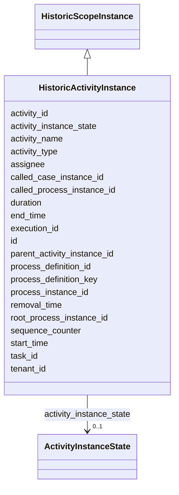

---
search:
  boost: 10.0
---

# Class: HistoricActivityInstance 


_Represents one execution of an activity and it's stored permanent for statistics, audit and other business intelligence purposes._


<div data-search-exclude markdown="1">


URI: [fluxnova_bpm_platform:HistoricActivityInstance](https://w3id.org/TD-Universe/fluxnova-bpm-platform/HistoricActivityInstance)





## Inheritance
* [HistoricScopeInstance](HistoricScopeInstance.md)
    * **HistoricActivityInstance**


## Slots

| Name | Cardinality and Range | Description | Inheritance |
| ---  | --- | --- | --- |
| [parent_activity_instance_id](parent_activity_instance_id.md) | 0..1 <br/> [String](String.md) | Id of the parent activity instance | direct |
| [execution_id](execution_id.md) | 1 <br/> [String](String.md) | Reference to the execution | direct |
| [activity_id](activity_id.md) | 1 <br/> [String](String.md) | BPMN activity element identifier | direct |
| [task_id](task_id.md) | 0..1 <br/> [String](String.md) | Reference to the task | direct |
| [called_process_instance_id](called_process_instance_id.md) | 0..1 <br/> [String](String.md) | The called process instance in case of call activity | direct |
| [called_case_instance_id](called_case_instance_id.md) | 0..1 <br/> [String](String.md) | The called case instance in case of (case) call activity | direct |
| [activity_name](activity_name.md) | 0..1 <br/> [String](String.md) | The display name for the activity | direct |
| [activity_type](activity_type.md) | 1 <br/> [String](String.md) | The activity type of the activity | direct |
| [assignee](assignee.md) | 0..1 <br/> [String](String.md) | The userId of the person to which this task is assigned or delegated | direct |
| [activity_instance_state](activity_instance_state.md) | 0..1 <br/> [ActivityInstanceState](ActivityInstanceState.md) | The activity instance state | direct |
| [sequence_counter](sequence_counter.md) | 0..1 <br/> [Integer](Integer.md) | Monotonically increasing counter for ordering | direct |
| [tenant_id](tenant_id.md) | 0..1 <br/> [String](String.md) | Multi-tenancy discriminator | direct |
| [id](id.md) | 1 <br/> [String](String.md) | Unique identifier | [HistoricScopeInstance](HistoricScopeInstance.md) |
| [root_process_instance_id](root_process_instance_id.md) | 0..1 <br/> [String](String.md) | Root process instance for history cleanup | [HistoricScopeInstance](HistoricScopeInstance.md) |
| [process_instance_id](process_instance_id.md) | 1 <br/> [String](String.md) | Reference to the process instance | [HistoricScopeInstance](HistoricScopeInstance.md) |
| [process_definition_id](process_definition_id.md) | 1 <br/> [String](String.md) | Reference to the process definition | [HistoricScopeInstance](HistoricScopeInstance.md) |
| [process_definition_key](process_definition_key.md) | 0..1 <br/> [String](String.md) | Key of the process definition | [HistoricScopeInstance](HistoricScopeInstance.md) |
| [start_time](start_time.md) | 1 <br/> [Datetime](Datetime.md) | Start timestamp | [HistoricScopeInstance](HistoricScopeInstance.md) |
| [end_time](end_time.md) | 0..1 <br/> [Datetime](Datetime.md) | End timestamp | [HistoricScopeInstance](HistoricScopeInstance.md) |
| [duration](duration.md) | 0..1 <br/> [Integer](Integer.md) | Duration in milliseconds | [HistoricScopeInstance](HistoricScopeInstance.md) |
| [removal_time](removal_time.md) | 0..1 <br/> [Datetime](Datetime.md) | Timestamp when this entity is eligible for removal | [HistoricScopeInstance](HistoricScopeInstance.md) |


## In Subsets


* [History](History.md)
* [FluxnovaBpm](FluxnovaBpm.md)


## Identifier and Mapping Information


### Annotations

| property | value |
| --- | --- |
| sql_table | ACT_HI_ACTINST |


### Schema Source


* from schema: https://w3id.org/TD-Universe/fluxnova-bpm-platform


## Mappings

| Mapping Type | Mapped Value |
| ---  | ---  |
| self | fluxnova_bpm_platform:HistoricActivityInstance |
| native | fluxnova_bpm_platform:HistoricActivityInstance |


## LinkML Source

<!-- TODO: investigate https://stackoverflow.com/questions/37606292/how-to-create-tabbed-code-blocks-in-mkdocs-or-sphinx -->

### Direct

<details>
```yaml
name: HistoricActivityInstance
annotations:
  sql_table:
    tag: sql_table
    value: ACT_HI_ACTINST
description: Represents one execution of an activity and it's stored permanent for
  statistics, audit and other business intelligence purposes.
in_subset:
- history
- fluxnova_bpm
from_schema: https://w3id.org/TD-Universe/fluxnova-bpm-platform
is_a: HistoricScopeInstance
slots:
- parent_activity_instance_id
- execution_id
- activity_id
- task_id
- called_process_instance_id
- called_case_instance_id
- activity_name
- activity_type
- assignee
- activity_instance_state
- sequence_counter
- tenant_id
slot_usage:
  process_definition_id:
    name: process_definition_id
    required: true
  process_instance_id:
    name: process_instance_id
    required: true
  execution_id:
    name: execution_id
    required: true
  activity_id:
    name: activity_id
    required: true
  start_time:
    name: start_time
    required: true

```
</details>

### Induced

<details>
```yaml
name: HistoricActivityInstance
annotations:
  sql_table:
    tag: sql_table
    value: ACT_HI_ACTINST
description: Represents one execution of an activity and it's stored permanent for
  statistics, audit and other business intelligence purposes.
in_subset:
- history
- fluxnova_bpm
from_schema: https://w3id.org/TD-Universe/fluxnova-bpm-platform
is_a: HistoricScopeInstance
slot_usage:
  process_definition_id:
    name: process_definition_id
    required: true
  process_instance_id:
    name: process_instance_id
    required: true
  execution_id:
    name: execution_id
    required: true
  activity_id:
    name: activity_id
    required: true
  start_time:
    name: start_time
    required: true
attributes:
  parent_activity_instance_id:
    name: parent_activity_instance_id
    annotations:
      sql_column:
        tag: sql_column
        value: PARENT_ACT_INST_ID_
    description: Id of the parent activity instance
    from_schema: https://w3id.org/TD-Universe/fluxnova-bpm-platform
    rank: 1000
    owner: HistoricActivityInstance
    domain_of:
    - HistoricActivityInstance
    - HistoricCaseActivityInstance
    range: string
  execution_id:
    name: execution_id
    description: Reference to the execution.
    from_schema: https://w3id.org/TD-Universe/fluxnova-bpm-platform
    rank: 1000
    owner: HistoricActivityInstance
    domain_of:
    - EventSubscription
    - ExternalTask
    - Incident
    - Task
    - VariableInstance
    - Job
    - HistoricActivityInstance
    - HistoricDetail
    - HistoricExternalTaskLog
    - HistoricIncident
    - HistoricJobLog
    - HistoricTaskInstance
    - HistoricVariableInstance
    - UserOperationLogEntry
    range: string
    required: true
  activity_id:
    name: activity_id
    description: BPMN activity element identifier.
    from_schema: https://w3id.org/TD-Universe/fluxnova-bpm-platform
    rank: 1000
    owner: HistoricActivityInstance
    domain_of:
    - CaseExecution
    - EventSubscription
    - Execution
    - ExternalTask
    - Incident
    - JobDefinition
    - HistoricActivityInstance
    - HistoricDecisionInstance
    - HistoricExternalTaskLog
    - HistoricIncident
    - HistoricJobLog
    range: string
    required: true
  task_id:
    name: task_id
    description: Reference to the task.
    from_schema: https://w3id.org/TD-Universe/fluxnova-bpm-platform
    rank: 1000
    owner: HistoricActivityInstance
    domain_of:
    - IdentityLink
    - VariableInstance
    - Attachment
    - Comment
    - HistoricActivityInstance
    - HistoricCaseActivityInstance
    - HistoricDetail
    - HistoricIdentityLink
    - HistoricVariableInstance
    - UserOperationLogEntry
    range: string
  called_process_instance_id:
    name: called_process_instance_id
    annotations:
      sql_column:
        tag: sql_column
        value: CALL_PROC_INST_ID_
    description: The called process instance in case of call activity
    from_schema: https://w3id.org/TD-Universe/fluxnova-bpm-platform
    rank: 1000
    owner: HistoricActivityInstance
    domain_of:
    - HistoricActivityInstance
    - HistoricCaseActivityInstance
    range: string
  called_case_instance_id:
    name: called_case_instance_id
    annotations:
      sql_column:
        tag: sql_column
        value: CALL_CASE_INST_ID_
    description: The called case instance in case of (case) call activity
    from_schema: https://w3id.org/TD-Universe/fluxnova-bpm-platform
    rank: 1000
    owner: HistoricActivityInstance
    domain_of:
    - HistoricActivityInstance
    - HistoricCaseActivityInstance
    range: string
  activity_name:
    name: activity_name
    annotations:
      sql_column:
        tag: sql_column
        value: ACT_NAME_
    description: The display name for the activity
    from_schema: https://w3id.org/TD-Universe/fluxnova-bpm-platform
    rank: 1000
    owner: HistoricActivityInstance
    domain_of:
    - HistoricActivityInstance
    range: string
  activity_type:
    name: activity_type
    annotations:
      sql_column:
        tag: sql_column
        value: ACT_TYPE_
    description: The activity type of the activity. Typically the activity type correspond
      to the XML tag used in the BPMN 2.0 process definition file. All activity types
      are available in org.finos.fluxnova.bpm.eng...
    from_schema: https://w3id.org/TD-Universe/fluxnova-bpm-platform
    rank: 1000
    owner: HistoricActivityInstance
    domain_of:
    - HistoricActivityInstance
    range: string
    required: true
  assignee:
    name: assignee
    annotations:
      sql_column:
        tag: sql_column
        value: ASSIGNEE_
    description: The userId of the person to which this task is assigned or delegated.
    from_schema: https://w3id.org/TD-Universe/fluxnova-bpm-platform
    rank: 1000
    owner: HistoricActivityInstance
    domain_of:
    - Task
    - HistoricActivityInstance
    - HistoricTaskInstance
    range: string
  activity_instance_state:
    name: activity_instance_state
    annotations:
      sql_column:
        tag: sql_column
        value: ACT_INST_STATE_
    description: The activity instance state.
    from_schema: https://w3id.org/TD-Universe/fluxnova-bpm-platform
    rank: 1000
    owner: HistoricActivityInstance
    domain_of:
    - HistoricActivityInstance
    range: ActivityInstanceState
  sequence_counter:
    name: sequence_counter
    annotations:
      sql_column:
        tag: sql_column
        value: SEQUENCE_COUNTER_
    description: Monotonically increasing counter for ordering.
    from_schema: https://w3id.org/TD-Universe/fluxnova-bpm-platform
    rank: 1000
    owner: HistoricActivityInstance
    domain_of:
    - Execution
    - VariableInstance
    - Job
    - HistoricActivityInstance
    - HistoricDetail
    - HistoricJobLog
    range: integer
  tenant_id:
    name: tenant_id
    description: Multi-tenancy discriminator.
    from_schema: https://w3id.org/TD-Universe/fluxnova-bpm-platform
    rank: 1000
    owner: HistoricActivityInstance
    domain_of:
    - ByteArray
    - IdentityLink
    - TenantMembership
    - CaseExecution
    - CaseSentryPart
    - EventSubscription
    - Execution
    - ExternalTask
    - Incident
    - Task
    - VariableInstance
    - Attachment
    - Comment
    - Deployment
    - ResourceDefinition
    - Batch
    - Job
    - JobDefinition
    - HistoricActivityInstance
    - HistoricBatch
    - HistoricCaseActivityInstance
    - HistoricCaseInstance
    - HistoricDecisionInputInstance
    - HistoricDecisionInstance
    - HistoricDecisionOutputInstance
    - HistoricDetail
    - HistoricExternalTaskLog
    - HistoricIdentityLink
    - HistoricIncident
    - HistoricJobLog
    - HistoricProcessInstance
    - HistoricTaskInstance
    - HistoricVariableInstance
    - UserOperationLogEntry
    range: string
  id:
    name: id
    description: Unique identifier.
    from_schema: https://w3id.org/TD-Universe/fluxnova-bpm-platform
    rank: 1000
    slot_uri: schema:identifier
    identifier: true
    owner: HistoricActivityInstance
    domain_of:
    - ByteArray
    - MeterLog
    - SchemaLogEntry
    - TaskMeterLog
    - Authorization
    - Group
    - IdentityInfo
    - IdentityLink
    - Tenant
    - TenantMembership
    - User
    - CaseExecution
    - CaseSentryPart
    - EventSubscription
    - Execution
    - ExternalTask
    - Incident
    - Task
    - VariableInstance
    - Attachment
    - Comment
    - Filter
    - Deployment
    - ResourceDefinition
    - Batch
    - Job
    - JobDefinition
    - HistoricBatch
    - HistoricDecisionInputInstance
    - HistoricDecisionInstance
    - HistoricDecisionOutputInstance
    - HistoricDetail
    - HistoricExternalTaskLog
    - HistoricIdentityLink
    - HistoricIncident
    - HistoricJobLog
    - HistoricScopeInstance
    - HistoricVariableInstance
    - UserOperationLogEntry
    - Diagram
    - DiagramElement
    - Style
    - BaseElement
    - Definitions
    - Documentation
    - InteractionNode
    range: string
    required: true
  root_process_instance_id:
    name: root_process_instance_id
    description: Root process instance for history cleanup.
    from_schema: https://w3id.org/TD-Universe/fluxnova-bpm-platform
    rank: 1000
    owner: HistoricActivityInstance
    domain_of:
    - ByteArray
    - Authorization
    - Execution
    - Attachment
    - Comment
    - Job
    - HistoricDecisionInputInstance
    - HistoricDecisionInstance
    - HistoricDecisionOutputInstance
    - HistoricDetail
    - HistoricExternalTaskLog
    - HistoricIdentityLink
    - HistoricIncident
    - HistoricJobLog
    - HistoricScopeInstance
    - HistoricVariableInstance
    - UserOperationLogEntry
    range: string
  process_instance_id:
    name: process_instance_id
    description: Reference to the process instance.
    from_schema: https://w3id.org/TD-Universe/fluxnova-bpm-platform
    rank: 1000
    owner: HistoricActivityInstance
    domain_of:
    - EventSubscription
    - Execution
    - ExternalTask
    - Incident
    - Task
    - VariableInstance
    - Attachment
    - Comment
    - Job
    - HistoricDecisionInstance
    - HistoricDetail
    - HistoricExternalTaskLog
    - HistoricIncident
    - HistoricJobLog
    - HistoricScopeInstance
    - HistoricVariableInstance
    - UserOperationLogEntry
    range: string
    required: true
  process_definition_id:
    name: process_definition_id
    description: Reference to the process definition.
    from_schema: https://w3id.org/TD-Universe/fluxnova-bpm-platform
    rank: 1000
    owner: HistoricActivityInstance
    domain_of:
    - IdentityLink
    - Execution
    - ExternalTask
    - Incident
    - Task
    - VariableInstance
    - Job
    - JobDefinition
    - HistoricDecisionInstance
    - HistoricDetail
    - HistoricExternalTaskLog
    - HistoricIdentityLink
    - HistoricIncident
    - HistoricJobLog
    - HistoricScopeInstance
    - HistoricVariableInstance
    - UserOperationLogEntry
    range: string
    required: true
  process_definition_key:
    name: process_definition_key
    description: Key of the process definition.
    from_schema: https://w3id.org/TD-Universe/fluxnova-bpm-platform
    rank: 1000
    owner: HistoricActivityInstance
    domain_of:
    - Execution
    - ExternalTask
    - Job
    - JobDefinition
    - HistoricDecisionInstance
    - HistoricDetail
    - HistoricExternalTaskLog
    - HistoricIdentityLink
    - HistoricIncident
    - HistoricJobLog
    - HistoricScopeInstance
    - HistoricVariableInstance
    - UserOperationLogEntry
    range: string
  start_time:
    name: start_time
    description: Start timestamp.
    from_schema: https://w3id.org/TD-Universe/fluxnova-bpm-platform
    rank: 1000
    owner: HistoricActivityInstance
    domain_of:
    - Batch
    - HistoricBatch
    - HistoricScopeInstance
    range: datetime
    required: true
  end_time:
    name: end_time
    description: End timestamp.
    from_schema: https://w3id.org/TD-Universe/fluxnova-bpm-platform
    rank: 1000
    owner: HistoricActivityInstance
    domain_of:
    - HistoricBatch
    - HistoricIncident
    - HistoricScopeInstance
    range: datetime
  duration:
    name: duration
    description: Duration in milliseconds.
    from_schema: https://w3id.org/TD-Universe/fluxnova-bpm-platform
    rank: 1000
    owner: HistoricActivityInstance
    domain_of:
    - HistoricScopeInstance
    range: integer
  removal_time:
    name: removal_time
    description: Timestamp when this entity is eligible for removal.
    from_schema: https://w3id.org/TD-Universe/fluxnova-bpm-platform
    rank: 1000
    owner: HistoricActivityInstance
    domain_of:
    - ByteArray
    - Authorization
    - Attachment
    - Comment
    - HistoricBatch
    - HistoricDecisionInputInstance
    - HistoricDecisionInstance
    - HistoricDecisionOutputInstance
    - HistoricDetail
    - HistoricExternalTaskLog
    - HistoricIdentityLink
    - HistoricIncident
    - HistoricJobLog
    - HistoricScopeInstance
    - HistoricVariableInstance
    - UserOperationLogEntry
    range: datetime

```
</details></div>