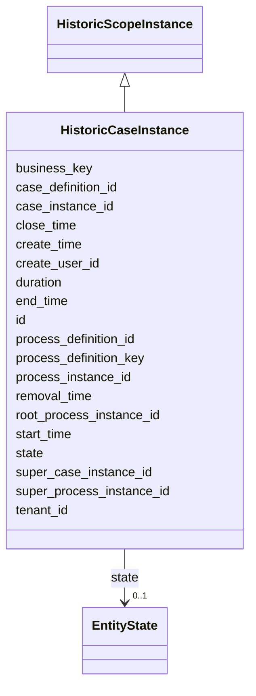

---
search:
  boost: 10.0
---

# Class: HistoricCaseInstance 


_A single execution of a case definition that is stored permanently._


<div data-search-exclude markdown="1">


URI: [fluxnova_bpm_platform:HistoricCaseInstance](https://w3id.org/TD-Universe/fluxnova-bpm-platform/HistoricCaseInstance)





## Inheritance
* [HistoricScopeInstance](HistoricScopeInstance.md)
    * **HistoricCaseInstance**


## Slots

| Name | Cardinality and Range | Description | Inheritance |
| ---  | --- | --- | --- |
| [case_instance_id](case_instance_id.md) | 1 <br/> [String](String.md) | Reference to the case instance | direct |
| [business_key](business_key.md) | 0..1 <br/> [String](String.md) | Domain-specific business key | direct |
| [case_definition_id](case_definition_id.md) | 1 <br/> [String](String.md) | Reference to the case definition | direct |
| [create_time](create_time.md) | 1 <br/> [Datetime](Datetime.md) | Creation timestamp | direct |
| [close_time](close_time.md) | 0..1 <br/> [Datetime](Datetime.md) | The time the case was closed | direct |
| [state](state.md) | 0..1 <br/> [EntityState](EntityState.md) | Current state of HistoricProcessInstance, following values are recognized dur... | direct |
| [create_user_id](create_user_id.md) | 0..1 <br/> [String](String.md) | The authenticated user that created this case instance | direct |
| [super_case_instance_id](super_case_instance_id.md) | 0..1 <br/> [String](String.md) | The case instance id of a potential super case instance or null if no super c... | direct |
| [super_process_instance_id](super_process_instance_id.md) | 0..1 <br/> [String](String.md) | The process instance id of a potential super process instance or null if no s... | direct |
| [tenant_id](tenant_id.md) | 0..1 <br/> [String](String.md) | Multi-tenancy discriminator | direct |
| [id](id.md) | 1 <br/> [String](String.md) | Unique identifier | [HistoricScopeInstance](HistoricScopeInstance.md) |
| [root_process_instance_id](root_process_instance_id.md) | 0..1 <br/> [String](String.md) | Root process instance for history cleanup | [HistoricScopeInstance](HistoricScopeInstance.md) |
| [process_instance_id](process_instance_id.md) | 0..1 <br/> [String](String.md) | Reference to the process instance | [HistoricScopeInstance](HistoricScopeInstance.md) |
| [process_definition_id](process_definition_id.md) | 0..1 <br/> [String](String.md) | Reference to the process definition | [HistoricScopeInstance](HistoricScopeInstance.md) |
| [process_definition_key](process_definition_key.md) | 0..1 <br/> [String](String.md) | Key of the process definition | [HistoricScopeInstance](HistoricScopeInstance.md) |
| [start_time](start_time.md) | 0..1 <br/> [Datetime](Datetime.md) | Start timestamp | [HistoricScopeInstance](HistoricScopeInstance.md) |
| [end_time](end_time.md) | 0..1 <br/> [Datetime](Datetime.md) | End timestamp | [HistoricScopeInstance](HistoricScopeInstance.md) |
| [duration](duration.md) | 0..1 <br/> [Integer](Integer.md) | Duration in milliseconds | [HistoricScopeInstance](HistoricScopeInstance.md) |
| [removal_time](removal_time.md) | 0..1 <br/> [Datetime](Datetime.md) | Timestamp when this entity is eligible for removal | [HistoricScopeInstance](HistoricScopeInstance.md) |


## In Subsets


* [History](History.md)
* [FluxnovaBpm](FluxnovaBpm.md)


## Identifier and Mapping Information


### Annotations

| property | value |
| --- | --- |
| sql_table | ACT_HI_CASEINST |


### Schema Source


* from schema: https://w3id.org/TD-Universe/fluxnova-bpm-platform


## Mappings

| Mapping Type | Mapped Value |
| ---  | ---  |
| self | fluxnova_bpm_platform:HistoricCaseInstance |
| native | fluxnova_bpm_platform:HistoricCaseInstance |


## LinkML Source

<!-- TODO: investigate https://stackoverflow.com/questions/37606292/how-to-create-tabbed-code-blocks-in-mkdocs-or-sphinx -->

### Direct

<details>
```yaml
name: HistoricCaseInstance
annotations:
  sql_table:
    tag: sql_table
    value: ACT_HI_CASEINST
description: A single execution of a case definition that is stored permanently.
in_subset:
- history
- fluxnova_bpm
from_schema: https://w3id.org/TD-Universe/fluxnova-bpm-platform
is_a: HistoricScopeInstance
slots:
- case_instance_id
- business_key
- case_definition_id
- create_time
- close_time
- state
- create_user_id
- super_case_instance_id
- super_process_instance_id
- tenant_id
slot_usage:
  case_instance_id:
    name: case_instance_id
    required: true
  case_definition_id:
    name: case_definition_id
    required: true
  create_time:
    name: create_time
    required: true

```
</details>

### Induced

<details>
```yaml
name: HistoricCaseInstance
annotations:
  sql_table:
    tag: sql_table
    value: ACT_HI_CASEINST
description: A single execution of a case definition that is stored permanently.
in_subset:
- history
- fluxnova_bpm
from_schema: https://w3id.org/TD-Universe/fluxnova-bpm-platform
is_a: HistoricScopeInstance
slot_usage:
  case_instance_id:
    name: case_instance_id
    required: true
  case_definition_id:
    name: case_definition_id
    required: true
  create_time:
    name: create_time
    required: true
attributes:
  case_instance_id:
    name: case_instance_id
    description: Reference to the case instance.
    from_schema: https://w3id.org/TD-Universe/fluxnova-bpm-platform
    rank: 1000
    owner: HistoricCaseInstance
    domain_of:
    - CaseExecution
    - CaseSentryPart
    - Execution
    - Task
    - VariableInstance
    - HistoricCaseActivityInstance
    - HistoricCaseInstance
    - HistoricDecisionInstance
    - HistoricDetail
    - HistoricProcessInstance
    - HistoricTaskInstance
    - HistoricVariableInstance
    - UserOperationLogEntry
    range: string
    required: true
  business_key:
    name: business_key
    description: Domain-specific business key.
    from_schema: https://w3id.org/TD-Universe/fluxnova-bpm-platform
    rank: 1000
    owner: HistoricCaseInstance
    domain_of:
    - CaseExecution
    - Execution
    - HistoricCaseInstance
    - HistoricProcessInstance
    range: string
  case_definition_id:
    name: case_definition_id
    description: Reference to the case definition.
    from_schema: https://w3id.org/TD-Universe/fluxnova-bpm-platform
    rank: 1000
    owner: HistoricCaseInstance
    domain_of:
    - CaseExecution
    - Task
    - HistoricCaseActivityInstance
    - HistoricCaseInstance
    - HistoricDecisionInstance
    - HistoricDetail
    - HistoricTaskInstance
    - HistoricVariableInstance
    - UserOperationLogEntry
    range: string
    required: true
  create_time:
    name: create_time
    description: Creation timestamp.
    from_schema: https://w3id.org/TD-Universe/fluxnova-bpm-platform
    rank: 1000
    owner: HistoricCaseInstance
    domain_of:
    - ByteArray
    - ExternalTask
    - Task
    - Attachment
    - Job
    - HistoricCaseActivityInstance
    - HistoricCaseInstance
    - HistoricDecisionInputInstance
    - HistoricDecisionOutputInstance
    - HistoricIncident
    - HistoricVariableInstance
    range: datetime
    required: true
  close_time:
    name: close_time
    annotations:
      sql_column:
        tag: sql_column
        value: CLOSE_TIME_
    description: The time the case was closed.
    from_schema: https://w3id.org/TD-Universe/fluxnova-bpm-platform
    rank: 1000
    owner: HistoricCaseInstance
    domain_of:
    - HistoricCaseInstance
    range: datetime
  state:
    name: state
    annotations:
      sql_column:
        tag: sql_column
        value: STATE_
    description: 'Current state of HistoricProcessInstance, following values are recognized
      during process engine operations: STATE_ACTIVE - running process instance STATE_SUSPENDED
      - suspended process instances STA...'
    from_schema: https://w3id.org/TD-Universe/fluxnova-bpm-platform
    rank: 1000
    owner: HistoricCaseInstance
    domain_of:
    - HistoricCaseActivityInstance
    - HistoricCaseInstance
    - HistoricExternalTaskLog
    - HistoricProcessInstance
    - HistoricVariableInstance
    range: EntityState
  create_user_id:
    name: create_user_id
    annotations:
      sql_column:
        tag: sql_column
        value: CREATE_USER_ID_
    description: The authenticated user that created this case instance.
    from_schema: https://w3id.org/TD-Universe/fluxnova-bpm-platform
    rank: 1000
    owner: HistoricCaseInstance
    domain_of:
    - Batch
    - HistoricBatch
    - HistoricCaseInstance
    range: string
  super_case_instance_id:
    name: super_case_instance_id
    annotations:
      sql_column:
        tag: sql_column
        value: SUPER_CASE_INSTANCE_ID_
    description: The case instance id of a potential super case instance or null if
      no super case instance exists
    from_schema: https://w3id.org/TD-Universe/fluxnova-bpm-platform
    rank: 1000
    owner: HistoricCaseInstance
    domain_of:
    - HistoricCaseInstance
    - HistoricProcessInstance
    range: string
  super_process_instance_id:
    name: super_process_instance_id
    annotations:
      sql_column:
        tag: sql_column
        value: SUPER_PROCESS_INSTANCE_ID_
    description: The process instance id of a potential super process instance or
      null if no super process instance exists
    from_schema: https://w3id.org/TD-Universe/fluxnova-bpm-platform
    rank: 1000
    owner: HistoricCaseInstance
    domain_of:
    - HistoricCaseInstance
    - HistoricProcessInstance
    range: string
  tenant_id:
    name: tenant_id
    description: Multi-tenancy discriminator.
    from_schema: https://w3id.org/TD-Universe/fluxnova-bpm-platform
    rank: 1000
    owner: HistoricCaseInstance
    domain_of:
    - ByteArray
    - IdentityLink
    - TenantMembership
    - CaseExecution
    - CaseSentryPart
    - EventSubscription
    - Execution
    - ExternalTask
    - Incident
    - Task
    - VariableInstance
    - Attachment
    - Comment
    - Deployment
    - ResourceDefinition
    - Batch
    - Job
    - JobDefinition
    - HistoricActivityInstance
    - HistoricBatch
    - HistoricCaseActivityInstance
    - HistoricCaseInstance
    - HistoricDecisionInputInstance
    - HistoricDecisionInstance
    - HistoricDecisionOutputInstance
    - HistoricDetail
    - HistoricExternalTaskLog
    - HistoricIdentityLink
    - HistoricIncident
    - HistoricJobLog
    - HistoricProcessInstance
    - HistoricTaskInstance
    - HistoricVariableInstance
    - UserOperationLogEntry
    range: string
  id:
    name: id
    description: Unique identifier.
    from_schema: https://w3id.org/TD-Universe/fluxnova-bpm-platform
    rank: 1000
    slot_uri: schema:identifier
    identifier: true
    owner: HistoricCaseInstance
    domain_of:
    - ByteArray
    - MeterLog
    - SchemaLogEntry
    - TaskMeterLog
    - Authorization
    - Group
    - IdentityInfo
    - IdentityLink
    - Tenant
    - TenantMembership
    - User
    - CaseExecution
    - CaseSentryPart
    - EventSubscription
    - Execution
    - ExternalTask
    - Incident
    - Task
    - VariableInstance
    - Attachment
    - Comment
    - Filter
    - Deployment
    - ResourceDefinition
    - Batch
    - Job
    - JobDefinition
    - HistoricBatch
    - HistoricDecisionInputInstance
    - HistoricDecisionInstance
    - HistoricDecisionOutputInstance
    - HistoricDetail
    - HistoricExternalTaskLog
    - HistoricIdentityLink
    - HistoricIncident
    - HistoricJobLog
    - HistoricScopeInstance
    - HistoricVariableInstance
    - UserOperationLogEntry
    - Diagram
    - DiagramElement
    - Style
    - BaseElement
    - Definitions
    - Documentation
    - InteractionNode
    range: string
    required: true
  root_process_instance_id:
    name: root_process_instance_id
    description: Root process instance for history cleanup.
    from_schema: https://w3id.org/TD-Universe/fluxnova-bpm-platform
    rank: 1000
    owner: HistoricCaseInstance
    domain_of:
    - ByteArray
    - Authorization
    - Execution
    - Attachment
    - Comment
    - Job
    - HistoricDecisionInputInstance
    - HistoricDecisionInstance
    - HistoricDecisionOutputInstance
    - HistoricDetail
    - HistoricExternalTaskLog
    - HistoricIdentityLink
    - HistoricIncident
    - HistoricJobLog
    - HistoricScopeInstance
    - HistoricVariableInstance
    - UserOperationLogEntry
    range: string
  process_instance_id:
    name: process_instance_id
    description: Reference to the process instance.
    from_schema: https://w3id.org/TD-Universe/fluxnova-bpm-platform
    rank: 1000
    owner: HistoricCaseInstance
    domain_of:
    - EventSubscription
    - Execution
    - ExternalTask
    - Incident
    - Task
    - VariableInstance
    - Attachment
    - Comment
    - Job
    - HistoricDecisionInstance
    - HistoricDetail
    - HistoricExternalTaskLog
    - HistoricIncident
    - HistoricJobLog
    - HistoricScopeInstance
    - HistoricVariableInstance
    - UserOperationLogEntry
    range: string
  process_definition_id:
    name: process_definition_id
    description: Reference to the process definition.
    from_schema: https://w3id.org/TD-Universe/fluxnova-bpm-platform
    rank: 1000
    owner: HistoricCaseInstance
    domain_of:
    - IdentityLink
    - Execution
    - ExternalTask
    - Incident
    - Task
    - VariableInstance
    - Job
    - JobDefinition
    - HistoricDecisionInstance
    - HistoricDetail
    - HistoricExternalTaskLog
    - HistoricIdentityLink
    - HistoricIncident
    - HistoricJobLog
    - HistoricScopeInstance
    - HistoricVariableInstance
    - UserOperationLogEntry
    range: string
  process_definition_key:
    name: process_definition_key
    description: Key of the process definition.
    from_schema: https://w3id.org/TD-Universe/fluxnova-bpm-platform
    rank: 1000
    owner: HistoricCaseInstance
    domain_of:
    - Execution
    - ExternalTask
    - Job
    - JobDefinition
    - HistoricDecisionInstance
    - HistoricDetail
    - HistoricExternalTaskLog
    - HistoricIdentityLink
    - HistoricIncident
    - HistoricJobLog
    - HistoricScopeInstance
    - HistoricVariableInstance
    - UserOperationLogEntry
    range: string
  start_time:
    name: start_time
    description: Start timestamp.
    from_schema: https://w3id.org/TD-Universe/fluxnova-bpm-platform
    rank: 1000
    owner: HistoricCaseInstance
    domain_of:
    - Batch
    - HistoricBatch
    - HistoricScopeInstance
    range: datetime
  end_time:
    name: end_time
    description: End timestamp.
    from_schema: https://w3id.org/TD-Universe/fluxnova-bpm-platform
    rank: 1000
    owner: HistoricCaseInstance
    domain_of:
    - HistoricBatch
    - HistoricIncident
    - HistoricScopeInstance
    range: datetime
  duration:
    name: duration
    description: Duration in milliseconds.
    from_schema: https://w3id.org/TD-Universe/fluxnova-bpm-platform
    rank: 1000
    owner: HistoricCaseInstance
    domain_of:
    - HistoricScopeInstance
    range: integer
  removal_time:
    name: removal_time
    description: Timestamp when this entity is eligible for removal.
    from_schema: https://w3id.org/TD-Universe/fluxnova-bpm-platform
    rank: 1000
    owner: HistoricCaseInstance
    domain_of:
    - ByteArray
    - Authorization
    - Attachment
    - Comment
    - HistoricBatch
    - HistoricDecisionInputInstance
    - HistoricDecisionInstance
    - HistoricDecisionOutputInstance
    - HistoricDetail
    - HistoricExternalTaskLog
    - HistoricIdentityLink
    - HistoricIncident
    - HistoricJobLog
    - HistoricScopeInstance
    - HistoricVariableInstance
    - UserOperationLogEntry
    range: datetime

```
</details></div>