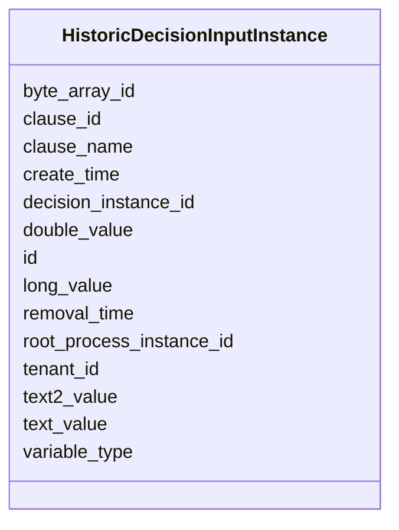

---
search:
  boost: 10.0
---

# Class: HistoricDecisionInputInstance 


_Represents one input variable of a decision evaluation._


<div data-search-exclude markdown="1">


URI: [fluxnova_bpm_platform:HistoricDecisionInputInstance](https://w3id.org/TD-Universe/fluxnova-bpm-platform/HistoricDecisionInputInstance)





<!-- no inheritance hierarchy -->

## Slots

| Name | Cardinality and Range | Description | Inheritance |
| ---  | --- | --- | --- |
| [id](id.md) | 1 <br/> [String](String.md) | Unique identifier | direct |
| [decision_instance_id](decision_instance_id.md) | 1 <br/> [String](String.md) | The unique identifier of the historic decision instance | direct |
| [clause_id](clause_id.md) | 0..1 <br/> [String](String.md) | The unique identifier of the clause that the value is assigned for | direct |
| [clause_name](clause_name.md) | 0..1 <br/> [String](String.md) | The name of the clause that the value is assigned for | direct |
| [variable_type](variable_type.md) | 0..1 <br/> [String](String.md) | The variable type | direct |
| [byte_array_id](byte_array_id.md) | 0..1 <br/> [String](String.md) | Reference to the byte array | direct |
| [double_value](double_value.md) | 0..1 <br/> [Float](Float.md) | Variable value stored as double | direct |
| [long_value](long_value.md) | 0..1 <br/> [Integer](Integer.md) | Variable value stored as long | direct |
| [text_value](text_value.md) | 0..1 <br/> [String](String.md) | Variable value stored as text | direct |
| [text2_value](text2_value.md) | 0..1 <br/> [String](String.md) | Variable value stored as text2 | direct |
| [tenant_id](tenant_id.md) | 0..1 <br/> [String](String.md) | Multi-tenancy discriminator | direct |
| [create_time](create_time.md) | 0..1 <br/> [Datetime](Datetime.md) | Creation timestamp | direct |
| [root_process_instance_id](root_process_instance_id.md) | 0..1 <br/> [String](String.md) | Root process instance for history cleanup | direct |
| [removal_time](removal_time.md) | 0..1 <br/> [Datetime](Datetime.md) | Timestamp when this entity is eligible for removal | direct |


## In Subsets


* [History](History.md)
* [FluxnovaBpm](FluxnovaBpm.md)


## Identifier and Mapping Information


### Annotations

| property | value |
| --- | --- |
| sql_table | ACT_HI_DEC_IN |


### Schema Source


* from schema: https://w3id.org/TD-Universe/fluxnova-bpm-platform


## Mappings

| Mapping Type | Mapped Value |
| ---  | ---  |
| self | fluxnova_bpm_platform:HistoricDecisionInputInstance |
| native | fluxnova_bpm_platform:HistoricDecisionInputInstance |


## LinkML Source

<!-- TODO: investigate https://stackoverflow.com/questions/37606292/how-to-create-tabbed-code-blocks-in-mkdocs-or-sphinx -->

### Direct

<details>
```yaml
name: HistoricDecisionInputInstance
annotations:
  sql_table:
    tag: sql_table
    value: ACT_HI_DEC_IN
description: Represents one input variable of a decision evaluation.
in_subset:
- history
- fluxnova_bpm
from_schema: https://w3id.org/TD-Universe/fluxnova-bpm-platform
slots:
- id
- decision_instance_id
- clause_id
- clause_name
- variable_type
- byte_array_id
- double_value
- long_value
- text_value
- text2_value
- tenant_id
- create_time
- root_process_instance_id
- removal_time

```
</details>

### Induced

<details>
```yaml
name: HistoricDecisionInputInstance
annotations:
  sql_table:
    tag: sql_table
    value: ACT_HI_DEC_IN
description: Represents one input variable of a decision evaluation.
in_subset:
- history
- fluxnova_bpm
from_schema: https://w3id.org/TD-Universe/fluxnova-bpm-platform
attributes:
  id:
    name: id
    description: Unique identifier.
    from_schema: https://w3id.org/TD-Universe/fluxnova-bpm-platform
    rank: 1000
    slot_uri: schema:identifier
    identifier: true
    owner: HistoricDecisionInputInstance
    domain_of:
    - ByteArray
    - MeterLog
    - SchemaLogEntry
    - TaskMeterLog
    - Authorization
    - Group
    - IdentityInfo
    - IdentityLink
    - Tenant
    - TenantMembership
    - User
    - CaseExecution
    - CaseSentryPart
    - EventSubscription
    - Execution
    - ExternalTask
    - Incident
    - Task
    - VariableInstance
    - Attachment
    - Comment
    - Filter
    - Deployment
    - ResourceDefinition
    - Batch
    - Job
    - JobDefinition
    - HistoricBatch
    - HistoricDecisionInputInstance
    - HistoricDecisionInstance
    - HistoricDecisionOutputInstance
    - HistoricDetail
    - HistoricExternalTaskLog
    - HistoricIdentityLink
    - HistoricIncident
    - HistoricJobLog
    - HistoricScopeInstance
    - HistoricVariableInstance
    - UserOperationLogEntry
    - Diagram
    - DiagramElement
    - Style
    - BaseElement
    - Definitions
    - Documentation
    - InteractionNode
    range: string
    required: true
  decision_instance_id:
    name: decision_instance_id
    annotations:
      sql_column:
        tag: sql_column
        value: DEC_INST_ID_
    description: The unique identifier of the historic decision instance.
    from_schema: https://w3id.org/TD-Universe/fluxnova-bpm-platform
    rank: 1000
    owner: HistoricDecisionInputInstance
    domain_of:
    - HistoricDecisionInputInstance
    - HistoricDecisionOutputInstance
    range: string
    required: true
  clause_id:
    name: clause_id
    annotations:
      sql_column:
        tag: sql_column
        value: CLAUSE_ID_
    description: The unique identifier of the clause that the value is assigned for.
      Can be null if the decision is not implemented as decision table.
    from_schema: https://w3id.org/TD-Universe/fluxnova-bpm-platform
    rank: 1000
    owner: HistoricDecisionInputInstance
    domain_of:
    - HistoricDecisionInputInstance
    - HistoricDecisionOutputInstance
    range: string
  clause_name:
    name: clause_name
    annotations:
      sql_column:
        tag: sql_column
        value: CLAUSE_NAME_
    description: The name of the clause that the value is assigned for. Can be null
      if the decision is not implemented as decision table.
    from_schema: https://w3id.org/TD-Universe/fluxnova-bpm-platform
    rank: 1000
    owner: HistoricDecisionInputInstance
    domain_of:
    - HistoricDecisionInputInstance
    - HistoricDecisionOutputInstance
    range: string
  variable_type:
    name: variable_type
    annotations:
      sql_column:
        tag: sql_column
        value: VAR_TYPE_
    description: The variable type.
    from_schema: https://w3id.org/TD-Universe/fluxnova-bpm-platform
    rank: 1000
    owner: HistoricDecisionInputInstance
    domain_of:
    - HistoricDecisionInputInstance
    - HistoricDecisionOutputInstance
    - HistoricDetail
    - HistoricVariableInstance
    range: string
  byte_array_id:
    name: byte_array_id
    annotations:
      sql_column:
        tag: sql_column
        value: BYTEARRAY_ID_
    description: Reference to the byte array.
    from_schema: https://w3id.org/TD-Universe/fluxnova-bpm-platform
    rank: 1000
    owner: HistoricDecisionInputInstance
    domain_of:
    - VariableInstance
    - HistoricDecisionInputInstance
    - HistoricDecisionOutputInstance
    - HistoricDetail
    - HistoricVariableInstance
    range: string
  double_value:
    name: double_value
    annotations:
      sql_column:
        tag: sql_column
        value: DOUBLE_
    description: Variable value stored as double.
    from_schema: https://w3id.org/TD-Universe/fluxnova-bpm-platform
    rank: 1000
    owner: HistoricDecisionInputInstance
    domain_of:
    - VariableInstance
    - HistoricDecisionInputInstance
    - HistoricDecisionOutputInstance
    - HistoricDetail
    - HistoricVariableInstance
    range: float
  long_value:
    name: long_value
    annotations:
      sql_column:
        tag: sql_column
        value: LONG_
    description: Variable value stored as long.
    from_schema: https://w3id.org/TD-Universe/fluxnova-bpm-platform
    rank: 1000
    owner: HistoricDecisionInputInstance
    domain_of:
    - VariableInstance
    - HistoricDecisionInputInstance
    - HistoricDecisionOutputInstance
    - HistoricDetail
    - HistoricVariableInstance
    range: integer
  text_value:
    name: text_value
    annotations:
      sql_column:
        tag: sql_column
        value: TEXT_
    description: Variable value stored as text.
    from_schema: https://w3id.org/TD-Universe/fluxnova-bpm-platform
    rank: 1000
    owner: HistoricDecisionInputInstance
    domain_of:
    - VariableInstance
    - HistoricDecisionInputInstance
    - HistoricDecisionOutputInstance
    - HistoricDetail
    - HistoricVariableInstance
    range: string
  text2_value:
    name: text2_value
    annotations:
      sql_column:
        tag: sql_column
        value: TEXT2_
    description: Variable value stored as text2.
    from_schema: https://w3id.org/TD-Universe/fluxnova-bpm-platform
    rank: 1000
    owner: HistoricDecisionInputInstance
    domain_of:
    - VariableInstance
    - HistoricDecisionInputInstance
    - HistoricDecisionOutputInstance
    - HistoricDetail
    - HistoricVariableInstance
    range: string
  tenant_id:
    name: tenant_id
    description: Multi-tenancy discriminator.
    from_schema: https://w3id.org/TD-Universe/fluxnova-bpm-platform
    rank: 1000
    owner: HistoricDecisionInputInstance
    domain_of:
    - ByteArray
    - IdentityLink
    - TenantMembership
    - CaseExecution
    - CaseSentryPart
    - EventSubscription
    - Execution
    - ExternalTask
    - Incident
    - Task
    - VariableInstance
    - Attachment
    - Comment
    - Deployment
    - ResourceDefinition
    - Batch
    - Job
    - JobDefinition
    - HistoricActivityInstance
    - HistoricBatch
    - HistoricCaseActivityInstance
    - HistoricCaseInstance
    - HistoricDecisionInputInstance
    - HistoricDecisionInstance
    - HistoricDecisionOutputInstance
    - HistoricDetail
    - HistoricExternalTaskLog
    - HistoricIdentityLink
    - HistoricIncident
    - HistoricJobLog
    - HistoricProcessInstance
    - HistoricTaskInstance
    - HistoricVariableInstance
    - UserOperationLogEntry
    range: string
  create_time:
    name: create_time
    description: Creation timestamp.
    from_schema: https://w3id.org/TD-Universe/fluxnova-bpm-platform
    rank: 1000
    owner: HistoricDecisionInputInstance
    domain_of:
    - ByteArray
    - ExternalTask
    - Task
    - Attachment
    - Job
    - HistoricCaseActivityInstance
    - HistoricCaseInstance
    - HistoricDecisionInputInstance
    - HistoricDecisionOutputInstance
    - HistoricIncident
    - HistoricVariableInstance
    range: datetime
  root_process_instance_id:
    name: root_process_instance_id
    description: Root process instance for history cleanup.
    from_schema: https://w3id.org/TD-Universe/fluxnova-bpm-platform
    rank: 1000
    owner: HistoricDecisionInputInstance
    domain_of:
    - ByteArray
    - Authorization
    - Execution
    - Attachment
    - Comment
    - Job
    - HistoricDecisionInputInstance
    - HistoricDecisionInstance
    - HistoricDecisionOutputInstance
    - HistoricDetail
    - HistoricExternalTaskLog
    - HistoricIdentityLink
    - HistoricIncident
    - HistoricJobLog
    - HistoricScopeInstance
    - HistoricVariableInstance
    - UserOperationLogEntry
    range: string
  removal_time:
    name: removal_time
    description: Timestamp when this entity is eligible for removal.
    from_schema: https://w3id.org/TD-Universe/fluxnova-bpm-platform
    rank: 1000
    owner: HistoricDecisionInputInstance
    domain_of:
    - ByteArray
    - Authorization
    - Attachment
    - Comment
    - HistoricBatch
    - HistoricDecisionInputInstance
    - HistoricDecisionInstance
    - HistoricDecisionOutputInstance
    - HistoricDetail
    - HistoricExternalTaskLog
    - HistoricIdentityLink
    - HistoricIncident
    - HistoricJobLog
    - HistoricScopeInstance
    - HistoricVariableInstance
    - UserOperationLogEntry
    range: datetime

```
</details></div>