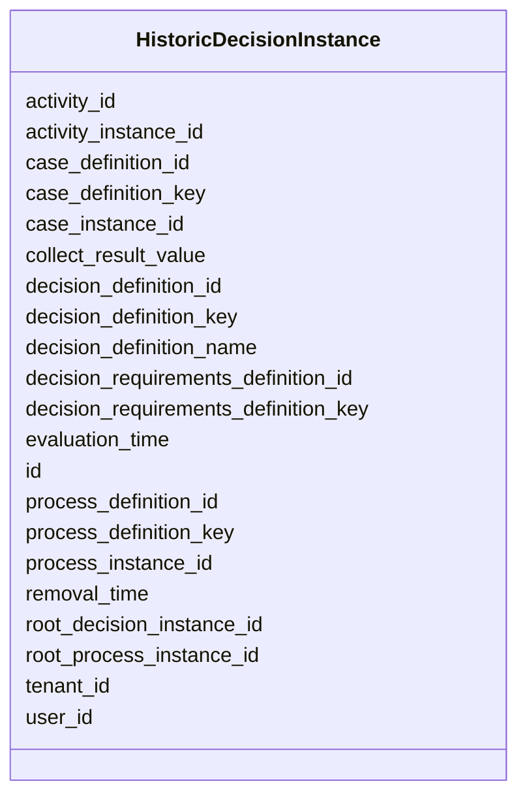

---
search:
  boost: 10.0
---

# Class: HistoricDecisionInstance 


_Represents one evaluation of a decision._


<div data-search-exclude markdown="1">


URI: [fluxnova_bpm_platform:HistoricDecisionInstance](https://w3id.org/TD-Universe/fluxnova-bpm-platform/HistoricDecisionInstance)





<!-- no inheritance hierarchy -->

## Slots

| Name | Cardinality and Range | Description | Inheritance |
| ---  | --- | --- | --- |
| [id](id.md) | 1 <br/> [String](String.md) | Unique identifier | direct |
| [decision_definition_id](decision_definition_id.md) | 1 <br/> [String](String.md) | The decision definition reference | direct |
| [decision_definition_key](decision_definition_key.md) | 1 <br/> [String](String.md) | The unique identifier of the decision definition | direct |
| [decision_definition_name](decision_definition_name.md) | 0..1 <br/> [String](String.md) | The name of the decision definition | direct |
| [process_definition_key](process_definition_key.md) | 0..1 <br/> [String](String.md) | Key of the process definition | direct |
| [process_definition_id](process_definition_id.md) | 0..1 <br/> [String](String.md) | Reference to the process definition | direct |
| [process_instance_id](process_instance_id.md) | 0..1 <br/> [String](String.md) | Reference to the process instance | direct |
| [case_definition_key](case_definition_key.md) | 0..1 <br/> [String](String.md) | Case definition key reference | direct |
| [case_definition_id](case_definition_id.md) | 0..1 <br/> [String](String.md) | Reference to the case definition | direct |
| [case_instance_id](case_instance_id.md) | 0..1 <br/> [String](String.md) | Reference to the case instance | direct |
| [activity_instance_id](activity_instance_id.md) | 0..1 <br/> [String](String.md) | Runtime activity instance identifier | direct |
| [activity_id](activity_id.md) | 0..1 <br/> [String](String.md) | BPMN activity element identifier | direct |
| [evaluation_time](evaluation_time.md) | 1 <br/> [Datetime](Datetime.md) | Time when the decision was evaluated | direct |
| [removal_time](removal_time.md) | 0..1 <br/> [Datetime](Datetime.md) | Timestamp when this entity is eligible for removal | direct |
| [collect_result_value](collect_result_value.md) | 0..1 <br/> [Float](Float.md) | The result of the collect operation if the hit policy 'collect' was used for ... | direct |
| [user_id](user_id.md) | 0..1 <br/> [String](String.md) | Reference to a user | direct |
| [root_decision_instance_id](root_decision_instance_id.md) | 0..1 <br/> [String](String.md) | The unique identifier of the historic decision instance of the evaluated root... | direct |
| [root_process_instance_id](root_process_instance_id.md) | 0..1 <br/> [String](String.md) | Root process instance for history cleanup | direct |
| [decision_requirements_definition_id](decision_requirements_definition_id.md) | 0..1 <br/> [String](String.md) | Id of the related decision requirements definition | direct |
| [decision_requirements_definition_key](decision_requirements_definition_key.md) | 0..1 <br/> [String](String.md) | Key of the related decision requirements definition | direct |
| [tenant_id](tenant_id.md) | 0..1 <br/> [String](String.md) | Multi-tenancy discriminator | direct |


## In Subsets


* [History](History.md)
* [FluxnovaBpm](FluxnovaBpm.md)


## Identifier and Mapping Information


### Annotations

| property | value |
| --- | --- |
| sql_table | ACT_HI_DECINST |


### Schema Source


* from schema: https://w3id.org/TD-Universe/fluxnova-bpm-platform


## Mappings

| Mapping Type | Mapped Value |
| ---  | ---  |
| self | fluxnova_bpm_platform:HistoricDecisionInstance |
| native | fluxnova_bpm_platform:HistoricDecisionInstance |


## LinkML Source

<!-- TODO: investigate https://stackoverflow.com/questions/37606292/how-to-create-tabbed-code-blocks-in-mkdocs-or-sphinx -->

### Direct

<details>
```yaml
name: HistoricDecisionInstance
annotations:
  sql_table:
    tag: sql_table
    value: ACT_HI_DECINST
description: Represents one evaluation of a decision.
in_subset:
- history
- fluxnova_bpm
from_schema: https://w3id.org/TD-Universe/fluxnova-bpm-platform
slots:
- id
- decision_definition_id
- decision_definition_key
- decision_definition_name
- process_definition_key
- process_definition_id
- process_instance_id
- case_definition_key
- case_definition_id
- case_instance_id
- activity_instance_id
- activity_id
- evaluation_time
- removal_time
- collect_result_value
- user_id
- root_decision_instance_id
- root_process_instance_id
- decision_requirements_definition_id
- decision_requirements_definition_key
- tenant_id

```
</details>

### Induced

<details>
```yaml
name: HistoricDecisionInstance
annotations:
  sql_table:
    tag: sql_table
    value: ACT_HI_DECINST
description: Represents one evaluation of a decision.
in_subset:
- history
- fluxnova_bpm
from_schema: https://w3id.org/TD-Universe/fluxnova-bpm-platform
attributes:
  id:
    name: id
    description: Unique identifier.
    from_schema: https://w3id.org/TD-Universe/fluxnova-bpm-platform
    rank: 1000
    slot_uri: schema:identifier
    identifier: true
    owner: HistoricDecisionInstance
    domain_of:
    - ByteArray
    - MeterLog
    - SchemaLogEntry
    - TaskMeterLog
    - Authorization
    - Group
    - IdentityInfo
    - IdentityLink
    - Tenant
    - TenantMembership
    - User
    - CaseExecution
    - CaseSentryPart
    - EventSubscription
    - Execution
    - ExternalTask
    - Incident
    - Task
    - VariableInstance
    - Attachment
    - Comment
    - Filter
    - Deployment
    - ResourceDefinition
    - Batch
    - Job
    - JobDefinition
    - HistoricBatch
    - HistoricDecisionInputInstance
    - HistoricDecisionInstance
    - HistoricDecisionOutputInstance
    - HistoricDetail
    - HistoricExternalTaskLog
    - HistoricIdentityLink
    - HistoricIncident
    - HistoricJobLog
    - HistoricScopeInstance
    - HistoricVariableInstance
    - UserOperationLogEntry
    - Diagram
    - DiagramElement
    - Style
    - BaseElement
    - Definitions
    - Documentation
    - InteractionNode
    range: string
    required: true
  decision_definition_id:
    name: decision_definition_id
    annotations:
      sql_column:
        tag: sql_column
        value: DEC_DEF_ID_
    description: The decision definition reference.
    from_schema: https://w3id.org/TD-Universe/fluxnova-bpm-platform
    rank: 1000
    owner: HistoricDecisionInstance
    domain_of:
    - HistoricDecisionInstance
    range: string
    required: true
  decision_definition_key:
    name: decision_definition_key
    annotations:
      sql_column:
        tag: sql_column
        value: DEC_DEF_KEY_
    description: The unique identifier of the decision definition
    from_schema: https://w3id.org/TD-Universe/fluxnova-bpm-platform
    rank: 1000
    owner: HistoricDecisionInstance
    domain_of:
    - HistoricDecisionInstance
    range: string
    required: true
  decision_definition_name:
    name: decision_definition_name
    annotations:
      sql_column:
        tag: sql_column
        value: DEC_DEF_NAME_
    description: The name of the decision definition
    from_schema: https://w3id.org/TD-Universe/fluxnova-bpm-platform
    rank: 1000
    owner: HistoricDecisionInstance
    domain_of:
    - HistoricDecisionInstance
    range: string
  process_definition_key:
    name: process_definition_key
    description: Key of the process definition.
    from_schema: https://w3id.org/TD-Universe/fluxnova-bpm-platform
    rank: 1000
    owner: HistoricDecisionInstance
    domain_of:
    - Execution
    - ExternalTask
    - Job
    - JobDefinition
    - HistoricDecisionInstance
    - HistoricDetail
    - HistoricExternalTaskLog
    - HistoricIdentityLink
    - HistoricIncident
    - HistoricJobLog
    - HistoricScopeInstance
    - HistoricVariableInstance
    - UserOperationLogEntry
    range: string
  process_definition_id:
    name: process_definition_id
    description: Reference to the process definition.
    from_schema: https://w3id.org/TD-Universe/fluxnova-bpm-platform
    rank: 1000
    owner: HistoricDecisionInstance
    domain_of:
    - IdentityLink
    - Execution
    - ExternalTask
    - Incident
    - Task
    - VariableInstance
    - Job
    - JobDefinition
    - HistoricDecisionInstance
    - HistoricDetail
    - HistoricExternalTaskLog
    - HistoricIdentityLink
    - HistoricIncident
    - HistoricJobLog
    - HistoricScopeInstance
    - HistoricVariableInstance
    - UserOperationLogEntry
    range: string
  process_instance_id:
    name: process_instance_id
    description: Reference to the process instance.
    from_schema: https://w3id.org/TD-Universe/fluxnova-bpm-platform
    rank: 1000
    owner: HistoricDecisionInstance
    domain_of:
    - EventSubscription
    - Execution
    - ExternalTask
    - Incident
    - Task
    - VariableInstance
    - Attachment
    - Comment
    - Job
    - HistoricDecisionInstance
    - HistoricDetail
    - HistoricExternalTaskLog
    - HistoricIncident
    - HistoricJobLog
    - HistoricScopeInstance
    - HistoricVariableInstance
    - UserOperationLogEntry
    range: string
  case_definition_key:
    name: case_definition_key
    annotations:
      sql_column:
        tag: sql_column
        value: CASE_DEF_KEY_
    description: Case definition key reference.
    from_schema: https://w3id.org/TD-Universe/fluxnova-bpm-platform
    rank: 1000
    owner: HistoricDecisionInstance
    domain_of:
    - HistoricDecisionInstance
    - HistoricDetail
    - HistoricTaskInstance
    - HistoricVariableInstance
    range: string
  case_definition_id:
    name: case_definition_id
    description: Reference to the case definition.
    from_schema: https://w3id.org/TD-Universe/fluxnova-bpm-platform
    rank: 1000
    owner: HistoricDecisionInstance
    domain_of:
    - CaseExecution
    - Task
    - HistoricCaseActivityInstance
    - HistoricCaseInstance
    - HistoricDecisionInstance
    - HistoricDetail
    - HistoricTaskInstance
    - HistoricVariableInstance
    - UserOperationLogEntry
    range: string
  case_instance_id:
    name: case_instance_id
    description: Reference to the case instance.
    from_schema: https://w3id.org/TD-Universe/fluxnova-bpm-platform
    rank: 1000
    owner: HistoricDecisionInstance
    domain_of:
    - CaseExecution
    - CaseSentryPart
    - Execution
    - Task
    - VariableInstance
    - HistoricCaseActivityInstance
    - HistoricCaseInstance
    - HistoricDecisionInstance
    - HistoricDetail
    - HistoricProcessInstance
    - HistoricTaskInstance
    - HistoricVariableInstance
    - UserOperationLogEntry
    range: string
  activity_instance_id:
    name: activity_instance_id
    description: Runtime activity instance identifier.
    from_schema: https://w3id.org/TD-Universe/fluxnova-bpm-platform
    rank: 1000
    owner: HistoricDecisionInstance
    domain_of:
    - Execution
    - ExternalTask
    - HistoricDecisionInstance
    - HistoricDetail
    - HistoricExternalTaskLog
    - HistoricTaskInstance
    - HistoricVariableInstance
    range: string
  activity_id:
    name: activity_id
    description: BPMN activity element identifier.
    from_schema: https://w3id.org/TD-Universe/fluxnova-bpm-platform
    rank: 1000
    owner: HistoricDecisionInstance
    domain_of:
    - CaseExecution
    - EventSubscription
    - Execution
    - ExternalTask
    - Incident
    - JobDefinition
    - HistoricActivityInstance
    - HistoricDecisionInstance
    - HistoricExternalTaskLog
    - HistoricIncident
    - HistoricJobLog
    range: string
  evaluation_time:
    name: evaluation_time
    annotations:
      sql_column:
        tag: sql_column
        value: EVAL_TIME_
    description: Time when the decision was evaluated.
    from_schema: https://w3id.org/TD-Universe/fluxnova-bpm-platform
    rank: 1000
    owner: HistoricDecisionInstance
    domain_of:
    - HistoricDecisionInstance
    range: datetime
    required: true
  removal_time:
    name: removal_time
    description: Timestamp when this entity is eligible for removal.
    from_schema: https://w3id.org/TD-Universe/fluxnova-bpm-platform
    rank: 1000
    owner: HistoricDecisionInstance
    domain_of:
    - ByteArray
    - Authorization
    - Attachment
    - Comment
    - HistoricBatch
    - HistoricDecisionInputInstance
    - HistoricDecisionInstance
    - HistoricDecisionOutputInstance
    - HistoricDetail
    - HistoricExternalTaskLog
    - HistoricIdentityLink
    - HistoricIncident
    - HistoricJobLog
    - HistoricScopeInstance
    - HistoricVariableInstance
    - UserOperationLogEntry
    range: datetime
  collect_result_value:
    name: collect_result_value
    annotations:
      sql_column:
        tag: sql_column
        value: COLLECT_VALUE_
    description: The result of the collect operation if the hit policy 'collect' was
      used for the decision.
    from_schema: https://w3id.org/TD-Universe/fluxnova-bpm-platform
    rank: 1000
    owner: HistoricDecisionInstance
    domain_of:
    - HistoricDecisionInstance
    range: float
  user_id:
    name: user_id
    description: Reference to a user.
    from_schema: https://w3id.org/TD-Universe/fluxnova-bpm-platform
    rank: 1000
    owner: HistoricDecisionInstance
    domain_of:
    - Authorization
    - IdentityInfo
    - IdentityLink
    - Membership
    - TenantMembership
    - Attachment
    - Comment
    - HistoricDecisionInstance
    - HistoricIdentityLink
    - UserOperationLogEntry
    range: string
  root_decision_instance_id:
    name: root_decision_instance_id
    annotations:
      sql_column:
        tag: sql_column
        value: ROOT_DEC_INST_ID_
    description: The unique identifier of the historic decision instance of the evaluated
      root decision. Can be null if this instance is the root decision instance of
      the evaluation.
    from_schema: https://w3id.org/TD-Universe/fluxnova-bpm-platform
    rank: 1000
    owner: HistoricDecisionInstance
    domain_of:
    - HistoricDecisionInstance
    range: string
  root_process_instance_id:
    name: root_process_instance_id
    description: Root process instance for history cleanup.
    from_schema: https://w3id.org/TD-Universe/fluxnova-bpm-platform
    rank: 1000
    owner: HistoricDecisionInstance
    domain_of:
    - ByteArray
    - Authorization
    - Execution
    - Attachment
    - Comment
    - Job
    - HistoricDecisionInputInstance
    - HistoricDecisionInstance
    - HistoricDecisionOutputInstance
    - HistoricDetail
    - HistoricExternalTaskLog
    - HistoricIdentityLink
    - HistoricIncident
    - HistoricJobLog
    - HistoricScopeInstance
    - HistoricVariableInstance
    - UserOperationLogEntry
    range: string
  decision_requirements_definition_id:
    name: decision_requirements_definition_id
    annotations:
      sql_column:
        tag: sql_column
        value: DEC_REQ_ID_
    description: Id of the related decision requirements definition. Can be null if
      the decision has no relations to other decisions.
    from_schema: https://w3id.org/TD-Universe/fluxnova-bpm-platform
    rank: 1000
    owner: HistoricDecisionInstance
    domain_of:
    - DecisionDefinition
    - HistoricDecisionInstance
    range: string
  decision_requirements_definition_key:
    name: decision_requirements_definition_key
    annotations:
      sql_column:
        tag: sql_column
        value: DEC_REQ_KEY_
    description: Key of the related decision requirements definition. Can be null
      if the decision has no relations to other decisions.
    from_schema: https://w3id.org/TD-Universe/fluxnova-bpm-platform
    rank: 1000
    owner: HistoricDecisionInstance
    domain_of:
    - DecisionDefinition
    - HistoricDecisionInstance
    range: string
  tenant_id:
    name: tenant_id
    description: Multi-tenancy discriminator.
    from_schema: https://w3id.org/TD-Universe/fluxnova-bpm-platform
    rank: 1000
    owner: HistoricDecisionInstance
    domain_of:
    - ByteArray
    - IdentityLink
    - TenantMembership
    - CaseExecution
    - CaseSentryPart
    - EventSubscription
    - Execution
    - ExternalTask
    - Incident
    - Task
    - VariableInstance
    - Attachment
    - Comment
    - Deployment
    - ResourceDefinition
    - Batch
    - Job
    - JobDefinition
    - HistoricActivityInstance
    - HistoricBatch
    - HistoricCaseActivityInstance
    - HistoricCaseInstance
    - HistoricDecisionInputInstance
    - HistoricDecisionInstance
    - HistoricDecisionOutputInstance
    - HistoricDetail
    - HistoricExternalTaskLog
    - HistoricIdentityLink
    - HistoricIncident
    - HistoricJobLog
    - HistoricProcessInstance
    - HistoricTaskInstance
    - HistoricVariableInstance
    - UserOperationLogEntry
    range: string

```
</details></div>