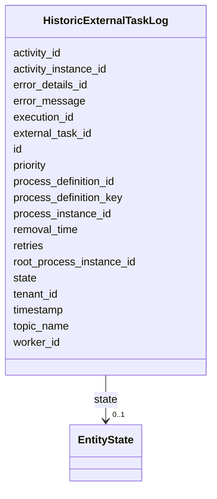

---
search:
  boost: 10.0
---

# Class: HistoricExternalTaskLog 


_The HistoricExternalTaskLog is used to have a log containing information about ExternalTask task execution. The log provides details about the last lifecycle state of a ExternalTask task: An instan..._


<div data-search-exclude markdown="1">


URI: [fluxnova_bpm_platform:HistoricExternalTaskLog](https://w3id.org/TD-Universe/fluxnova-bpm-platform/HistoricExternalTaskLog)





<!-- no inheritance hierarchy -->

## Slots

| Name | Cardinality and Range | Description | Inheritance |
| ---  | --- | --- | --- |
| [id](id.md) | 1 <br/> [String](String.md) | Unique identifier | direct |
| [timestamp](timestamp.md) | 1 <br/> [Datetime](Datetime.md) | Time when this log occurred | direct |
| [external_task_id](external_task_id.md) | 1 <br/> [String](String.md) | Id of the associated external task | direct |
| [retries](retries.md) | 0..1 <br/> [Integer](Integer.md) | Number of retries this job has left | direct |
| [topic_name](topic_name.md) | 0..1 <br/> [String](String.md) | Topic name of the associated external task | direct |
| [worker_id](worker_id.md) | 0..1 <br/> [String](String.md) | Id of the worker that fetched the external task most recently | direct |
| [priority](priority.md) | 1 <br/> [Integer](Integer.md) | Indication of how important/urgent this task is with a number between 0 and 1... | direct |
| [error_message](error_message.md) | 0..1 <br/> [String](String.md) | If the variable value could not be loaded, this returns the error message | direct |
| [error_details_id](error_details_id.md) | 0..1 <br/> [String](String.md) | Reference to a ByteArray | direct |
| [activity_id](activity_id.md) | 0..1 <br/> [String](String.md) | BPMN activity element identifier | direct |
| [activity_instance_id](activity_instance_id.md) | 0..1 <br/> [String](String.md) | Runtime activity instance identifier | direct |
| [execution_id](execution_id.md) | 0..1 <br/> [String](String.md) | Reference to the execution | direct |
| [root_process_instance_id](root_process_instance_id.md) | 0..1 <br/> [String](String.md) | Root process instance for history cleanup | direct |
| [process_instance_id](process_instance_id.md) | 0..1 <br/> [String](String.md) | Reference to the process instance | direct |
| [process_definition_id](process_definition_id.md) | 0..1 <br/> [String](String.md) | Reference to the process definition | direct |
| [process_definition_key](process_definition_key.md) | 0..1 <br/> [String](String.md) | Key of the process definition | direct |
| [tenant_id](tenant_id.md) | 0..1 <br/> [String](String.md) | Multi-tenancy discriminator | direct |
| [state](state.md) | 0..1 <br/> [EntityState](EntityState.md) | Current state of HistoricProcessInstance, following values are recognized dur... | direct |
| [removal_time](removal_time.md) | 0..1 <br/> [Datetime](Datetime.md) | Timestamp when this entity is eligible for removal | direct |


## In Subsets


* [History](History.md)
* [FluxnovaBpm](FluxnovaBpm.md)


## Identifier and Mapping Information


### Annotations

| property | value |
| --- | --- |
| sql_table | ACT_HI_EXT_TASK_LOG |


### Schema Source


* from schema: https://w3id.org/TD-Universe/fluxnova-bpm-platform


## Mappings

| Mapping Type | Mapped Value |
| ---  | ---  |
| self | fluxnova_bpm_platform:HistoricExternalTaskLog |
| native | fluxnova_bpm_platform:HistoricExternalTaskLog |


## LinkML Source

<!-- TODO: investigate https://stackoverflow.com/questions/37606292/how-to-create-tabbed-code-blocks-in-mkdocs-or-sphinx -->

### Direct

<details>
```yaml
name: HistoricExternalTaskLog
annotations:
  sql_table:
    tag: sql_table
    value: ACT_HI_EXT_TASK_LOG
description: 'The HistoricExternalTaskLog is used to have a log containing information
  about ExternalTask task execution. The log provides details about the last lifecycle
  state of a ExternalTask task: An instan...'
in_subset:
- history
- fluxnova_bpm
from_schema: https://w3id.org/TD-Universe/fluxnova-bpm-platform
slots:
- id
- timestamp
- external_task_id
- retries
- topic_name
- worker_id
- priority
- error_message
- error_details_id
- activity_id
- activity_instance_id
- execution_id
- root_process_instance_id
- process_instance_id
- process_definition_id
- process_definition_key
- tenant_id
- state
- removal_time
slot_usage:
  timestamp:
    name: timestamp
    required: true

```
</details>

### Induced

<details>
```yaml
name: HistoricExternalTaskLog
annotations:
  sql_table:
    tag: sql_table
    value: ACT_HI_EXT_TASK_LOG
description: 'The HistoricExternalTaskLog is used to have a log containing information
  about ExternalTask task execution. The log provides details about the last lifecycle
  state of a ExternalTask task: An instan...'
in_subset:
- history
- fluxnova_bpm
from_schema: https://w3id.org/TD-Universe/fluxnova-bpm-platform
slot_usage:
  timestamp:
    name: timestamp
    required: true
attributes:
  id:
    name: id
    description: Unique identifier.
    from_schema: https://w3id.org/TD-Universe/fluxnova-bpm-platform
    rank: 1000
    slot_uri: schema:identifier
    identifier: true
    owner: HistoricExternalTaskLog
    domain_of:
    - ByteArray
    - MeterLog
    - SchemaLogEntry
    - TaskMeterLog
    - Authorization
    - Group
    - IdentityInfo
    - IdentityLink
    - Tenant
    - TenantMembership
    - User
    - CaseExecution
    - CaseSentryPart
    - EventSubscription
    - Execution
    - ExternalTask
    - Incident
    - Task
    - VariableInstance
    - Attachment
    - Comment
    - Filter
    - Deployment
    - ResourceDefinition
    - Batch
    - Job
    - JobDefinition
    - HistoricBatch
    - HistoricDecisionInputInstance
    - HistoricDecisionInstance
    - HistoricDecisionOutputInstance
    - HistoricDetail
    - HistoricExternalTaskLog
    - HistoricIdentityLink
    - HistoricIncident
    - HistoricJobLog
    - HistoricScopeInstance
    - HistoricVariableInstance
    - UserOperationLogEntry
    - Diagram
    - DiagramElement
    - Style
    - BaseElement
    - Definitions
    - Documentation
    - InteractionNode
    range: string
    required: true
  timestamp:
    name: timestamp
    annotations:
      sql_column:
        tag: sql_column
        value: TIMESTAMP_
    description: Time when this log occurred.
    from_schema: https://w3id.org/TD-Universe/fluxnova-bpm-platform
    rank: 1000
    owner: HistoricExternalTaskLog
    domain_of:
    - MeterLog
    - SchemaLogEntry
    - TaskMeterLog
    - HistoricExternalTaskLog
    - HistoricIdentityLink
    - HistoricJobLog
    - UserOperationLogEntry
    range: datetime
    required: true
  external_task_id:
    name: external_task_id
    annotations:
      sql_column:
        tag: sql_column
        value: EXT_TASK_ID_
    description: Id of the associated external task.
    from_schema: https://w3id.org/TD-Universe/fluxnova-bpm-platform
    rank: 1000
    owner: HistoricExternalTaskLog
    domain_of:
    - HistoricExternalTaskLog
    - UserOperationLogEntry
    range: string
    required: true
  retries:
    name: retries
    annotations:
      sql_column:
        tag: sql_column
        value: RETRIES_
    description: Number of retries this job has left. Whenever the jobexecutor fails
      to execute the job, this value is decremented. When it hits zero, the job is
      supposed to be dead and not retried again (ie a manu...
    from_schema: https://w3id.org/TD-Universe/fluxnova-bpm-platform
    rank: 1000
    owner: HistoricExternalTaskLog
    domain_of:
    - ExternalTask
    - Job
    - HistoricExternalTaskLog
    range: integer
  topic_name:
    name: topic_name
    annotations:
      sql_column:
        tag: sql_column
        value: TOPIC_NAME_
    description: Topic name of the associated external task.
    from_schema: https://w3id.org/TD-Universe/fluxnova-bpm-platform
    rank: 1000
    owner: HistoricExternalTaskLog
    domain_of:
    - ExternalTask
    - HistoricExternalTaskLog
    range: string
  worker_id:
    name: worker_id
    annotations:
      sql_column:
        tag: sql_column
        value: WORKER_ID_
    description: Id of the worker that fetched the external task most recently.
    from_schema: https://w3id.org/TD-Universe/fluxnova-bpm-platform
    rank: 1000
    owner: HistoricExternalTaskLog
    domain_of:
    - ExternalTask
    - HistoricExternalTaskLog
    range: string
  priority:
    name: priority
    annotations:
      sql_column:
        tag: sql_column
        value: PRIORITY_
    description: 'Indication of how important/urgent this task is with a number between
      0 and 100 where higher values mean a higher priority and lower values mean lower
      priority: [0..19] lowest, [20..39] low, [40..5...'
    from_schema: https://w3id.org/TD-Universe/fluxnova-bpm-platform
    rank: 1000
    owner: HistoricExternalTaskLog
    domain_of:
    - ExternalTask
    - Task
    - Job
    - HistoricExternalTaskLog
    - HistoricTaskInstance
    range: integer
    required: true
  error_message:
    name: error_message
    annotations:
      sql_column:
        tag: sql_column
        value: ERROR_MSG_
    description: If the variable value could not be loaded, this returns the error
      message.
    from_schema: https://w3id.org/TD-Universe/fluxnova-bpm-platform
    rank: 1000
    owner: HistoricExternalTaskLog
    domain_of:
    - ExternalTask
    - HistoricExternalTaskLog
    range: string
  error_details_id:
    name: error_details_id
    annotations:
      sql_column:
        tag: sql_column
        value: ERROR_DETAILS_ID_
    description: Reference to a ByteArray.
    from_schema: https://w3id.org/TD-Universe/fluxnova-bpm-platform
    rank: 1000
    owner: HistoricExternalTaskLog
    domain_of:
    - ExternalTask
    - HistoricExternalTaskLog
    range: string
  activity_id:
    name: activity_id
    description: BPMN activity element identifier.
    from_schema: https://w3id.org/TD-Universe/fluxnova-bpm-platform
    rank: 1000
    owner: HistoricExternalTaskLog
    domain_of:
    - CaseExecution
    - EventSubscription
    - Execution
    - ExternalTask
    - Incident
    - JobDefinition
    - HistoricActivityInstance
    - HistoricDecisionInstance
    - HistoricExternalTaskLog
    - HistoricIncident
    - HistoricJobLog
    range: string
  activity_instance_id:
    name: activity_instance_id
    description: Runtime activity instance identifier.
    from_schema: https://w3id.org/TD-Universe/fluxnova-bpm-platform
    rank: 1000
    owner: HistoricExternalTaskLog
    domain_of:
    - Execution
    - ExternalTask
    - HistoricDecisionInstance
    - HistoricDetail
    - HistoricExternalTaskLog
    - HistoricTaskInstance
    - HistoricVariableInstance
    range: string
  execution_id:
    name: execution_id
    description: Reference to the execution.
    from_schema: https://w3id.org/TD-Universe/fluxnova-bpm-platform
    rank: 1000
    owner: HistoricExternalTaskLog
    domain_of:
    - EventSubscription
    - ExternalTask
    - Incident
    - Task
    - VariableInstance
    - Job
    - HistoricActivityInstance
    - HistoricDetail
    - HistoricExternalTaskLog
    - HistoricIncident
    - HistoricJobLog
    - HistoricTaskInstance
    - HistoricVariableInstance
    - UserOperationLogEntry
    range: string
  root_process_instance_id:
    name: root_process_instance_id
    description: Root process instance for history cleanup.
    from_schema: https://w3id.org/TD-Universe/fluxnova-bpm-platform
    rank: 1000
    owner: HistoricExternalTaskLog
    domain_of:
    - ByteArray
    - Authorization
    - Execution
    - Attachment
    - Comment
    - Job
    - HistoricDecisionInputInstance
    - HistoricDecisionInstance
    - HistoricDecisionOutputInstance
    - HistoricDetail
    - HistoricExternalTaskLog
    - HistoricIdentityLink
    - HistoricIncident
    - HistoricJobLog
    - HistoricScopeInstance
    - HistoricVariableInstance
    - UserOperationLogEntry
    range: string
  process_instance_id:
    name: process_instance_id
    description: Reference to the process instance.
    from_schema: https://w3id.org/TD-Universe/fluxnova-bpm-platform
    rank: 1000
    owner: HistoricExternalTaskLog
    domain_of:
    - EventSubscription
    - Execution
    - ExternalTask
    - Incident
    - Task
    - VariableInstance
    - Attachment
    - Comment
    - Job
    - HistoricDecisionInstance
    - HistoricDetail
    - HistoricExternalTaskLog
    - HistoricIncident
    - HistoricJobLog
    - HistoricScopeInstance
    - HistoricVariableInstance
    - UserOperationLogEntry
    range: string
  process_definition_id:
    name: process_definition_id
    description: Reference to the process definition.
    from_schema: https://w3id.org/TD-Universe/fluxnova-bpm-platform
    rank: 1000
    owner: HistoricExternalTaskLog
    domain_of:
    - IdentityLink
    - Execution
    - ExternalTask
    - Incident
    - Task
    - VariableInstance
    - Job
    - JobDefinition
    - HistoricDecisionInstance
    - HistoricDetail
    - HistoricExternalTaskLog
    - HistoricIdentityLink
    - HistoricIncident
    - HistoricJobLog
    - HistoricScopeInstance
    - HistoricVariableInstance
    - UserOperationLogEntry
    range: string
  process_definition_key:
    name: process_definition_key
    description: Key of the process definition.
    from_schema: https://w3id.org/TD-Universe/fluxnova-bpm-platform
    rank: 1000
    owner: HistoricExternalTaskLog
    domain_of:
    - Execution
    - ExternalTask
    - Job
    - JobDefinition
    - HistoricDecisionInstance
    - HistoricDetail
    - HistoricExternalTaskLog
    - HistoricIdentityLink
    - HistoricIncident
    - HistoricJobLog
    - HistoricScopeInstance
    - HistoricVariableInstance
    - UserOperationLogEntry
    range: string
  tenant_id:
    name: tenant_id
    description: Multi-tenancy discriminator.
    from_schema: https://w3id.org/TD-Universe/fluxnova-bpm-platform
    rank: 1000
    owner: HistoricExternalTaskLog
    domain_of:
    - ByteArray
    - IdentityLink
    - TenantMembership
    - CaseExecution
    - CaseSentryPart
    - EventSubscription
    - Execution
    - ExternalTask
    - Incident
    - Task
    - VariableInstance
    - Attachment
    - Comment
    - Deployment
    - ResourceDefinition
    - Batch
    - Job
    - JobDefinition
    - HistoricActivityInstance
    - HistoricBatch
    - HistoricCaseActivityInstance
    - HistoricCaseInstance
    - HistoricDecisionInputInstance
    - HistoricDecisionInstance
    - HistoricDecisionOutputInstance
    - HistoricDetail
    - HistoricExternalTaskLog
    - HistoricIdentityLink
    - HistoricIncident
    - HistoricJobLog
    - HistoricProcessInstance
    - HistoricTaskInstance
    - HistoricVariableInstance
    - UserOperationLogEntry
    range: string
  state:
    name: state
    annotations:
      sql_column:
        tag: sql_column
        value: STATE_
    description: 'Current state of HistoricProcessInstance, following values are recognized
      during process engine operations: STATE_ACTIVE - running process instance STATE_SUSPENDED
      - suspended process instances STA...'
    from_schema: https://w3id.org/TD-Universe/fluxnova-bpm-platform
    rank: 1000
    owner: HistoricExternalTaskLog
    domain_of:
    - HistoricCaseActivityInstance
    - HistoricCaseInstance
    - HistoricExternalTaskLog
    - HistoricProcessInstance
    - HistoricVariableInstance
    range: EntityState
  removal_time:
    name: removal_time
    description: Timestamp when this entity is eligible for removal.
    from_schema: https://w3id.org/TD-Universe/fluxnova-bpm-platform
    rank: 1000
    owner: HistoricExternalTaskLog
    domain_of:
    - ByteArray
    - Authorization
    - Attachment
    - Comment
    - HistoricBatch
    - HistoricDecisionInputInstance
    - HistoricDecisionInstance
    - HistoricDecisionOutputInstance
    - HistoricDetail
    - HistoricExternalTaskLog
    - HistoricIdentityLink
    - HistoricIncident
    - HistoricJobLog
    - HistoricScopeInstance
    - HistoricVariableInstance
    - UserOperationLogEntry
    range: datetime

```
</details></div>