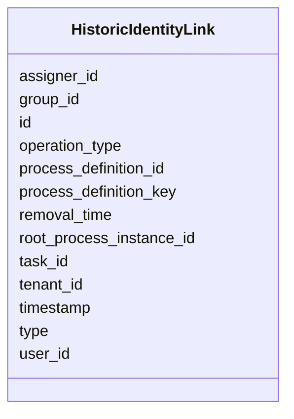

---
search:
  boost: 10.0
---

# Class: HistoricIdentityLink 


_An historic identity link stores the association of a task with a certain identity. For example, historic identity link is logged on the following conditions: - a user can be an assignee/Candidate/..._


<div data-search-exclude markdown="1">


URI: [fluxnova_bpm_platform:HistoricIdentityLink](https://w3id.org/TD-Universe/fluxnova-bpm-platform/HistoricIdentityLink)





<!-- no inheritance hierarchy -->

## Slots

| Name | Cardinality and Range | Description | Inheritance |
| ---  | --- | --- | --- |
| [id](id.md) | 1 <br/> [String](String.md) | Unique identifier | direct |
| [timestamp](timestamp.md) | 1 <br/> [Datetime](Datetime.md) | Time when this log occurred | direct |
| [type](type.md) | 0..1 <br/> [String](String.md) | Type discriminator | direct |
| [user_id](user_id.md) | 0..1 <br/> [String](String.md) | Reference to a user | direct |
| [group_id](group_id.md) | 0..1 <br/> [String](String.md) | Reference to a group | direct |
| [task_id](task_id.md) | 0..1 <br/> [String](String.md) | Reference to the task | direct |
| [root_process_instance_id](root_process_instance_id.md) | 0..1 <br/> [String](String.md) | Root process instance for history cleanup | direct |
| [process_definition_id](process_definition_id.md) | 0..1 <br/> [String](String.md) | Reference to the process definition | direct |
| [operation_type](operation_type.md) | 0..1 <br/> [String](String.md) | Type of identity link history (add or delete identity link) | direct |
| [assigner_id](assigner_id.md) | 0..1 <br/> [String](String.md) | UserId of the user who assigns a task to the user | direct |
| [process_definition_key](process_definition_key.md) | 0..1 <br/> [String](String.md) | Key of the process definition | direct |
| [tenant_id](tenant_id.md) | 0..1 <br/> [String](String.md) | Multi-tenancy discriminator | direct |
| [removal_time](removal_time.md) | 0..1 <br/> [Datetime](Datetime.md) | Timestamp when this entity is eligible for removal | direct |


## In Subsets


* [History](History.md)
* [FluxnovaBpm](FluxnovaBpm.md)


## Identifier and Mapping Information


### Annotations

| property | value |
| --- | --- |
| sql_table | ACT_HI_IDENTITYLINK |


### Schema Source


* from schema: https://w3id.org/TD-Universe/fluxnova-bpm-platform


## Mappings

| Mapping Type | Mapped Value |
| ---  | ---  |
| self | fluxnova_bpm_platform:HistoricIdentityLink |
| native | fluxnova_bpm_platform:HistoricIdentityLink |


## LinkML Source

<!-- TODO: investigate https://stackoverflow.com/questions/37606292/how-to-create-tabbed-code-blocks-in-mkdocs-or-sphinx -->

### Direct

<details>
```yaml
name: HistoricIdentityLink
annotations:
  sql_table:
    tag: sql_table
    value: ACT_HI_IDENTITYLINK
description: 'An historic identity link stores the association of a task with a certain
  identity. For example, historic identity link is logged on the following conditions:
  - a user can be an assignee/Candidate/...'
in_subset:
- history
- fluxnova_bpm
from_schema: https://w3id.org/TD-Universe/fluxnova-bpm-platform
slots:
- id
- timestamp
- type
- user_id
- group_id
- task_id
- root_process_instance_id
- process_definition_id
- operation_type
- assigner_id
- process_definition_key
- tenant_id
- removal_time
slot_usage:
  timestamp:
    name: timestamp
    required: true

```
</details>

### Induced

<details>
```yaml
name: HistoricIdentityLink
annotations:
  sql_table:
    tag: sql_table
    value: ACT_HI_IDENTITYLINK
description: 'An historic identity link stores the association of a task with a certain
  identity. For example, historic identity link is logged on the following conditions:
  - a user can be an assignee/Candidate/...'
in_subset:
- history
- fluxnova_bpm
from_schema: https://w3id.org/TD-Universe/fluxnova-bpm-platform
slot_usage:
  timestamp:
    name: timestamp
    required: true
attributes:
  id:
    name: id
    description: Unique identifier.
    from_schema: https://w3id.org/TD-Universe/fluxnova-bpm-platform
    rank: 1000
    slot_uri: schema:identifier
    identifier: true
    owner: HistoricIdentityLink
    domain_of:
    - ByteArray
    - MeterLog
    - SchemaLogEntry
    - TaskMeterLog
    - Authorization
    - Group
    - IdentityInfo
    - IdentityLink
    - Tenant
    - TenantMembership
    - User
    - CaseExecution
    - CaseSentryPart
    - EventSubscription
    - Execution
    - ExternalTask
    - Incident
    - Task
    - VariableInstance
    - Attachment
    - Comment
    - Filter
    - Deployment
    - ResourceDefinition
    - Batch
    - Job
    - JobDefinition
    - HistoricBatch
    - HistoricDecisionInputInstance
    - HistoricDecisionInstance
    - HistoricDecisionOutputInstance
    - HistoricDetail
    - HistoricExternalTaskLog
    - HistoricIdentityLink
    - HistoricIncident
    - HistoricJobLog
    - HistoricScopeInstance
    - HistoricVariableInstance
    - UserOperationLogEntry
    - Diagram
    - DiagramElement
    - Style
    - BaseElement
    - Definitions
    - Documentation
    - InteractionNode
    range: string
    required: true
  timestamp:
    name: timestamp
    annotations:
      sql_column:
        tag: sql_column
        value: TIMESTAMP_
    description: Time when this log occurred.
    from_schema: https://w3id.org/TD-Universe/fluxnova-bpm-platform
    rank: 1000
    owner: HistoricIdentityLink
    domain_of:
    - MeterLog
    - SchemaLogEntry
    - TaskMeterLog
    - HistoricExternalTaskLog
    - HistoricIdentityLink
    - HistoricJobLog
    - UserOperationLogEntry
    range: datetime
    required: true
  type:
    name: type
    description: Type discriminator.
    from_schema: https://w3id.org/TD-Universe/fluxnova-bpm-platform
    rank: 1000
    owner: HistoricIdentityLink
    domain_of:
    - ByteArray
    - Authorization
    - Group
    - IdentityInfo
    - IdentityLink
    - CaseSentryPart
    - VariableInstance
    - Attachment
    - Comment
    - Batch
    - Job
    - HistoricBatch
    - HistoricDetail
    - HistoricIdentityLink
    - ConditionExpression
    - CorrelationProperty
    - Relationship
    - ResourceParameter
    range: string
  user_id:
    name: user_id
    description: Reference to a user.
    from_schema: https://w3id.org/TD-Universe/fluxnova-bpm-platform
    rank: 1000
    owner: HistoricIdentityLink
    domain_of:
    - Authorization
    - IdentityInfo
    - IdentityLink
    - Membership
    - TenantMembership
    - Attachment
    - Comment
    - HistoricDecisionInstance
    - HistoricIdentityLink
    - UserOperationLogEntry
    range: string
  group_id:
    name: group_id
    description: Reference to a group.
    from_schema: https://w3id.org/TD-Universe/fluxnova-bpm-platform
    rank: 1000
    owner: HistoricIdentityLink
    domain_of:
    - Authorization
    - IdentityLink
    - Membership
    - TenantMembership
    - HistoricIdentityLink
    range: string
  task_id:
    name: task_id
    description: Reference to the task.
    from_schema: https://w3id.org/TD-Universe/fluxnova-bpm-platform
    rank: 1000
    owner: HistoricIdentityLink
    domain_of:
    - IdentityLink
    - VariableInstance
    - Attachment
    - Comment
    - HistoricActivityInstance
    - HistoricCaseActivityInstance
    - HistoricDetail
    - HistoricIdentityLink
    - HistoricVariableInstance
    - UserOperationLogEntry
    range: string
  root_process_instance_id:
    name: root_process_instance_id
    description: Root process instance for history cleanup.
    from_schema: https://w3id.org/TD-Universe/fluxnova-bpm-platform
    rank: 1000
    owner: HistoricIdentityLink
    domain_of:
    - ByteArray
    - Authorization
    - Execution
    - Attachment
    - Comment
    - Job
    - HistoricDecisionInputInstance
    - HistoricDecisionInstance
    - HistoricDecisionOutputInstance
    - HistoricDetail
    - HistoricExternalTaskLog
    - HistoricIdentityLink
    - HistoricIncident
    - HistoricJobLog
    - HistoricScopeInstance
    - HistoricVariableInstance
    - UserOperationLogEntry
    range: string
  process_definition_id:
    name: process_definition_id
    description: Reference to the process definition.
    from_schema: https://w3id.org/TD-Universe/fluxnova-bpm-platform
    rank: 1000
    owner: HistoricIdentityLink
    domain_of:
    - IdentityLink
    - Execution
    - ExternalTask
    - Incident
    - Task
    - VariableInstance
    - Job
    - JobDefinition
    - HistoricDecisionInstance
    - HistoricDetail
    - HistoricExternalTaskLog
    - HistoricIdentityLink
    - HistoricIncident
    - HistoricJobLog
    - HistoricScopeInstance
    - HistoricVariableInstance
    - UserOperationLogEntry
    range: string
  operation_type:
    name: operation_type
    annotations:
      sql_column:
        tag: sql_column
        value: OPERATION_TYPE_
    description: Type of identity link history (add or delete identity link)
    from_schema: https://w3id.org/TD-Universe/fluxnova-bpm-platform
    rank: 1000
    owner: HistoricIdentityLink
    domain_of:
    - HistoricIdentityLink
    - UserOperationLogEntry
    range: string
  assigner_id:
    name: assigner_id
    annotations:
      sql_column:
        tag: sql_column
        value: ASSIGNER_ID_
    description: UserId of the user who assigns a task to the user
    from_schema: https://w3id.org/TD-Universe/fluxnova-bpm-platform
    rank: 1000
    owner: HistoricIdentityLink
    domain_of:
    - HistoricIdentityLink
    range: string
  process_definition_key:
    name: process_definition_key
    description: Key of the process definition.
    from_schema: https://w3id.org/TD-Universe/fluxnova-bpm-platform
    rank: 1000
    owner: HistoricIdentityLink
    domain_of:
    - Execution
    - ExternalTask
    - Job
    - JobDefinition
    - HistoricDecisionInstance
    - HistoricDetail
    - HistoricExternalTaskLog
    - HistoricIdentityLink
    - HistoricIncident
    - HistoricJobLog
    - HistoricScopeInstance
    - HistoricVariableInstance
    - UserOperationLogEntry
    range: string
  tenant_id:
    name: tenant_id
    description: Multi-tenancy discriminator.
    from_schema: https://w3id.org/TD-Universe/fluxnova-bpm-platform
    rank: 1000
    owner: HistoricIdentityLink
    domain_of:
    - ByteArray
    - IdentityLink
    - TenantMembership
    - CaseExecution
    - CaseSentryPart
    - EventSubscription
    - Execution
    - ExternalTask
    - Incident
    - Task
    - VariableInstance
    - Attachment
    - Comment
    - Deployment
    - ResourceDefinition
    - Batch
    - Job
    - JobDefinition
    - HistoricActivityInstance
    - HistoricBatch
    - HistoricCaseActivityInstance
    - HistoricCaseInstance
    - HistoricDecisionInputInstance
    - HistoricDecisionInstance
    - HistoricDecisionOutputInstance
    - HistoricDetail
    - HistoricExternalTaskLog
    - HistoricIdentityLink
    - HistoricIncident
    - HistoricJobLog
    - HistoricProcessInstance
    - HistoricTaskInstance
    - HistoricVariableInstance
    - UserOperationLogEntry
    range: string
  removal_time:
    name: removal_time
    description: Timestamp when this entity is eligible for removal.
    from_schema: https://w3id.org/TD-Universe/fluxnova-bpm-platform
    rank: 1000
    owner: HistoricIdentityLink
    domain_of:
    - ByteArray
    - Authorization
    - Attachment
    - Comment
    - HistoricBatch
    - HistoricDecisionInputInstance
    - HistoricDecisionInstance
    - HistoricDecisionOutputInstance
    - HistoricDetail
    - HistoricExternalTaskLog
    - HistoricIdentityLink
    - HistoricIncident
    - HistoricJobLog
    - HistoricScopeInstance
    - HistoricVariableInstance
    - UserOperationLogEntry
    range: datetime

```
</details></div>