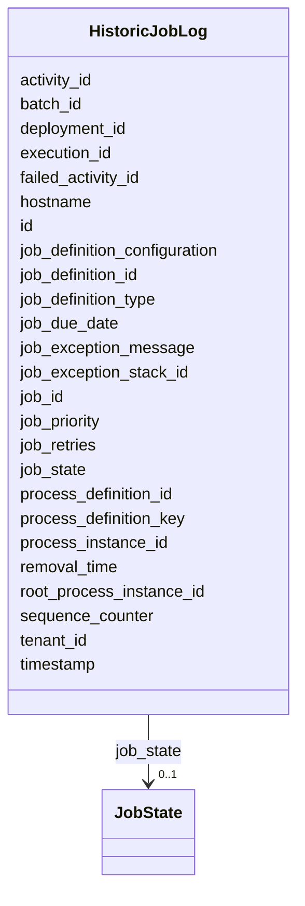

---
search:
  boost: 10.0
---

# Class: HistoricJobLog 


_The HistoricJobLog is used to have a log containing information about Job job execution. The log provides details about the complete lifecycle of a Job job: An instance of HistoricJobLog represents..._


<div data-search-exclude markdown="1">


URI: [fluxnova_bpm_platform:HistoricJobLog](https://w3id.org/TD-Universe/fluxnova-bpm-platform/HistoricJobLog)





<!-- no inheritance hierarchy -->

## Slots

| Name | Cardinality and Range | Description | Inheritance |
| ---  | --- | --- | --- |
| [id](id.md) | 1 <br/> [String](String.md) | Unique identifier | direct |
| [timestamp](timestamp.md) | 1 <br/> [Datetime](Datetime.md) | Time when this log occurred | direct |
| [job_id](job_id.md) | 1 <br/> [String](String.md) | Id of the associated job | direct |
| [job_due_date](job_due_date.md) | 0..1 <br/> [Datetime](Datetime.md) | Due date of the associated job when this log occurred | direct |
| [job_retries](job_retries.md) | 0..1 <br/> [Integer](Integer.md) | Retries of the associated job before the associated job has been executed and... | direct |
| [job_priority](job_priority.md) | 1 <br/> [Integer](Integer.md) | Priority of the associated job when this log entry was created | direct |
| [job_exception_message](job_exception_message.md) | 0..1 <br/> [String](String.md) | Message of the exception that occurred by executing the associated job | direct |
| [job_exception_stack_id](job_exception_stack_id.md) | 0..1 <br/> [String](String.md) | Reference to the job exception stack | direct |
| [job_state](job_state.md) | 0..1 <br/> [JobState](JobState.md) | The job state | direct |
| [job_definition_id](job_definition_id.md) | 0..1 <br/> [String](String.md) | Reference to the job definition | direct |
| [job_definition_type](job_definition_type.md) | 0..1 <br/> [String](String.md) | Job definition type of the associated job | direct |
| [job_definition_configuration](job_definition_configuration.md) | 0..1 <br/> [String](String.md) | Job definition configuration type of the associated job | direct |
| [activity_id](activity_id.md) | 0..1 <br/> [String](String.md) | BPMN activity element identifier | direct |
| [failed_activity_id](failed_activity_id.md) | 0..1 <br/> [String](String.md) | Id of the activity on which the last exception occurred | direct |
| [execution_id](execution_id.md) | 0..1 <br/> [String](String.md) | Reference to the execution | direct |
| [root_process_instance_id](root_process_instance_id.md) | 0..1 <br/> [String](String.md) | Root process instance for history cleanup | direct |
| [process_instance_id](process_instance_id.md) | 0..1 <br/> [String](String.md) | Reference to the process instance | direct |
| [process_definition_id](process_definition_id.md) | 0..1 <br/> [String](String.md) | Reference to the process definition | direct |
| [process_definition_key](process_definition_key.md) | 0..1 <br/> [String](String.md) | Key of the process definition | direct |
| [deployment_id](deployment_id.md) | 0..1 <br/> [String](String.md) | Reference to the deployment | direct |
| [sequence_counter](sequence_counter.md) | 0..1 <br/> [Integer](Integer.md) | Monotonically increasing counter for ordering | direct |
| [tenant_id](tenant_id.md) | 0..1 <br/> [String](String.md) | Multi-tenancy discriminator | direct |
| [hostname](hostname.md) | 0..1 <br/> [String](String.md) | Name of the host where the Process Engine that added this job log runs | direct |
| [removal_time](removal_time.md) | 0..1 <br/> [Datetime](Datetime.md) | Timestamp when this entity is eligible for removal | direct |
| [batch_id](batch_id.md) | 0..1 <br/> [String](String.md) | Reference to a batch | direct |


## In Subsets


* [History](History.md)
* [FluxnovaBpm](FluxnovaBpm.md)


## Identifier and Mapping Information


### Annotations

| property | value |
| --- | --- |
| sql_table | ACT_HI_JOB_LOG |


### Schema Source


* from schema: https://w3id.org/TD-Universe/fluxnova-bpm-platform


## Mappings

| Mapping Type | Mapped Value |
| ---  | ---  |
| self | fluxnova_bpm_platform:HistoricJobLog |
| native | fluxnova_bpm_platform:HistoricJobLog |


## LinkML Source

<!-- TODO: investigate https://stackoverflow.com/questions/37606292/how-to-create-tabbed-code-blocks-in-mkdocs-or-sphinx -->

### Direct

<details>
```yaml
name: HistoricJobLog
annotations:
  sql_table:
    tag: sql_table
    value: ACT_HI_JOB_LOG
description: 'The HistoricJobLog is used to have a log containing information about
  Job job execution. The log provides details about the complete lifecycle of a Job
  job: An instance of HistoricJobLog represents...'
in_subset:
- history
- fluxnova_bpm
from_schema: https://w3id.org/TD-Universe/fluxnova-bpm-platform
slots:
- id
- timestamp
- job_id
- job_due_date
- job_retries
- job_priority
- job_exception_message
- job_exception_stack_id
- job_state
- job_definition_id
- job_definition_type
- job_definition_configuration
- activity_id
- failed_activity_id
- execution_id
- root_process_instance_id
- process_instance_id
- process_definition_id
- process_definition_key
- deployment_id
- sequence_counter
- tenant_id
- hostname
- removal_time
- batch_id
slot_usage:
  timestamp:
    name: timestamp
    required: true

```
</details>

### Induced

<details>
```yaml
name: HistoricJobLog
annotations:
  sql_table:
    tag: sql_table
    value: ACT_HI_JOB_LOG
description: 'The HistoricJobLog is used to have a log containing information about
  Job job execution. The log provides details about the complete lifecycle of a Job
  job: An instance of HistoricJobLog represents...'
in_subset:
- history
- fluxnova_bpm
from_schema: https://w3id.org/TD-Universe/fluxnova-bpm-platform
slot_usage:
  timestamp:
    name: timestamp
    required: true
attributes:
  id:
    name: id
    description: Unique identifier.
    from_schema: https://w3id.org/TD-Universe/fluxnova-bpm-platform
    rank: 1000
    slot_uri: schema:identifier
    identifier: true
    owner: HistoricJobLog
    domain_of:
    - ByteArray
    - MeterLog
    - SchemaLogEntry
    - TaskMeterLog
    - Authorization
    - Group
    - IdentityInfo
    - IdentityLink
    - Tenant
    - TenantMembership
    - User
    - CaseExecution
    - CaseSentryPart
    - EventSubscription
    - Execution
    - ExternalTask
    - Incident
    - Task
    - VariableInstance
    - Attachment
    - Comment
    - Filter
    - Deployment
    - ResourceDefinition
    - Batch
    - Job
    - JobDefinition
    - HistoricBatch
    - HistoricDecisionInputInstance
    - HistoricDecisionInstance
    - HistoricDecisionOutputInstance
    - HistoricDetail
    - HistoricExternalTaskLog
    - HistoricIdentityLink
    - HistoricIncident
    - HistoricJobLog
    - HistoricScopeInstance
    - HistoricVariableInstance
    - UserOperationLogEntry
    - Diagram
    - DiagramElement
    - Style
    - BaseElement
    - Definitions
    - Documentation
    - InteractionNode
    range: string
    required: true
  timestamp:
    name: timestamp
    annotations:
      sql_column:
        tag: sql_column
        value: TIMESTAMP_
    description: Time when this log occurred.
    from_schema: https://w3id.org/TD-Universe/fluxnova-bpm-platform
    rank: 1000
    owner: HistoricJobLog
    domain_of:
    - MeterLog
    - SchemaLogEntry
    - TaskMeterLog
    - HistoricExternalTaskLog
    - HistoricIdentityLink
    - HistoricJobLog
    - UserOperationLogEntry
    range: datetime
    required: true
  job_id:
    name: job_id
    annotations:
      sql_column:
        tag: sql_column
        value: JOB_ID_
    description: Id of the associated job.
    from_schema: https://w3id.org/TD-Universe/fluxnova-bpm-platform
    rank: 1000
    owner: HistoricJobLog
    domain_of:
    - HistoricJobLog
    - UserOperationLogEntry
    range: string
    required: true
  job_due_date:
    name: job_due_date
    annotations:
      sql_column:
        tag: sql_column
        value: JOB_DUEDATE_
    description: Due date of the associated job when this log occurred.
    from_schema: https://w3id.org/TD-Universe/fluxnova-bpm-platform
    rank: 1000
    owner: HistoricJobLog
    domain_of:
    - HistoricJobLog
    range: datetime
  job_retries:
    name: job_retries
    annotations:
      sql_column:
        tag: sql_column
        value: JOB_RETRIES_
    description: Retries of the associated job before the associated job has been
      executed and when this log occurred.
    from_schema: https://w3id.org/TD-Universe/fluxnova-bpm-platform
    rank: 1000
    owner: HistoricJobLog
    domain_of:
    - HistoricJobLog
    range: integer
  job_priority:
    name: job_priority
    annotations:
      sql_column:
        tag: sql_column
        value: JOB_PRIORITY_
    description: Priority of the associated job when this log entry was created.
    from_schema: https://w3id.org/TD-Universe/fluxnova-bpm-platform
    rank: 1000
    owner: HistoricJobLog
    domain_of:
    - JobDefinition
    - HistoricJobLog
    range: integer
    required: true
  job_exception_message:
    name: job_exception_message
    annotations:
      sql_column:
        tag: sql_column
        value: JOB_EXCEPTION_MSG_
    description: Message of the exception that occurred by executing the associated
      job. To get the full exception stacktrace, use
    from_schema: https://w3id.org/TD-Universe/fluxnova-bpm-platform
    rank: 1000
    owner: HistoricJobLog
    domain_of:
    - HistoricJobLog
    range: string
  job_exception_stack_id:
    name: job_exception_stack_id
    annotations:
      sql_column:
        tag: sql_column
        value: JOB_EXCEPTION_STACK_ID_
    description: Reference to the job exception stack.
    from_schema: https://w3id.org/TD-Universe/fluxnova-bpm-platform
    rank: 1000
    owner: HistoricJobLog
    domain_of:
    - HistoricJobLog
    range: string
  job_state:
    name: job_state
    annotations:
      sql_column:
        tag: sql_column
        value: JOB_STATE_
    description: The job state.
    from_schema: https://w3id.org/TD-Universe/fluxnova-bpm-platform
    rank: 1000
    owner: HistoricJobLog
    domain_of:
    - HistoricJobLog
    range: JobState
  job_definition_id:
    name: job_definition_id
    description: Reference to the job definition.
    from_schema: https://w3id.org/TD-Universe/fluxnova-bpm-platform
    rank: 1000
    owner: HistoricJobLog
    domain_of:
    - Incident
    - Job
    - HistoricIncident
    - HistoricJobLog
    - UserOperationLogEntry
    range: string
  job_definition_type:
    name: job_definition_type
    annotations:
      sql_column:
        tag: sql_column
        value: JOB_DEF_TYPE_
    description: Job definition type of the associated job.
    from_schema: https://w3id.org/TD-Universe/fluxnova-bpm-platform
    rank: 1000
    owner: HistoricJobLog
    domain_of:
    - HistoricJobLog
    range: string
  job_definition_configuration:
    name: job_definition_configuration
    annotations:
      sql_column:
        tag: sql_column
        value: JOB_DEF_CONFIGURATION_
    description: Job definition configuration type of the associated job.
    from_schema: https://w3id.org/TD-Universe/fluxnova-bpm-platform
    rank: 1000
    owner: HistoricJobLog
    domain_of:
    - HistoricJobLog
    range: string
  activity_id:
    name: activity_id
    description: BPMN activity element identifier.
    from_schema: https://w3id.org/TD-Universe/fluxnova-bpm-platform
    rank: 1000
    owner: HistoricJobLog
    domain_of:
    - CaseExecution
    - EventSubscription
    - Execution
    - ExternalTask
    - Incident
    - JobDefinition
    - HistoricActivityInstance
    - HistoricDecisionInstance
    - HistoricExternalTaskLog
    - HistoricIncident
    - HistoricJobLog
    range: string
  failed_activity_id:
    name: failed_activity_id
    annotations:
      sql_column:
        tag: sql_column
        value: FAILED_ACTIVITY_ID_
    description: Id of the activity on which the last exception occurred.
    from_schema: https://w3id.org/TD-Universe/fluxnova-bpm-platform
    rank: 1000
    owner: HistoricJobLog
    domain_of:
    - Incident
    - Job
    - HistoricIncident
    - HistoricJobLog
    range: string
  execution_id:
    name: execution_id
    description: Reference to the execution.
    from_schema: https://w3id.org/TD-Universe/fluxnova-bpm-platform
    rank: 1000
    owner: HistoricJobLog
    domain_of:
    - EventSubscription
    - ExternalTask
    - Incident
    - Task
    - VariableInstance
    - Job
    - HistoricActivityInstance
    - HistoricDetail
    - HistoricExternalTaskLog
    - HistoricIncident
    - HistoricJobLog
    - HistoricTaskInstance
    - HistoricVariableInstance
    - UserOperationLogEntry
    range: string
  root_process_instance_id:
    name: root_process_instance_id
    description: Root process instance for history cleanup.
    from_schema: https://w3id.org/TD-Universe/fluxnova-bpm-platform
    rank: 1000
    owner: HistoricJobLog
    domain_of:
    - ByteArray
    - Authorization
    - Execution
    - Attachment
    - Comment
    - Job
    - HistoricDecisionInputInstance
    - HistoricDecisionInstance
    - HistoricDecisionOutputInstance
    - HistoricDetail
    - HistoricExternalTaskLog
    - HistoricIdentityLink
    - HistoricIncident
    - HistoricJobLog
    - HistoricScopeInstance
    - HistoricVariableInstance
    - UserOperationLogEntry
    range: string
  process_instance_id:
    name: process_instance_id
    description: Reference to the process instance.
    from_schema: https://w3id.org/TD-Universe/fluxnova-bpm-platform
    rank: 1000
    owner: HistoricJobLog
    domain_of:
    - EventSubscription
    - Execution
    - ExternalTask
    - Incident
    - Task
    - VariableInstance
    - Attachment
    - Comment
    - Job
    - HistoricDecisionInstance
    - HistoricDetail
    - HistoricExternalTaskLog
    - HistoricIncident
    - HistoricJobLog
    - HistoricScopeInstance
    - HistoricVariableInstance
    - UserOperationLogEntry
    range: string
  process_definition_id:
    name: process_definition_id
    description: Reference to the process definition.
    from_schema: https://w3id.org/TD-Universe/fluxnova-bpm-platform
    rank: 1000
    owner: HistoricJobLog
    domain_of:
    - IdentityLink
    - Execution
    - ExternalTask
    - Incident
    - Task
    - VariableInstance
    - Job
    - JobDefinition
    - HistoricDecisionInstance
    - HistoricDetail
    - HistoricExternalTaskLog
    - HistoricIdentityLink
    - HistoricIncident
    - HistoricJobLog
    - HistoricScopeInstance
    - HistoricVariableInstance
    - UserOperationLogEntry
    range: string
  process_definition_key:
    name: process_definition_key
    description: Key of the process definition.
    from_schema: https://w3id.org/TD-Universe/fluxnova-bpm-platform
    rank: 1000
    owner: HistoricJobLog
    domain_of:
    - Execution
    - ExternalTask
    - Job
    - JobDefinition
    - HistoricDecisionInstance
    - HistoricDetail
    - HistoricExternalTaskLog
    - HistoricIdentityLink
    - HistoricIncident
    - HistoricJobLog
    - HistoricScopeInstance
    - HistoricVariableInstance
    - UserOperationLogEntry
    range: string
  deployment_id:
    name: deployment_id
    description: Reference to the deployment.
    from_schema: https://w3id.org/TD-Universe/fluxnova-bpm-platform
    rank: 1000
    owner: HistoricJobLog
    domain_of:
    - ByteArray
    - ResourceDefinition
    - Job
    - JobDefinition
    - HistoricJobLog
    - UserOperationLogEntry
    range: string
  sequence_counter:
    name: sequence_counter
    annotations:
      sql_column:
        tag: sql_column
        value: SEQUENCE_COUNTER_
    description: Monotonically increasing counter for ordering.
    from_schema: https://w3id.org/TD-Universe/fluxnova-bpm-platform
    rank: 1000
    owner: HistoricJobLog
    domain_of:
    - Execution
    - VariableInstance
    - Job
    - HistoricActivityInstance
    - HistoricDetail
    - HistoricJobLog
    range: integer
  tenant_id:
    name: tenant_id
    description: Multi-tenancy discriminator.
    from_schema: https://w3id.org/TD-Universe/fluxnova-bpm-platform
    rank: 1000
    owner: HistoricJobLog
    domain_of:
    - ByteArray
    - IdentityLink
    - TenantMembership
    - CaseExecution
    - CaseSentryPart
    - EventSubscription
    - Execution
    - ExternalTask
    - Incident
    - Task
    - VariableInstance
    - Attachment
    - Comment
    - Deployment
    - ResourceDefinition
    - Batch
    - Job
    - JobDefinition
    - HistoricActivityInstance
    - HistoricBatch
    - HistoricCaseActivityInstance
    - HistoricCaseInstance
    - HistoricDecisionInputInstance
    - HistoricDecisionInstance
    - HistoricDecisionOutputInstance
    - HistoricDetail
    - HistoricExternalTaskLog
    - HistoricIdentityLink
    - HistoricIncident
    - HistoricJobLog
    - HistoricProcessInstance
    - HistoricTaskInstance
    - HistoricVariableInstance
    - UserOperationLogEntry
    range: string
  hostname:
    name: hostname
    annotations:
      sql_column:
        tag: sql_column
        value: HOSTNAME_
    description: Name of the host where the Process Engine that added this job log
      runs.
    from_schema: https://w3id.org/TD-Universe/fluxnova-bpm-platform
    rank: 1000
    owner: HistoricJobLog
    domain_of:
    - HistoricJobLog
    range: string
  removal_time:
    name: removal_time
    description: Timestamp when this entity is eligible for removal.
    from_schema: https://w3id.org/TD-Universe/fluxnova-bpm-platform
    rank: 1000
    owner: HistoricJobLog
    domain_of:
    - ByteArray
    - Authorization
    - Attachment
    - Comment
    - HistoricBatch
    - HistoricDecisionInputInstance
    - HistoricDecisionInstance
    - HistoricDecisionOutputInstance
    - HistoricDetail
    - HistoricExternalTaskLog
    - HistoricIdentityLink
    - HistoricIncident
    - HistoricJobLog
    - HistoricScopeInstance
    - HistoricVariableInstance
    - UserOperationLogEntry
    range: datetime
  batch_id:
    name: batch_id
    description: Reference to a batch.
    from_schema: https://w3id.org/TD-Universe/fluxnova-bpm-platform
    rank: 1000
    owner: HistoricJobLog
    domain_of:
    - VariableInstance
    - Job
    - HistoricJobLog
    - UserOperationLogEntry
    range: string

```
</details></div>