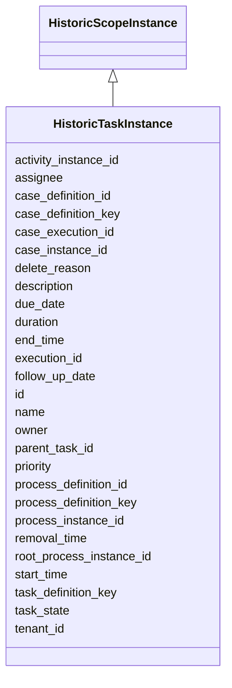

---
search:
  boost: 10.0
---

# Class: HistoricTaskInstance 


_Represents a historic task instance (waiting, finished or deleted) that is stored permanent for statistics, audit and other business intelligence purposes._


<div data-search-exclude markdown="1">


URI: [fluxnova_bpm_platform:HistoricTaskInstance](https://w3id.org/TD-Universe/fluxnova-bpm-platform/HistoricTaskInstance)





## Inheritance
* [HistoricScopeInstance](HistoricScopeInstance.md)
    * **HistoricTaskInstance**


## Slots

| Name | Cardinality and Range | Description | Inheritance |
| ---  | --- | --- | --- |
| [task_definition_key](task_definition_key.md) | 0..1 <br/> [String](String.md) | The id of the activity in the process defining this task or null if this is n... | direct |
| [execution_id](execution_id.md) | 0..1 <br/> [String](String.md) | Reference to the execution | direct |
| [case_definition_key](case_definition_key.md) | 0..1 <br/> [String](String.md) | Case definition key reference | direct |
| [case_definition_id](case_definition_id.md) | 0..1 <br/> [String](String.md) | Reference to the case definition | direct |
| [case_instance_id](case_instance_id.md) | 0..1 <br/> [String](String.md) | Reference to the case instance | direct |
| [case_execution_id](case_execution_id.md) | 0..1 <br/> [String](String.md) | Reference to the case execution | direct |
| [activity_instance_id](activity_instance_id.md) | 0..1 <br/> [String](String.md) | Runtime activity instance identifier | direct |
| [name](name.md) | 0..1 <br/> [String](String.md) | Human-readable name | direct |
| [parent_task_id](parent_task_id.md) | 0..1 <br/> [String](String.md) | The parent task for which this task is a subtask | direct |
| [description](description.md) | 0..1 <br/> [String](String.md) | Human-readable description | direct |
| [owner](owner.md) | 0..1 <br/> [String](String.md) | The userId of the person that is responsible for this task | direct |
| [assignee](assignee.md) | 0..1 <br/> [String](String.md) | The userId of the person to which this task is assigned or delegated | direct |
| [delete_reason](delete_reason.md) | 0..1 <br/> [String](String.md) | Obtains the reason for the process instance's deletion | direct |
| [priority](priority.md) | 1 <br/> [Integer](Integer.md) | Indication of how important/urgent this task is with a number between 0 and 1... | direct |
| [due_date](due_date.md) | 0..1 <br/> [Datetime](Datetime.md) | Due date of the task | direct |
| [follow_up_date](follow_up_date.md) | 0..1 <br/> [Datetime](Datetime.md) | Follow-up date of the task | direct |
| [tenant_id](tenant_id.md) | 0..1 <br/> [String](String.md) | Multi-tenancy discriminator | direct |
| [task_state](task_state.md) | 0..1 <br/> [String](String.md) | Task's state | direct |
| [id](id.md) | 1 <br/> [String](String.md) | Unique identifier | [HistoricScopeInstance](HistoricScopeInstance.md) |
| [root_process_instance_id](root_process_instance_id.md) | 0..1 <br/> [String](String.md) | Root process instance for history cleanup | [HistoricScopeInstance](HistoricScopeInstance.md) |
| [process_instance_id](process_instance_id.md) | 0..1 <br/> [String](String.md) | Reference to the process instance | [HistoricScopeInstance](HistoricScopeInstance.md) |
| [process_definition_id](process_definition_id.md) | 0..1 <br/> [String](String.md) | Reference to the process definition | [HistoricScopeInstance](HistoricScopeInstance.md) |
| [process_definition_key](process_definition_key.md) | 0..1 <br/> [String](String.md) | Key of the process definition | [HistoricScopeInstance](HistoricScopeInstance.md) |
| [start_time](start_time.md) | 1 <br/> [Datetime](Datetime.md) | Start timestamp | [HistoricScopeInstance](HistoricScopeInstance.md) |
| [end_time](end_time.md) | 0..1 <br/> [Datetime](Datetime.md) | End timestamp | [HistoricScopeInstance](HistoricScopeInstance.md) |
| [duration](duration.md) | 0..1 <br/> [Integer](Integer.md) | Duration in milliseconds | [HistoricScopeInstance](HistoricScopeInstance.md) |
| [removal_time](removal_time.md) | 0..1 <br/> [Datetime](Datetime.md) | Timestamp when this entity is eligible for removal | [HistoricScopeInstance](HistoricScopeInstance.md) |


## In Subsets


* [History](History.md)
* [FluxnovaBpm](FluxnovaBpm.md)


## Identifier and Mapping Information


### Annotations

| property | value |
| --- | --- |
| sql_table | ACT_HI_TASKINST |


### Schema Source


* from schema: https://w3id.org/TD-Universe/fluxnova-bpm-platform


## Mappings

| Mapping Type | Mapped Value |
| ---  | ---  |
| self | fluxnova_bpm_platform:HistoricTaskInstance |
| native | fluxnova_bpm_platform:HistoricTaskInstance |


## LinkML Source

<!-- TODO: investigate https://stackoverflow.com/questions/37606292/how-to-create-tabbed-code-blocks-in-mkdocs-or-sphinx -->

### Direct

<details>
```yaml
name: HistoricTaskInstance
annotations:
  sql_table:
    tag: sql_table
    value: ACT_HI_TASKINST
description: Represents a historic task instance (waiting, finished or deleted) that
  is stored permanent for statistics, audit and other business intelligence purposes.
in_subset:
- history
- fluxnova_bpm
from_schema: https://w3id.org/TD-Universe/fluxnova-bpm-platform
is_a: HistoricScopeInstance
slots:
- task_definition_key
- execution_id
- case_definition_key
- case_definition_id
- case_instance_id
- case_execution_id
- activity_instance_id
- name
- parent_task_id
- description
- owner
- assignee
- delete_reason
- priority
- due_date
- follow_up_date
- tenant_id
- task_state
slot_usage:
  start_time:
    name: start_time
    required: true

```
</details>

### Induced

<details>
```yaml
name: HistoricTaskInstance
annotations:
  sql_table:
    tag: sql_table
    value: ACT_HI_TASKINST
description: Represents a historic task instance (waiting, finished or deleted) that
  is stored permanent for statistics, audit and other business intelligence purposes.
in_subset:
- history
- fluxnova_bpm
from_schema: https://w3id.org/TD-Universe/fluxnova-bpm-platform
is_a: HistoricScopeInstance
slot_usage:
  start_time:
    name: start_time
    required: true
attributes:
  task_definition_key:
    name: task_definition_key
    annotations:
      sql_column:
        tag: sql_column
        value: TASK_DEF_KEY_
    description: The id of the activity in the process defining this task or null
      if this is not related to a process
    from_schema: https://w3id.org/TD-Universe/fluxnova-bpm-platform
    rank: 1000
    owner: HistoricTaskInstance
    domain_of:
    - Task
    - HistoricTaskInstance
    range: string
  execution_id:
    name: execution_id
    description: Reference to the execution.
    from_schema: https://w3id.org/TD-Universe/fluxnova-bpm-platform
    rank: 1000
    owner: HistoricTaskInstance
    domain_of:
    - EventSubscription
    - ExternalTask
    - Incident
    - Task
    - VariableInstance
    - Job
    - HistoricActivityInstance
    - HistoricDetail
    - HistoricExternalTaskLog
    - HistoricIncident
    - HistoricJobLog
    - HistoricTaskInstance
    - HistoricVariableInstance
    - UserOperationLogEntry
    range: string
  case_definition_key:
    name: case_definition_key
    annotations:
      sql_column:
        tag: sql_column
        value: CASE_DEF_KEY_
    description: Case definition key reference.
    from_schema: https://w3id.org/TD-Universe/fluxnova-bpm-platform
    rank: 1000
    owner: HistoricTaskInstance
    domain_of:
    - HistoricDecisionInstance
    - HistoricDetail
    - HistoricTaskInstance
    - HistoricVariableInstance
    range: string
  case_definition_id:
    name: case_definition_id
    description: Reference to the case definition.
    from_schema: https://w3id.org/TD-Universe/fluxnova-bpm-platform
    rank: 1000
    owner: HistoricTaskInstance
    domain_of:
    - CaseExecution
    - Task
    - HistoricCaseActivityInstance
    - HistoricCaseInstance
    - HistoricDecisionInstance
    - HistoricDetail
    - HistoricTaskInstance
    - HistoricVariableInstance
    - UserOperationLogEntry
    range: string
  case_instance_id:
    name: case_instance_id
    description: Reference to the case instance.
    from_schema: https://w3id.org/TD-Universe/fluxnova-bpm-platform
    rank: 1000
    owner: HistoricTaskInstance
    domain_of:
    - CaseExecution
    - CaseSentryPart
    - Execution
    - Task
    - VariableInstance
    - HistoricCaseActivityInstance
    - HistoricCaseInstance
    - HistoricDecisionInstance
    - HistoricDetail
    - HistoricProcessInstance
    - HistoricTaskInstance
    - HistoricVariableInstance
    - UserOperationLogEntry
    range: string
  case_execution_id:
    name: case_execution_id
    description: Reference to the case execution.
    from_schema: https://w3id.org/TD-Universe/fluxnova-bpm-platform
    rank: 1000
    owner: HistoricTaskInstance
    domain_of:
    - CaseSentryPart
    - Task
    - VariableInstance
    - HistoricDetail
    - HistoricTaskInstance
    - HistoricVariableInstance
    - UserOperationLogEntry
    range: string
  activity_instance_id:
    name: activity_instance_id
    description: Runtime activity instance identifier.
    from_schema: https://w3id.org/TD-Universe/fluxnova-bpm-platform
    rank: 1000
    owner: HistoricTaskInstance
    domain_of:
    - Execution
    - ExternalTask
    - HistoricDecisionInstance
    - HistoricDetail
    - HistoricExternalTaskLog
    - HistoricTaskInstance
    - HistoricVariableInstance
    range: string
  name:
    name: name
    description: Human-readable name.
    from_schema: https://w3id.org/TD-Universe/fluxnova-bpm-platform
    rank: 1000
    slot_uri: schema:name
    owner: HistoricTaskInstance
    domain_of:
    - ByteArray
    - MeterLog
    - Property
    - Group
    - Tenant
    - Task
    - VariableInstance
    - Attachment
    - Filter
    - Deployment
    - ResourceDefinition
    - HistoricDetail
    - HistoricTaskInstance
    - HistoricVariableInstance
    - Font
    - Diagram
    - CallableElement
    - Category
    - Collaboration
    - ConversationLink
    - ConversationNode
    - CorrelationKey
    - CorrelationProperty
    - DataInput
    - DataOutput
    - DataState
    - DataStore
    - Definitions
    - Error
    - Escalation
    - FlowElement
    - InputSet
    - Interface
    - Lane
    - LaneSet
    - LinkEventDefinition
    - Message
    - MessageFlow
    - Operation
    - OutputSet
    - Participant
    - BpmnProperty
    - Resource
    - ResourceParameter
    - ResourceRole
    - Signal
    range: string
  parent_task_id:
    name: parent_task_id
    annotations:
      sql_column:
        tag: sql_column
        value: PARENT_TASK_ID_
    description: The parent task for which this task is a subtask
    from_schema: https://w3id.org/TD-Universe/fluxnova-bpm-platform
    rank: 1000
    owner: HistoricTaskInstance
    domain_of:
    - Task
    - HistoricTaskInstance
    range: string
  description:
    name: description
    description: Human-readable description.
    from_schema: https://w3id.org/TD-Universe/fluxnova-bpm-platform
    rank: 1000
    slot_uri: schema:description
    owner: HistoricTaskInstance
    domain_of:
    - Task
    - Attachment
    - HistoricTaskInstance
    range: string
  owner:
    name: owner
    annotations:
      sql_column:
        tag: sql_column
        value: OWNER_
    description: The userId of the person that is responsible for this task. This
      is used when a task is delegated.
    from_schema: https://w3id.org/TD-Universe/fluxnova-bpm-platform
    rank: 1000
    owner: HistoricTaskInstance
    domain_of:
    - Task
    - Filter
    - HistoricTaskInstance
    range: string
  assignee:
    name: assignee
    annotations:
      sql_column:
        tag: sql_column
        value: ASSIGNEE_
    description: The userId of the person to which this task is assigned or delegated.
    from_schema: https://w3id.org/TD-Universe/fluxnova-bpm-platform
    rank: 1000
    owner: HistoricTaskInstance
    domain_of:
    - Task
    - HistoricActivityInstance
    - HistoricTaskInstance
    range: string
  delete_reason:
    name: delete_reason
    annotations:
      sql_column:
        tag: sql_column
        value: DELETE_REASON_
    description: Obtains the reason for the process instance's deletion.
    from_schema: https://w3id.org/TD-Universe/fluxnova-bpm-platform
    rank: 1000
    owner: HistoricTaskInstance
    domain_of:
    - HistoricProcessInstance
    - HistoricTaskInstance
    range: string
  priority:
    name: priority
    annotations:
      sql_column:
        tag: sql_column
        value: PRIORITY_
    description: 'Indication of how important/urgent this task is with a number between
      0 and 100 where higher values mean a higher priority and lower values mean lower
      priority: [0..19] lowest, [20..39] low, [40..5...'
    from_schema: https://w3id.org/TD-Universe/fluxnova-bpm-platform
    rank: 1000
    owner: HistoricTaskInstance
    domain_of:
    - ExternalTask
    - Task
    - Job
    - HistoricExternalTaskLog
    - HistoricTaskInstance
    range: integer
    required: true
  due_date:
    name: due_date
    annotations:
      sql_column:
        tag: sql_column
        value: DUE_DATE_
    description: Due date of the task.
    from_schema: https://w3id.org/TD-Universe/fluxnova-bpm-platform
    rank: 1000
    owner: HistoricTaskInstance
    domain_of:
    - Task
    - Job
    - HistoricTaskInstance
    range: datetime
  follow_up_date:
    name: follow_up_date
    annotations:
      sql_column:
        tag: sql_column
        value: FOLLOW_UP_DATE_
    description: Follow-up date of the task.
    from_schema: https://w3id.org/TD-Universe/fluxnova-bpm-platform
    rank: 1000
    owner: HistoricTaskInstance
    domain_of:
    - Task
    - HistoricTaskInstance
    range: datetime
  tenant_id:
    name: tenant_id
    description: Multi-tenancy discriminator.
    from_schema: https://w3id.org/TD-Universe/fluxnova-bpm-platform
    rank: 1000
    owner: HistoricTaskInstance
    domain_of:
    - ByteArray
    - IdentityLink
    - TenantMembership
    - CaseExecution
    - CaseSentryPart
    - EventSubscription
    - Execution
    - ExternalTask
    - Incident
    - Task
    - VariableInstance
    - Attachment
    - Comment
    - Deployment
    - ResourceDefinition
    - Batch
    - Job
    - JobDefinition
    - HistoricActivityInstance
    - HistoricBatch
    - HistoricCaseActivityInstance
    - HistoricCaseInstance
    - HistoricDecisionInputInstance
    - HistoricDecisionInstance
    - HistoricDecisionOutputInstance
    - HistoricDetail
    - HistoricExternalTaskLog
    - HistoricIdentityLink
    - HistoricIncident
    - HistoricJobLog
    - HistoricProcessInstance
    - HistoricTaskInstance
    - HistoricVariableInstance
    - UserOperationLogEntry
    range: string
  task_state:
    name: task_state
    annotations:
      sql_column:
        tag: sql_column
        value: TASK_STATE_
    description: Task's state.
    from_schema: https://w3id.org/TD-Universe/fluxnova-bpm-platform
    rank: 1000
    owner: HistoricTaskInstance
    domain_of:
    - Task
    - HistoricTaskInstance
    range: string
  id:
    name: id
    description: Unique identifier.
    from_schema: https://w3id.org/TD-Universe/fluxnova-bpm-platform
    rank: 1000
    slot_uri: schema:identifier
    identifier: true
    owner: HistoricTaskInstance
    domain_of:
    - ByteArray
    - MeterLog
    - SchemaLogEntry
    - TaskMeterLog
    - Authorization
    - Group
    - IdentityInfo
    - IdentityLink
    - Tenant
    - TenantMembership
    - User
    - CaseExecution
    - CaseSentryPart
    - EventSubscription
    - Execution
    - ExternalTask
    - Incident
    - Task
    - VariableInstance
    - Attachment
    - Comment
    - Filter
    - Deployment
    - ResourceDefinition
    - Batch
    - Job
    - JobDefinition
    - HistoricBatch
    - HistoricDecisionInputInstance
    - HistoricDecisionInstance
    - HistoricDecisionOutputInstance
    - HistoricDetail
    - HistoricExternalTaskLog
    - HistoricIdentityLink
    - HistoricIncident
    - HistoricJobLog
    - HistoricScopeInstance
    - HistoricVariableInstance
    - UserOperationLogEntry
    - Diagram
    - DiagramElement
    - Style
    - BaseElement
    - Definitions
    - Documentation
    - InteractionNode
    range: string
    required: true
  root_process_instance_id:
    name: root_process_instance_id
    description: Root process instance for history cleanup.
    from_schema: https://w3id.org/TD-Universe/fluxnova-bpm-platform
    rank: 1000
    owner: HistoricTaskInstance
    domain_of:
    - ByteArray
    - Authorization
    - Execution
    - Attachment
    - Comment
    - Job
    - HistoricDecisionInputInstance
    - HistoricDecisionInstance
    - HistoricDecisionOutputInstance
    - HistoricDetail
    - HistoricExternalTaskLog
    - HistoricIdentityLink
    - HistoricIncident
    - HistoricJobLog
    - HistoricScopeInstance
    - HistoricVariableInstance
    - UserOperationLogEntry
    range: string
  process_instance_id:
    name: process_instance_id
    description: Reference to the process instance.
    from_schema: https://w3id.org/TD-Universe/fluxnova-bpm-platform
    rank: 1000
    owner: HistoricTaskInstance
    domain_of:
    - EventSubscription
    - Execution
    - ExternalTask
    - Incident
    - Task
    - VariableInstance
    - Attachment
    - Comment
    - Job
    - HistoricDecisionInstance
    - HistoricDetail
    - HistoricExternalTaskLog
    - HistoricIncident
    - HistoricJobLog
    - HistoricScopeInstance
    - HistoricVariableInstance
    - UserOperationLogEntry
    range: string
  process_definition_id:
    name: process_definition_id
    description: Reference to the process definition.
    from_schema: https://w3id.org/TD-Universe/fluxnova-bpm-platform
    rank: 1000
    owner: HistoricTaskInstance
    domain_of:
    - IdentityLink
    - Execution
    - ExternalTask
    - Incident
    - Task
    - VariableInstance
    - Job
    - JobDefinition
    - HistoricDecisionInstance
    - HistoricDetail
    - HistoricExternalTaskLog
    - HistoricIdentityLink
    - HistoricIncident
    - HistoricJobLog
    - HistoricScopeInstance
    - HistoricVariableInstance
    - UserOperationLogEntry
    range: string
  process_definition_key:
    name: process_definition_key
    description: Key of the process definition.
    from_schema: https://w3id.org/TD-Universe/fluxnova-bpm-platform
    rank: 1000
    owner: HistoricTaskInstance
    domain_of:
    - Execution
    - ExternalTask
    - Job
    - JobDefinition
    - HistoricDecisionInstance
    - HistoricDetail
    - HistoricExternalTaskLog
    - HistoricIdentityLink
    - HistoricIncident
    - HistoricJobLog
    - HistoricScopeInstance
    - HistoricVariableInstance
    - UserOperationLogEntry
    range: string
  start_time:
    name: start_time
    description: Start timestamp.
    from_schema: https://w3id.org/TD-Universe/fluxnova-bpm-platform
    rank: 1000
    owner: HistoricTaskInstance
    domain_of:
    - Batch
    - HistoricBatch
    - HistoricScopeInstance
    range: datetime
    required: true
  end_time:
    name: end_time
    description: End timestamp.
    from_schema: https://w3id.org/TD-Universe/fluxnova-bpm-platform
    rank: 1000
    owner: HistoricTaskInstance
    domain_of:
    - HistoricBatch
    - HistoricIncident
    - HistoricScopeInstance
    range: datetime
  duration:
    name: duration
    description: Duration in milliseconds.
    from_schema: https://w3id.org/TD-Universe/fluxnova-bpm-platform
    rank: 1000
    owner: HistoricTaskInstance
    domain_of:
    - HistoricScopeInstance
    range: integer
  removal_time:
    name: removal_time
    description: Timestamp when this entity is eligible for removal.
    from_schema: https://w3id.org/TD-Universe/fluxnova-bpm-platform
    rank: 1000
    owner: HistoricTaskInstance
    domain_of:
    - ByteArray
    - Authorization
    - Attachment
    - Comment
    - HistoricBatch
    - HistoricDecisionInputInstance
    - HistoricDecisionInstance
    - HistoricDecisionOutputInstance
    - HistoricDetail
    - HistoricExternalTaskLog
    - HistoricIdentityLink
    - HistoricIncident
    - HistoricJobLog
    - HistoricScopeInstance
    - HistoricVariableInstance
    - UserOperationLogEntry
    range: datetime

```
</details></div>