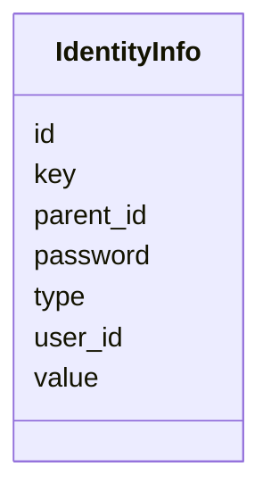

---
search:
  boost: 10.0
---

# Class: IdentityInfo 


_Identity Info entity in the identity and access management._


<div data-search-exclude markdown="1">


URI: [fluxnova_bpm_platform:IdentityInfo](https://w3id.org/TD-Universe/fluxnova-bpm-platform/IdentityInfo)





<!-- no inheritance hierarchy -->

## Slots

| Name | Cardinality and Range | Description | Inheritance |
| ---  | --- | --- | --- |
| [id](id.md) | 1 <br/> [String](String.md) | Unique identifier | direct |
| [user_id](user_id.md) | 0..1 <br/> [String](String.md) | Reference to a user | direct |
| [type](type.md) | 0..1 <br/> [String](String.md) | Type discriminator | direct |
| [key](key.md) | 0..1 <br/> [String](String.md) | Business key for the definition | direct |
| [value](value.md) | 0..1 <br/> [String](String.md) | Value of this variable instance | direct |
| [password](password.md) | 0..1 <br/> [String](String.md) | Hashed password | direct |
| [parent_id](parent_id.md) | 0..1 <br/> [String](String.md) | Reference to a CaseExecution | direct |


## In Subsets


* [Identity](Identity.md)
* [FluxnovaBpm](FluxnovaBpm.md)


## Identifier and Mapping Information


### Annotations

| property | value |
| --- | --- |
| sql_table | ACT_ID_INFO |


### Schema Source


* from schema: https://w3id.org/TD-Universe/fluxnova-bpm-platform


## Mappings

| Mapping Type | Mapped Value |
| ---  | ---  |
| self | fluxnova_bpm_platform:IdentityInfo |
| native | fluxnova_bpm_platform:IdentityInfo |


## LinkML Source

<!-- TODO: investigate https://stackoverflow.com/questions/37606292/how-to-create-tabbed-code-blocks-in-mkdocs-or-sphinx -->

### Direct

<details>
```yaml
name: IdentityInfo
annotations:
  sql_table:
    tag: sql_table
    value: ACT_ID_INFO
description: Identity Info entity in the identity and access management.
in_subset:
- identity
- fluxnova_bpm
from_schema: https://w3id.org/TD-Universe/fluxnova-bpm-platform
slots:
- id
- user_id
- type
- key
- value
- password
- parent_id

```
</details>

### Induced

<details>
```yaml
name: IdentityInfo
annotations:
  sql_table:
    tag: sql_table
    value: ACT_ID_INFO
description: Identity Info entity in the identity and access management.
in_subset:
- identity
- fluxnova_bpm
from_schema: https://w3id.org/TD-Universe/fluxnova-bpm-platform
attributes:
  id:
    name: id
    description: Unique identifier.
    from_schema: https://w3id.org/TD-Universe/fluxnova-bpm-platform
    rank: 1000
    slot_uri: schema:identifier
    identifier: true
    owner: IdentityInfo
    domain_of:
    - ByteArray
    - MeterLog
    - SchemaLogEntry
    - TaskMeterLog
    - Authorization
    - Group
    - IdentityInfo
    - IdentityLink
    - Tenant
    - TenantMembership
    - User
    - CaseExecution
    - CaseSentryPart
    - EventSubscription
    - Execution
    - ExternalTask
    - Incident
    - Task
    - VariableInstance
    - Attachment
    - Comment
    - Filter
    - Deployment
    - ResourceDefinition
    - Batch
    - Job
    - JobDefinition
    - HistoricBatch
    - HistoricDecisionInputInstance
    - HistoricDecisionInstance
    - HistoricDecisionOutputInstance
    - HistoricDetail
    - HistoricExternalTaskLog
    - HistoricIdentityLink
    - HistoricIncident
    - HistoricJobLog
    - HistoricScopeInstance
    - HistoricVariableInstance
    - UserOperationLogEntry
    - Diagram
    - DiagramElement
    - Style
    - BaseElement
    - Definitions
    - Documentation
    - InteractionNode
    range: string
    required: true
  user_id:
    name: user_id
    description: Reference to a user.
    from_schema: https://w3id.org/TD-Universe/fluxnova-bpm-platform
    rank: 1000
    owner: IdentityInfo
    domain_of:
    - Authorization
    - IdentityInfo
    - IdentityLink
    - Membership
    - TenantMembership
    - Attachment
    - Comment
    - HistoricDecisionInstance
    - HistoricIdentityLink
    - UserOperationLogEntry
    range: string
  type:
    name: type
    description: Type discriminator.
    from_schema: https://w3id.org/TD-Universe/fluxnova-bpm-platform
    rank: 1000
    owner: IdentityInfo
    domain_of:
    - ByteArray
    - Authorization
    - Group
    - IdentityInfo
    - IdentityLink
    - CaseSentryPart
    - VariableInstance
    - Attachment
    - Comment
    - Batch
    - Job
    - HistoricBatch
    - HistoricDetail
    - HistoricIdentityLink
    - ConditionExpression
    - CorrelationProperty
    - Relationship
    - ResourceParameter
    range: string
  key:
    name: key
    description: Business key for the definition.
    from_schema: https://w3id.org/TD-Universe/fluxnova-bpm-platform
    rank: 1000
    owner: IdentityInfo
    domain_of:
    - IdentityInfo
    - ResourceDefinition
    range: string
  value:
    name: value
    annotations:
      sql_column:
        tag: sql_column
        value: VALUE_
    description: Value of this variable instance.
    from_schema: https://w3id.org/TD-Universe/fluxnova-bpm-platform
    rank: 1000
    owner: IdentityInfo
    domain_of:
    - MeterLog
    - Property
    - IdentityInfo
    - CategoryValue
    - FluxnovaGenericValueElement
    range: string
  password:
    name: password
    annotations:
      sql_column:
        tag: sql_column
        value: PASSWORD_
    description: Hashed password.
    from_schema: https://w3id.org/TD-Universe/fluxnova-bpm-platform
    rank: 1000
    owner: IdentityInfo
    domain_of:
    - IdentityInfo
    - User
    range: string
  parent_id:
    name: parent_id
    annotations:
      sql_column:
        tag: sql_column
        value: PARENT_ID_
    description: Reference to a CaseExecution.
    from_schema: https://w3id.org/TD-Universe/fluxnova-bpm-platform
    rank: 1000
    owner: IdentityInfo
    domain_of:
    - IdentityInfo
    - CaseExecution
    - Execution
    range: string

```
</details></div>