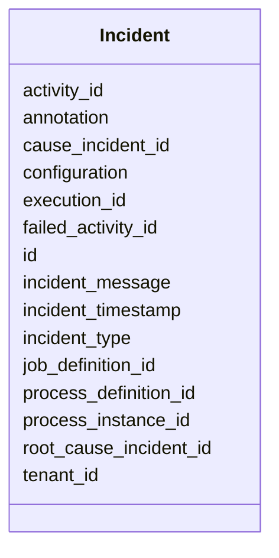

---
search:
  boost: 10.0
---

# Class: Incident 


_An Incident represents a failure in the execution of a process instance. A possible failure could be for example a failed Job during the execution, so that the job retry is equal zero (job.retries ..._


<div data-search-exclude markdown="1">


URI: [fluxnova_bpm_platform:Incident](https://w3id.org/TD-Universe/fluxnova-bpm-platform/Incident)





<!-- no inheritance hierarchy -->

## Slots

| Name | Cardinality and Range | Description | Inheritance |
| ---  | --- | --- | --- |
| [id](id.md) | 1 <br/> [String](String.md) | Unique identifier | direct |
| [incident_timestamp](incident_timestamp.md) | 1 <br/> [Datetime](Datetime.md) | Time when the incident happened | direct |
| [incident_message](incident_message.md) | 0..1 <br/> [String](String.md) | Incident message | direct |
| [incident_type](incident_type.md) | 1 <br/> [String](String.md) | Type of this incident to identify the kind of incident | direct |
| [execution_id](execution_id.md) | 0..1 <br/> [String](String.md) | Reference to the execution | direct |
| [activity_id](activity_id.md) | 0..1 <br/> [String](String.md) | BPMN activity element identifier | direct |
| [failed_activity_id](failed_activity_id.md) | 0..1 <br/> [String](String.md) | Id of the activity on which the last exception occurred | direct |
| [process_instance_id](process_instance_id.md) | 0..1 <br/> [String](String.md) | Reference to the process instance | direct |
| [process_definition_id](process_definition_id.md) | 0..1 <br/> [String](String.md) | Reference to the process definition | direct |
| [cause_incident_id](cause_incident_id.md) | 0..1 <br/> [String](String.md) | Id of the incident on which this incident has been triggered | direct |
| [root_cause_incident_id](root_cause_incident_id.md) | 0..1 <br/> [String](String.md) | Id of the root incident on which this transitive incident has been triggered | direct |
| [configuration](configuration.md) | 0..1 <br/> [String](String.md) | Payload of this incident | direct |
| [tenant_id](tenant_id.md) | 0..1 <br/> [String](String.md) | Multi-tenancy discriminator | direct |
| [job_definition_id](job_definition_id.md) | 0..1 <br/> [String](String.md) | Reference to the job definition | direct |
| [annotation](annotation.md) | 0..1 <br/> [String](String.md) | Annotation of this incident | direct |


## In Subsets


* [Runtime](Runtime.md)
* [FluxnovaBpm](FluxnovaBpm.md)


## Identifier and Mapping Information


### Annotations

| property | value |
| --- | --- |
| sql_table | ACT_RU_INCIDENT |


### Schema Source


* from schema: https://w3id.org/TD-Universe/fluxnova-bpm-platform


## Mappings

| Mapping Type | Mapped Value |
| ---  | ---  |
| self | fluxnova_bpm_platform:Incident |
| native | fluxnova_bpm_platform:Incident |


## LinkML Source

<!-- TODO: investigate https://stackoverflow.com/questions/37606292/how-to-create-tabbed-code-blocks-in-mkdocs-or-sphinx -->

### Direct

<details>
```yaml
name: Incident
annotations:
  sql_table:
    tag: sql_table
    value: ACT_RU_INCIDENT
description: An Incident represents a failure in the execution of a process instance.
  A possible failure could be for example a failed Job during the execution, so that
  the job retry is equal zero (job.retries ...
in_subset:
- runtime
- fluxnova_bpm
from_schema: https://w3id.org/TD-Universe/fluxnova-bpm-platform
slots:
- id
- incident_timestamp
- incident_message
- incident_type
- execution_id
- activity_id
- failed_activity_id
- process_instance_id
- process_definition_id
- cause_incident_id
- root_cause_incident_id
- configuration
- tenant_id
- job_definition_id
- annotation

```
</details>

### Induced

<details>
```yaml
name: Incident
annotations:
  sql_table:
    tag: sql_table
    value: ACT_RU_INCIDENT
description: An Incident represents a failure in the execution of a process instance.
  A possible failure could be for example a failed Job during the execution, so that
  the job retry is equal zero (job.retries ...
in_subset:
- runtime
- fluxnova_bpm
from_schema: https://w3id.org/TD-Universe/fluxnova-bpm-platform
attributes:
  id:
    name: id
    description: Unique identifier.
    from_schema: https://w3id.org/TD-Universe/fluxnova-bpm-platform
    rank: 1000
    slot_uri: schema:identifier
    identifier: true
    owner: Incident
    domain_of:
    - ByteArray
    - MeterLog
    - SchemaLogEntry
    - TaskMeterLog
    - Authorization
    - Group
    - IdentityInfo
    - IdentityLink
    - Tenant
    - TenantMembership
    - User
    - CaseExecution
    - CaseSentryPart
    - EventSubscription
    - Execution
    - ExternalTask
    - Incident
    - Task
    - VariableInstance
    - Attachment
    - Comment
    - Filter
    - Deployment
    - ResourceDefinition
    - Batch
    - Job
    - JobDefinition
    - HistoricBatch
    - HistoricDecisionInputInstance
    - HistoricDecisionInstance
    - HistoricDecisionOutputInstance
    - HistoricDetail
    - HistoricExternalTaskLog
    - HistoricIdentityLink
    - HistoricIncident
    - HistoricJobLog
    - HistoricScopeInstance
    - HistoricVariableInstance
    - UserOperationLogEntry
    - Diagram
    - DiagramElement
    - Style
    - BaseElement
    - Definitions
    - Documentation
    - InteractionNode
    range: string
    required: true
  incident_timestamp:
    name: incident_timestamp
    annotations:
      sql_column:
        tag: sql_column
        value: INCIDENT_TIMESTAMP_
    description: Time when the incident happened.
    from_schema: https://w3id.org/TD-Universe/fluxnova-bpm-platform
    rank: 1000
    owner: Incident
    domain_of:
    - Incident
    range: datetime
    required: true
  incident_message:
    name: incident_message
    annotations:
      sql_column:
        tag: sql_column
        value: INCIDENT_MSG_
    description: Incident message.
    from_schema: https://w3id.org/TD-Universe/fluxnova-bpm-platform
    rank: 1000
    owner: Incident
    domain_of:
    - Incident
    - HistoricIncident
    range: string
  incident_type:
    name: incident_type
    annotations:
      sql_column:
        tag: sql_column
        value: INCIDENT_TYPE_
    description: 'Type of this incident to identify the kind of incident. For example:
      failedJobs will be returned in the case of an incident, which identify failed
      job during the execution of a process instance.'
    from_schema: https://w3id.org/TD-Universe/fluxnova-bpm-platform
    rank: 1000
    owner: Incident
    domain_of:
    - Incident
    - HistoricIncident
    range: string
    required: true
  execution_id:
    name: execution_id
    description: Reference to the execution.
    from_schema: https://w3id.org/TD-Universe/fluxnova-bpm-platform
    rank: 1000
    owner: Incident
    domain_of:
    - EventSubscription
    - ExternalTask
    - Incident
    - Task
    - VariableInstance
    - Job
    - HistoricActivityInstance
    - HistoricDetail
    - HistoricExternalTaskLog
    - HistoricIncident
    - HistoricJobLog
    - HistoricTaskInstance
    - HistoricVariableInstance
    - UserOperationLogEntry
    range: string
  activity_id:
    name: activity_id
    description: BPMN activity element identifier.
    from_schema: https://w3id.org/TD-Universe/fluxnova-bpm-platform
    rank: 1000
    owner: Incident
    domain_of:
    - CaseExecution
    - EventSubscription
    - Execution
    - ExternalTask
    - Incident
    - JobDefinition
    - HistoricActivityInstance
    - HistoricDecisionInstance
    - HistoricExternalTaskLog
    - HistoricIncident
    - HistoricJobLog
    range: string
  failed_activity_id:
    name: failed_activity_id
    annotations:
      sql_column:
        tag: sql_column
        value: FAILED_ACTIVITY_ID_
    description: Id of the activity on which the last exception occurred.
    from_schema: https://w3id.org/TD-Universe/fluxnova-bpm-platform
    rank: 1000
    owner: Incident
    domain_of:
    - Incident
    - Job
    - HistoricIncident
    - HistoricJobLog
    range: string
  process_instance_id:
    name: process_instance_id
    description: Reference to the process instance.
    from_schema: https://w3id.org/TD-Universe/fluxnova-bpm-platform
    rank: 1000
    owner: Incident
    domain_of:
    - EventSubscription
    - Execution
    - ExternalTask
    - Incident
    - Task
    - VariableInstance
    - Attachment
    - Comment
    - Job
    - HistoricDecisionInstance
    - HistoricDetail
    - HistoricExternalTaskLog
    - HistoricIncident
    - HistoricJobLog
    - HistoricScopeInstance
    - HistoricVariableInstance
    - UserOperationLogEntry
    range: string
  process_definition_id:
    name: process_definition_id
    description: Reference to the process definition.
    from_schema: https://w3id.org/TD-Universe/fluxnova-bpm-platform
    rank: 1000
    owner: Incident
    domain_of:
    - IdentityLink
    - Execution
    - ExternalTask
    - Incident
    - Task
    - VariableInstance
    - Job
    - JobDefinition
    - HistoricDecisionInstance
    - HistoricDetail
    - HistoricExternalTaskLog
    - HistoricIdentityLink
    - HistoricIncident
    - HistoricJobLog
    - HistoricScopeInstance
    - HistoricVariableInstance
    - UserOperationLogEntry
    range: string
  cause_incident_id:
    name: cause_incident_id
    annotations:
      sql_column:
        tag: sql_column
        value: CAUSE_INCIDENT_ID_
    description: Id of the incident on which this incident has been triggered.
    from_schema: https://w3id.org/TD-Universe/fluxnova-bpm-platform
    rank: 1000
    owner: Incident
    domain_of:
    - Incident
    - HistoricIncident
    range: string
  root_cause_incident_id:
    name: root_cause_incident_id
    annotations:
      sql_column:
        tag: sql_column
        value: ROOT_CAUSE_INCIDENT_ID_
    description: Id of the root incident on which this transitive incident has been
      triggered.
    from_schema: https://w3id.org/TD-Universe/fluxnova-bpm-platform
    rank: 1000
    owner: Incident
    domain_of:
    - Incident
    - HistoricIncident
    range: string
  configuration:
    name: configuration
    annotations:
      sql_column:
        tag: sql_column
        value: CONFIGURATION_
    description: Payload of this incident.
    from_schema: https://w3id.org/TD-Universe/fluxnova-bpm-platform
    rank: 1000
    owner: Incident
    domain_of:
    - EventSubscription
    - Incident
    - Batch
    - HistoricIncident
    range: string
  tenant_id:
    name: tenant_id
    description: Multi-tenancy discriminator.
    from_schema: https://w3id.org/TD-Universe/fluxnova-bpm-platform
    rank: 1000
    owner: Incident
    domain_of:
    - ByteArray
    - IdentityLink
    - TenantMembership
    - CaseExecution
    - CaseSentryPart
    - EventSubscription
    - Execution
    - ExternalTask
    - Incident
    - Task
    - VariableInstance
    - Attachment
    - Comment
    - Deployment
    - ResourceDefinition
    - Batch
    - Job
    - JobDefinition
    - HistoricActivityInstance
    - HistoricBatch
    - HistoricCaseActivityInstance
    - HistoricCaseInstance
    - HistoricDecisionInputInstance
    - HistoricDecisionInstance
    - HistoricDecisionOutputInstance
    - HistoricDetail
    - HistoricExternalTaskLog
    - HistoricIdentityLink
    - HistoricIncident
    - HistoricJobLog
    - HistoricProcessInstance
    - HistoricTaskInstance
    - HistoricVariableInstance
    - UserOperationLogEntry
    range: string
  job_definition_id:
    name: job_definition_id
    description: Reference to the job definition.
    from_schema: https://w3id.org/TD-Universe/fluxnova-bpm-platform
    rank: 1000
    owner: Incident
    domain_of:
    - Incident
    - Job
    - HistoricIncident
    - HistoricJobLog
    - UserOperationLogEntry
    range: string
  annotation:
    name: annotation
    annotations:
      sql_column:
        tag: sql_column
        value: ANNOTATION_
    description: Annotation of this incident
    from_schema: https://w3id.org/TD-Universe/fluxnova-bpm-platform
    rank: 1000
    owner: Incident
    domain_of:
    - Incident
    - HistoricIncident
    - UserOperationLogEntry
    range: string

```
</details></div>