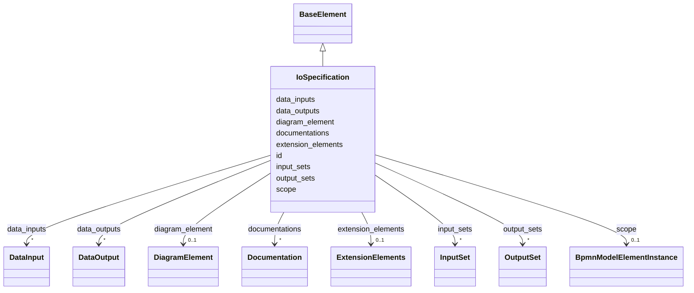

---
search:
  boost: 10.0
---

# Class: IoSpecification 


_The BPMN inputOutputSpecification element_


<div data-search-exclude markdown="1">


URI: [fluxnova_bpm_platform:IoSpecification](https://w3id.org/TD-Universe/fluxnova-bpm-platform/IoSpecification)





## Inheritance
* [BpmnModelElementInstance](BpmnModelElementInstance.md)
    * [BaseElement](BaseElement.md)
        * **IoSpecification**


## Slots

| Name | Cardinality and Range | Description | Inheritance |
| ---  | --- | --- | --- |
| [data_inputs](data_inputs.md) | * <br/> [DataInput](DataInput.md) | Input data elements of this specification | direct |
| [data_outputs](data_outputs.md) | * <br/> [DataOutput](DataOutput.md) | Output data elements of this specification | direct |
| [input_sets](input_sets.md) | * <br/> [InputSet](InputSet.md) | Input sets grouping required input data | direct |
| [output_sets](output_sets.md) | * <br/> [OutputSet](OutputSet.md) | Output sets grouping produced output data | direct |
| [id](id.md) | 1 <br/> [String](String.md) | Unique identifier | [BaseElement](BaseElement.md) |
| [documentations](documentations.md) | * <br/> [Documentation](Documentation.md) | Collection of documentation elements associated with this element | [BaseElement](BaseElement.md) |
| [extension_elements](extension_elements.md) | 0..1 <br/> [ExtensionElements](ExtensionElements.md) | Extension elements holding vendor-specific metadata | [BaseElement](BaseElement.md) |
| [diagram_element](diagram_element.md) | 0..1 <br/> [DiagramElement](DiagramElement.md) | The diagram element that visually represents this BPMN element | [BaseElement](BaseElement.md) |
| [scope](scope.md) | 0..1 <br/> [BpmnModelElementInstance](BpmnModelElementInstance.md) | Tests if the element is a scope like process or sub-process | [BpmnModelElementInstance](BpmnModelElementInstance.md) |


## Usages

| used by | used in | type | used |
| ---  | --- | --- | --- |
| [Activity](Activity.md) | [io_specification](io_specification.md) | range | [IoSpecification](IoSpecification.md) |
| [BusinessRuleTask](BusinessRuleTask.md) | [io_specification](io_specification.md) | range | [IoSpecification](IoSpecification.md) |
| [CallActivity](CallActivity.md) | [io_specification](io_specification.md) | range | [IoSpecification](IoSpecification.md) |
| [CallableElement](CallableElement.md) | [io_specification](io_specification.md) | range | [IoSpecification](IoSpecification.md) |
| [ManualTask](ManualTask.md) | [io_specification](io_specification.md) | range | [IoSpecification](IoSpecification.md) |
| [Process](Process.md) | [io_specification](io_specification.md) | range | [IoSpecification](IoSpecification.md) |
| [ReceiveTask](ReceiveTask.md) | [io_specification](io_specification.md) | range | [IoSpecification](IoSpecification.md) |
| [ScriptTask](ScriptTask.md) | [io_specification](io_specification.md) | range | [IoSpecification](IoSpecification.md) |
| [SendTask](SendTask.md) | [io_specification](io_specification.md) | range | [IoSpecification](IoSpecification.md) |
| [ServiceTask](ServiceTask.md) | [io_specification](io_specification.md) | range | [IoSpecification](IoSpecification.md) |
| [SubProcess](SubProcess.md) | [io_specification](io_specification.md) | range | [IoSpecification](IoSpecification.md) |
| [BpmnTask](BpmnTask.md) | [io_specification](io_specification.md) | range | [IoSpecification](IoSpecification.md) |
| [Transaction](Transaction.md) | [io_specification](io_specification.md) | range | [IoSpecification](IoSpecification.md) |
| [UserTask](UserTask.md) | [io_specification](io_specification.md) | range | [IoSpecification](IoSpecification.md) |


## In Subsets


* [Instance](Instance.md)
* [FluxnovaBpmnModel](FluxnovaBpmnModel.md)


## Identifier and Mapping Information


### Annotations

| property | value |
| --- | --- |
| java_package | org.finos.fluxnova.bpm.model.bpmn.instance |
| source_file | model-api/bpmn-model/src/main/java/org/finos/fluxnova/bpm/model/bpmn/instance/IoSpecification.java |


### Schema Source


* from schema: https://w3id.org/TD-Universe/fluxnova-bpm-platform


## Mappings

| Mapping Type | Mapped Value |
| ---  | ---  |
| self | fluxnova_bpm_platform:IoSpecification |
| native | fluxnova_bpm_platform:IoSpecification |


## LinkML Source

<!-- TODO: investigate https://stackoverflow.com/questions/37606292/how-to-create-tabbed-code-blocks-in-mkdocs-or-sphinx -->

### Direct

<details>
```yaml
name: IoSpecification
annotations:
  java_package:
    tag: java_package
    value: org.finos.fluxnova.bpm.model.bpmn.instance
  source_file:
    tag: source_file
    value: model-api/bpmn-model/src/main/java/org/finos/fluxnova/bpm/model/bpmn/instance/IoSpecification.java
description: The BPMN inputOutputSpecification element
in_subset:
- instance
- fluxnova_bpmn_model
from_schema: https://w3id.org/TD-Universe/fluxnova-bpm-platform
is_a: BaseElement
slots:
- data_inputs
- data_outputs
- input_sets
- output_sets

```
</details>

### Induced

<details>
```yaml
name: IoSpecification
annotations:
  java_package:
    tag: java_package
    value: org.finos.fluxnova.bpm.model.bpmn.instance
  source_file:
    tag: source_file
    value: model-api/bpmn-model/src/main/java/org/finos/fluxnova/bpm/model/bpmn/instance/IoSpecification.java
description: The BPMN inputOutputSpecification element
in_subset:
- instance
- fluxnova_bpmn_model
from_schema: https://w3id.org/TD-Universe/fluxnova-bpm-platform
is_a: BaseElement
attributes:
  data_inputs:
    name: data_inputs
    description: Input data elements of this specification.
    from_schema: https://w3id.org/TD-Universe/fluxnova-bpm-platform
    rank: 1000
    owner: IoSpecification
    domain_of:
    - InputSet
    - IoSpecification
    - ThrowEvent
    range: DataInput
    multivalued: true
    inlined: true
    inlined_as_list: true
  data_outputs:
    name: data_outputs
    description: Output data elements of this specification.
    from_schema: https://w3id.org/TD-Universe/fluxnova-bpm-platform
    rank: 1000
    owner: IoSpecification
    domain_of:
    - CatchEvent
    - IoSpecification
    range: DataOutput
    multivalued: true
    inlined: true
    inlined_as_list: true
  input_sets:
    name: input_sets
    description: Input sets grouping required input data.
    from_schema: https://w3id.org/TD-Universe/fluxnova-bpm-platform
    rank: 1000
    owner: IoSpecification
    domain_of:
    - IoSpecification
    range: InputSet
    multivalued: true
    inlined: true
    inlined_as_list: true
  output_sets:
    name: output_sets
    description: Output sets grouping produced output data.
    from_schema: https://w3id.org/TD-Universe/fluxnova-bpm-platform
    rank: 1000
    owner: IoSpecification
    domain_of:
    - InputSet
    - IoSpecification
    range: OutputSet
    multivalued: true
    inlined: true
    inlined_as_list: true
  id:
    name: id
    description: Unique identifier.
    from_schema: https://w3id.org/TD-Universe/fluxnova-bpm-platform
    rank: 1000
    slot_uri: schema:identifier
    identifier: true
    owner: IoSpecification
    domain_of:
    - ByteArray
    - MeterLog
    - SchemaLogEntry
    - TaskMeterLog
    - Authorization
    - Group
    - IdentityInfo
    - IdentityLink
    - Tenant
    - TenantMembership
    - User
    - CaseExecution
    - CaseSentryPart
    - EventSubscription
    - Execution
    - ExternalTask
    - Incident
    - Task
    - VariableInstance
    - Attachment
    - Comment
    - Filter
    - Deployment
    - ResourceDefinition
    - Batch
    - Job
    - JobDefinition
    - HistoricBatch
    - HistoricDecisionInputInstance
    - HistoricDecisionInstance
    - HistoricDecisionOutputInstance
    - HistoricDetail
    - HistoricExternalTaskLog
    - HistoricIdentityLink
    - HistoricIncident
    - HistoricJobLog
    - HistoricScopeInstance
    - HistoricVariableInstance
    - UserOperationLogEntry
    - Diagram
    - DiagramElement
    - Style
    - BaseElement
    - Definitions
    - Documentation
    - InteractionNode
    range: string
    required: true
  documentations:
    name: documentations
    description: Collection of documentation elements associated with this element.
    from_schema: https://w3id.org/TD-Universe/fluxnova-bpm-platform
    rank: 1000
    owner: IoSpecification
    domain_of:
    - BaseElement
    range: Documentation
    multivalued: true
    inlined: true
    inlined_as_list: true
  extension_elements:
    name: extension_elements
    description: Extension elements holding vendor-specific metadata.
    from_schema: https://w3id.org/TD-Universe/fluxnova-bpm-platform
    rank: 1000
    owner: IoSpecification
    domain_of:
    - BaseElement
    range: ExtensionElements
  diagram_element:
    name: diagram_element
    description: The diagram element that visually represents this BPMN element.
    from_schema: https://w3id.org/TD-Universe/fluxnova-bpm-platform
    rank: 1000
    owner: IoSpecification
    domain_of:
    - BaseElement
    range: DiagramElement
  scope:
    name: scope
    description: Tests if the element is a scope like process or sub-process.
    from_schema: https://w3id.org/TD-Universe/fluxnova-bpm-platform
    rank: 1000
    owner: IoSpecification
    domain_of:
    - BpmnModelElementInstance
    range: BpmnModelElementInstance

```
</details></div>