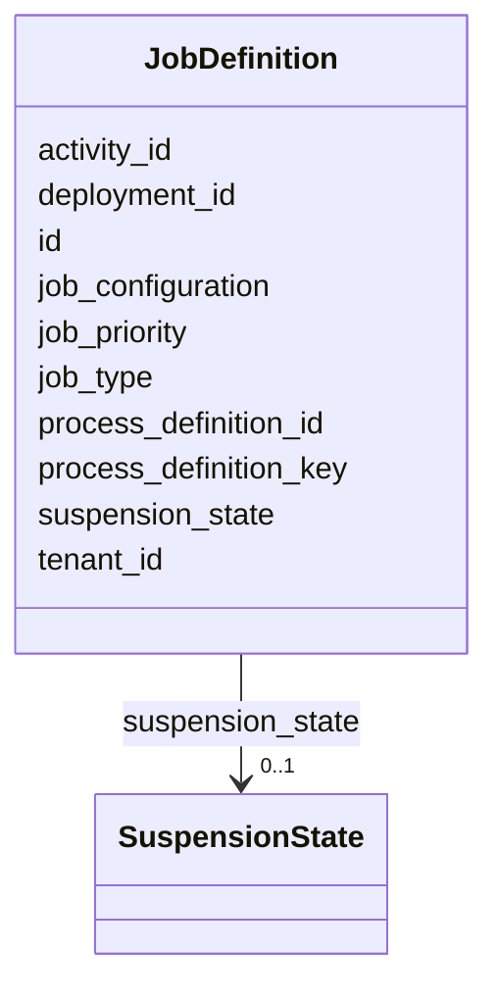

---
search:
  boost: 10.0
---

# Class: JobDefinition 


_A Job Definition provides details about asynchronous background processing ("Jobs") performed by the process engine. Each Job Definition corresponds to a Timer or Asynchronous continuation job inst..._


<div data-search-exclude markdown="1">


URI: [fluxnova_bpm_platform:JobDefinition](https://w3id.org/TD-Universe/fluxnova-bpm-platform/JobDefinition)





<!-- no inheritance hierarchy -->

## Slots

| Name | Cardinality and Range | Description | Inheritance |
| ---  | --- | --- | --- |
| [id](id.md) | 1 <br/> [String](String.md) | Unique identifier | direct |
| [process_definition_id](process_definition_id.md) | 0..1 <br/> [String](String.md) | Reference to the process definition | direct |
| [process_definition_key](process_definition_key.md) | 0..1 <br/> [String](String.md) | Key of the process definition | direct |
| [activity_id](activity_id.md) | 0..1 <br/> [String](String.md) | BPMN activity element identifier | direct |
| [job_type](job_type.md) | 1 <br/> [String](String.md) | The Type of a job | direct |
| [job_configuration](job_configuration.md) | 0..1 <br/> [String](String.md) | The configuration of a job definition provides details about the jobs which w... | direct |
| [suspension_state](suspension_state.md) | 0..1 <br/> [SuspensionState](SuspensionState.md) | Whether the entity is active or suspended | direct |
| [job_priority](job_priority.md) | 1 <br/> [Integer](Integer.md) | Priority of the associated job when this log entry was created | direct |
| [tenant_id](tenant_id.md) | 0..1 <br/> [String](String.md) | Multi-tenancy discriminator | direct |
| [deployment_id](deployment_id.md) | 0..1 <br/> [String](String.md) | Reference to the deployment | direct |


## In Subsets


* [Job](Job.md)
* [FluxnovaBpm](FluxnovaBpm.md)


## Identifier and Mapping Information


### Annotations

| property | value |
| --- | --- |
| sql_table | ACT_RU_JOBDEF |


### Schema Source


* from schema: https://w3id.org/TD-Universe/fluxnova-bpm-platform


## Mappings

| Mapping Type | Mapped Value |
| ---  | ---  |
| self | fluxnova_bpm_platform:JobDefinition |
| native | fluxnova_bpm_platform:JobDefinition |


## LinkML Source

<!-- TODO: investigate https://stackoverflow.com/questions/37606292/how-to-create-tabbed-code-blocks-in-mkdocs-or-sphinx -->

### Direct

<details>
```yaml
name: JobDefinition
annotations:
  sql_table:
    tag: sql_table
    value: ACT_RU_JOBDEF
description: A Job Definition provides details about asynchronous background processing
  ("Jobs") performed by the process engine. Each Job Definition corresponds to a Timer
  or Asynchronous continuation job inst...
in_subset:
- job
- fluxnova_bpm
from_schema: https://w3id.org/TD-Universe/fluxnova-bpm-platform
slots:
- id
- process_definition_id
- process_definition_key
- activity_id
- job_type
- job_configuration
- suspension_state
- job_priority
- tenant_id
- deployment_id

```
</details>

### Induced

<details>
```yaml
name: JobDefinition
annotations:
  sql_table:
    tag: sql_table
    value: ACT_RU_JOBDEF
description: A Job Definition provides details about asynchronous background processing
  ("Jobs") performed by the process engine. Each Job Definition corresponds to a Timer
  or Asynchronous continuation job inst...
in_subset:
- job
- fluxnova_bpm
from_schema: https://w3id.org/TD-Universe/fluxnova-bpm-platform
attributes:
  id:
    name: id
    description: Unique identifier.
    from_schema: https://w3id.org/TD-Universe/fluxnova-bpm-platform
    rank: 1000
    slot_uri: schema:identifier
    identifier: true
    owner: JobDefinition
    domain_of:
    - ByteArray
    - MeterLog
    - SchemaLogEntry
    - TaskMeterLog
    - Authorization
    - Group
    - IdentityInfo
    - IdentityLink
    - Tenant
    - TenantMembership
    - User
    - CaseExecution
    - CaseSentryPart
    - EventSubscription
    - Execution
    - ExternalTask
    - Incident
    - Task
    - VariableInstance
    - Attachment
    - Comment
    - Filter
    - Deployment
    - ResourceDefinition
    - Batch
    - Job
    - JobDefinition
    - HistoricBatch
    - HistoricDecisionInputInstance
    - HistoricDecisionInstance
    - HistoricDecisionOutputInstance
    - HistoricDetail
    - HistoricExternalTaskLog
    - HistoricIdentityLink
    - HistoricIncident
    - HistoricJobLog
    - HistoricScopeInstance
    - HistoricVariableInstance
    - UserOperationLogEntry
    - Diagram
    - DiagramElement
    - Style
    - BaseElement
    - Definitions
    - Documentation
    - InteractionNode
    range: string
    required: true
  process_definition_id:
    name: process_definition_id
    description: Reference to the process definition.
    from_schema: https://w3id.org/TD-Universe/fluxnova-bpm-platform
    rank: 1000
    owner: JobDefinition
    domain_of:
    - IdentityLink
    - Execution
    - ExternalTask
    - Incident
    - Task
    - VariableInstance
    - Job
    - JobDefinition
    - HistoricDecisionInstance
    - HistoricDetail
    - HistoricExternalTaskLog
    - HistoricIdentityLink
    - HistoricIncident
    - HistoricJobLog
    - HistoricScopeInstance
    - HistoricVariableInstance
    - UserOperationLogEntry
    range: string
  process_definition_key:
    name: process_definition_key
    description: Key of the process definition.
    from_schema: https://w3id.org/TD-Universe/fluxnova-bpm-platform
    rank: 1000
    owner: JobDefinition
    domain_of:
    - Execution
    - ExternalTask
    - Job
    - JobDefinition
    - HistoricDecisionInstance
    - HistoricDetail
    - HistoricExternalTaskLog
    - HistoricIdentityLink
    - HistoricIncident
    - HistoricJobLog
    - HistoricScopeInstance
    - HistoricVariableInstance
    - UserOperationLogEntry
    range: string
  activity_id:
    name: activity_id
    description: BPMN activity element identifier.
    from_schema: https://w3id.org/TD-Universe/fluxnova-bpm-platform
    rank: 1000
    owner: JobDefinition
    domain_of:
    - CaseExecution
    - EventSubscription
    - Execution
    - ExternalTask
    - Incident
    - JobDefinition
    - HistoricActivityInstance
    - HistoricDecisionInstance
    - HistoricExternalTaskLog
    - HistoricIncident
    - HistoricJobLog
    range: string
  job_type:
    name: job_type
    annotations:
      sql_column:
        tag: sql_column
        value: JOB_TYPE_
    description: The Type of a job. Asynchronous continuation, timer, ...
    from_schema: https://w3id.org/TD-Universe/fluxnova-bpm-platform
    rank: 1000
    owner: JobDefinition
    domain_of:
    - JobDefinition
    range: string
    required: true
  job_configuration:
    name: job_configuration
    annotations:
      sql_column:
        tag: sql_column
        value: JOB_CONFIGURATION_
    description: The configuration of a job definition provides details about the
      jobs which will be created. For timer jobs this method returns the timer configuration.
    from_schema: https://w3id.org/TD-Universe/fluxnova-bpm-platform
    rank: 1000
    owner: JobDefinition
    domain_of:
    - JobDefinition
    range: string
  suspension_state:
    name: suspension_state
    annotations:
      sql_column:
        tag: sql_column
        value: SUSPENSION_STATE_
    description: Whether the entity is active or suspended.
    from_schema: https://w3id.org/TD-Universe/fluxnova-bpm-platform
    rank: 1000
    owner: JobDefinition
    domain_of:
    - Execution
    - ExternalTask
    - Task
    - ProcessDefinition
    - Batch
    - Job
    - JobDefinition
    range: SuspensionState
  job_priority:
    name: job_priority
    annotations:
      sql_column:
        tag: sql_column
        value: JOB_PRIORITY_
    description: Priority of the associated job when this log entry was created.
    from_schema: https://w3id.org/TD-Universe/fluxnova-bpm-platform
    rank: 1000
    owner: JobDefinition
    domain_of:
    - JobDefinition
    - HistoricJobLog
    range: integer
    required: true
  tenant_id:
    name: tenant_id
    description: Multi-tenancy discriminator.
    from_schema: https://w3id.org/TD-Universe/fluxnova-bpm-platform
    rank: 1000
    owner: JobDefinition
    domain_of:
    - ByteArray
    - IdentityLink
    - TenantMembership
    - CaseExecution
    - CaseSentryPart
    - EventSubscription
    - Execution
    - ExternalTask
    - Incident
    - Task
    - VariableInstance
    - Attachment
    - Comment
    - Deployment
    - ResourceDefinition
    - Batch
    - Job
    - JobDefinition
    - HistoricActivityInstance
    - HistoricBatch
    - HistoricCaseActivityInstance
    - HistoricCaseInstance
    - HistoricDecisionInputInstance
    - HistoricDecisionInstance
    - HistoricDecisionOutputInstance
    - HistoricDetail
    - HistoricExternalTaskLog
    - HistoricIdentityLink
    - HistoricIncident
    - HistoricJobLog
    - HistoricProcessInstance
    - HistoricTaskInstance
    - HistoricVariableInstance
    - UserOperationLogEntry
    range: string
  deployment_id:
    name: deployment_id
    description: Reference to the deployment.
    from_schema: https://w3id.org/TD-Universe/fluxnova-bpm-platform
    rank: 1000
    owner: JobDefinition
    domain_of:
    - ByteArray
    - ResourceDefinition
    - Job
    - JobDefinition
    - HistoricJobLog
    - UserOperationLogEntry
    range: string

```
</details></div>