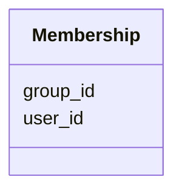

---
search:
  boost: 10.0
---

# Class: Membership 


_Association entity in identity and access management._


<div data-search-exclude markdown="1">


URI: [fluxnova_bpm_platform:Membership](https://w3id.org/TD-Universe/fluxnova-bpm-platform/Membership)





<!-- no inheritance hierarchy -->

## Slots

| Name | Cardinality and Range | Description | Inheritance |
| ---  | --- | --- | --- |
| [user_id](user_id.md) | 1 <br/> [String](String.md) | Reference to a user | direct |
| [group_id](group_id.md) | 1 <br/> [String](String.md) | Reference to a group | direct |

## Unique Keys


### membership_pk

**Unique key slots:** user_id, group_id


## In Subsets


* [Identity](Identity.md)
* [FluxnovaBpm](FluxnovaBpm.md)


## Identifier and Mapping Information


### Annotations

| property | value |
| --- | --- |
| sql_table | ACT_ID_MEMBERSHIP |


### Schema Source


* from schema: https://w3id.org/TD-Universe/fluxnova-bpm-platform


## Mappings

| Mapping Type | Mapped Value |
| ---  | ---  |
| self | fluxnova_bpm_platform:Membership |
| native | fluxnova_bpm_platform:Membership |


## LinkML Source

<!-- TODO: investigate https://stackoverflow.com/questions/37606292/how-to-create-tabbed-code-blocks-in-mkdocs-or-sphinx -->

### Direct

<details>
```yaml
name: Membership
annotations:
  sql_table:
    tag: sql_table
    value: ACT_ID_MEMBERSHIP
description: Association entity in identity and access management.
in_subset:
- identity
- fluxnova_bpm
from_schema: https://w3id.org/TD-Universe/fluxnova-bpm-platform
slots:
- user_id
- group_id
slot_usage:
  user_id:
    name: user_id
    required: true
  group_id:
    name: group_id
    required: true
unique_keys:
  membership_pk:
    unique_key_name: membership_pk
    unique_key_slots:
    - user_id
    - group_id

```
</details>

### Induced

<details>
```yaml
name: Membership
annotations:
  sql_table:
    tag: sql_table
    value: ACT_ID_MEMBERSHIP
description: Association entity in identity and access management.
in_subset:
- identity
- fluxnova_bpm
from_schema: https://w3id.org/TD-Universe/fluxnova-bpm-platform
slot_usage:
  user_id:
    name: user_id
    required: true
  group_id:
    name: group_id
    required: true
attributes:
  user_id:
    name: user_id
    description: Reference to a user.
    from_schema: https://w3id.org/TD-Universe/fluxnova-bpm-platform
    rank: 1000
    owner: Membership
    domain_of:
    - Authorization
    - IdentityInfo
    - IdentityLink
    - Membership
    - TenantMembership
    - Attachment
    - Comment
    - HistoricDecisionInstance
    - HistoricIdentityLink
    - UserOperationLogEntry
    range: string
    required: true
  group_id:
    name: group_id
    description: Reference to a group.
    from_schema: https://w3id.org/TD-Universe/fluxnova-bpm-platform
    rank: 1000
    owner: Membership
    domain_of:
    - Authorization
    - IdentityLink
    - Membership
    - TenantMembership
    - HistoricIdentityLink
    range: string
    required: true
unique_keys:
  membership_pk:
    unique_key_name: membership_pk
    unique_key_slots:
    - user_id
    - group_id

```
</details></div>