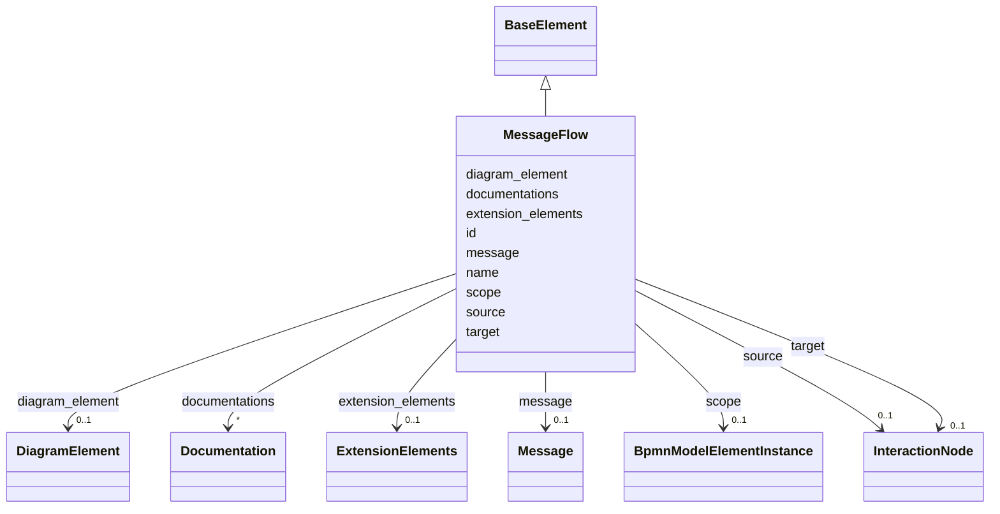

---
search:
  boost: 10.0
---

# Class: MessageFlow 


_The BPMN messageFlow element_


<div data-search-exclude markdown="1">


URI: [fluxnova_bpm_platform:MessageFlow](https://w3id.org/TD-Universe/fluxnova-bpm-platform/MessageFlow)





## Inheritance
* [BpmnModelElementInstance](BpmnModelElementInstance.md)
    * [BaseElement](BaseElement.md)
        * **MessageFlow**


## Slots

| Name | Cardinality and Range | Description | Inheritance |
| ---  | --- | --- | --- |
| [name](name.md) | 0..1 <br/> [String](String.md) | Human-readable name | direct |
| [source](source.md) | 0..1 <br/> [InteractionNode](InteractionNode.md) | The source | direct |
| [target](target.md) | 0..1 <br/> [InteractionNode](InteractionNode.md) | The catching link event that receives this link | direct |
| [message](message.md) | 0..1 <br/> [Message](Message.md) | Short message or summary | direct |
| [id](id.md) | 1 <br/> [String](String.md) | Unique identifier | [BaseElement](BaseElement.md) |
| [documentations](documentations.md) | * <br/> [Documentation](Documentation.md) | Collection of documentation elements associated with this element | [BaseElement](BaseElement.md) |
| [extension_elements](extension_elements.md) | 0..1 <br/> [ExtensionElements](ExtensionElements.md) | Extension elements holding vendor-specific metadata | [BaseElement](BaseElement.md) |
| [diagram_element](diagram_element.md) | 0..1 <br/> [DiagramElement](DiagramElement.md) | The diagram element that visually represents this BPMN element | [BaseElement](BaseElement.md) |
| [scope](scope.md) | 0..1 <br/> [BpmnModelElementInstance](BpmnModelElementInstance.md) | Tests if the element is a scope like process or sub-process | [BpmnModelElementInstance](BpmnModelElementInstance.md) |


## Usages

| used by | used in | type | used |
| ---  | --- | --- | --- |
| [CallConversation](CallConversation.md) | [message_flows](message_flows.md) | range | [MessageFlow](MessageFlow.md) |
| [Collaboration](Collaboration.md) | [message_flows](message_flows.md) | range | [MessageFlow](MessageFlow.md) |
| [Conversation](Conversation.md) | [message_flows](message_flows.md) | range | [MessageFlow](MessageFlow.md) |
| [ConversationNode](ConversationNode.md) | [message_flows](message_flows.md) | range | [MessageFlow](MessageFlow.md) |
| [GlobalConversation](GlobalConversation.md) | [message_flows](message_flows.md) | range | [MessageFlow](MessageFlow.md) |
| [MessageFlowAssociation](MessageFlowAssociation.md) | [inner_message_flow](inner_message_flow.md) | range | [MessageFlow](MessageFlow.md) |
| [MessageFlowAssociation](MessageFlowAssociation.md) | [outer_message_flow](outer_message_flow.md) | range | [MessageFlow](MessageFlow.md) |
| [SubConversation](SubConversation.md) | [message_flows](message_flows.md) | range | [MessageFlow](MessageFlow.md) |


## In Subsets


* [Instance](Instance.md)
* [FluxnovaBpmnModel](FluxnovaBpmnModel.md)


## Identifier and Mapping Information


### Annotations

| property | value |
| --- | --- |
| java_package | org.finos.fluxnova.bpm.model.bpmn.instance |
| source_file | model-api/bpmn-model/src/main/java/org/finos/fluxnova/bpm/model/bpmn/instance/MessageFlow.java |


### Schema Source


* from schema: https://w3id.org/TD-Universe/fluxnova-bpm-platform


## Mappings

| Mapping Type | Mapped Value |
| ---  | ---  |
| self | fluxnova_bpm_platform:MessageFlow |
| native | fluxnova_bpm_platform:MessageFlow |


## LinkML Source

<!-- TODO: investigate https://stackoverflow.com/questions/37606292/how-to-create-tabbed-code-blocks-in-mkdocs-or-sphinx -->

### Direct

<details>
```yaml
name: MessageFlow
annotations:
  java_package:
    tag: java_package
    value: org.finos.fluxnova.bpm.model.bpmn.instance
  source_file:
    tag: source_file
    value: model-api/bpmn-model/src/main/java/org/finos/fluxnova/bpm/model/bpmn/instance/MessageFlow.java
description: The BPMN messageFlow element
in_subset:
- instance
- fluxnova_bpmn_model
from_schema: https://w3id.org/TD-Universe/fluxnova-bpm-platform
is_a: BaseElement
slots:
- name
- source
- target
- message
slot_usage:
  source:
    name: source
    range: InteractionNode
  target:
    name: target
    range: InteractionNode
  message:
    name: message
    range: Message

```
</details>

### Induced

<details>
```yaml
name: MessageFlow
annotations:
  java_package:
    tag: java_package
    value: org.finos.fluxnova.bpm.model.bpmn.instance
  source_file:
    tag: source_file
    value: model-api/bpmn-model/src/main/java/org/finos/fluxnova/bpm/model/bpmn/instance/MessageFlow.java
description: The BPMN messageFlow element
in_subset:
- instance
- fluxnova_bpmn_model
from_schema: https://w3id.org/TD-Universe/fluxnova-bpm-platform
is_a: BaseElement
slot_usage:
  source:
    name: source
    range: InteractionNode
  target:
    name: target
    range: InteractionNode
  message:
    name: message
    range: Message
attributes:
  name:
    name: name
    description: Human-readable name.
    from_schema: https://w3id.org/TD-Universe/fluxnova-bpm-platform
    rank: 1000
    slot_uri: schema:name
    owner: MessageFlow
    domain_of:
    - ByteArray
    - MeterLog
    - Property
    - Group
    - Tenant
    - Task
    - VariableInstance
    - Attachment
    - Filter
    - Deployment
    - ResourceDefinition
    - HistoricDetail
    - HistoricTaskInstance
    - HistoricVariableInstance
    - Font
    - Diagram
    - CallableElement
    - Category
    - Collaboration
    - ConversationLink
    - ConversationNode
    - CorrelationKey
    - CorrelationProperty
    - DataInput
    - DataOutput
    - DataState
    - DataStore
    - Definitions
    - Error
    - Escalation
    - FlowElement
    - InputSet
    - Interface
    - Lane
    - LaneSet
    - LinkEventDefinition
    - Message
    - MessageFlow
    - Operation
    - OutputSet
    - Participant
    - BpmnProperty
    - Resource
    - ResourceParameter
    - ResourceRole
    - Signal
    range: string
  source:
    name: source
    annotations:
      sql_column:
        tag: sql_column
        value: SOURCE_
    description: The source.
    from_schema: https://w3id.org/TD-Universe/fluxnova-bpm-platform
    rank: 1000
    owner: MessageFlow
    domain_of:
    - CaseSentryPart
    - Deployment
    - Association
    - ConversationLink
    - MessageFlow
    - SequenceFlow
    range: InteractionNode
  target:
    name: target
    description: The catching link event that receives this link.
    from_schema: https://w3id.org/TD-Universe/fluxnova-bpm-platform
    rank: 1000
    owner: MessageFlow
    domain_of:
    - Association
    - ConversationLink
    - DataAssociation
    - LinkEventDefinition
    - MessageFlow
    - SequenceFlow
    range: InteractionNode
  message:
    name: message
    annotations:
      sql_column:
        tag: sql_column
        value: MESSAGE_
    description: Short message or summary.
    from_schema: https://w3id.org/TD-Universe/fluxnova-bpm-platform
    rank: 1000
    owner: MessageFlow
    domain_of:
    - Comment
    - CorrelationPropertyRetrievalExpression
    - MessageEventDefinition
    - MessageFlow
    - ReceiveTask
    - SendTask
    range: Message
  id:
    name: id
    description: Unique identifier.
    from_schema: https://w3id.org/TD-Universe/fluxnova-bpm-platform
    rank: 1000
    slot_uri: schema:identifier
    identifier: true
    owner: MessageFlow
    domain_of:
    - ByteArray
    - MeterLog
    - SchemaLogEntry
    - TaskMeterLog
    - Authorization
    - Group
    - IdentityInfo
    - IdentityLink
    - Tenant
    - TenantMembership
    - User
    - CaseExecution
    - CaseSentryPart
    - EventSubscription
    - Execution
    - ExternalTask
    - Incident
    - Task
    - VariableInstance
    - Attachment
    - Comment
    - Filter
    - Deployment
    - ResourceDefinition
    - Batch
    - Job
    - JobDefinition
    - HistoricBatch
    - HistoricDecisionInputInstance
    - HistoricDecisionInstance
    - HistoricDecisionOutputInstance
    - HistoricDetail
    - HistoricExternalTaskLog
    - HistoricIdentityLink
    - HistoricIncident
    - HistoricJobLog
    - HistoricScopeInstance
    - HistoricVariableInstance
    - UserOperationLogEntry
    - Diagram
    - DiagramElement
    - Style
    - BaseElement
    - Definitions
    - Documentation
    - InteractionNode
    range: string
    required: true
  documentations:
    name: documentations
    description: Collection of documentation elements associated with this element.
    from_schema: https://w3id.org/TD-Universe/fluxnova-bpm-platform
    rank: 1000
    owner: MessageFlow
    domain_of:
    - BaseElement
    range: Documentation
    multivalued: true
    inlined: true
    inlined_as_list: true
  extension_elements:
    name: extension_elements
    description: Extension elements holding vendor-specific metadata.
    from_schema: https://w3id.org/TD-Universe/fluxnova-bpm-platform
    rank: 1000
    owner: MessageFlow
    domain_of:
    - BaseElement
    range: ExtensionElements
  diagram_element:
    name: diagram_element
    description: The diagram element that visually represents this BPMN element.
    from_schema: https://w3id.org/TD-Universe/fluxnova-bpm-platform
    rank: 1000
    owner: MessageFlow
    domain_of:
    - BaseElement
    range: DiagramElement
  scope:
    name: scope
    description: Tests if the element is a scope like process or sub-process.
    from_schema: https://w3id.org/TD-Universe/fluxnova-bpm-platform
    rank: 1000
    owner: MessageFlow
    domain_of:
    - BpmnModelElementInstance
    range: BpmnModelElementInstance

```
</details></div>